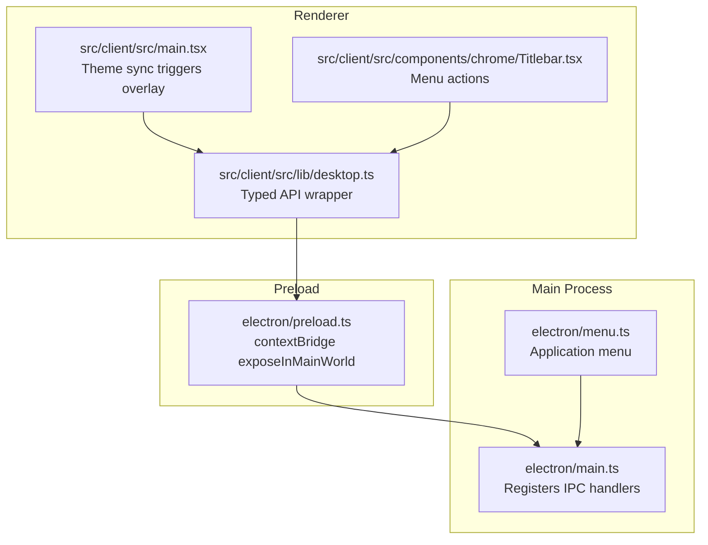
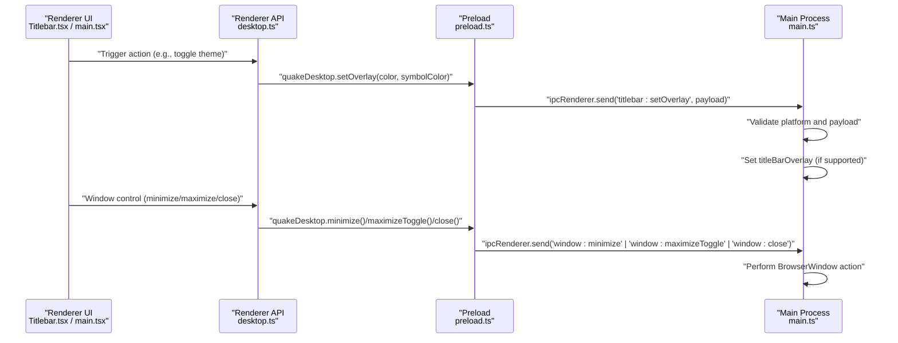
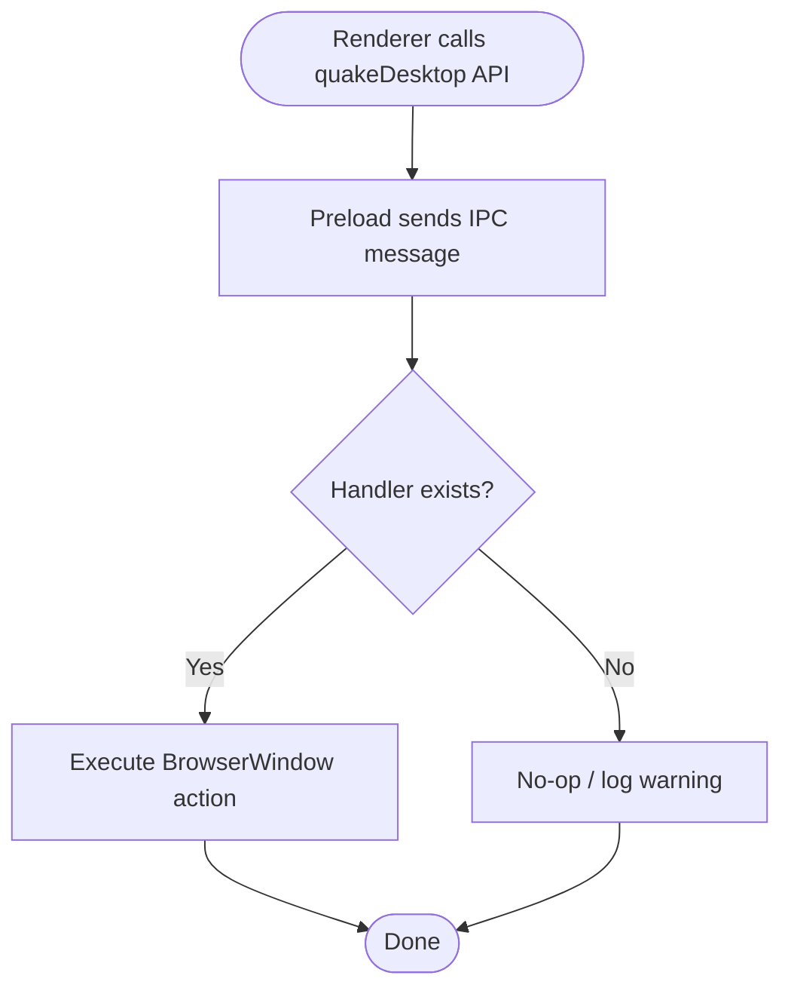
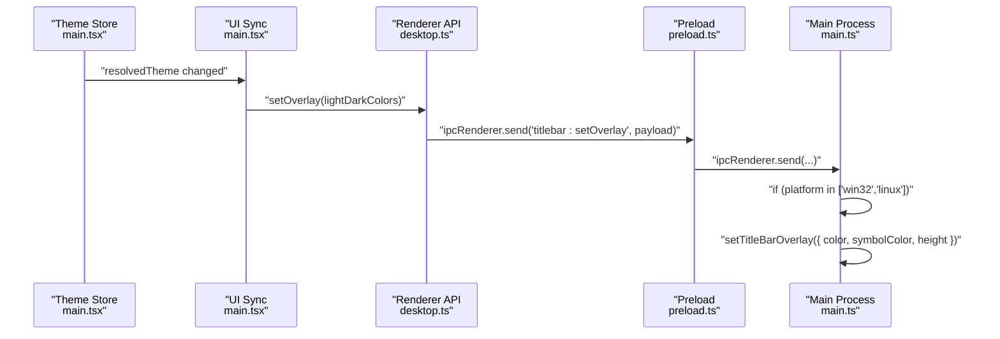
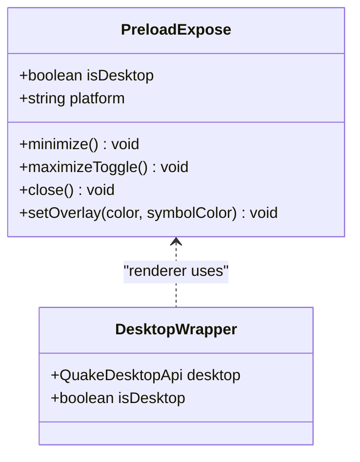
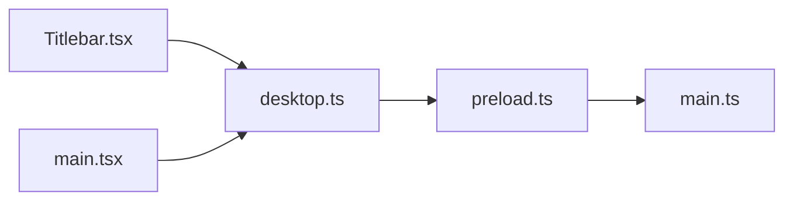
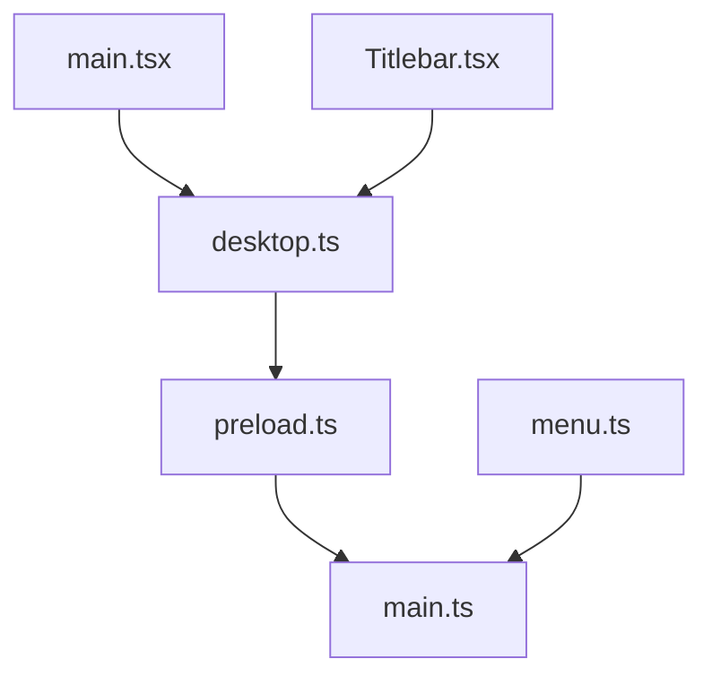

# IPC Communication

<cite>
**Referenced Files in This Document**
- [main.ts](file://electron/main.ts)
- [preload.ts](file://electron/preload.ts)
- [desktop.ts](file://src/client/src/lib/desktop.ts)
- [Titlebar.tsx](file://src/client/src/components/chrome/Titlebar.tsx)
- [main.tsx](file://src/client/src/main.tsx)
- [protocol.ts](file://src/shared/protocol.ts)
- [menu.ts](file://electron/menu.ts)
</cite>

## Table of Contents
1. [Introduction](#introduction)
2. [Project Structure](#project-structure)
3. [Core Components](#core-components)
4. [Architecture Overview](#architecture-overview)
5. [Detailed Component Analysis](#detailed-component-analysis)
6. [Dependency Analysis](#dependency-analysis)
7. [Performance Considerations](#performance-considerations)
8. [Security Considerations](#security-considerations)
9. [Troubleshooting Guide](#troubleshooting-guide)
10. [Best Practices and Debugging](#best-practices-and-debugging)
11. [Conclusion](#conclusion)

## Introduction
This document explains the Electron Inter-Process Communication (IPC) patterns used in the application, focusing on window control handlers and the titlebar overlay mechanism for dynamic theme updates. It also covers the preload bridge responsibilities, context isolation, and secure communication channels between the renderer and main processes. Practical guidance is included for error handling, debugging, and security hardening.

## Project Structure
The IPC implementation spans three layers:
- Main process: registers IPC handlers and manages the BrowserWindow lifecycle.
- Preload: exposes a minimal, secure API surface via contextBridge and forwards messages to the main process.
- Renderer: consumes the exposed API to trigger actions and synchronize UI state.

**Diagram sources**
- [main.ts:52-73](file://electron/main.ts#L52-L73)
- [preload.ts:5-14](file://electron/preload.ts#L5-L14)
- [desktop.ts:20-24](file://src/client/src/lib/desktop.ts#L20-L24)
- [main.tsx:549-556](file://src/client/src/main.tsx#L549-L556)
- [Titlebar.tsx:10-11](file://src/client/src/components/chrome/Titlebar.tsx#L10-L11)
- [menu.ts:3-20](file://electron/menu.ts#L3-L20)

**Section sources**
- [main.ts:52-121](file://electron/main.ts#L52-L121)
- [preload.ts:1-15](file://electron/preload.ts#L1-L15)
- [desktop.ts:1-24](file://src/client/src/lib/desktop.ts#L1-L24)
- [main.tsx:549-556](file://src/client/src/main.tsx#L549-L556)
- [Titlebar.tsx:1-218](file://src/client/src/components/chrome/Titlebar.tsx#L1-L218)
- [menu.ts:1-21](file://electron/menu.ts#L1-L21)

## Core Components
- Main process IPC handlers:
  - Window controls: minimize, maximizeToggle, close.
  - Titlebar overlay: setOverlay for Windows and Linux titlebar overlay synchronization.
- Preload bridge:
  - Exposes a typed API surface under window.quakeDesktop with safe send calls.
- Renderer API:
  - Provides isDesktop flag and platform detection, and delegates actions to the main process.

Key responsibilities:
- Main process validates platform support for titlebar overlay and guards against missing APIs.
- Preload enforces context isolation and restricts exposed methods to a minimal set.
- Renderer reacts to theme changes and triggers overlay updates.

**Section sources**
- [main.ts:52-73](file://electron/main.ts#L52-L73)
- [preload.ts:5-14](file://electron/preload.ts#L5-L14)
- [desktop.ts:5-24](file://src/client/src/lib/desktop.ts#L5-L24)

## Architecture Overview
The IPC flow for window controls and overlay synchronization follows a unidirectional pattern: renderer invokes preload, preload sends IPC to main, main executes the action.

**Diagram sources**
- [Titlebar.tsx:10-11](file://src/client/src/components/chrome/Titlebar.tsx#L10-L11)
- [main.tsx:549-556](file://src/client/src/main.tsx#L549-L556)
- [desktop.ts:20-24](file://src/client/src/lib/desktop.ts#L20-L24)
- [preload.ts:5-14](file://electron/preload.ts#L5-L14)
- [main.ts:52-73](file://electron/main.ts#L52-L73)

## Detailed Component Analysis

### Window Control IPC Handlers
The main process registers three synchronous-style handlers for window control:
- "window:minimize": minimizes the main window.
- "window:maximizeToggle": toggles maximize/unmaximize state.
- "window:close": closes the main window.

These handlers are registered during application boot and executed immediately upon receipt of the IPC message.

**Diagram sources**
- [preload.ts:8-13](file://electron/preload.ts#L8-L13)
- [main.ts:52-59](file://electron/main.ts#L52-L59)

**Section sources**
- [main.ts:52-59](file://electron/main.ts#L52-L59)
- [preload.ts:8-13](file://electron/preload.ts#L8-L13)

### Titlebar Overlay IPC (Dynamic Theme Updates)
The overlay handler synchronizes the OS-native titlebar overlay colors with the active theme:
- Triggered when the resolved theme changes in the renderer.
- Sends a payload containing overlay color and symbol color.
- Platform guard ensures the handler runs only on Windows and Linux.
- Uses optional chaining to avoid errors on unsupported platforms.

**Diagram sources**
- [main.tsx:549-556](file://src/client/src/main.tsx#L549-L556)
- [desktop.ts:20-24](file://src/client/src/lib/desktop.ts#L20-L24)
- [preload.ts:12-13](file://electron/preload.ts#L12-L13)
- [main.ts:61-72](file://electron/main.ts#L61-L72)

**Section sources**
- [main.tsx:549-556](file://src/client/src/main.tsx#L549-L556)
- [main.ts:61-72](file://electron/main.ts#L61-L72)
- [preload.ts:12-13](file://electron/preload.ts#L12-L13)

### Preload Script Responsibilities and Secure Channels
The preload script establishes a secure bridge:
- Exposes a single object window.quakeDesktop with explicit methods.
- Enforces context isolation and disables Node.js integration.
- Restricts the API to window controls and overlay updates.
- Prevents arbitrary remote code execution by limiting IPC exposure.

**Diagram sources**
- [preload.ts:5-14](file://electron/preload.ts#L5-L14)
- [desktop.ts:5-24](file://src/client/src/lib/desktop.ts#L5-L24)

**Section sources**
- [preload.ts:1-15](file://electron/preload.ts#L1-L15)
- [desktop.ts:1-24](file://src/client/src/lib/desktop.ts#L1-L24)

### Renderer Integration Points
- Titlebar component reads platform info from the desktop API to adjust layout.
- Theme synchronization in main.tsx triggers overlay updates based on resolved theme.
- Menu actions delegate to the desktop API for cross-platform behavior.

**Diagram sources**
- [Titlebar.tsx:51-52](file://src/client/src/components/chrome/Titlebar.tsx#L51-L52)
- [main.tsx:549-556](file://src/client/src/main.tsx#L549-L556)
- [desktop.ts:20-24](file://src/client/src/lib/desktop.ts#L20-L24)
- [preload.ts:5-14](file://electron/preload.ts#L5-L14)
- [main.ts:52-73](file://electron/main.ts#L52-L73)

**Section sources**
- [Titlebar.tsx:51-52](file://src/client/src/components/chrome/Titlebar.tsx#L51-L52)
- [main.tsx:549-556](file://src/client/src/main.tsx#L549-L556)
- [desktop.ts:20-24](file://src/client/src/lib/desktop.ts#L20-L24)

## Dependency Analysis
- Preload depends on Electron's contextBridge and ipcRenderer.
- Main process depends on BrowserWindow and ipcMain.
- Renderer depends on the typed desktop API wrapper.
- Application menu is built in the main process and does not directly depend on IPC.

**Diagram sources**
- [desktop.ts:20-24](file://src/client/src/lib/desktop.ts#L20-L24)
- [preload.ts:1-15](file://electron/preload.ts#L1-L15)
- [main.ts:1-178](file://electron/main.ts#L1-L178)
- [main.tsx:549-556](file://src/client/src/main.tsx#L549-L556)
- [Titlebar.tsx:10-11](file://src/client/src/components/chrome/Titlebar.tsx#L10-L11)
- [menu.ts:1-21](file://electron/menu.ts#L1-L21)

**Section sources**
- [desktop.ts:1-24](file://src/client/src/lib/desktop.ts#L1-L24)
- [preload.ts:1-15](file://electron/preload.ts#L1-L15)
- [main.ts:1-178](file://electron/main.ts#L1-L178)
- [main.tsx:549-556](file://src/client/src/main.tsx#L549-L556)
- [Titlebar.tsx:10-11](file://src/client/src/components/chrome/Titlebar.tsx#L10-L11)
- [menu.ts:1-21](file://electron/menu.ts#L1-L21)

## Performance Considerations
- IPC calls are lightweight and synchronous-like for window controls; overhead is minimal.
- Overlay updates occur on theme changes; batch or debounce if frequent toggles are expected.
- Avoid excessive IPC frequency by coalescing rapid UI events in the renderer.

## Security Considerations
- Context isolation is enabled; Node.js integration is disabled in webPreferences.
- Preload exposes only essential methods via contextBridge.
- Message validation:
  - Main process checks platform support before applying overlay.
  - Payload shape is validated implicitly by TypeScript and runtime checks.
- Data serialization:
  - Only primitive values and simple objects are sent; avoid passing complex objects or functions.
- Least privilege:
  - Exposed API surface is minimal; no filesystem or system commands are exposed.
- Error handling:
  - Missing APIs (e.g., titleBarOverlay) are handled gracefully with try/catch and early returns.

**Section sources**
- [main.ts:77-100](file://electron/main.ts#L77-L100)
- [main.ts:61-72](file://electron/main.ts#L61-L72)
- [preload.ts:5-14](file://electron/preload.ts#L5-L14)

## Troubleshooting Guide
Common issues and resolutions:
- Overlay not updating:
  - Verify platform is Windows or Linux.
  - Ensure setOverlay is called after theme resolution.
  - Confirm payload contains color and symbolColor.
- Window controls not working:
  - Check that the main window exists and is focused.
  - Verify preload methods are invoked from renderer.
- IPC not reaching main:
  - Confirm preload is correctly injected in webPreferences.
  - Ensure the preload object is available in window.quakeDesktop.

Diagnostic tips:
- Use main process logs to confirm handler registration and execution.
- Add console logging around renderer-to-preload transitions.
- Validate IPC payloads with simple tests in development builds.

**Section sources**
- [main.ts:52-73](file://electron/main.ts#L52-L73)
- [preload.ts:5-14](file://electron/preload.ts#L5-L14)
- [main.tsx:549-556](file://src/client/src/main.tsx#L549-L556)

## Best Practices and Debugging
- Keep the preload API minimal and well-typed.
- Centralize IPC handler registration in a dedicated function for maintainability.
- Use consistent naming for IPC channels (e.g., "window:*", "titlebar:*").
- Add defensive checks for optional platform APIs.
- Instrument renderer-to-main transitions with logs for quick diagnosis.
- Prefer declarative UI state updates; throttle overlay updates if needed.

## Conclusion
The IPC implementation cleanly separates concerns: the renderer triggers actions via a typed API, the preload forwards messages securely, and the main process executes platform-specific operations. The design emphasizes safety through context isolation and a minimal API surface while enabling responsive UI behaviors like window controls and dynamic titlebar overlays.
