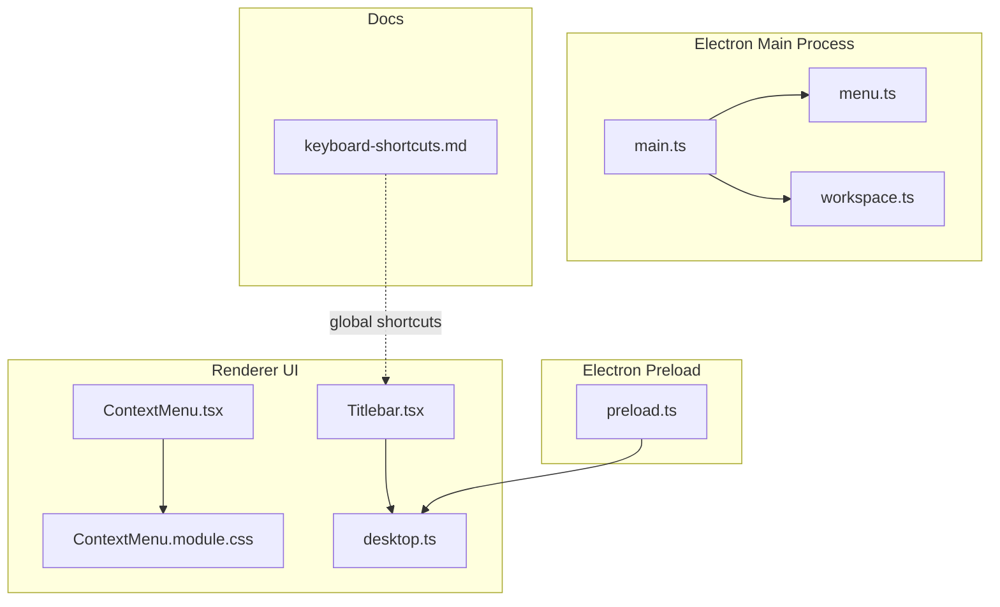
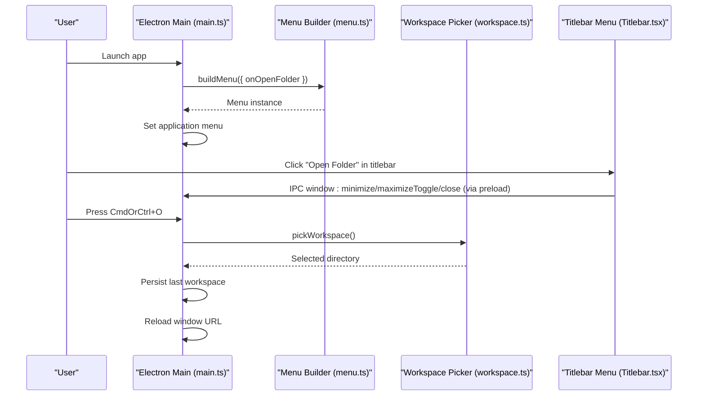
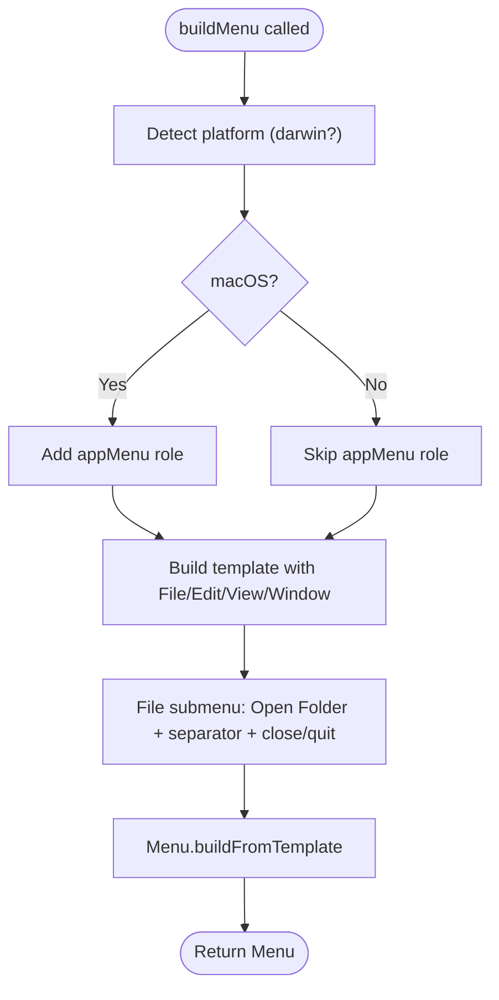
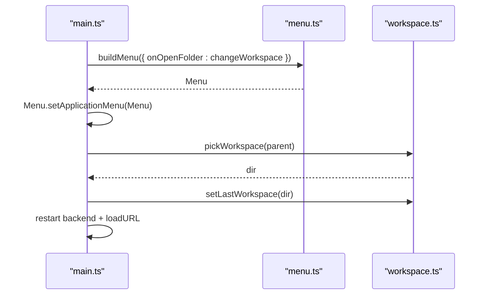
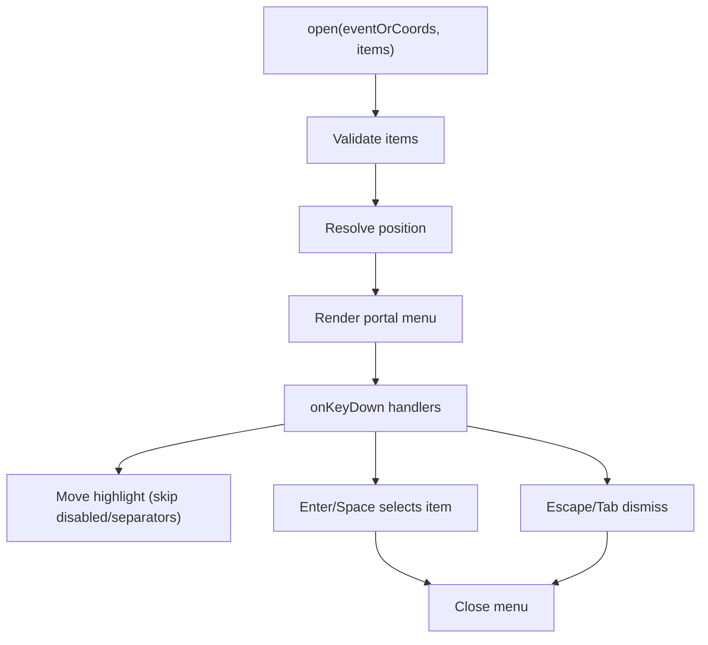
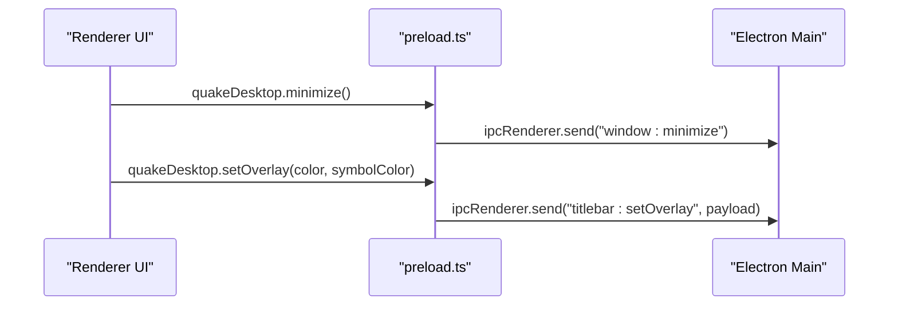
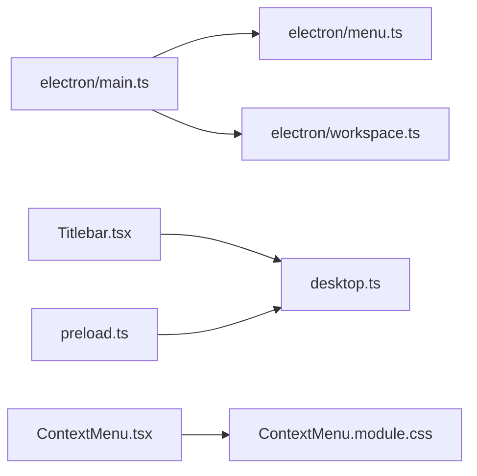

# Menu System

<cite>
**Referenced Files in This Document**
- [menu.ts](file://electron/menu.ts)
- [main.ts](file://electron/main.ts)
- [workspace.ts](file://electron/workspace.ts)
- [keyboard-shortcuts.md](file://docs/keyboard-shortcuts.md)
- [Titlebar.tsx](file://src/client/src/components/chrome/Titlebar.tsx)
- [ContextMenu.tsx](file://src/client/src/components/chrome/ContextMenu.tsx)
- [ContextMenu.module.css](file://src/client/src/components/chrome/ContextMenu.module.css)
- [desktop.ts](file://src/client/src/lib/desktop.ts)
- [preload.ts](file://electron/preload.ts)
- [README.md](file://README.md)
</cite>

## Table of Contents
1. [Introduction](#introduction)
2. [Project Structure](#project-structure)
3. [Core Components](#core-components)
4. [Architecture Overview](#architecture-overview)
5. [Detailed Component Analysis](#detailed-component-analysis)
6. [Dependency Analysis](#dependency-analysis)
7. [Performance Considerations](#performance-considerations)
8. [Troubleshooting Guide](#troubleshooting-guide)
9. [Conclusion](#conclusion)

## Introduction
This document explains the Electron menu system and application menu building in the project. It covers how the application menu is constructed, platform-specific behaviors (especially macOS vs. Windows/Linux), keyboard shortcut integration, workspace selection menu items, application commands, and menu item enable/disable logic. It also details the menu template structure, accelerator key definitions, dynamic menu updates, accessibility considerations, and user experience guidelines for menu navigation.

## Project Structure
The menu system spans three layers:
- Electron main process: builds the application menu and handles workspace switching.
- Renderer UI: provides a native-like titlebar menu and context menus with accessibility and keyboard support.
- Documentation: defines global keyboard shortcuts used across the app.



**Diagram sources**
- [main.ts:139-145](file://electron/main.ts#L139-L145)
- [menu.ts:3-20](file://electron/menu.ts#L3-L20)
- [workspace.ts:42-66](file://electron/workspace.ts#L42-L66)
- [Titlebar.tsx:79-107](file://src/client/src/components/chrome/Titlebar.tsx#L79-L107)
- [ContextMenu.tsx:1-72](file://src/client/src/components/chrome/ContextMenu.tsx#L1-L72)
- [ContextMenu.module.css:1-72](file://src/client/src/components/chrome/ContextMenu.module.css#L1-L72)
- [desktop.ts:1-24](file://src/client/src/lib/desktop.ts#L1-L24)
- [preload.ts:1-15](file://electron/preload.ts#L1-L15)
- [keyboard-shortcuts.md:1-37](file://docs/keyboard-shortcuts.md#L1-L37)

**Section sources**
- [main.ts:139-145](file://electron/main.ts#L139-L145)
- [menu.ts:3-20](file://electron/menu.ts#L3-L20)
- [workspace.ts:42-66](file://electron/workspace.ts#L42-L66)
- [Titlebar.tsx:79-107](file://src/client/src/components/chrome/Titlebar.tsx#L79-L107)
- [ContextMenu.tsx:1-72](file://src/client/src/components/chrome/ContextMenu.tsx#L1-L72)
- [ContextMenu.module.css:1-72](file://src/client/src/components/chrome/ContextMenu.module.css#L1-L72)
- [desktop.ts:1-24](file://src/client/src/lib/desktop.ts#L1-L24)
- [preload.ts:1-15](file://electron/preload.ts#L1-L15)
- [keyboard-shortcuts.md:1-37](file://docs/keyboard-shortcuts.md#L1-L37)

## Core Components
- Application menu builder: constructs the top-level menu with platform-aware roles and a workspace-open action bound to a keyboard accelerator.
- Main process wiring: sets the application menu and wires the workspace-open action to a native folder picker and workspace persistence.
- Titlebar menu (renderer): provides a native-like menu bar with dropdowns and actions mapped to UI behaviors.
- Context menu (renderer): fully accessible right-click menu with keyboard navigation, disabled item handling, and portal rendering.
- Desktop API bridge: exposes a minimal, secure API to the renderer for window controls and theme overlay synchronization.

**Section sources**
- [menu.ts:3-20](file://electron/menu.ts#L3-L20)
- [main.ts:139-145](file://electron/main.ts#L139-L145)
- [workspace.ts:42-66](file://electron/workspace.ts#L42-L66)
- [Titlebar.tsx:79-107](file://src/client/src/components/chrome/Titlebar.tsx#L79-L107)
- [ContextMenu.tsx:1-72](file://src/client/src/components/chrome/ContextMenu.tsx#L1-L72)
- [desktop.ts:1-24](file://src/client/src/lib/desktop.ts#L1-L24)
- [preload.ts:1-15](file://electron/preload.ts#L1-L15)

## Architecture Overview
The application menu is built in the Electron main process and attached to the application. The renderer provides complementary UI menus that mirror the main menu's actions and integrate with the app's state and commands.



**Diagram sources**
- [main.ts:139-145](file://electron/main.ts#L139-L145)
- [menu.ts:3-20](file://electron/menu.ts#L3-L20)
- [workspace.ts:56-66](file://electron/workspace.ts#L56-L66)
- [Titlebar.tsx:79-107](file://src/client/src/components/chrome/Titlebar.tsx#L79-L107)
- [preload.ts:5-14](file://electron/preload.ts#L5-L14)

## Detailed Component Analysis

### Electron Application Menu Builder
The main process constructs a menu template with:
- Platform-specific app menu on macOS.
- A File menu containing:
  - Open Folder with accelerator CmdOrCtrl+O.
  - Separator.
  - Close on macOS or Quit on Windows/Linux.
- Standard Edit, View, and Window menus.

The File menu's Open Folder action triggers a callback that opens a native folder picker and persists the selection.



**Diagram sources**
- [menu.ts:3-20](file://electron/menu.ts#L3-L20)

**Section sources**
- [menu.ts:3-20](file://electron/menu.ts#L3-L20)
- [workspace.ts:56-66](file://electron/workspace.ts#L56-L66)

### Main Process Integration and Workspace Selection
The main process:
- Registers IPC handlers for window controls.
- Builds the application menu and attaches it.
- Wires the File menu's Open Folder action to a workspace change routine that:
  - Opens a native folder picker.
  - Persists the last workspace.
  - Restarts the backend server and reloads the window URL.



**Diagram sources**
- [main.ts:139-145](file://electron/main.ts#L139-L145)
- [workspace.ts:56-66](file://electron/workspace.ts#L56-L66)

**Section sources**
- [main.ts:139-145](file://electron/main.ts#L139-L145)
- [workspace.ts:56-66](file://electron/workspace.ts#L56-L66)

### Titlebar Menu (Renderer)
The renderer provides a native-like menu bar with:
- Four menus: File, Edit, View, Help.
- Actions mapped to UI behaviors (e.g., open folder opens a workspace modal).
- macOS-specific behavior detection via the desktop API.

```mermaid
classDiagram
class Titlebar {
+leftOpen : boolean
+onToggleSidebar() : void
+onOpenSessions() : void
+onToggleDock?() : void
+onToggleBottomPanel?() : void
+dockOpen? : boolean
+bottomPanelOpen? : boolean
+onMenuAction?(action : MenuAction) : void
}
class MenuAction {
<<enumeration>>
"new-chat"
"open-folder"
"settings"
"toggle-theme"
"about"
}
Titlebar --> MenuAction : "invokes"
```

**Diagram sources**
- [Titlebar.tsx:25-30](file://src/client/src/components/chrome/Titlebar.tsx#L25-L30)
- [Titlebar.tsx:79-107](file://src/client/src/components/chrome/Titlebar.tsx#L79-L107)
- [Titlebar.tsx:154-191](file://src/client/src/components/chrome/Titlebar.tsx#L154-L191)

**Section sources**
- [Titlebar.tsx:25-30](file://src/client/src/components/chrome/Titlebar.tsx#L25-L30)
- [Titlebar.tsx:79-107](file://src/client/src/components/chrome/Titlebar.tsx#L79-L107)
- [Titlebar.tsx:154-191](file://src/client/src/components/chrome/Titlebar.tsx#L154-L191)

### Context Menu (Renderer)
The context menu is a fully accessible, keyboard-navigable, portal-rendered component supporting:
- Separators and disabled items.
- Arrow keys, Home/End, Enter/Space, Escape, and Tab.
- Disabled item skipping during keyboard navigation.
- Visual highlighting and destructive action coloring.



**Diagram sources**
- [ContextMenu.tsx:119-156](file://src/client/src/components/chrome/ContextMenu.tsx#L119-L156)
- [ContextMenu.tsx:226-265](file://src/client/src/components/chrome/ContextMenu.tsx#L226-L265)
- [ContextMenu.tsx:267-326](file://src/client/src/components/chrome/ContextMenu.tsx#L267-L326)
- [ContextMenu.module.css:68-72](file://src/client/src/components/chrome/ContextMenu.module.css#L68-L72)

**Section sources**
- [ContextMenu.tsx:119-156](file://src/client/src/components/chrome/ContextMenu.tsx#L119-L156)
- [ContextMenu.tsx:226-265](file://src/client/src/components/chrome/ContextMenu.tsx#L226-L265)
- [ContextMenu.tsx:267-326](file://src/client/src/components/chrome/ContextMenu.tsx#L267-L326)
- [ContextMenu.module.css:68-72](file://src/client/src/components/chrome/ContextMenu.module.css#L68-L72)

### Desktop API Bridge
The preload script exposes a minimal desktop API to the renderer:
- Window controls: minimize, maximizeToggle, close.
- Theme overlay synchronization for Windows/Linux titlebar.
- Platform detection for UI behavior.



**Diagram sources**
- [preload.ts:5-14](file://electron/preload.ts#L5-L14)
- [desktop.ts:1-24](file://src/client/src/lib/desktop.ts#L1-L24)

**Section sources**
- [preload.ts:1-15](file://electron/preload.ts#L1-L15)
- [desktop.ts:1-24](file://src/client/src/lib/desktop.ts#L1-L24)

## Dependency Analysis
- The main process depends on the menu builder and workspace utilities.
- The renderer depends on the desktop API and UI components for menus.
- The context menu is self-contained with its own accessibility logic and styles.



**Diagram sources**
- [main.ts:1-10](file://electron/main.ts#L1-L10)
- [menu.ts:1-20](file://electron/menu.ts#L1-L20)
- [workspace.ts:1-10](file://electron/workspace.ts#L1-L10)
- [Titlebar.tsx:1-20](file://src/client/src/components/chrome/Titlebar.tsx#L1-L20)
- [ContextMenu.tsx:1-10](file://src/client/src/components/chrome/ContextMenu.tsx#L1-L10)
- [ContextMenu.module.css:1-10](file://src/client/src/components/chrome/ContextMenu.module.css#L1-L10)
- [desktop.ts:1-10](file://src/client/src/lib/desktop.ts#L1-L10)
- [preload.ts:1-10](file://electron/preload.ts#L1-L10)

**Section sources**
- [main.ts:1-10](file://electron/main.ts#L1-L10)
- [menu.ts:1-20](file://electron/menu.ts#L1-L20)
- [workspace.ts:1-10](file://electron/workspace.ts#L1-L10)
- [Titlebar.tsx:1-20](file://src/client/src/components/chrome/Titlebar.tsx#L1-L20)
- [ContextMenu.tsx:1-10](file://src/client/src/components/chrome/ContextMenu.tsx#L1-L10)
- [ContextMenu.module.css:1-10](file://src/client/src/components/chrome/ContextMenu.module.css#L1-L10)
- [desktop.ts:1-10](file://src/client/src/lib/desktop.ts#L1-L10)
- [preload.ts:1-10](file://electron/preload.ts#L1-L10)

## Performance Considerations
- Menu templates are constructed once at startup; keep the template structure minimal to avoid unnecessary overhead.
- Avoid heavy operations in menu item click handlers; defer to background tasks where possible.
- For dynamic menus, prefer updating state and re-rendering lightweight components rather than rebuilding the entire menu.

## Troubleshooting Guide
- Menu not appearing on Windows/Linux: Verify auto-hide behavior and ensure the menu is set in the main process.
- Accelerator not triggering: Confirm the accelerator string matches the platform convention and that the menu item is enabled.
- Workspace selection not persisting: Check the workspace state file location and permissions.
- Context menu disabled items not behaving: Ensure disabled items are marked as such and that keyboard navigation skips them.

**Section sources**
- [main.ts:88-89](file://electron/main.ts#L88-L89)
- [menu.ts:10-10](file://electron/menu.ts#L10-L10)
- [workspace.ts:31-40](file://electron/workspace.ts#L31-L40)
- [ContextMenu.tsx:286-310](file://src/client/src/components/chrome/ContextMenu.tsx#L286-L310)

## Conclusion
The menu system combines a concise Electron application menu with renderer-side UI menus to deliver a cohesive, accessible, and platform-aware experience. The File menu integrates workspace selection with a keyboard shortcut, while the renderer provides complementary menus with robust accessibility and keyboard navigation. The preload bridge ensures secure and minimal exposure of native capabilities to the renderer.
