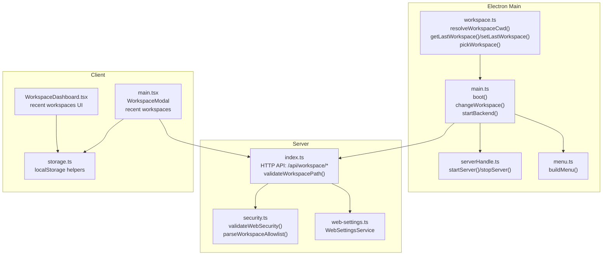
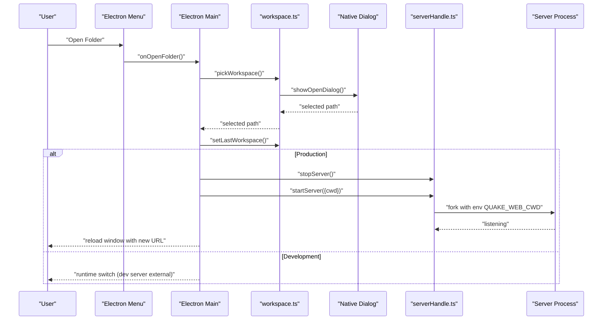
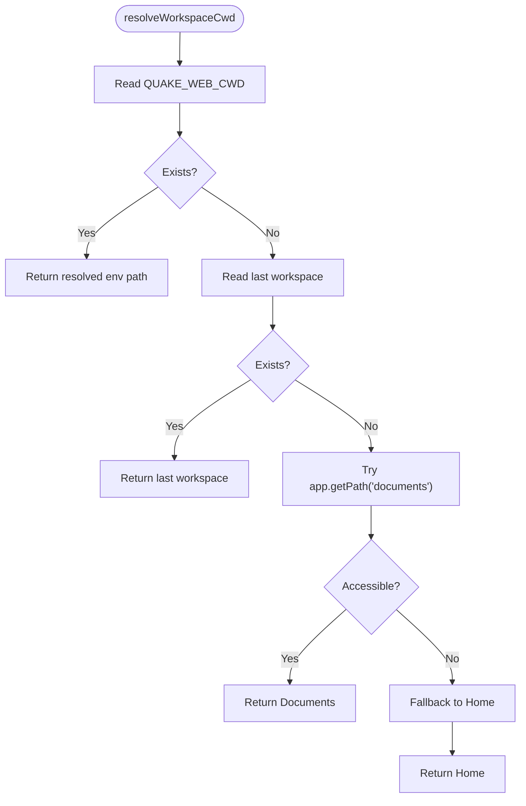
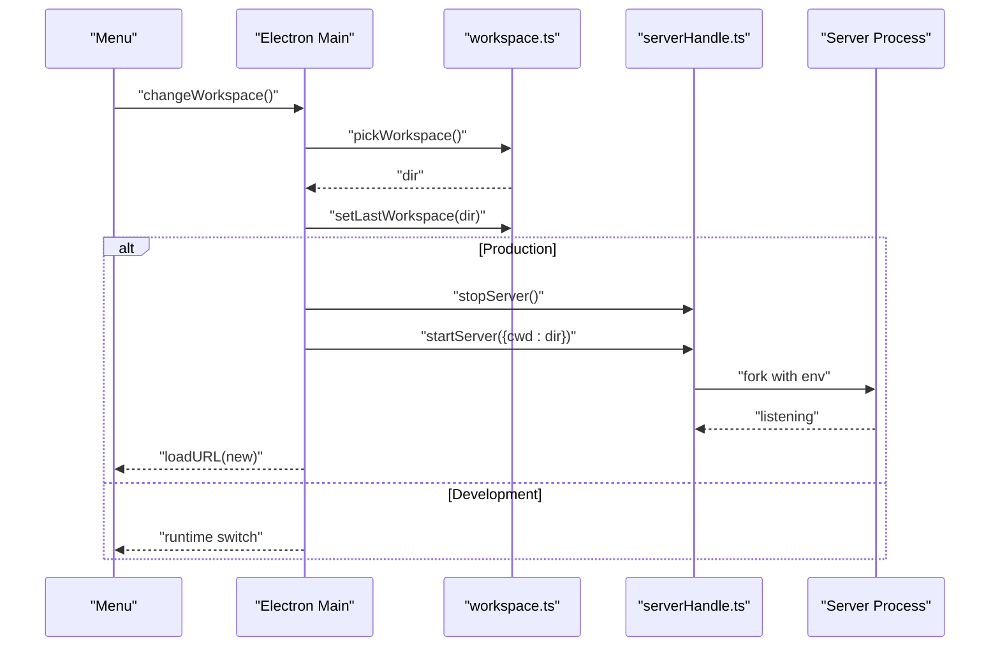
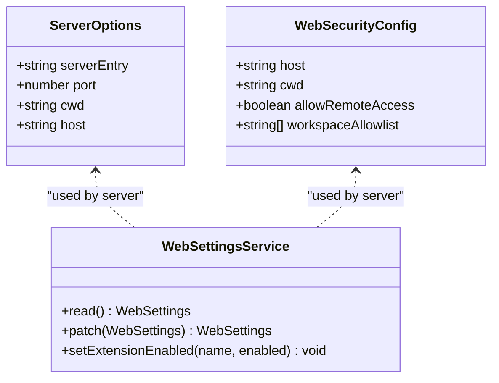
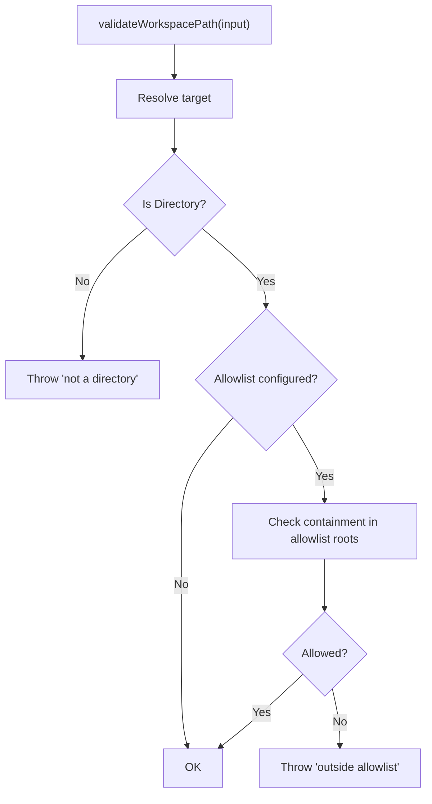
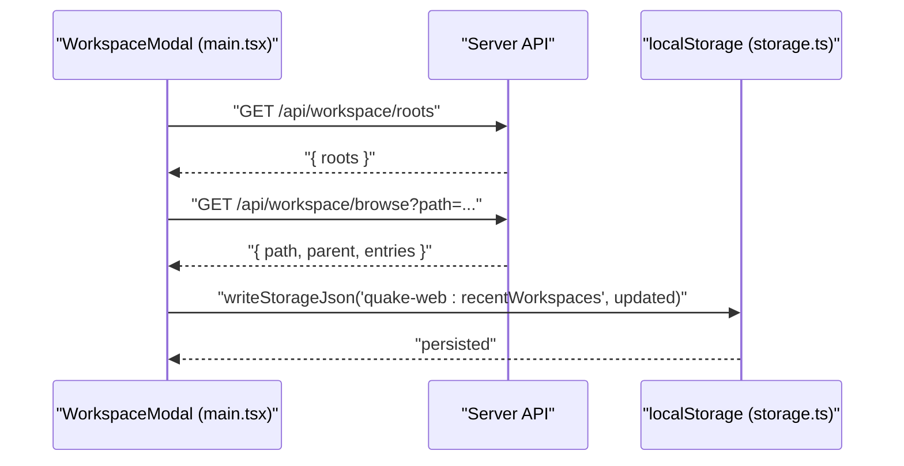
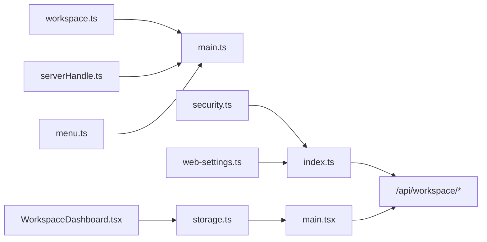

# Workspace Management

<cite>
**Referenced Files in This Document**
- [workspace.ts](file://electron/workspace.ts)
- [main.ts](file://electron/main.ts)
- [serverHandle.ts](file://electron/serverHandle.ts)
- [menu.ts](file://electron/menu.ts)
- [index.ts](file://src/server/index.ts)
- [security.ts](file://src/server/security.ts)
- [web-settings.ts](file://src/server/web-settings.ts)
- [main.tsx](file://src/client/src/main.tsx)
- [WorkspaceDashboard.tsx](file://src/client/src/components/workspace/WorkspaceDashboard.tsx)
- [storage.ts](file://src/client/src/lib/storage.ts)
</cite>

## Table of Contents
1. [Introduction](#introduction)
2. [Project Structure](#project-structure)
3. [Core Components](#core-components)
4. [Architecture Overview](#architecture-overview)
5. [Detailed Component Analysis](#detailed-component-analysis)
6. [Dependency Analysis](#dependency-analysis)
7. [Performance Considerations](#performance-considerations)
8. [Troubleshooting Guide](#troubleshooting-guide)
9. [Conclusion](#conclusion)

## Introduction
This document explains the workspace management functionality in the desktop application. It covers how workspaces are detected, selected, persisted, validated, and switched. It also documents the integration between workspace selection and server startup, including environment variable management, security considerations, and persistence mechanisms.

## Project Structure
Workspace management spans three layers:
- Electron main process: workspace detection, selection, persistence, and server lifecycle
- Server process: workspace validation, security enforcement, and API endpoints
- Client UI: workspace browsing, recent workspaces, and dashboard

**Diagram sources**
- [workspace.ts:42-53](file://electron/workspace.ts#L42-L53)
- [main.ts:173-180](file://electron/main.ts#L173-L180)
- [serverHandle.ts:17-31](file://electron/serverHandle.ts#L17-L31)
- [menu.ts:3-20](file://electron/menu.ts#L3-L20)
- [index.ts:466-489](file://src/server/index.ts#L466-L489)
- [security.ts:24-41](file://src/server/security.ts#L24-L41)
- [web-settings.ts:13-63](file://src/server/web-settings.ts#L13-L63)
- [main.tsx:1695-1778](file://src/client/src/main.tsx#L1695-L1778)
- [WorkspaceDashboard.tsx:20-71](file://src/client/src/components/workspace/WorkspaceDashboard.tsx#L20-L71)
- [storage.ts:1-49](file://src/client/src/lib/storage.ts#L1-L49)

**Section sources**
- [workspace.ts:42-53](file://electron/workspace.ts#L42-L53)
- [main.ts:173-180](file://electron/main.ts#L173-L180)
- [serverHandle.ts:17-31](file://electron/serverHandle.ts#L17-L31)
- [index.ts:466-489](file://src/server/index.ts#L466-L489)
- [security.ts:24-41](file://src/server/security.ts#L24-L41)
- [web-settings.ts:13-63](file://src/server/web-settings.ts#L13-L63)
- [main.tsx:1695-1778](file://src/client/src/main.tsx#L1695-L1778)
- [WorkspaceDashboard.tsx:20-71](file://src/client/src/components/workspace/WorkspaceDashboard.tsx#L20-L71)
- [storage.ts:1-49](file://src/client/src/lib/storage.ts#L1-L49)

## Core Components
- Workspace detection and persistence (Electron main):
  - Last workspace tracking via a JSON state file in user data
  - Environment-driven override for workspace directory
  - Native folder picker integration
- Server-side workspace validation and security:
  - Validation of workspace path and allowlist enforcement
  - Security checks for remote access and host binding
- Client-side workspace browsing and recent workspaces:
  - Modal workspace browser backed by server endpoints
  - Recent workspaces stored in local storage
- Integration with server startup:
  - New workspace requires a fresh server process with updated environment
  - Dev vs prod behavior differs for runtime switching

**Section sources**
- [workspace.ts:31-53](file://electron/workspace.ts#L31-L53)
- [main.ts:157-171](file://electron/main.ts#L157-L171)
- [index.ts:211-219](file://src/server/index.ts#L211-L219)
- [security.ts:24-41](file://src/server/security.ts#L24-L41)
- [main.tsx:1695-1778](file://src/client/src/main.tsx#L1695-L1778)
- [storage.ts:1-49](file://src/client/src/lib/storage.ts#L1-L49)

## Architecture Overview
The workspace lifecycle involves detection, selection, persistence, and server integration:

**Diagram sources**
- [menu.ts:3-20](file://electron/menu.ts#L3-L20)
- [main.ts:157-171](file://electron/main.ts#L157-L171)
- [workspace.ts:55-65](file://electron/workspace.ts#L55-L65)
- [serverHandle.ts:17-31](file://electron/serverHandle.ts#L17-L31)

## Detailed Component Analysis

### Workspace Detection and Persistence (Electron Main)
- Last workspace tracking:
  - Reads/writes a JSON state file under user data
  - Returns undefined if the stored path does not exist
- Environment override:
  - Resolves workspace from QUAKE_WEB_CWD if present and valid
- Fallback resolution:
  - Uses Documents folder, then Home directory if unavailable
- Native folder picker:
  - Opens a native dialog and persists the selection as last workspace

**Diagram sources**
- [workspace.ts:42-53](file://electron/workspace.ts#L42-L53)

**Section sources**
- [workspace.ts:6-29](file://electron/workspace.ts#L6-L29)
- [workspace.ts:31-53](file://electron/workspace.ts#L31-L53)
- [workspace.ts:55-65](file://electron/workspace.ts#L55-L65)

### Workspace Selection and Switching (Electron Main)
- Entry point:
  - Menu triggers a handler that opens the native folder picker
- Switching procedure:
  - Updates current working directory
  - Persists as last workspace
  - In production, stops old server, starts a new server with updated environment, waits for readiness, then reloads the renderer
  - In development, relies on external dev server and runtime switching

**Diagram sources**
- [menu.ts:3-20](file://electron/menu.ts#L3-L20)
- [main.ts:157-171](file://electron/main.ts#L157-L171)
- [serverHandle.ts:17-31](file://electron/serverHandle.ts#L17-L31)

**Section sources**
- [menu.ts:3-20](file://electron/menu.ts#L3-L20)
- [main.ts:157-171](file://electron/main.ts#L157-L171)
- [serverHandle.ts:17-31](file://electron/serverHandle.ts#L17-L31)

### Server Startup and Environment Management
- Server process:
  - Forked as a separate Node process with environment variables
  - Exposes workspace-related endpoints for browsing and validation
- Environment variables:
  - QUAKE_WEB_PORT, QUAKE_WEB_HOST, QUAKE_WEB_CWD are passed to the server
  - Workspace allowlist and remote access policies are enforced at startup
- Restart requirement:
  - Because the server reads environment variables at startup, changing the workspace requires a new process

**Diagram sources**
- [serverHandle.ts:3-9](file://electron/serverHandle.ts#L3-L9)
- [serverHandle.ts:17-31](file://electron/serverHandle.ts#L17-L31)
- [web-settings.ts:13-63](file://src/server/web-settings.ts#L13-L63)
- [security.ts:4-18](file://src/server/security.ts#L4-L18)

**Section sources**
- [serverHandle.ts:17-31](file://electron/serverHandle.ts#L17-L31)
- [index.ts:54-61](file://src/server/index.ts#L54-L61)
- [web-settings.ts:13-63](file://src/server/web-settings.ts#L13-L63)
- [security.ts:24-41](file://src/server/security.ts#L24-L41)

### Workspace Validation and Security
- Path validation:
  - Ensures the target is a directory and resides within allowed roots
- Security checks:
  - Remote access is disallowed unless explicitly permitted
  - Host binding to 0.0.0.0 requires the allow-remote flag
  - Workspace must be within configured allowlist roots

**Diagram sources**
- [index.ts:211-219](file://src/server/index.ts#L211-L219)
- [security.ts:24-41](file://src/server/security.ts#L24-L41)

**Section sources**
- [index.ts:211-219](file://src/server/index.ts#L211-L219)
- [security.ts:24-41](file://src/server/security.ts#L24-L41)

### Client Integration: Workspace Browser and Recent Workspaces
- Workspace modal:
  - Fetches roots and browses folders via server endpoints
  - Maintains recent workspaces in local storage
  - On selection, updates recent list and persists to storage
- Dashboard:
  - Lists recent workspaces from local storage
  - Allows removing entries and opening workspaces

**Diagram sources**
- [main.tsx:1720-1741](file://src/client/src/main.tsx#L1720-L1741)
- [index.ts:466-472](file://src/server/index.ts#L466-L472)
- [storage.ts:28-30](file://src/client/src/lib/storage.ts#L28-L30)

**Section sources**
- [main.tsx:1695-1778](file://src/client/src/main.tsx#L1695-L1778)
- [WorkspaceDashboard.tsx:20-71](file://src/client/src/components/workspace/WorkspaceDashboard.tsx#L20-L71)
- [storage.ts:1-49](file://src/client/src/lib/storage.ts#L1-L49)

## Dependency Analysis
- Electron main depends on:
  - workspace.ts for detection and selection
  - serverHandle.ts for process lifecycle
  - menu.ts for menu integration
- Server depends on:
  - security.ts for policy enforcement
  - web-settings.ts for persistent settings
  - index.ts for workspace APIs
- Client depends on:
  - localStorage via storage.ts
  - server endpoints for browsing and validation

**Diagram sources**
- [workspace.ts:1-66](file://electron/workspace.ts#L1-L66)
- [main.ts:1-213](file://electron/main.ts#L1-L213)
- [serverHandle.ts:1-47](file://electron/serverHandle.ts#L1-L47)
- [menu.ts:1-21](file://electron/menu.ts#L1-L21)
- [security.ts:1-46](file://src/server/security.ts#L1-L46)
- [web-settings.ts:1-64](file://src/server/web-settings.ts#L1-L64)
- [index.ts:466-489](file://src/server/index.ts#L466-L489)
- [main.tsx:1695-1778](file://src/client/src/main.tsx#L1695-L1778)
- [storage.ts:1-49](file://src/client/src/lib/storage.ts#L1-L49)
- [WorkspaceDashboard.tsx:1-72](file://src/client/src/components/workspace/WorkspaceDashboard.tsx#L1-L72)

**Section sources**
- [workspace.ts:1-66](file://electron/workspace.ts#L1-L66)
- [main.ts:1-213](file://electron/main.ts#L1-L213)
- [serverHandle.ts:1-47](file://electron/serverHandle.ts#L1-L47)
- [menu.ts:1-21](file://electron/menu.ts#L1-L21)
- [security.ts:1-46](file://src/server/security.ts#L1-L46)
- [web-settings.ts:1-64](file://src/server/web-settings.ts#L1-L64)
- [index.ts:466-489](file://src/server/index.ts#L466-L489)
- [main.tsx:1695-1778](file://src/client/src/main.tsx#L1695-L1778)
- [storage.ts:1-49](file://src/client/src/lib/storage.ts#L1-L49)
- [WorkspaceDashboard.tsx:1-72](file://src/client/src/components/workspace/WorkspaceDashboard.tsx#L1-L72)

## Performance Considerations
- Workspace detection is lightweight and synchronous, reading a small JSON file and checking existence.
- Server restart on workspace change introduces latency while waiting for the new process to listen; this is acceptable given the infrequent nature of workspace switches.
- Client-side browsing fetches only directory listings; avoid excessive recursion and limit returned entries to prevent UI lag.
- Local storage operations are fast; ensure minimal writes during rapid user interactions.

## Troubleshooting Guide
- Workspace not switching in production:
  - Verify the new server process is listening on the expected port and host.
  - Confirm environment variables are correctly passed to the forked process.
- Workspace validation errors:
  - Ensure the selected path is a directory and within the configured allowlist.
  - Check remote access policy if binding to 0.0.0.0.
- Recent workspaces not persisting:
  - Confirm local storage availability and absence of storage exceptions.
  - Verify the recent workspaces key is written after successful selection.
- Server crashes after workspace change:
  - Inspect crash diagnostics and ensure the previous server was stopped before starting a new one.

**Section sources**
- [main.ts:42-47](file://electron/main.ts#L42-L47)
- [serverHandle.ts:17-31](file://electron/serverHandle.ts#L17-L31)
- [index.ts:211-219](file://src/server/index.ts#L211-L219)
- [security.ts:24-41](file://src/server/security.ts#L24-L41)
- [storage.ts:20-38](file://src/client/src/lib/storage.ts#L20-L38)

## Conclusion
Workspace management integrates detection, selection, persistence, and secure validation across Electron, server, and client layers. The design ensures robustness by restarting the server with updated environment variables upon workspace changes, enforcing security policies, and maintaining a seamless user experience through recent workspaces and a native folder picker.
