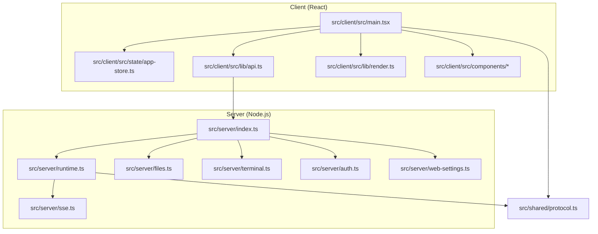
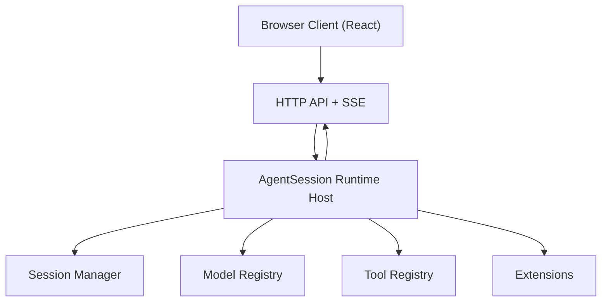
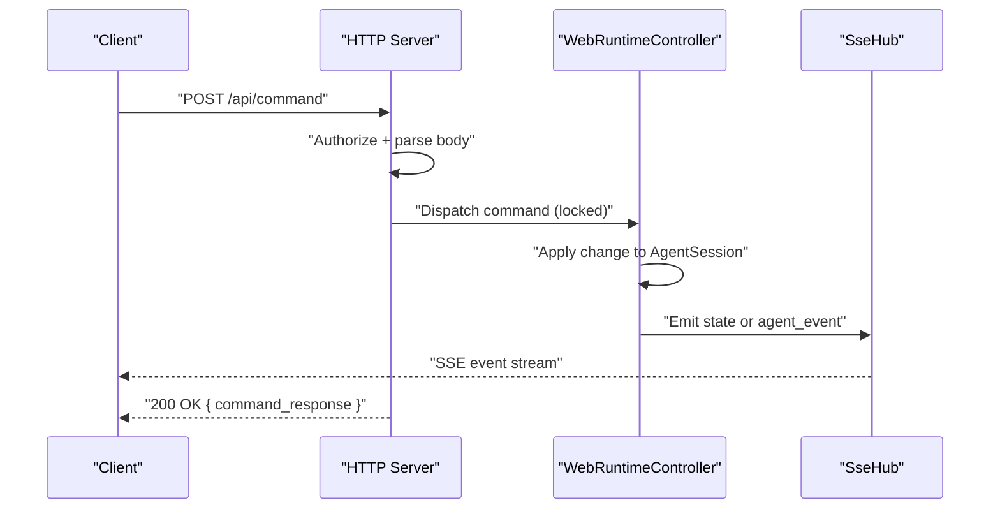
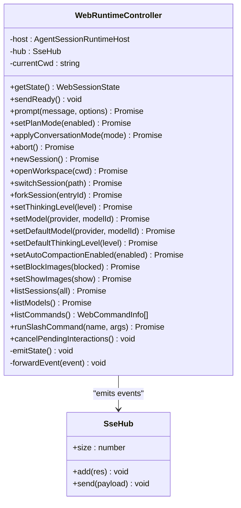
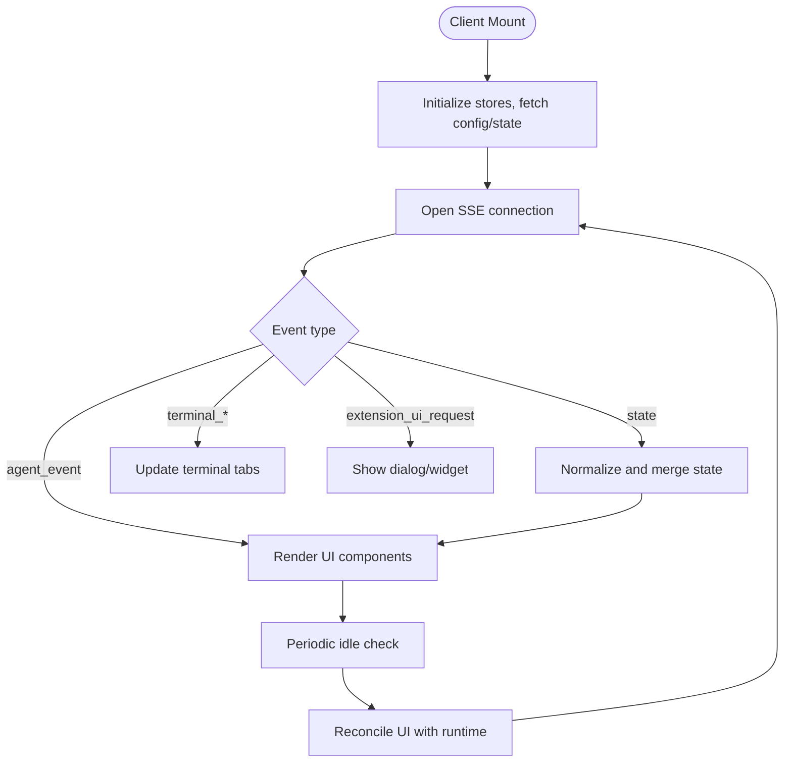
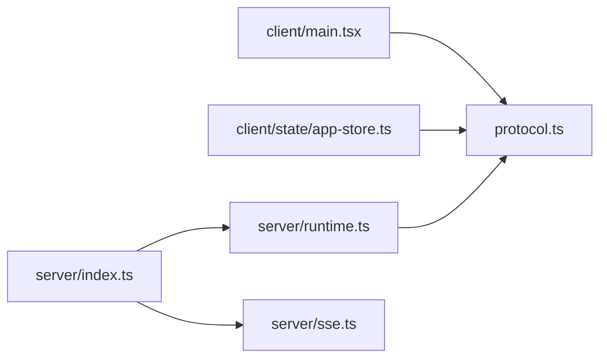

# Development Guidelines

<cite>
**Referenced Files in This Document**
- [README.md](file://README.md)
- [docs/architecture.md](file://docs/architecture.md)
- [package.json](file://package.json)
- [src/server/index.ts](file://src/server/index.ts)
- [src/server/runtime.ts](file://src/server/runtime.ts)
- [src/server/sse.ts](file://src/server/sse.ts)
- [src/shared/protocol.ts](file://src/shared/protocol.ts)
- [src/client/src/main.tsx](file://src/client/src/main.tsx)
- [src/client/src/state/app-store.ts](file://src/client/src/state/app-store.ts)
</cite>

## Table of Contents
1. [Introduction](#introduction)
2. [Project Structure](#project-structure)
3. [Core Components](#core-components)
4. [Architecture Overview](#architecture-overview)
5. [Detailed Component Analysis](#detailed-component-analysis)
6. [Dependency Analysis](#dependency-analysis)
7. [Performance Considerations](#performance-considerations)
8. [Testing and Quality Assurance](#testing-and-quality-assurance)
9. [Contribution Workflow](#contribution-workflow)
10. [Troubleshooting Guide](#troubleshooting-guide)
11. [Conclusion](#conclusion)

## Introduction
This document defines development guidelines for Quake Code Web, focusing on coding standards, architectural principles, and contribution workflows. It explains how the web application maintains runtime parity with the core AgentSession runtime, highlights extension points for customization, and prescribes state management patterns and performance optimizations. It also covers the recommended implementation order, code organization principles, and the development workflow including testing and code review processes.

## Project Structure
Quake Code Web is organized as a React + TypeScript + Vite frontend packaged with a Node.js HTTP server that bridges to the AgentSession runtime. The backend exposes REST endpoints and streams runtime events via Server-Sent Events (SSE). The frontend consumes these endpoints and events to orchestrate the UI, manage state, and render interactive components.

**Diagram sources**
- [src/client/src/main.tsx](file://src/client/src/main.tsx)
- [src/client/src/state/app-store.ts](file://src/client/src/state/app-store.ts)
- [src/server/index.ts](file://src/server/index.ts)
- [src/server/runtime.ts](file://src/server/runtime.ts)
- [src/server/sse.ts](file://src/server/sse.ts)
- [src/shared/protocol.ts](file://src/shared/protocol.ts)

**Section sources**
- [README.md](file://README.md)
- [docs/architecture.md](file://docs/architecture.md)
- [package.json](file://package.json)

## Core Components
- Server entrypoint and API router: handles HTTP routes, authentication, SSE, and command dispatch to the runtime.
- Runtime controller: manages AgentSession lifecycle, subscribes to runtime events, and emits normalized state updates.
- SSE hub: streams events to the client and maintains connections.
- Protocol contracts: define typed server-to-client events and client-to-server commands.
- Client shell: orchestrates UI composition, state synchronization, and user interactions.
- Client state store: centralized event and UI state with normalization and pruning policies.

Key responsibilities and integration points:
- Runtime parity: All tool execution, model selection, and session management flow through the AgentSession runtime.
- Extension UI bridge: Provides lightweight extension UI requests (select/confirm/input/editor/notify/status/widget).
- Security: Local token auth, workspace allowlist, and terminal policy enforcement.

**Section sources**
- [src/server/index.ts](file://src/server/index.ts)
- [src/server/runtime.ts](file://src/server/runtime.ts)
- [src/server/sse.ts](file://src/server/sse.ts)
- [src/shared/protocol.ts](file://src/shared/protocol.ts)
- [src/client/src/main.tsx](file://src/client/src/main.tsx)
- [src/client/src/state/app-store.ts](file://src/client/src/state/app-store.ts)

## Architecture Overview
Quake Code Web follows a strict runtime-native architecture: the browser never drives a separate agent implementation. The server owns the AgentSession runtime, active session, extension binding, model/session/settings/runtime state, and tool execution through the existing agent tool registry. The client is a React shell that mirrors runtime state and events.

**Diagram sources**
- [docs/architecture.md](file://docs/architecture.md)
- [src/server/runtime.ts](file://src/server/runtime.ts)
- [src/server/index.ts](file://src/server/index.ts)

## Detailed Component Analysis

### Server Entry and API Routing
Responsibilities:
- Parse and authorize requests, inject client token into HTML.
- Serve static assets and handle REST endpoints for sessions, models, files, terminal, settings, Git, search, and scheduling.
- Dispatch commands to the runtime controller with concurrency and locking controls.
- Attach terminal WebSocket for interactive PTY sessions.

Implementation notes:
- Uses a lock to serialize runtime-changing commands.
- Validates workspace paths against allowlist and security constraints.
- Emits SSE events for terminal output and runtime state changes.

**Diagram sources**
- [src/server/index.ts](file://src/server/index.ts)
- [src/server/runtime.ts](file://src/server/runtime.ts)
- [src/server/sse.ts](file://src/server/sse.ts)

**Section sources**
- [src/server/index.ts](file://src/server/index.ts)

### Runtime Controller and Extension UI Bridge
Responsibilities:
- Owns AgentSessionRuntimeHost and current session.
- Normalizes runtime state for the UI and emits ready/state events.
- Handles conversation modes (execute/plan), plan clarifications, and slash commands.
- Bridges extension UI requests to the client via SSE.

Design principles:
- Centralized subscription to runtime events and selective state emission.
- Explicit handling of plan mode transitions and UI state synchronization.

**Diagram sources**
- [src/server/runtime.ts](file://src/server/runtime.ts)
- [src/server/sse.ts](file://src/server/sse.ts)

**Section sources**
- [src/server/runtime.ts](file://src/server/runtime.ts)

### Client Shell and State Management
Responsibilities:
- Initialize UI, theme, and keyboard shortcuts.
- Subscribe to SSE for runtime events and synchronize state.
- Manage session switching, workspace opening, and file operations.
- Orchestrate tool rendering, terminal panels, and extension UI requests.
- Persist UI preferences and manage toast notifications.

State management:
- Centralized store using Zustand with normalization and pruning for messages and tools.
- Streaming message consolidation and periodic reconciliation on visibility changes and idle timeouts.

**Diagram sources**
- [src/client/src/main.tsx](file://src/client/src/main.tsx)
- [src/client/src/state/app-store.ts](file://src/client/src/state/app-store.ts)

**Section sources**
- [src/client/src/main.tsx](file://src/client/src/main.tsx)
- [src/client/src/state/app-store.ts](file://src/client/src/state/app-store.ts)

### Protocol Contracts
Defines typed contracts for:
- Server-to-client events (ready, state, agent_event, terminal_*).
- Client-to-server commands (prompt, abort, session management, settings, plan decisions, slash commands).
- Session state, models, commands, plan state, and server configuration.

These contracts ensure runtime parity and enable robust client-server communication.

**Section sources**
- [src/shared/protocol.ts](file://src/shared/protocol.ts)

## Dependency Analysis
Internal dependencies:
- Client depends on shared protocol types and server endpoints.
- Server depends on runtime controller, SSE hub, file services, terminal service, and security modules.
- Runtime controller depends on AgentSession runtime and extension UI bridge.

External dependencies (selected):
- React, ReactDOM, Zustand for UI and state.
- Monaco Editor for editor/diff experiences.
- Xterm for terminal emulation.
- TailwindCSS for styling.

**Diagram sources**
- [src/shared/protocol.ts](file://src/shared/protocol.ts)
- [src/client/src/main.tsx](file://src/client/src/main.tsx)
- [src/client/src/state/app-store.ts](file://src/client/src/state/app-store.ts)
- [src/server/index.ts](file://src/server/index.ts)
- [src/server/runtime.ts](file://src/server/runtime.ts)
- [src/server/sse.ts](file://src/server/sse.ts)

**Section sources**
- [package.json](file://package.json)

## Performance Considerations
- Message deduplication and sliding window: The client normalizes messages and prunes older entries to cap memory usage.
- Tool output compaction: Long tool outputs are truncated with markers to limit DOM and network payload sizes.
- Streaming consolidation: Uses requestAnimationFrame to batch UI updates for streaming messages and tool cards.
- Idle reconciliation: Periodic refresh ensures UI stays in sync after long idle periods or focus changes.
- SSE buffering: Server sends minimal payloads and avoids unnecessary state emissions.

Recommendations:
- Prefer incremental rendering for long timelines and tool outputs.
- Use virtualization for large lists (already integrated).
- Avoid frequent deep re-renders by keeping props shallow and using selectors.

**Section sources**
- [src/client/src/state/app-store.ts](file://src/client/src/state/app-store.ts)
- [src/client/src/main.tsx](file://src/client/src/main.tsx)

## Testing and Quality Assurance
- Type checking and build verification are automated via scripts.
- Smoke tests exercise basic flows.
- End-to-end tests use Playwright with dedicated scripts and reports.

Recommended practices:
- Add unit tests for state normalization and rendering helpers.
- Add integration tests for SSE event handling and command sequences.
- Use Playwright tests for cross-feature flows (chat, sessions, terminal, files).

**Section sources**
- [README.md](file://README.md)
- [package.json](file://package.json)

## Contribution Workflow
Recommended implementation order:
1. Keep AgentSessionRuntimeHost as the single execution backend.
2. Harden local auth, workspace allowlist, and terminal policy before enabling remote access.
3. Replace or complement SSE with WebSocket only when bidirectional interactions require it.
4. Add rich tool renderers incrementally, starting with edit, write, bash, read.
5. Introduce Monaco editor/diff once structured file operations are stable.
6. Add a complete settings UI through SettingsManager rather than duplicating config parsing.
7. Add E2E smoke tests before expanding to multi-session/multi-workspace mode.

Guidelines:
- Keep web-specific code focused on presentation, local auth, event bridging, and browser ergonomics.
- Avoid coupling to TUI-only internals; rely on runtime-native APIs.
- Extend protocol contracts and server handlers for new capabilities.
- Maintain runtime parity: all tool execution and session semantics originate from the runtime.

**Section sources**
- [README.md](file://README.md)

## Troubleshooting Guide
Common areas to inspect:
- SSE connectivity: Verify the client opens /api/events and handles reconnects gracefully.
- Authentication: Ensure local token is injected and required endpoints are protected.
- Workspace permissions: Validate workspace allowlist and path resolution.
- Terminal policy: Confirm policy mode and command restrictions.
- Lock contention: Commands that mutate runtime state are serialized; long-running operations may appear delayed.

Operational checks:
- Inspect server logs for authorization failures or workspace violations.
- Use browser DevTools Network tab to monitor SSE and API responses.
- Verify terminal WebSocket attachment and PTY behavior.

**Section sources**
- [src/server/index.ts](file://src/server/index.ts)
- [src/server/sse.ts](file://src/server/sse.ts)

## Conclusion
Quake Code Web's architecture and development guidelines emphasize runtime parity, security, and maintainable UI patterns. By keeping the AgentSession runtime as the source of truth, leveraging SSE for event streaming, and organizing code around shared protocols, contributors can implement features that integrate seamlessly with the core while preserving a responsive, secure, and scalable user experience.
