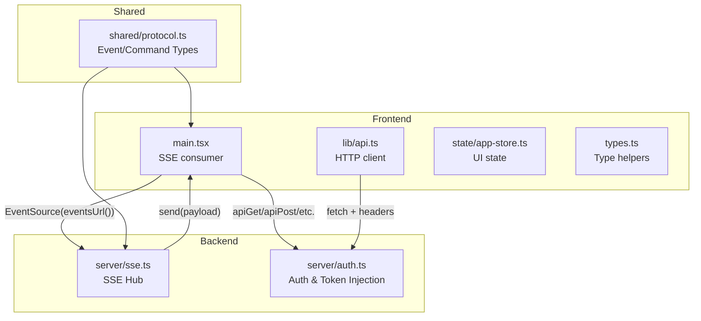
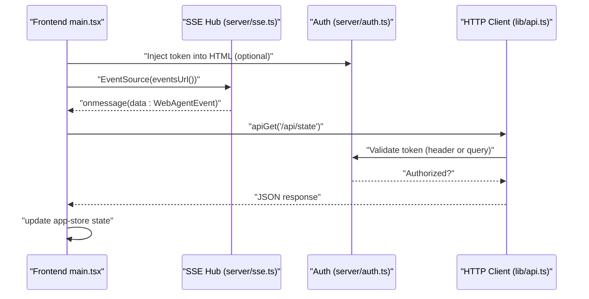
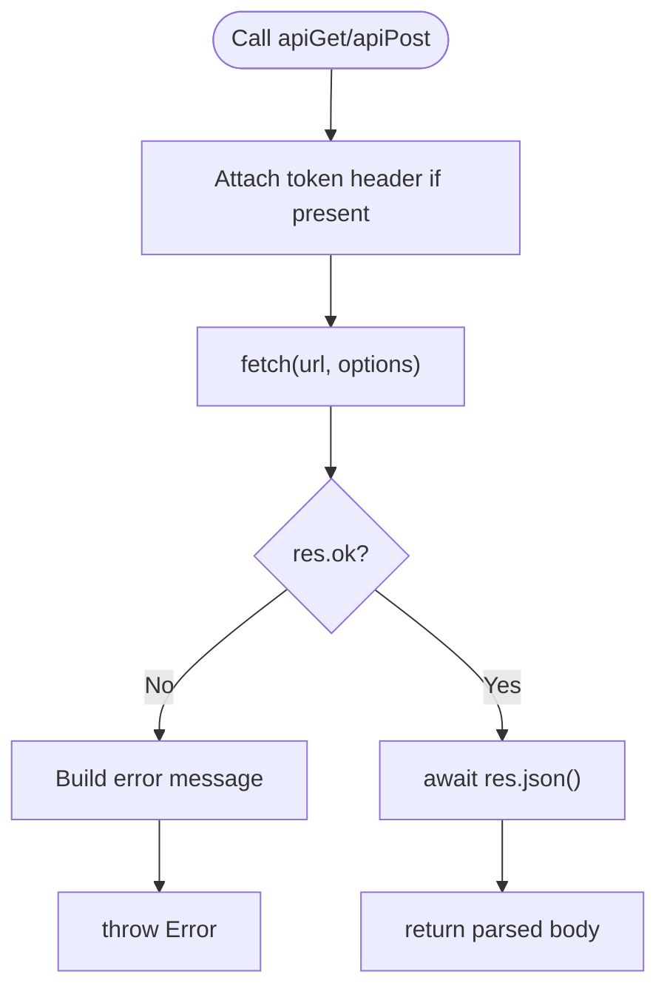
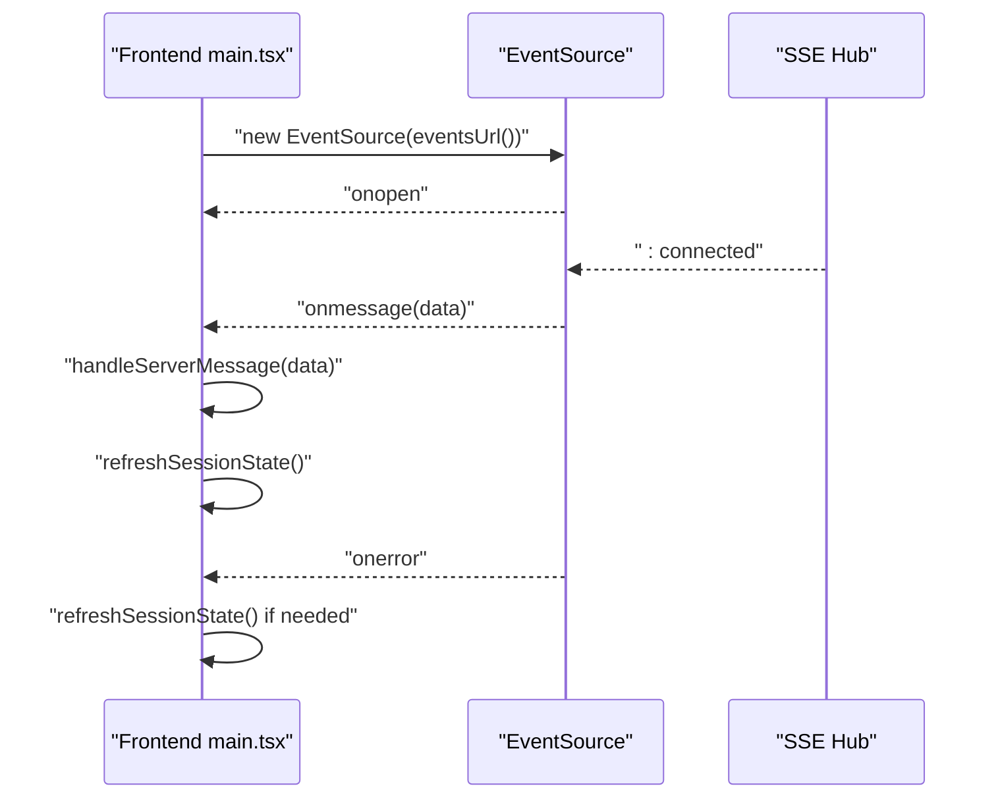
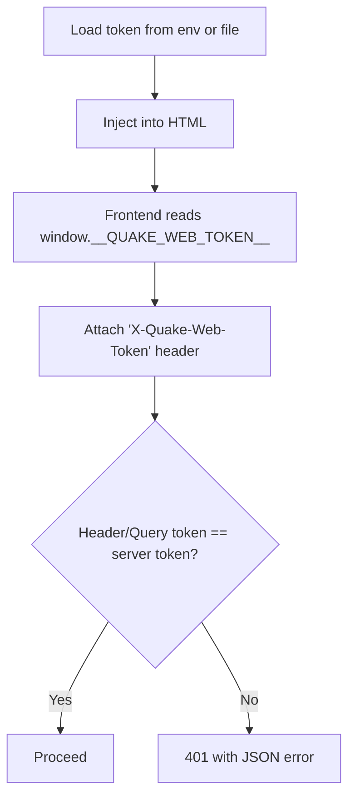
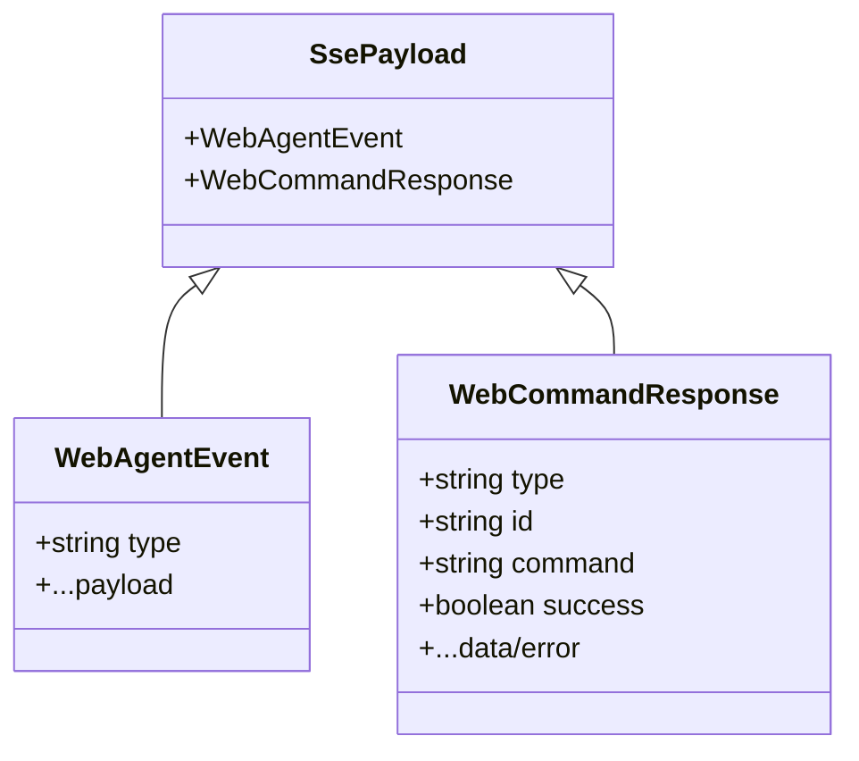
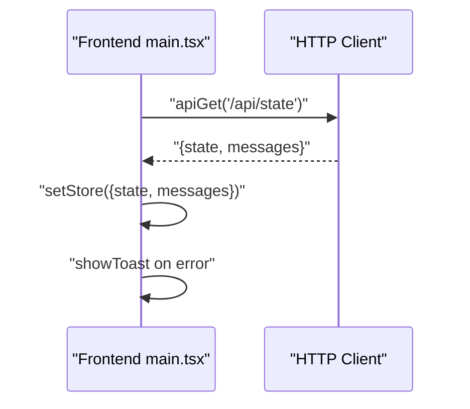
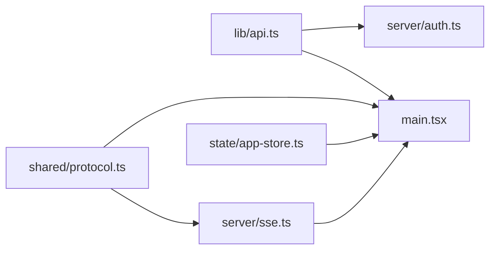

# API Integration

<cite>
**Referenced Files in This Document**
- [api.ts](file://src/client/src/lib/api.ts)
- [sse.ts](file://src/server/sse.ts)
- [auth.ts](file://src/server/auth.ts)
- [protocol.ts](file://src/shared/protocol.ts)
- [main.tsx](file://src/client/src/main.tsx)
- [app-store.ts](file://src/client/src/state/app-store.ts)
- [types.ts](file://src/client/src/types.ts)
</cite>

## Table of Contents
1. [Introduction](#introduction)
2. [Project Structure](#project-structure)
3. [Core Components](#core-components)
4. [Architecture Overview](#architecture-overview)
5. [Detailed Component Analysis](#detailed-component-analysis)
6. [Dependency Analysis](#dependency-analysis)
7. [Performance Considerations](#performance-considerations)
8. [Troubleshooting Guide](#troubleshooting-guide)
9. [Conclusion](#conclusion)

## Introduction
This document explains the frontend API integration patterns used by the application. It covers the HTTP client implementation, request/response handling, error management, Server-Sent Events (SSE) integration for real-time updates, authentication and token management, API endpoint usage, data transformation patterns, and strategies for resilience and performance. The goal is to help developers understand how the frontend communicates with the backend, how real-time updates are handled, and how to extend or troubleshoot the integration safely.

## Project Structure
The API integration spans three primary areas:
- Frontend HTTP client and SSE consumption
- Backend SSE hub and authentication
- Shared protocol definitions for events and commands

**Diagram sources**
- [main.tsx:572-588](file://src/client/src/main.tsx#L572-L588)
- [api.ts:9-46](file://src/client/src/lib/api.ts#L9-L46)
- [sse.ts:6-31](file://src/server/sse.ts#L6-L31)
- [auth.ts:15-29](file://src/server/auth.ts#L15-L29)
- [protocol.ts:161-197](file://src/shared/protocol.ts#L161-L197)

**Section sources**
- [api.ts:1-59](file://src/client/src/lib/api.ts#L1-L59)
- [sse.ts:1-32](file://src/server/sse.ts#L1-L32)
- [auth.ts:1-56](file://src/server/auth.ts#L1-L56)
- [protocol.ts:1-198](file://src/shared/protocol.ts#L1-L198)
- [main.tsx:572-588](file://src/client/src/main.tsx#L572-L588)

## Core Components
- HTTP client: Provides typed fetch wrappers for GET, POST, PATCH, DELETE with optional token header injection.
- SSE hub: Manages SSE connections, headers, and broadcasting to connected clients.
- Authentication: Enforces token-based access via request headers or URL query param, with secure token generation and HTML injection.
- Protocol: Defines the shape of agent events and command responses exchanged over SSE and HTTP.
- Frontend integration: Consumes SSE events, refreshes state, and manages UI updates.

**Section sources**
- [api.ts:9-46](file://src/client/src/lib/api.ts#L9-L46)
- [sse.ts:6-31](file://src/server/sse.ts#L6-L31)
- [auth.ts:15-29](file://src/server/auth.ts#L15-L29)
- [protocol.ts:161-197](file://src/shared/protocol.ts#L161-L197)
- [main.tsx:572-588](file://src/client/src/main.tsx#L572-L588)

## Architecture Overview
The frontend establishes an SSE connection to receive real-time updates and uses a lightweight HTTP client for REST-style interactions. Authentication is enforced by the backend using a shared token passed either via a request header or URL query parameter. The shared protocol defines the event and command schemas.

**Diagram sources**
- [main.tsx:572-588](file://src/client/src/main.tsx#L572-L588)
- [api.ts:9-46](file://src/client/src/lib/api.ts#L9-L46)
- [sse.ts:6-31](file://src/server/sse.ts#L6-L31)
- [auth.ts:15-29](file://src/server/auth.ts#L15-L29)
- [protocol.ts:161-197](file://src/shared/protocol.ts#L161-L197)

## Detailed Component Analysis

### HTTP Client Implementation (lib/api.ts)
- Token propagation: The client reads a token from a global variable injected by the backend and attaches it as a custom header for protected routes.
- Request methods: Typed wrappers for GET, POST, PATCH, DELETE that serialize/deserialize JSON and surface errors consistently.
- Error handling: On non-OK responses, the client constructs a user-friendly error message derived from the response body or status code.

**Diagram sources**
- [api.ts:9-46](file://src/client/src/lib/api.ts#L9-L46)
- [api.ts:52-58](file://src/client/src/lib/api.ts#L52-L58)

**Section sources**
- [api.ts:7-8](file://src/client/src/lib/api.ts#L7-L8)
- [api.ts:9-46](file://src/client/src/lib/api.ts#L9-L46)
- [api.ts:52-58](file://src/client/src/lib/api.ts#L52-L58)

### SSE Integration (main.tsx + server/sse.ts)
- Connection lifecycle: The frontend opens an EventSource to the URL returned by eventsUrl(), which optionally appends the token as a query parameter. It handles open, message, and error events.
- Real-time updates: Each incoming message is parsed and routed to a handler that updates UI state and triggers a refresh of session state when appropriate.
- Resilience: On error, the frontend attempts a state reconciliation refresh to recover from transient disconnections.
- Backend SSE hub: The server sets strict headers to maintain long-lived streams, writes periodic keepalive, and broadcasts payloads to all connected clients.

**Diagram sources**
- [main.tsx:572-588](file://src/client/src/main.tsx#L572-L588)
- [sse.ts:9-26](file://src/server/sse.ts#L9-L26)

**Section sources**
- [main.tsx:572-588](file://src/client/src/main.tsx#L572-L588)
- [sse.ts:6-31](file://src/server/sse.ts#L6-L31)

### Authentication and Token Management (server/auth.ts + lib/api.ts)
- Token discovery: The backend checks environment variables and a token file to initialize a persistent token. The frontend reads the token from a global variable injected into the HTML head.
- Authorization check: Requests are authorized if the token is present in the X-Quake-Web-Token header or as a token query parameter.
- Rejection: Unauthorized requests receive a structured JSON error response with a 401 status.
- Security: Token comparison uses constant-time equality to mitigate timing attacks.

**Diagram sources**
- [auth.ts:10-35](file://src/server/auth.ts#L10-L35)
- [api.ts:7](file://src/client/src/lib/api.ts#L7-L8)
- [auth.ts:15-29](file://src/server/auth.ts#L15-L29)

**Section sources**
- [auth.ts:10-35](file://src/server/auth.ts#L10-L35)
- [api.ts:7](file://src/client/src/lib/api.ts#L7-L8)
- [auth.ts:15-29](file://src/server/auth.ts#L15-L29)

### Protocol and Data Transformation (shared/protocol.ts + main.tsx)
- Event types: The shared protocol defines WebAgentEvent variants covering ready, state updates, agent events, terminal activity, errors, and extension UI requests.
- Command responses: WebCommandResponse distinguishes successful and failed command outcomes.
- Frontend handling: Incoming SSE payloads are parsed and mapped into UI updates via the app store, including streaming message consolidation and tool card state transitions.

**Diagram sources**
- [protocol.ts:161-197](file://src/shared/protocol.ts#L161-L197)
- [sse.ts:4](file://src/server/sse.ts#L4)

**Section sources**
- [protocol.ts:161-197](file://src/shared/protocol.ts#L161-L197)
- [main.tsx:1177-1200](file://src/client/src/main.tsx#L1177-L1200)

### API Endpoint Usage Patterns (main.tsx)
- State refresh: The frontend calls a state endpoint to synchronize UI with the backend session state.
- Command dispatch: Commands are sent to the backend via SSE (as defined in the protocol) and also through HTTP where applicable.
- Error surfacing: UI notifications are shown for failures during refresh and other operations.

**Diagram sources**
- [main.tsx:378-398](file://src/client/src/main.tsx#L378-L398)

**Section sources**
- [main.tsx:378-398](file://src/client/src/main.tsx#L378-L398)

## Dependency Analysis
- Frontend depends on:
  - lib/api.ts for HTTP requests
  - server/auth.ts for token validation and HTML injection
  - server/sse.ts for real-time updates
  - shared/protocol.ts for event/command schemas
- Coupling:
  - main.tsx couples to both HTTP client and SSE hub.
  - app-store.ts holds UI state and is updated by both HTTP responses and SSE events.
- Cohesion:
  - HTTP client encapsulates request/response and error handling.
  - SSE hub encapsulates connection lifecycle and broadcasting.

**Diagram sources**
- [api.ts:9-46](file://src/client/src/lib/api.ts#L9-L46)
- [auth.ts:15-29](file://src/server/auth.ts#L15-L29)
- [sse.ts:6-31](file://src/server/sse.ts#L6-L31)
- [protocol.ts:161-197](file://src/shared/protocol.ts#L161-L197)
- [main.tsx:572-588](file://src/client/src/main.tsx#L572-L588)
- [app-store.ts:186-252](file://src/client/src/state/app-store.ts#L186-L252)

**Section sources**
- [api.ts:9-46](file://src/client/src/lib/api.ts#L9-L46)
- [auth.ts:15-29](file://src/server/auth.ts#L15-L29)
- [sse.ts:6-31](file://src/server/sse.ts#L6-L31)
- [protocol.ts:161-197](file://src/shared/protocol.ts#L161-L197)
- [main.tsx:572-588](file://src/client/src/main.tsx#L572-L588)
- [app-store.ts:186-252](file://src/client/src/state/app-store.ts#L186-L252)

## Performance Considerations
- SSE streaming:
  - Keep-alive headers and buffered writes ensure reliable delivery.
  - Frontend refreshes state periodically when no events arrive to avoid stale UI.
- HTTP client:
  - Minimal overhead via fetch with JSON parsing and error normalization.
  - No built-in retry or caching; rely on application-level strategies.
- UI state management:
  - Deduplication and windowing reduce memory footprint for long conversations.
  - Streaming message rendering uses a lightweight approach to minimize layout thrash.

[No sources needed since this section provides general guidance]

## Troubleshooting Guide
- SSE connection drops:
  - The frontend automatically attempts a state refresh on error and on focus/visibility change to reconcile state.
  - Verify the events URL includes the token when required.
- Unauthorized requests:
  - Ensure the token header or query parameter matches the server's token. Check backend logs for 401 responses.
- Error messages:
  - The HTTP client normalizes errors from the server; inspect the error payload and status to diagnose issues.
- UI not updating:
  - Confirm that SSE messages are being received and that the handler updates the app store accordingly.

**Section sources**
- [main.tsx:572-588](file://src/client/src/main.tsx#L572-L588)
- [auth.ts:15-29](file://src/server/auth.ts#L15-L29)
- [api.ts:52-58](file://src/client/src/lib/api.ts#L52-L58)

## Conclusion
The frontend integrates with the backend through a concise HTTP client and a robust SSE pipeline. Authentication is enforced securely via a shared token propagated via header or query parameter. The shared protocol ensures consistent event and command schemas across the wire. Together, these patterns enable responsive, real-time interactions while maintaining clear separation of concerns and predictable error handling.
