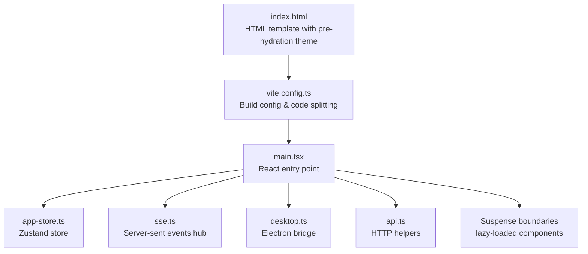
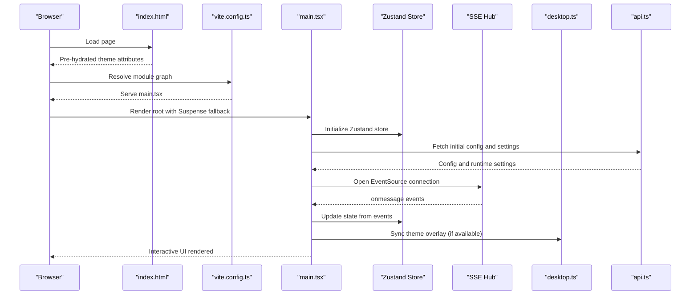
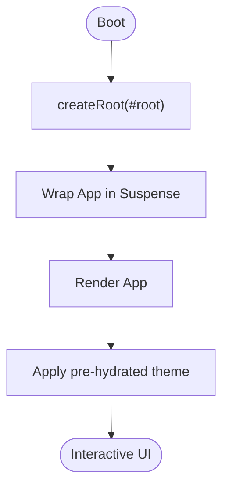
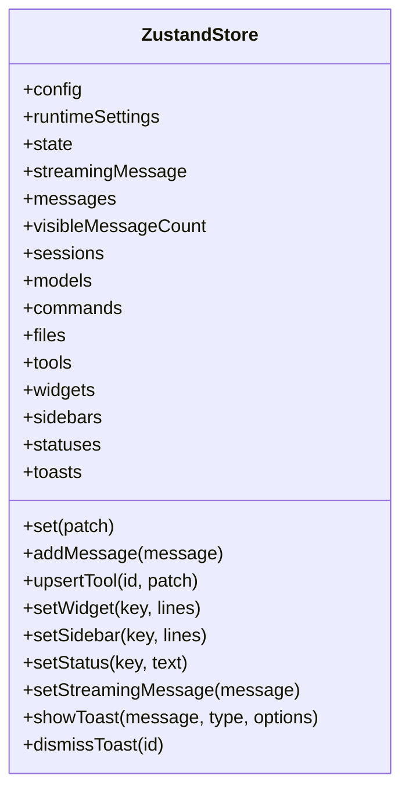
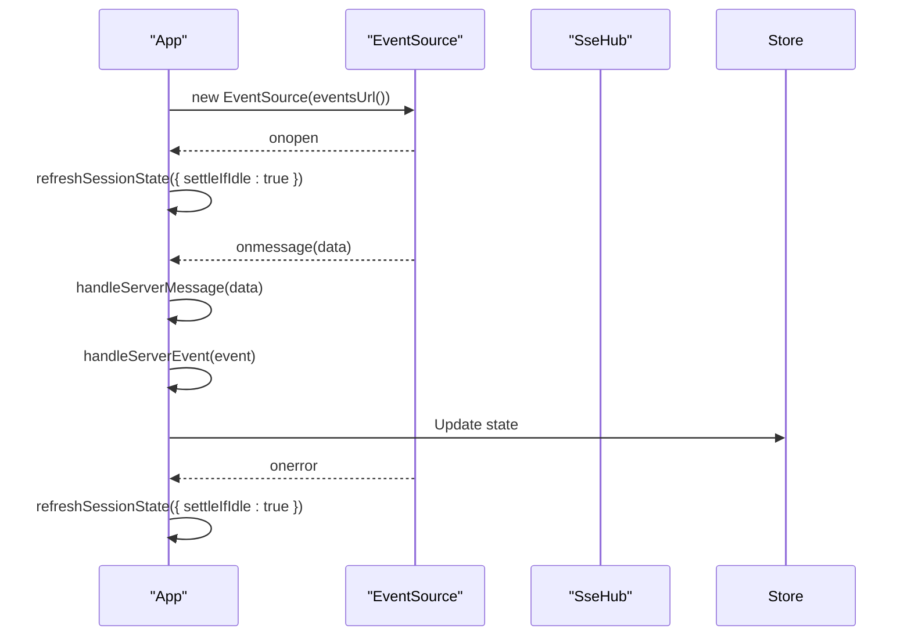
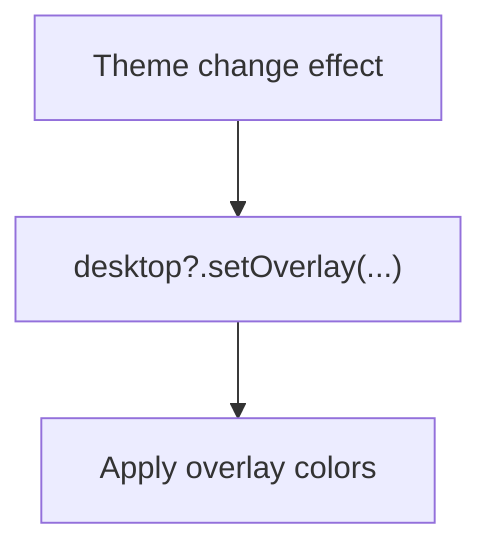
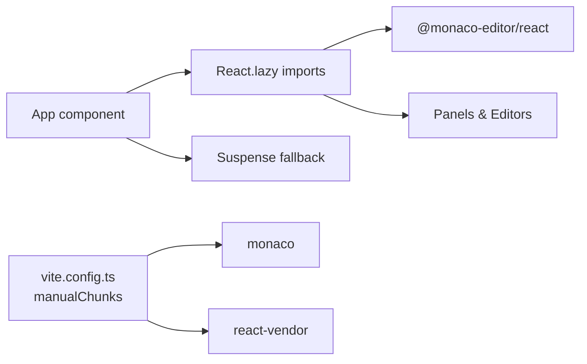
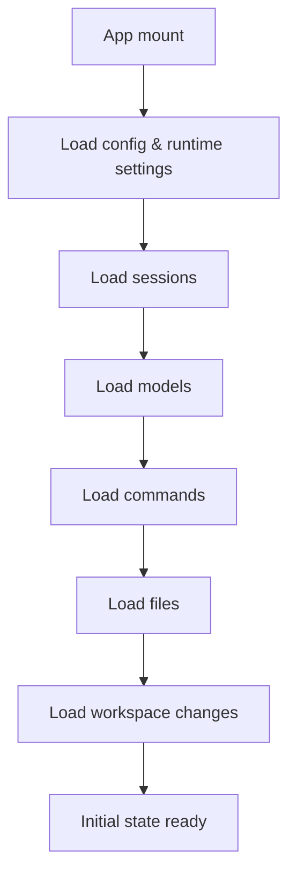
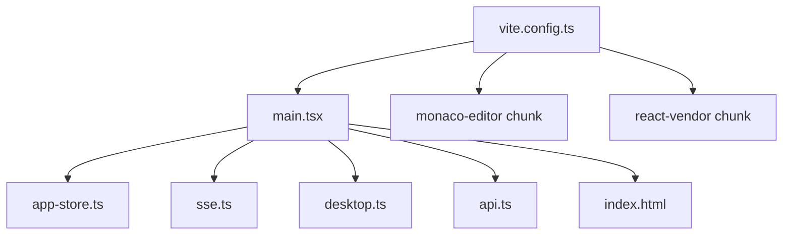

# Application Bootstrap

<cite>
**Referenced Files in This Document**
- [main.tsx](file://src/client/src/main.tsx)
- [app-store.ts](file://src/client/src/state/app-store.ts)
- [app-context.tsx](file://src/client/src/state/app-context.tsx)
- [api.ts](file://src/client/src/lib/api.ts)
- [desktop.ts](file://src/client/src/lib/desktop.ts)
- [sse.ts](file://src/server/sse.ts)
- [index.html](file://src/client/index.html)
- [vite.config.ts](file://vite.config.ts)
- [README.md](file://README.md)
</cite>

## Table of Contents
1. [Introduction](#introduction)
2. [Project Structure](#project-structure)
3. [Core Components](#core-components)
4. [Architecture Overview](#architecture-overview)
5. [Detailed Component Analysis](#detailed-component-analysis)
6. [Dependency Analysis](#dependency-analysis)
7. [Performance Considerations](#performance-considerations)
8. [Troubleshooting Guide](#troubleshooting-guide)
9. [Conclusion](#conclusion)

## Introduction
This document explains the React application bootstrap process for the Quake Code Web client. It covers the main entry point, component lazy loading with React.lazy, code splitting, initial state setup, application initialization sequence, suspense boundaries, fallback rendering, Zustand store integration, Server-Sent Events (SSE) event stream setup, and desktop integration initialization. It also addresses performance optimization techniques for initial load, memory management during hydration, error boundary configuration, browser compatibility considerations, and progressive enhancement strategies.

## Project Structure
The web client is a React + TypeScript + Vite application that serves as a browser shell over the Quake Code runtime. The key bootstrap artifacts are:
- HTML template with pre-hydration theme handling
- Vite configuration with code-splitting chunks
- React entry point with Suspense boundaries and lazy-loaded components
- Zustand store for centralized state and normalization
- SSE integration for real-time agent events
- Desktop bridge for Electron overlay theming

**Diagram sources**
- [index.html:1-27](file://src/client/index.html#L1-L27)
- [vite.config.ts:21-50](file://vite.config.ts#L21-L50)
- [main.tsx:1-120](file://src/client/src/main.tsx#L1-L120)
- [app-store.ts:186-253](file://src/client/src/state/app-store.ts#L186-L253)
- [sse.ts:6-32](file://src/server/sse.ts#L6-L32)
- [desktop.ts:1-24](file://src/client/src/lib/desktop.ts#L1-L24)
- [api.ts:9-50](file://src/client/src/lib/api.ts#L9-L50)

**Section sources**
- [README.md:88-103](file://README.md#L88-L103)
- [index.html:1-27](file://src/client/index.html#L1-L27)
- [vite.config.ts:21-50](file://vite.config.ts#L21-L50)

## Core Components
- React entry point and root rendering with Suspense fallback
- Zustand store with normalization and memory limits
- SSE event stream consumer with reconciliation and error handling
- Desktop integration bridge for Electron overlay theming
- API helpers for authenticated HTTP requests and SSE URLs
- HTML template with pre-hydration theme injection

**Section sources**
- [main.tsx:145-1572](file://src/client/src/main.tsx#L145-L1572)
- [app-store.ts:186-253](file://src/client/src/state/app-store.ts#L186-L253)
- [api.ts:9-50](file://src/client/src/lib/api.ts#L9-L50)
- [desktop.ts:1-24](file://src/client/src/lib/desktop.ts#L1-L24)
- [index.html:9-20](file://src/client/index.html#L9-L20)

## Architecture Overview
The bootstrap initializes the React root under a Suspense boundary, sets up the Zustand store, loads initial configuration and runtime settings, and establishes an SSE connection to receive agent events. Heavy UI components are lazy-loaded to reduce initial bundle size. The desktop bridge integrates with Electron to synchronize theme overlays.

**Diagram sources**
- [index.html:9-20](file://src/client/index.html#L9-L20)
- [vite.config.ts:21-50](file://vite.config.ts#L21-L50)
- [main.tsx:569-588](file://src/client/src/main.tsx#L569-L588)
- [app-store.ts:186-253](file://src/client/src/state/app-store.ts#L186-L253)
- [api.ts:9-50](file://src/client/src/lib/api.ts#L9-L50)
- [desktop.ts:20-24](file://src/client/src/lib/desktop.ts#L20-L24)

## Detailed Component Analysis

### React Entry Point and Root Rendering
- The entry point creates the root and wraps the App component in a Suspense boundary with a loading screen fallback.
- The App component orchestrates state, effects, lazy-loaded components, and UI composition.
- Theme pre-hydration is handled in the HTML head to avoid flash-of-wrong-theme.

**Diagram sources**
- [main.tsx:3197-3198](file://src/client/src/main.tsx#L3197-L3198)
- [index.html:9-20](file://src/client/index.html#L9-L20)

**Section sources**
- [main.tsx:3197-3198](file://src/client/src/main.tsx#L3197-L3198)
- [index.html:9-20](file://src/client/index.html#L9-L20)

### Zustand Store Initialization and Normalization
- The store defines state slices for messages, tools, sessions, models, files, and UI state.
- It includes normalization functions to deduplicate messages and cap memory usage.
- Tool outputs are compacted to limit DOM size and improve performance.
- Toast notifications are capped to a fixed number.

**Diagram sources**
- [app-store.ts:33-58](file://src/client/src/state/app-store.ts#L33-L58)
- [app-store.ts:186-253](file://src/client/src/state/app-store.ts#L186-L253)

**Section sources**
- [app-store.ts:186-253](file://src/client/src/state/app-store.ts#L186-L253)

### Server-Sent Events Integration
- An EventSource connects to the SSE endpoint, handling open, message, and error events.
- On open, the app refreshes session state and reconciles UI state.
- On message, events are parsed and dispatched to handlers for state updates and UI reactions.
- On error, the app attempts a reconciliation if streaming is not active.

**Diagram sources**
- [main.tsx:569-588](file://src/client/src/main.tsx#L569-L588)
- [main.tsx:1178-1191](file://src/client/src/main.tsx#L1178-L1191)
- [main.tsx:1144-1176](file://src/client/src/main.tsx#L1144-L1176)
- [sse.ts:6-32](file://src/server/sse.ts#L6-L32)

**Section sources**
- [main.tsx:569-588](file://src/client/src/main.tsx#L569-L588)
- [main.tsx:1178-1191](file://src/client/src/main.tsx#L1178-L1191)
- [main.tsx:1144-1176](file://src/client/src/main.tsx#L1144-L1176)
- [sse.ts:6-32](file://src/server/sse.ts#L6-L32)

### Desktop Integration Bridge
- The desktop bridge exposes a typed interface for Electron overlay theming.
- On theme changes, the app synchronizes the overlay color scheme for the titlebar.
- The bridge is conditionally available in Electron builds.

**Diagram sources**
- [main.tsx:549-556](file://src/client/src/main.tsx#L549-L556)
- [desktop.ts:20-24](file://src/client/src/lib/desktop.ts#L20-L24)

**Section sources**
- [main.tsx:549-556](file://src/client/src/main.tsx#L549-L556)
- [desktop.ts:20-24](file://src/client/src/lib/desktop.ts#L20-L24)

### Lazy Loading and Code Splitting
- Heavy components are lazy-loaded using React.lazy with dynamic imports.
- Vite-managed code splitting groups monaco-editor and react vendor bundles separately.
- Suspense boundaries wrap lazy components to provide fallback UI during loading.

**Diagram sources**
- [main.tsx:58-80](file://src/client/src/main.tsx#L58-L80)
- [vite.config.ts:36-41](file://vite.config.ts#L36-L41)

**Section sources**
- [main.tsx:58-80](file://src/client/src/main.tsx#L58-L80)
- [vite.config.ts:36-41](file://vite.config.ts#L36-L41)

### Initial State Setup and Refresh Sequence
- On mount, the app loads configuration and runtime settings, sessions, models, commands, files, and workspace changes.
- A refreshAll function coordinates parallel and sequential loads to populate the UI efficiently.
- Loading flags are managed per resource to drive skeleton UI.

**Diagram sources**
- [main.tsx:569-588](file://src/client/src/main.tsx#L569-L588)
- [main.tsx:793-809](file://src/client/src/main.tsx#L793-L809)
- [main.tsx:811-824](file://src/client/src/main.tsx#L811-L824)
- [main.tsx:845-858](file://src/client/src/main.tsx#L845-L858)
- [main.tsx:860-869](file://src/client/src/main.tsx#L860-L869)
- [main.tsx:882-905](file://src/client/src/main.tsx#L882-L905)
- [main.tsx:871-880](file://src/client/src/main.tsx#L871-L880)

**Section sources**
- [main.tsx:793-809](file://src/client/src/main.tsx#L793-L809)
- [main.tsx:811-824](file://src/client/src/main.tsx#L811-L824)
- [main.tsx:845-858](file://src/client/src/main.tsx#L845-L858)
- [main.tsx:860-869](file://src/client/src/main.tsx#L860-L869)
- [main.tsx:882-905](file://src/client/src/main.tsx#L882-L905)
- [main.tsx:871-880](file://src/client/src/main.tsx#L871-L880)

### Suspense Boundaries and Fallback Rendering
- Suspense boundaries wrap lazy components and heavy panels to provide loading indicators.
- The root Suspense uses a loading screen fallback while the app hydrates.
- Per-panel Suspense ensures responsive UI even when heavy modules are loading.

**Section sources**
- [main.tsx:1373-1387](file://src/client/src/main.tsx#L1373-L1387)
- [main.tsx:1451-1457](file://src/client/src/main.tsx#L1451-L1457)
- [main.tsx:1501-1514](file://src/client/src/main.tsx#L1501-L1514)
- [main.tsx:1515-1544](file://src/client/src/main.tsx#L1515-L1544)
- [main.tsx:1547-1555](file://src/client/src/main.tsx#L1547-L1555)
- [main.tsx:1556-1561](file://src/client/src/main.tsx#L1556-L1561)
- [main.tsx:1568-1571](file://src/client/src/main.tsx#L1568-L1571)
- [main.tsx:3197-3198](file://src/client/src/main.tsx#L3197-L3198)

### API Helpers and Authentication
- HTTP helpers encapsulate fetch calls with token support and standardized error handling.
- SSE URLs include optional token query parameter for secure connections.
- Token injection is handled by Vite plugin in development.

**Section sources**
- [api.ts:9-50](file://src/client/src/lib/api.ts#L9-L50)
- [vite.config.ts:6-19](file://vite.config.ts#L6-L19)

### Application Context Provider
- The AppProvider exposes runtime configuration, current model, thinking level, and command dispatch to consumers.
- It derives values from the Zustand store and exposes a sendCommand function.

**Section sources**
- [app-context.tsx:33-57](file://src/client/src/state/app-context.tsx#L33-L57)

## Dependency Analysis
The bootstrap process exhibits clear separation of concerns:
- Entry point depends on Zustand store, SSE, desktop bridge, and API helpers.
- Store depends on normalization utilities and memory management policies.
- SSE hub is a server-side abstraction used by the client via EventSource.
- Vite configuration manages code splitting and chunking for performance.

**Diagram sources**
- [main.tsx:1-120](file://src/client/src/main.tsx#L1-L120)
- [app-store.ts:186-253](file://src/client/src/state/app-store.ts#L186-L253)
- [sse.ts:6-32](file://src/server/sse.ts#L6-L32)
- [desktop.ts:1-24](file://src/client/src/lib/desktop.ts#L1-L24)
- [api.ts:9-50](file://src/client/src/lib/api.ts#L9-L50)
- [index.html:1-27](file://src/client/index.html#L1-L27)
- [vite.config.ts:21-50](file://vite.config.ts#L21-L50)

**Section sources**
- [main.tsx:1-120](file://src/client/src/main.tsx#L1-L120)
- [vite.config.ts:21-50](file://vite.config.ts#L21-L50)

## Performance Considerations
- Code splitting: Vite groups monaco-editor and react vendor bundles to optimize caching and parallel loading.
- Lazy loading: Heavy components are loaded on demand to reduce initial bundle size.
- Memory management: Zustand store normalizes messages, prunes tools, and caps toast counts to control memory growth.
- Streaming updates: requestAnimationFrame batching coalesces frequent tool updates to avoid render thrashing.
- Pre-hydration theme: HTML injects theme attributes to prevent FOIT/FOUC during hydration.
- SSE backoff: Periodic reconciliation prevents stale UI when streams disconnect.

**Section sources**
- [vite.config.ts:36-41](file://vite.config.ts#L36-L41)
- [main.tsx:1293-1302](file://src/client/src/main.tsx#L1293-L1302)
- [index.html:9-20](file://src/client/index.html#L9-L20)
- [app-store.ts:137-156](file://src/client/src/state/app-store.ts#L137-L156)

## Troubleshooting Guide
- SSE connectivity: Verify token presence and server availability; the app automatically reconciles on errors if streaming is inactive.
- Lazy component loading: Ensure Suspense fallbacks are present; missing boundaries can cause unhandled promise rejections.
- Theme overlay: Confirm desktop bridge availability in Electron builds; otherwise, the app gracefully falls back to browser UI.
- API errors: Inspect standardized error messages from HTTP helpers; unauthorized or not found responses are surfaced clearly.
- Memory warnings: Monitor toast and tool counts; the store caps these to prevent excessive memory usage.

**Section sources**
- [main.tsx:579-582](file://src/client/src/main.tsx#L579-L582)
- [main.tsx:1373-1387](file://src/client/src/main.tsx#L1373-L1387)
- [desktop.ts:20-24](file://src/client/src/lib/desktop.ts#L20-L24)
- [api.ts:52-58](file://src/client/src/lib/api.ts#L52-L58)
- [app-store.ts:60-67](file://src/client/src/state/app-store.ts#L60-L67)

## Conclusion
The Quake Code Web bootstrap process establishes a robust, performant React application with deliberate lazy loading, code splitting, and state management. The SSE integration provides real-time updates, while the desktop bridge enhances the Electron experience. The Zustand store's normalization and memory controls ensure scalability. Together, these patterns deliver a responsive, resilient UI that prioritizes user experience during initial load and ongoing interaction.
