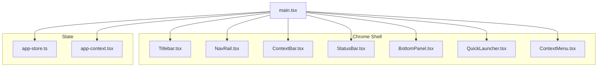
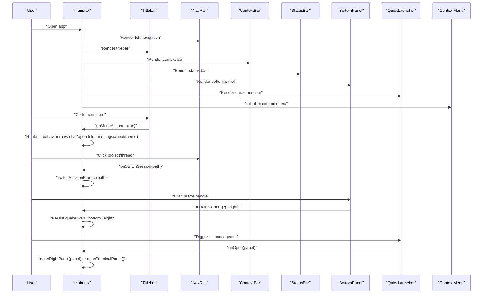
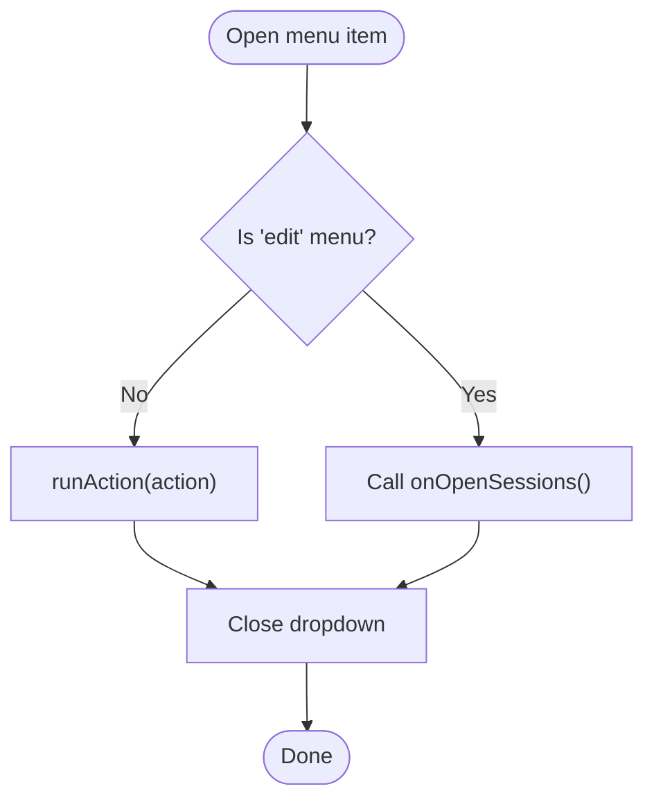
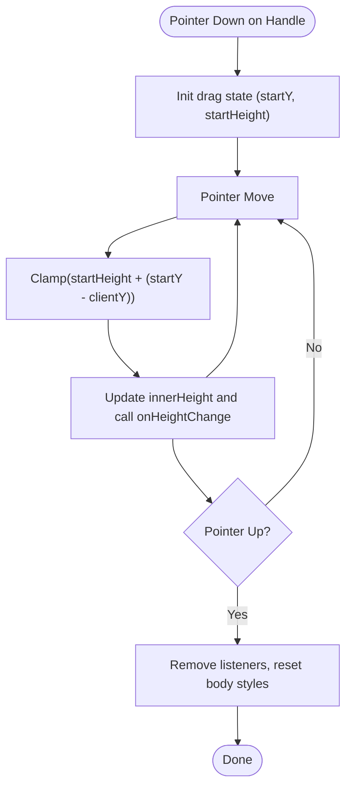
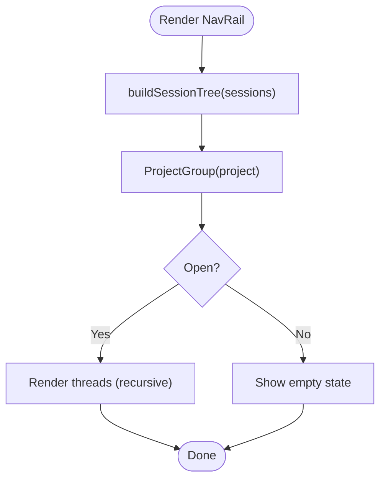
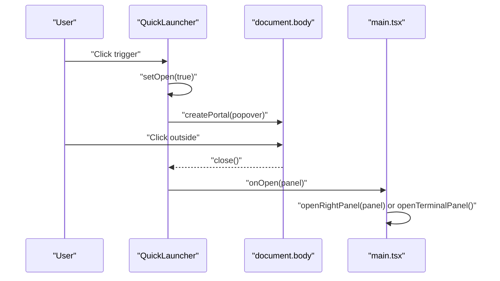
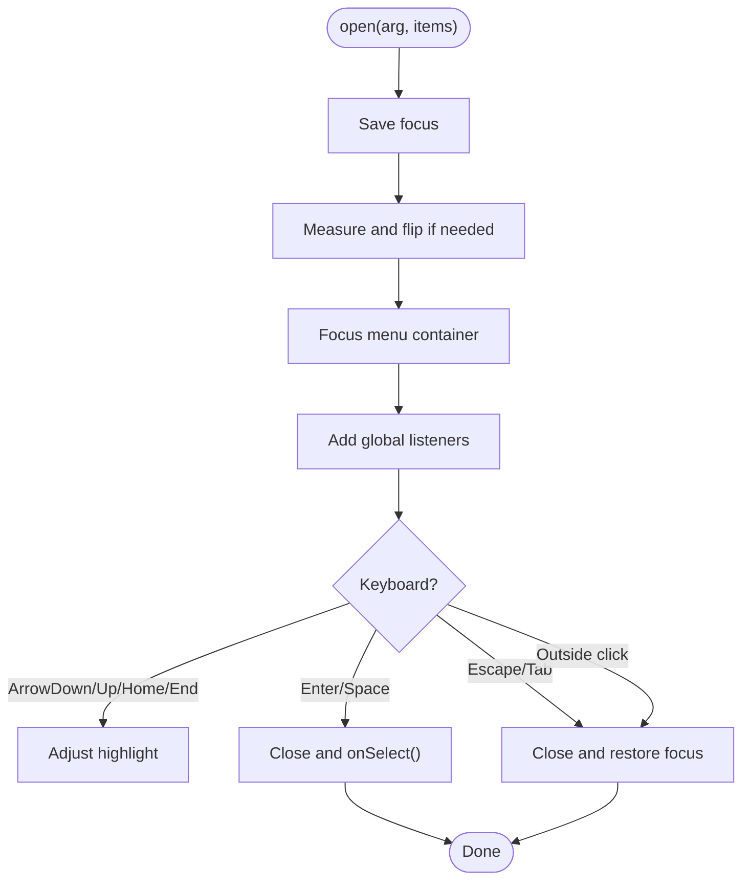
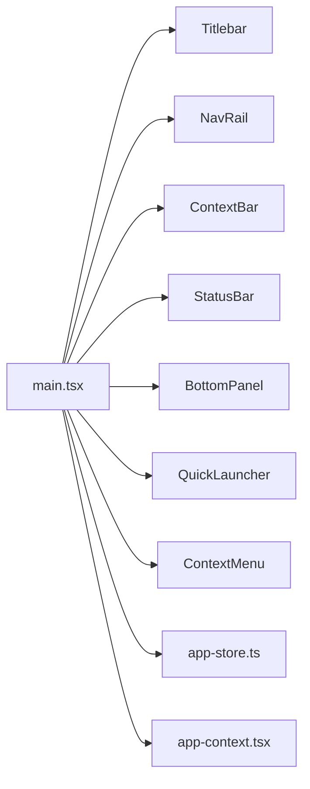

# Chrome Components

<cite>
**Referenced Files in This Document**
- [Titlebar.tsx](file://src/client/src/components/chrome/Titlebar.tsx)
- [Titlebar.module.css](file://src/client/src/components/chrome/Titlebar.module.css)
- [BottomPanel.tsx](file://src/client/src/components/chrome/BottomPanel.tsx)
- [BottomPanel.module.css](file://src/client/src/components/chrome/BottomPanel.module.css)
- [NavRail.tsx](file://src/client/src/components/chrome/NavRail.tsx)
- [NavRail.module.css](file://src/client/src/components/chrome/NavRail.module.css)
- [ContextBar.tsx](file://src/client/src/components/chrome/ContextBar.tsx)
- [ContextBar.module.css](file://src/client/src/components/chrome/ContextBar.module.css)
- [StatusBar.tsx](file://src/client/src/components/chrome/StatusBar.tsx)
- [StatusBar.module.css](file://src/client/src/components/chrome/StatusBar.module.css)
- [QuickLauncher.tsx](file://src/client/src/components/chrome/QuickLauncher.tsx)
- [QuickLauncher.module.css](file://src/client/src/components/chrome/QuickLauncher.module.css)
- [ContextMenu.tsx](file://src/client/src/components/chrome/ContextMenu.tsx)
- [ContextMenu.module.css](file://src/client/src/components/chrome/ContextMenu.module.css)
- [main.tsx](file://src/client/src/main.tsx)
- [app-store.ts](file://src/client/src/state/app-store.ts)
- [app-context.tsx](file://src/client/src/state/app-context.tsx)
</cite>

## Table of Contents
1. [Introduction](#introduction)
2. [Project Structure](#project-structure)
3. [Core Components](#core-components)
4. [Architecture Overview](#architecture-overview)
5. [Detailed Component Analysis](#detailed-component-analysis)
6. [Dependency Analysis](#dependency-analysis)
7. [Performance Considerations](#performance-considerations)
8. [Troubleshooting Guide](#troubleshooting-guide)
9. [Conclusion](#conclusion)

## Introduction
This document describes the Chrome components system that forms the application's outer shell. It covers the Titlebar (menu actions, window controls, branding), BottomPanel (terminal access and status), NavRail (navigation, project grouping, session management, quick access), ContextBar (workspace actions), StatusBar (system info), QuickLauncher (rapid tool/panel access), and ContextMenu (right-click interactions). It also explains styling with CSS custom properties and Tailwind-based tokens, responsive behavior, keyboard navigation, component lifecycles, event handling patterns, and integration with the main application state.

## Project Structure
The Chrome components are located under src/client/src/components/chrome and are integrated into the main application shell in main.tsx. They rely on a shared design token system (CSS custom properties) and are styled with Tailwind-based tokens for consistent theming across light/dark modes.

**Diagram sources**
- [main.tsx:145-790](file://src/client/src/main.tsx#L145-L790)
- [Titlebar.tsx:32-218](file://src/client/src/components/chrome/Titlebar.tsx#L32-L218)
- [NavRail.tsx:37-288](file://src/client/src/components/chrome/NavRail.tsx#L37-L288)
- [ContextBar.tsx:14-72](file://src/client/src/components/chrome/ContextBar.tsx#L14-L72)
- [StatusBar.tsx:9-45](file://src/client/src/components/chrome/StatusBar.tsx#L9-L45)
- [BottomPanel.tsx:27-129](file://src/client/src/components/chrome/BottomPanel.tsx#L27-L129)
- [QuickLauncher.tsx:53-180](file://src/client/src/components/chrome/QuickLauncher.tsx#L53-L180)
- [ContextMenu.tsx:95-326](file://src/client/src/components/chrome/ContextMenu.tsx#L95-L326)
- [app-store.ts:186-253](file://src/client/src/state/app-store.ts#L186-L253)
- [app-context.tsx:33-57](file://src/client/src/state/app-context.tsx#L33-L57)

**Section sources**
- [main.tsx:145-790](file://src/client/src/main.tsx#L145-L790)

## Core Components
- Titlebar: Top bar with left-toggle, disabled back/forward, OS-aware menu bar, and window control buttons (bottom dock, right dock). Integrates with desktop platform detection and handles menu actions and escape/close behavior.
- BottomPanel: Draggable terminal panel with process status, resize handle, and close button. Tracks elapsed time and clamps height.
- NavRail: Left navigation with quick actions, pinned sessions, grouped projects, and account area. Supports collapsing to icons-only mode.
- ContextBar: Lightweight horizontal bar showing workspace, local working context, and optional branch.
- StatusBar: System status bar with workspace, model, and thinking level.
- QuickLauncher: Floating trigger and popover (or embedded panel) to open panels/tools quickly with keyboard hints.
- ContextMenu: Reusable, portal-based, accessible context menu with keyboard navigation and global dismissal.

**Section sources**
- [Titlebar.tsx:32-218](file://src/client/src/components/chrome/Titlebar.tsx#L32-L218)
- [BottomPanel.tsx:27-129](file://src/client/src/components/chrome/BottomPanel.tsx#L27-L129)
- [NavRail.tsx:37-288](file://src/client/src/components/chrome/NavRail.tsx#L37-L288)
- [ContextBar.tsx:14-72](file://src/client/src/components/chrome/ContextBar.tsx#L14-L72)
- [StatusBar.tsx:9-45](file://src/client/src/components/chrome/StatusBar.tsx#L9-L45)
- [QuickLauncher.tsx:53-180](file://src/client/src/components/chrome/QuickLauncher.tsx#L53-L180)
- [ContextMenu.tsx:95-326](file://src/client/src/components/chrome/ContextMenu.tsx#L95-L326)

## Architecture Overview
The Chrome components are coordinated by the main application shell. State is managed by a Zustand store and exposed via a context provider. Keyboard shortcuts and persistence are handled centrally, while each Chrome component encapsulates its own UI and interactions.

**Diagram sources**
- [main.tsx:618-724](file://src/client/src/main.tsx#L618-L724)
- [Titlebar.tsx:74-117](file://src/client/src/components/chrome/Titlebar.tsx#L74-L117)
- [NavRail.tsx:165-185](file://src/client/src/components/chrome/NavRail.tsx#L165-L185)
- [BottomPanel.tsx:51-88](file://src/client/src/components/chrome/BottomPanel.tsx#L51-L88)
- [QuickLauncher.tsx:128-134](file://src/client/src/components/chrome/QuickLauncher.tsx#L128-L134)

## Detailed Component Analysis

### Titlebar
- Responsibilities
  - Hosts left sidebar toggle, disabled back/forward, OS-aware menu bar, and window control buttons.
  - Handles menu actions and keyboard/mouse dismissal.
- Key behaviors
  - Menu dropdowns open/close with pointer and keyboard events.
  - Window control buttons toggle bottom dock and right dock visibility.
  - macOS-specific padding and drag region adjustments.
- Styling
  - Uses CSS custom properties for theme-aware backgrounds, borders, and accents.
  - Icon buttons and menu items styled with hover/focus states.
- Accessibility
  - Proper aria roles and labels for menu and buttons.
  - Escape key closes open menus.

**Diagram sources**
- [Titlebar.tsx:110-117](file://src/client/src/components/chrome/Titlebar.tsx#L110-L117)

**Section sources**
- [Titlebar.tsx:32-218](file://src/client/src/components/chrome/Titlebar.tsx#L32-L218)
- [Titlebar.module.css:1-168](file://src/client/src/components/chrome/Titlebar.module.css#L1-L168)

### BottomPanel
- Responsibilities
  - Terminal panel with resizable height, process status, and close button.
  - Tracks elapsed time and resets on open.
- Key behaviors
  - Pointer-based resizing with drag state tracking.
  - Controlled height synchronization from parent props.
  - Clamp to min/max bounds.
- Styling
  - Uses CSS custom properties for panel, borders, and accents.
  - Hover effects on header and close button.
- Accessibility
  - Proper ARIA attributes for panel and separator.

**Diagram sources**
- [BottomPanel.tsx:51-88](file://src/client/src/components/chrome/BottomPanel.tsx#L51-L88)

**Section sources**
- [BottomPanel.tsx:27-129](file://src/client/src/components/chrome/BottomPanel.tsx#L27-L129)
- [BottomPanel.module.css:1-116](file://src/client/src/components/chrome/BottomPanel.module.css#L1-L116)

### NavRail
- Responsibilities
  - Left navigation with quick actions, pinned sessions, grouped projects, and account area.
  - Collapses to icon-only mode when closed.
- Key behaviors
  - Project tree built from sessions using parentSessionPath.
  - Relative timestamps for sessions.
  - Pin/archive actions update persistent sets.
- Styling
  - Responsive layout with scrollable sections.
  - Hover/focus states for items and actions.
- Accessibility
  - Proper ARIA roles and labels for navigation sections.

**Diagram sources**
- [NavRail.tsx:192-202](file://src/client/src/components/chrome/NavRail.tsx#L192-L202)
- [NavRail.tsx:236-264](file://src/client/src/components/chrome/NavRail.tsx#L236-L264)
- [NavRail.tsx:267-287](file://src/client/src/components/chrome/NavRail.tsx#L267-L287)

**Section sources**
- [NavRail.tsx:37-288](file://src/client/src/components/chrome/NavRail.tsx#L37-L288)
- [NavRail.module.css:1-256](file://src/client/src/components/chrome/NavRail.module.css#L1-L256)

### ContextBar
- Responsibilities
  - Workspace, local working context, and optional branch indicator.
  - Fetches branch from API when not provided.
- Key behaviors
  - Conditional rendering of branch segment.
  - Opens workspace on click.
- Styling
  - Compact pill-like items with hover states.
  - Caret indicators for dropdown affordances.

**Section sources**
- [ContextBar.tsx:14-72](file://src/client/src/components/chrome/ContextBar.tsx#L14-L72)
- [ContextBar.module.css:1-55](file://src/client/src/components/chrome/ContextBar.module.css#L1-L55)

### StatusBar
- Responsibilities
  - System status display: workspace, model, thinking level.
- Key behaviors
  - Truncated labels with tooltips for long paths.
- Styling
  - Minimalist two-group layout with muted colors.

**Section sources**
- [StatusBar.tsx:9-45](file://src/client/src/components/chrome/StatusBar.tsx#L9-L45)
- [StatusBar.module.css:1-32](file://src/client/src/components/chrome/StatusBar.module.css#L1-L32)

### QuickLauncher
- Responsibilities
  - Two variants: floating trigger with popover and embedded vertical panel.
  - Opens panels/tools with keyboard hints.
- Key behaviors
  - Portal-based popover with Escape/dismissal handling.
  - Focus management on open/close and keyboard navigation.
  - Programmatic open/close via returned hook.
- Styling
  - Uses CSS custom properties for theme-aware colors and shadows.
  - Distinct styles for popover vs panel variants.

**Diagram sources**
- [QuickLauncher.tsx:84-179](file://src/client/src/components/chrome/QuickLauncher.tsx#L84-L179)
- [QuickLauncher.tsx:128-134](file://src/client/src/components/chrome/QuickLauncher.tsx#L128-L134)

**Section sources**
- [QuickLauncher.tsx:53-180](file://src/client/src/components/chrome/QuickLauncher.tsx#L53-L180)
- [QuickLauncher.module.css:1-224](file://src/client/src/components/chrome/QuickLauncher.module.css#L1-L224)

### ContextMenu
- Responsibilities
  - Reusable, portal-based context menu with keyboard navigation and global dismissal.
- Key behaviors
  - Measures viewport and flips position if needed.
  - Keyboard navigation (arrow keys, Home/End, Enter/Space, Escape, Tab).
  - Global mousedown/scroll/resize/blur listeners for dismissal.
- Styling
  - Theme-aware with transitions and reduced-motion support.

**Diagram sources**
- [ContextMenu.tsx:119-196](file://src/client/src/components/chrome/ContextMenu.tsx#L119-L196)
- [ContextMenu.tsx:226-265](file://src/client/src/components/chrome/ContextMenu.tsx#L226-L265)

**Section sources**
- [ContextMenu.tsx:95-326](file://src/client/src/components/chrome/ContextMenu.tsx#L95-L326)
- [ContextMenu.module.css:1-101](file://src/client/src/components/chrome/ContextMenu.module.css#L1-L101)

## Dependency Analysis
- Integration points
  - main.tsx composes all Chrome components and wires actions (menu, navigation, panels).
  - State management via app-store.ts and app-context.tsx.
  - Keyboard shortcuts and persistence are centralized in main.tsx.
- Coupling and cohesion
  - Components are cohesive around their UI concerns and expose small, focused APIs.
  - Styling relies on shared CSS custom properties, minimizing duplication.
- External dependencies
  - React hooks and DOM APIs (pointer events, keyboard events, portals).
  - Desktop overlay integration for window controls.

**Diagram sources**
- [main.tsx:145-790](file://src/client/src/main.tsx#L145-L790)
- [app-store.ts:186-253](file://src/client/src/state/app-store.ts#L186-L253)
- [app-context.tsx:33-57](file://src/client/src/state/app-context.tsx#L33-L57)

**Section sources**
- [main.tsx:145-790](file://src/client/src/main.tsx#L145-L790)
- [app-store.ts:186-253](file://src/client/src/state/app-store.ts#L186-L253)
- [app-context.tsx:33-57](file://src/client/src/state/app-context.tsx#L33-L57)

## Performance Considerations
- Rendering cost
  - NavRail builds a session tree; memoization and shallow slices limit re-renders.
  - BottomPanel uses controlled height and clamping to avoid layout thrashing.
- Event handling
  - ContextMenu and Titlebar menus attach/detach global listeners efficiently.
  - QuickLauncher uses requestAnimationFrame for focus restoration.
- Persistence and caching
  - Local storage keys for panel widths, heights, and preferences reduce recomputation.
- Theming
  - CSS custom properties enable efficient light/dark switching without remounting.

## Troubleshooting Guide
- Menus not closing
  - Ensure pointer and keyboard listeners are attached and cleaned up in Titlebar and ContextMenu.
- Drag handles not responding
  - Verify pointer events are captured and body styles restored in BottomPanel.
- Context menu clipped or off-screen
  - Confirm viewport margin calculations and flip logic in ContextMenu.
- Keyboard shortcuts not working
  - Check global key handlers in main.tsx and ensure proper event propagation.
- Panel sizing inconsistencies
  - Confirm clamp bounds and persisted storage values for quake-web:rightWidth and quake-web:bottomHeight.

**Section sources**
- [Titlebar.tsx:56-72](file://src/client/src/components/chrome/Titlebar.tsx#L56-L72)
- [ContextMenu.tsx:199-224](file://src/client/src/components/chrome/ContextMenu.tsx#L199-L224)
- [BottomPanel.tsx:51-88](file://src/client/src/components/chrome/BottomPanel.tsx#L51-L88)
- [main.tsx:738-780](file://src/client/src/main.tsx#L738-L780)

## Conclusion
The Chrome components system provides a cohesive, accessible, and theme-aware shell for the application. Each component encapsulates its UI and interactions while integrating tightly with the central state and keyboard-driven workflows. The design leverages CSS custom properties and Tailwind-based tokens for consistent styling across themes and devices, with robust accessibility and responsive behavior.
