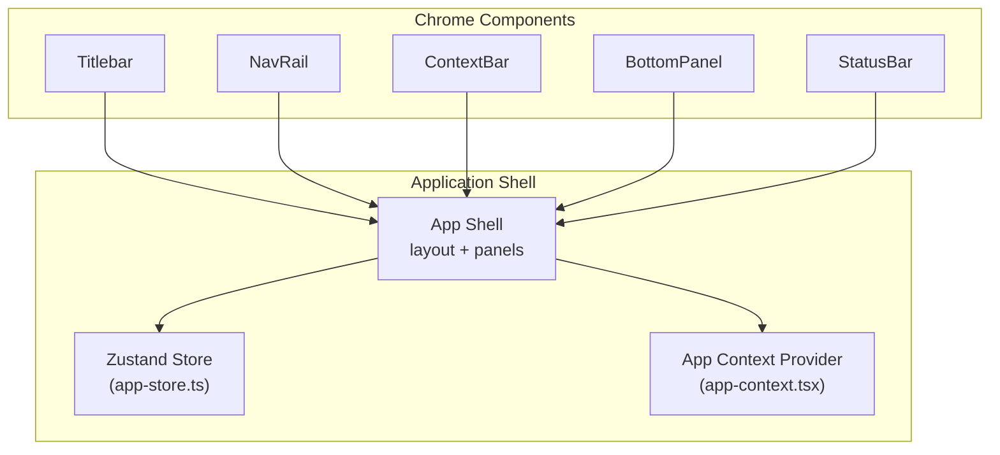
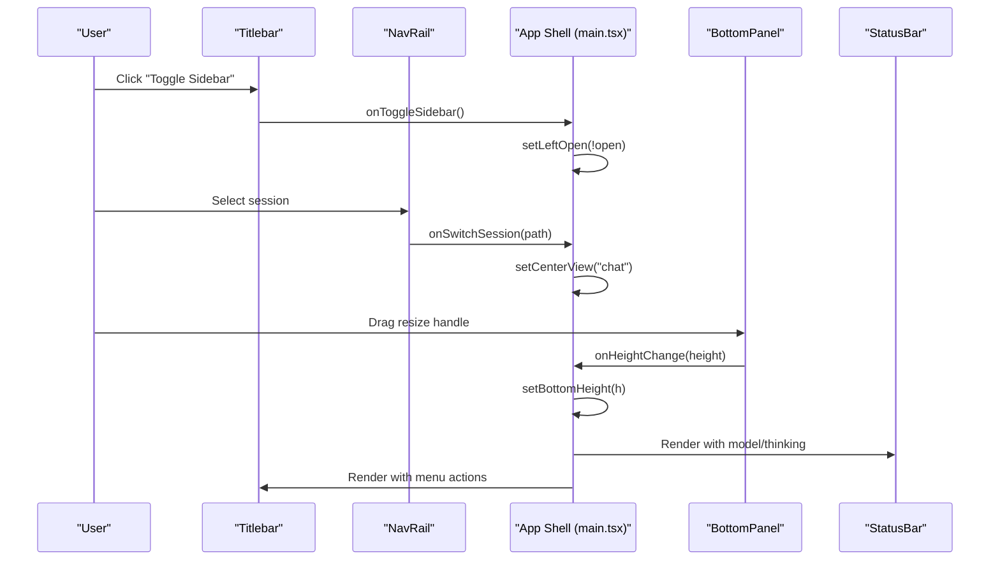
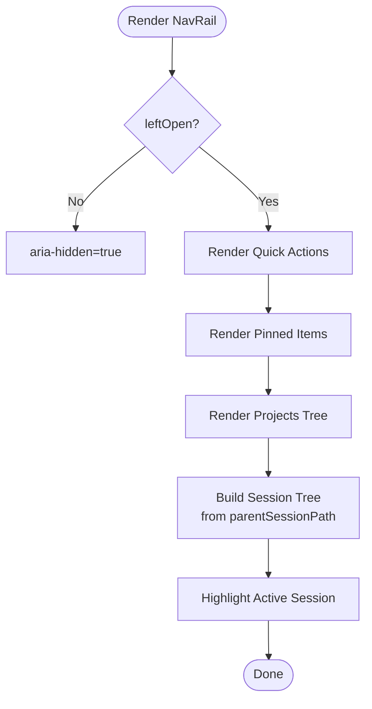
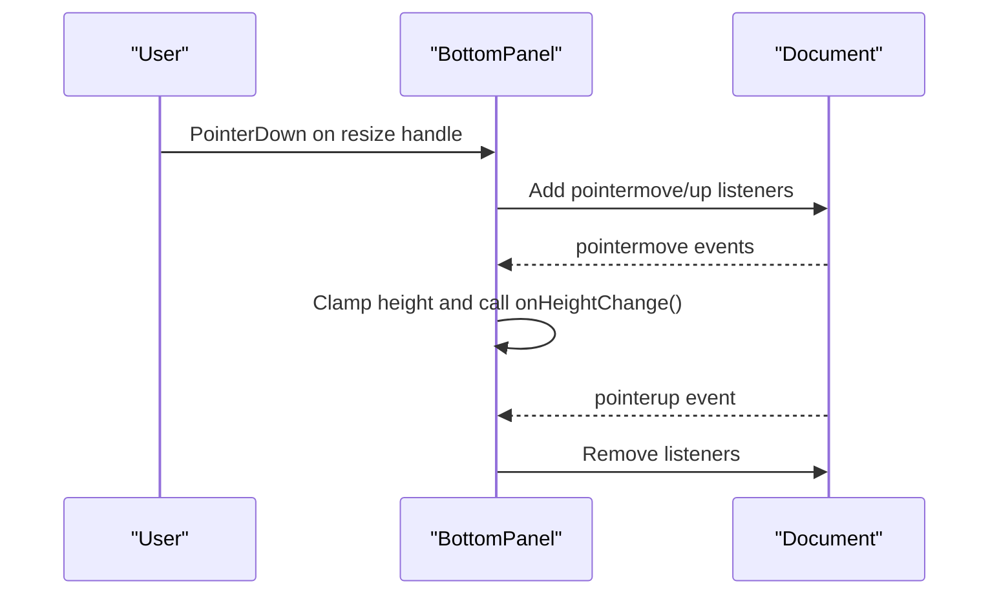
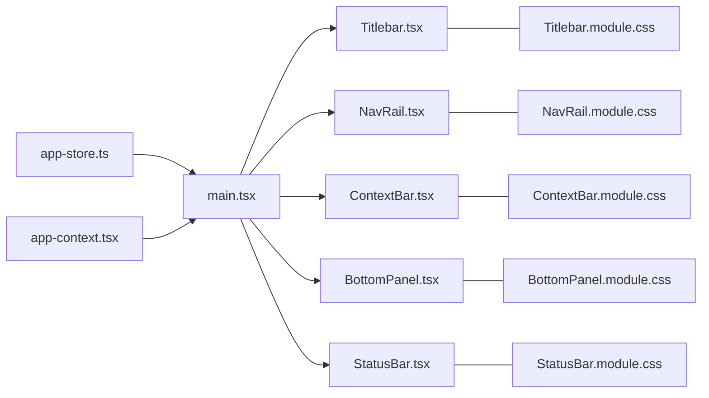

# Component Architecture

<cite>
**Referenced Files in This Document**
- [main.tsx](file://src/client/src/main.tsx)
- [Titlebar.tsx](file://src/client/src/components/chrome/Titlebar.tsx)
- [BottomPanel.tsx](file://src/client/src/components/chrome/BottomPanel.tsx)
- [NavRail.tsx](file://src/client/src/components/chrome/NavRail.tsx)
- [ContextBar.tsx](file://src/client/src/components/chrome/ContextBar.tsx)
- [StatusBar.tsx](file://src/client/src/components/chrome/StatusBar.tsx)
- [Titlebar.module.css](file://src/client/src/components/chrome/Titlebar.module.css)
- [BottomPanel.module.css](file://src/client/src/components/chrome/BottomPanel.module.css)
- [NavRail.module.css](file://src/client/src/components/chrome/NavRail.module.css)
- [ContextBar.module.css](file://src/client/src/components/chrome/ContextBar.module.css)
- [StatusBar.module.css](file://src/client/src/components/chrome/StatusBar.module.css)
- [app-context.tsx](file://src/client/src/state/app-context.tsx)
- [app-store.ts](file://src/client/src/state/app-store.ts)
</cite>

## Table of Contents
1. [Introduction](#introduction)
2. [Project Structure](#project-structure)
3. [Core Components](#core-components)
4. [Architecture Overview](#architecture-overview)
5. [Detailed Component Analysis](#detailed-component-analysis)
6. [Dependency Analysis](#dependency-analysis)
7. [Performance Considerations](#performance-considerations)
8. [Accessibility and UX](#accessibility-and-ux)
9. [Testing Strategies](#testing-strategies)
10. [Troubleshooting Guide](#troubleshooting-guide)
11. [Conclusion](#conclusion)

## Introduction
This document describes the React component architecture for the Chrome components system in the Quake Web application. It focuses on the Titlebar, BottomPanel, NavRail, ContextBar, and StatusBar components, explaining their composition patterns, layout management, responsive behavior, state synchronization, accessibility, and performance characteristics. It also covers how these components integrate with the global state via Zustand and context providers.

## Project Structure
The Chrome components are located under the client-side React application and are composed within the main application shell. The layout system manages left (sidebar), right (dock), and bottom (terminal) panels with persistent preferences and keyboard-driven toggles.



**Diagram sources**
- [main.tsx:1414-1571](file://src/client/src/main.tsx#L1414-L1571)
- [app-store.ts:186-252](file://src/client/src/state/app-store.ts#L186-L252)
- [app-context.tsx:33-57](file://src/client/src/state/app-context.tsx#L33-L57)

**Section sources**
- [main.tsx:1414-1571](file://src/client/src/main.tsx#L1414-L1571)

## Core Components
This section outlines the five core Chrome components and their responsibilities:

- Titlebar: Top-level window chrome with menu actions, sidebar toggle, and dock/panel controls.
- NavRail: Left sidebar navigation for sessions, projects, and pinned items.
- BottomPanel: Resizable terminal panel docked at the bottom with drag-to-resize and process indicator.
- ContextBar: Lightweight contextual indicators below the composer (workspace, local work, branch).
- StatusBar: Persistent footer with workspace, model, and thinking level.

Each component is implemented as a pure functional React component with TypeScript props and styled via CSS Modules.

**Section sources**
- [Titlebar.tsx:32-50](file://src/client/src/components/chrome/Titlebar.tsx#L32-L50)
- [NavRail.tsx:37-83](file://src/client/src/components/chrome/NavRail.tsx#L37-L83)
- [BottomPanel.tsx:27-15](file://src/client/src/components/chrome/BottomPanel.tsx#L27-L15)
- [ContextBar.tsx:14-24](file://src/client/src/components/chrome/ContextBar.tsx#L14-L24)
- [StatusBar.tsx:9-19](file://src/client/src/components/chrome/StatusBar.tsx#L9-L19)

## Architecture Overview
The Chrome components are orchestrated by the main application shell. The shell maintains state for panel visibility, sizes, and active views, and synchronizes these with persistent storage. Components communicate upward via callbacks and share global state through Zustand and a dedicated context provider.



**Diagram sources**
- [main.tsx:696-717](file://src/client/src/main.tsx#L696-L717)
- [main.tsx:1415-1424](file://src/client/src/main.tsx#L1415-L1424)
- [main.tsx:1557-1559](file://src/client/src/main.tsx#L1557-L1559)
- [BottomPanel.tsx:51-81](file://src/client/src/components/chrome/BottomPanel.tsx#L51-L81)

**Section sources**
- [main.tsx:1415-1424](file://src/client/src/main.tsx#L1415-L1424)
- [main.tsx:1557-1559](file://src/client/src/main.tsx#L1557-L1559)

## Detailed Component Analysis

### Titlebar Component
Responsibilities:
- Provides OS-aware draggable area and non-draggable interactive elements.
- Hosts the application menu with File/Edit/View/Help sections.
- Controls sidebar, dock, and bottom panel visibility.
- Handles click-outside and Escape to close menus.

Implementation highlights:
- Uses pointer and keyboard listeners to manage dropdown state.
- Conditionally applies macOS-specific styling and padding.
- Exposes callbacks for sidebar toggle, dock toggle, bottom panel toggle, and menu actions.

```mermaid
classDiagram
class Titlebar {
+boolean leftOpen
+boolean dockOpen?
+boolean bottomPanelOpen?
+onToggleSidebar()
+onOpenSessions()
+onToggleDock?()
+onToggleBottomPanel?()
+onMenuAction?(action)
}
class MenuAction {
<<enumeration>>
"new-chat"
"open-folder"
"settings"
"toggle-theme"
"about"
}
Titlebar --> MenuAction : "dispatches"
```

**Diagram sources**
- [Titlebar.tsx:25-50](file://src/client/src/components/chrome/Titlebar.tsx#L25-L50)

**Section sources**
- [Titlebar.tsx:12-23](file://src/client/src/components/chrome/Titlebar.tsx#L12-L23)
- [Titlebar.tsx:56-72](file://src/client/src/components/chrome/Titlebar.tsx#L56-L72)
- [Titlebar.tsx:79-117](file://src/client/src/components/chrome/Titlebar.tsx#L79-L117)
- [Titlebar.tsx:119-217](file://src/client/src/components/chrome/Titlebar.tsx#L119-L217)

### NavRail Component
Responsibilities:
- Renders the left navigation rail with quick actions and hierarchical navigation.
- Manages pinned sessions, projects, and nested thread trees.
- Supports collapsing to icon-only mode.

Implementation highlights:
- Builds a session tree from parent-child relationships.
- Uses relative timestamps and hover actions for pin/archive.
- Maintains active state for views and sessions.



**Diagram sources**
- [NavRail.tsx:84-154](file://src/client/src/components/chrome/NavRail.tsx#L84-L154)
- [NavRail.tsx:192-202](file://src/client/src/components/chrome/NavRail.tsx#L192-L202)
- [NavRail.tsx:267-287](file://src/client/src/components/chrome/NavRail.tsx#L267-L287)

**Section sources**
- [NavRail.tsx:37-83](file://src/client/src/components/chrome/NavRail.tsx#L37-L83)
- [NavRail.tsx:165-186](file://src/client/src/components/chrome/NavRail.tsx#L165-L186)
- [NavRail.tsx:192-202](file://src/client/src/components/chrome/NavRail.tsx#L192-L202)
- [NavRail.tsx:223-232](file://src/client/src/components/chrome/NavRail.tsx#L223-L232)
- [NavRail.tsx:236-265](file://src/client/src/components/chrome/NavRail.tsx#L236-L265)
- [NavRail.tsx:267-287](file://src/client/src/components/chrome/NavRail.tsx#L267-L287)

### BottomPanel Component
Responsibilities:
- Docked terminal panel with resizable height via drag handle.
- Tracks elapsed time and displays process status.
- Controlled by parent state for open/closed and height.

Implementation highlights:
- Uses pointer events for drag-to-resize with clamping.
- Syncs controlled height prop with internal state.
- Implements interval-based uptime counter.



**Diagram sources**
- [BottomPanel.tsx:51-81](file://src/client/src/components/chrome/BottomPanel.tsx#L51-L81)
- [BottomPanel.tsx:83-88](file://src/client/src/components/chrome/BottomPanel.tsx#L83-L88)

**Section sources**
- [BottomPanel.tsx:27-15](file://src/client/src/components/chrome/BottomPanel.tsx#L27-L15)
- [BottomPanel.tsx:32-49](file://src/client/src/components/chrome/BottomPanel.tsx#L32-L49)
- [BottomPanel.tsx:51-81](file://src/client/src/components/chrome/BottomPanel.tsx#L51-L81)
- [BottomPanel.tsx:90-126](file://src/client/src/components/chrome/BottomPanel.tsx#L90-L126)

### ContextBar Component
Responsibilities:
- Displays contextual metadata below the composer.
- Fetches branch information when not provided.
- Provides workspace navigation.

Implementation highlights:
- Conditional rendering of branch pill based on availability.
- Uses a cleanup flag to avoid setting state after unmount.

**Section sources**
- [ContextBar.tsx:14-24](file://src/client/src/components/chrome/ContextBar.tsx#L14-L24)
- [ContextBar.tsx:27-41](file://src/client/src/components/chrome/ContextBar.tsx#L27-L41)
- [ContextBar.tsx:45-71](file://src/client/src/components/chrome/ContextBar.tsx#L45-L71)

### StatusBar Component
Responsibilities:
- Persistent footer showing workspace, model, and thinking level.
- Uses icons and truncated labels for compactness.

**Section sources**
- [StatusBar.tsx:9-19](file://src/client/src/components/chrome/StatusBar.tsx#L9-L19)
- [StatusBar.tsx:20-44](file://src/client/src/components/chrome/StatusBar.tsx#L20-L44)

## Dependency Analysis
The Chrome components depend on:
- Global state (Zustand store) for messages, models, sessions, and UI flags.
- App context provider for configuration and runtime helpers.
- CSS Modules for styling and responsive behavior.



**Diagram sources**
- [app-store.ts:186-252](file://src/client/src/state/app-store.ts#L186-L252)
- [app-context.tsx:33-57](file://src/client/src/state/app-context.tsx#L33-L57)
- [main.tsx:1415-1568](file://src/client/src/main.tsx#L1415-L1568)

**Section sources**
- [app-store.ts:186-252](file://src/client/src/state/app-store.ts#L186-L252)
- [app-context.tsx:33-57](file://src/client/src/state/app-context.tsx#L33-L57)
- [main.tsx:1415-1568](file://src/client/src/main.tsx#L1415-L1568)

## Performance Considerations
- Rendering windows and virtualization: The timeline avoids virtualization for better accessibility and content-visibility, reducing reflow churn compared to previous virtualizers.
- Coalesced updates: Tool updates are batched using requestAnimationFrame to minimize render thrash during frequent SSE updates.
- Memoization: Several components use React.memo to prevent unnecessary re-renders.
- Controlled resizing: BottomPanel clamps heights and debounces updates to parent via onHeightChange.

Recommendations:
- Prefer controlled props for resizable panels to centralize state.
- Continue batching frequent updates (already implemented for tools).
- Monitor long session timelines and consider pagination if needed.

**Section sources**
- [main.tsx:1293-1302](file://src/client/src/main.tsx#L1293-L1302)
- [BottomPanel.tsx:17-19](file://src/client/src/components/chrome/BottomPanel.tsx#L17-L19)
- [main.tsx:1866-1866](file://src/client/src/main.tsx#L1866-L1866)

## Accessibility and UX
Keyboard navigation and screen reader support:
- Titlebar menu: Proper ARIA attributes (aria-haspopup, aria-expanded) and keyboard focus management.
- BottomPanel: Resize handle has role="separator" and aria-orientation; close button has aria-label.
- NavRail: Interactive elements use proper roles and labels; collapsed state hides text visually and semantically.
- ContextBar: Buttons use aria-labels and hover states for discoverability.
- StatusBar: Grouped items with truncation and hover to reveal full text.

Additional UX:
- Drag handles respect macOS overlay considerations and OS drag regions.
- Keyboard shortcuts: Ctrl/Cmd+B toggles sidebar; Ctrl/Cmd+J toggles bottom panel; Alt+1/2/3 opens right panel tabs.

**Section sources**
- [Titlebar.tsx:154-189](file://src/client/src/components/chrome/Titlebar.tsx#L154-L189)
- [BottomPanel.tsx:92-124](file://src/client/src/components/chrome/BottomPanel.tsx#L92-L124)
- [NavRail.module.css:239-256](file://src/client/src/components/chrome/NavRail.module.css#L239-L256)
- [ContextBar.module.css:1-55](file://src/client/src/components/chrome/ContextBar.module.css#L1-L55)
- [StatusBar.module.css:1-32](file://src/client/src/components/chrome/StatusBar.module.css#L1-L32)
- [main.tsx:618-641](file://src/client/src/main.tsx#L618-L641)

## Testing Strategies
Recommended testing approaches:
- Unit tests for component props and state transitions (e.g., Titlebar menu open/close, BottomPanel drag handlers).
- Integration tests for cross-component interactions (e.g., NavRail session switching updates main view).
- Snapshot tests for layout stability across breakpoints and collapsed states.
- Accessibility tests using axe-core or similar tools to validate ARIA attributes and keyboard navigation.
- End-to-end tests for keyboard shortcuts and panel toggling.

[No sources needed since this section provides general guidance]

## Troubleshooting Guide
Common issues and resolutions:
- Menu does not close on outside click: Verify pointer and key listeners are attached conditionally and cleaned up on unmount.
- BottomPanel drag not working: Ensure pointermove/up listeners are attached on handle down and removed on pointerup.
- Panel state not persisting: Confirm storage writes occur on toggle and resize events.
- Focus trap issues in dialogs: Ensure focus is trapped and returned on dialog close.

**Section sources**
- [Titlebar.tsx:56-72](file://src/client/src/components/chrome/Titlebar.tsx#L56-L72)
- [BottomPanel.tsx:51-88](file://src/client/src/components/chrome/BottomPanel.tsx#L51-L88)
- [main.tsx:463-484](file://src/client/src/main.tsx#L463-L484)
- [main.tsx:696-717](file://src/client/src/main.tsx#L696-L717)

## Conclusion
The Chrome components form a cohesive, accessible, and performant UI shell around the main application. They leverage controlled props, centralized state, and thoughtful keyboard and screen reader support to deliver a native-like experience. The layout system integrates seamlessly with persistent preferences and responsive behavior, while performance-conscious patterns ensure smooth interactions even under heavy streaming loads.
