# Component Interactions

<cite>
**Referenced Files in This Document**
- [app-store.ts](file://src/client/src/state/app-store.ts)
- [app-context.tsx](file://src/client/src/state/app-context.tsx)
- [api.ts](file://src/client/src/lib/api.ts)
- [sse.ts](file://src/server/sse.ts)
- [main.tsx](file://src/client/src/main.tsx)
- [Titlebar.tsx](file://src/client/src/components/chrome/Titlebar.tsx)
- [StatusBar.tsx](file://src/client/src/components/chrome/StatusBar.tsx)
- [Feedback.tsx](file://src/client/src/components/common/Feedback.tsx)
- [storage.ts](file://src/client/src/lib/storage.ts)
- [MarkdownMessage.tsx](file://src/client/src/components/markdown/MarkdownMessage.tsx)
- [StreamingMarkdown.tsx](file://src/client/src/components/markdown/StreamingMarkdown.tsx)
- [ToolRenderer.tsx](file://src/client/src/components/tools/ToolRenderer.tsx)
- [TerminalPanel.tsx](file://src/client/src/components/terminal/TerminalPanel.tsx)
</cite>

## Table of Contents
1. [Introduction](#introduction)
2. [Project Structure](#project-structure)
3. [Core Components](#core-components)
4. [Architecture Overview](#architecture-overview)
5. [Detailed Component Analysis](#detailed-component-analysis)
6. [Dependency Analysis](#dependency-analysis)
7. [Performance Considerations](#performance-considerations)
8. [Troubleshooting Guide](#troubleshooting-guide)
9. [Conclusion](#conclusion)

## Introduction
This document explains how components interact, synchronize state, and communicate in the application. It covers:
- Zustand store patterns and React context providers for global state access
- Event-driven communication via HTTP client and Server-Sent Events
- Lifecycle management, cleanup, and memory leak prevention
- Prop drilling solutions and context provider usage
- Event handling patterns for keyboard shortcuts, mouse interactions, and touch gestures
- State synchronization across components and the main application store
- Error boundaries, loading states, and optimistic updates
- Performance strategies including memoization, lazy loading, and code splitting

## Project Structure
The application follows a layered structure:
- State layer: Zustand store and React context for global state
- API layer: HTTP client helpers and SSE hub
- UI layer: React components organized by feature areas (chrome, markdown rendering, tools, terminal)
- Integration layer: main.tsx orchestrating API calls, SSE, and component lifecycle

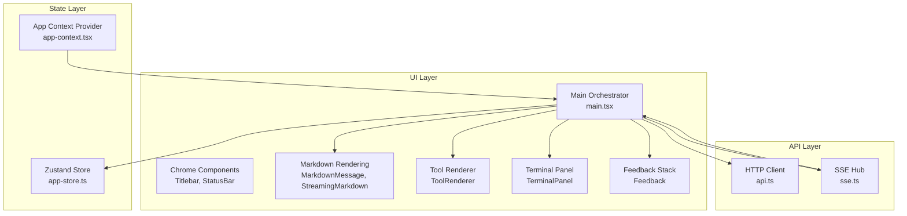

**Diagram sources**
- [app-store.ts:186-252](file://src/client/src/state/app-store.ts#L186-L252)
- [app-context.tsx:33-57](file://src/client/src/state/app-context.tsx#L33-L57)
- [api.ts:9-58](file://src/client/src/lib/api.ts#L9-L58)
- [sse.ts:6-31](file://src/server/sse.ts#L6-L31)
- [main.tsx:145-1572](file://src/client/src/main.tsx#L145-L1572)
- [Titlebar.tsx:32-217](file://src/client/src/components/chrome/Titlebar.tsx#L32-L217)
- [StatusBar.tsx:9-44](file://src/client/src/components/chrome/StatusBar.tsx#L9-L44)
- [MarkdownMessage.tsx:49-69](file://src/client/src/components/markdown/MarkdownMessage.tsx#L49-L69)
- [StreamingMarkdown.tsx:195-210](file://src/client/src/components/markdown/StreamingMarkdown.tsx#L195-L210)
- [ToolRenderer.tsx:20-51](file://src/client/src/components/tools/ToolRenderer.tsx#L20-L51)
- [TerminalPanel.tsx:9-78](file://src/client/src/components/terminal/TerminalPanel.tsx#L9-L78)
- [Feedback.tsx:5-37](file://src/client/src/components/common/Feedback.tsx#L5-L37)

**Section sources**
- [app-store.ts:186-252](file://src/client/src/state/app-store.ts#L186-L252)
- [app-context.tsx:33-57](file://src/client/src/state/app-context.tsx#L33-L57)
- [api.ts:9-58](file://src/client/src/lib/api.ts#L9-L58)
- [sse.ts:6-31](file://src/server/sse.ts#L6-L31)
- [main.tsx:145-1572](file://src/client/src/main.tsx#L145-L1572)

## Core Components
- Zustand Store (app-store.ts): Central state with normalized message handling, tool lifecycle, streaming message, and toast notifications. Provides setters and upsert utilities for efficient updates.
- App Context Provider (app-context.tsx): Exposes configuration, runtime state, and helper functions (e.g., sending commands) to components via a typed context.
- HTTP Client (api.ts): Typed fetch wrappers for GET, POST, PATCH, DELETE with token support and error normalization.
- SSE Hub (sse.ts): Server-Sent Events hub for real-time updates from the backend.
- Main Orchestrator (main.tsx): Coordinates API initialization, SSE subscription, lifecycle hooks, keyboard/mouse/touch handlers, optimistic updates, and state reconciliation.

Key responsibilities:
- State normalization and pruning to maintain performance and memory bounds
- Coalescing frequent updates (streaming and tool updates) using requestAnimationFrame
- Reconciliation on visibility/focus and periodic intervals to recover from network glitches
- Optimistic UI updates with fallbacks and error reporting

**Section sources**
- [app-store.ts:33-58](file://src/client/src/state/app-store.ts#L33-L58)
- [app-store.ts:186-252](file://src/client/src/state/app-store.ts#L186-L252)
- [app-context.tsx:33-57](file://src/client/src/state/app-context.tsx#L33-L57)
- [api.ts:9-58](file://src/client/src/lib/api.ts#L9-L58)
- [sse.ts:6-31](file://src/server/sse.ts#L6-L31)
- [main.tsx:569-588](file://src/client/src/main.tsx#L569-L588)
- [main.tsx:1263-1302](file://src/client/src/main.tsx#L1263-L1302)
- [main.tsx:1293-1302](file://src/client/src/main.tsx#L1293-L1302)

## Architecture Overview
The system integrates three primary channels:
- HTTP API: Initial configuration, runtime settings, sessions, models, files, commands, and terminal operations
- SSE: Real-time agent events, tool execution updates, terminal streams, and extension UI requests
- Local Store: Centralized state normalized and pruned to bound memory and computation

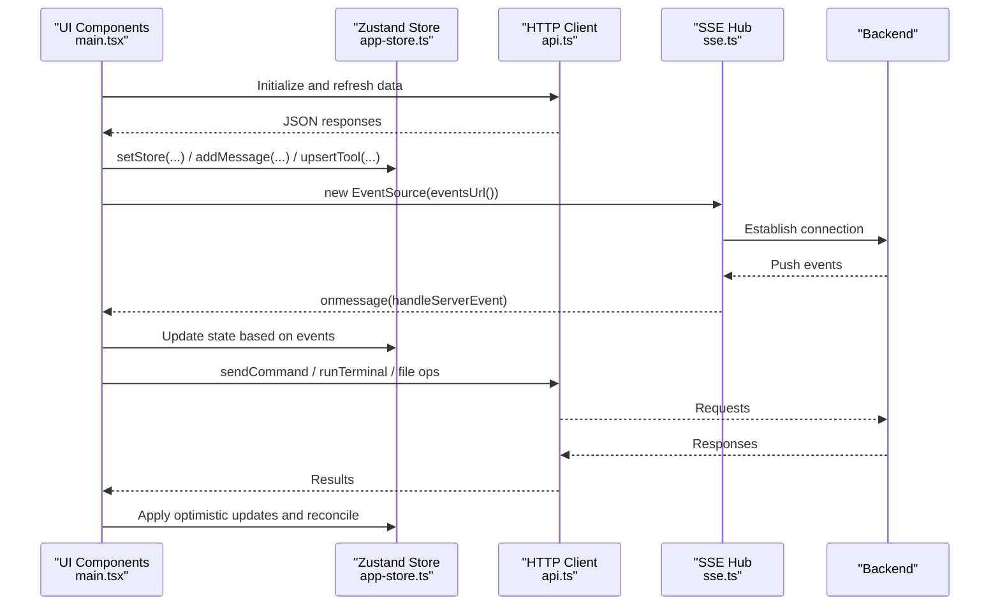

**Diagram sources**
- [main.tsx:569-588](file://src/client/src/main.tsx#L569-L588)
- [main.tsx:1144-1191](file://src/client/src/main.tsx#L1144-L1191)
- [api.ts:9-58](file://src/client/src/lib/api.ts#L9-L58)
- [sse.ts:6-31](file://src/server/sse.ts#L6-L31)
- [app-store.ts:186-252](file://src/client/src/state/app-store.ts#L186-L252)

## Detailed Component Analysis

### Zustand Store Patterns and State Normalization
- Store shape: Centralizes messages, tools, widgets, sidebars, statuses, and toasts
- Normalization: Deduplicates messages, limits visible counts, and compacts tool outputs
- Pruning: Limits total tools and prioritizes active ones by recency
- Optimistic updates: Upserts tool state with timestamps and durations

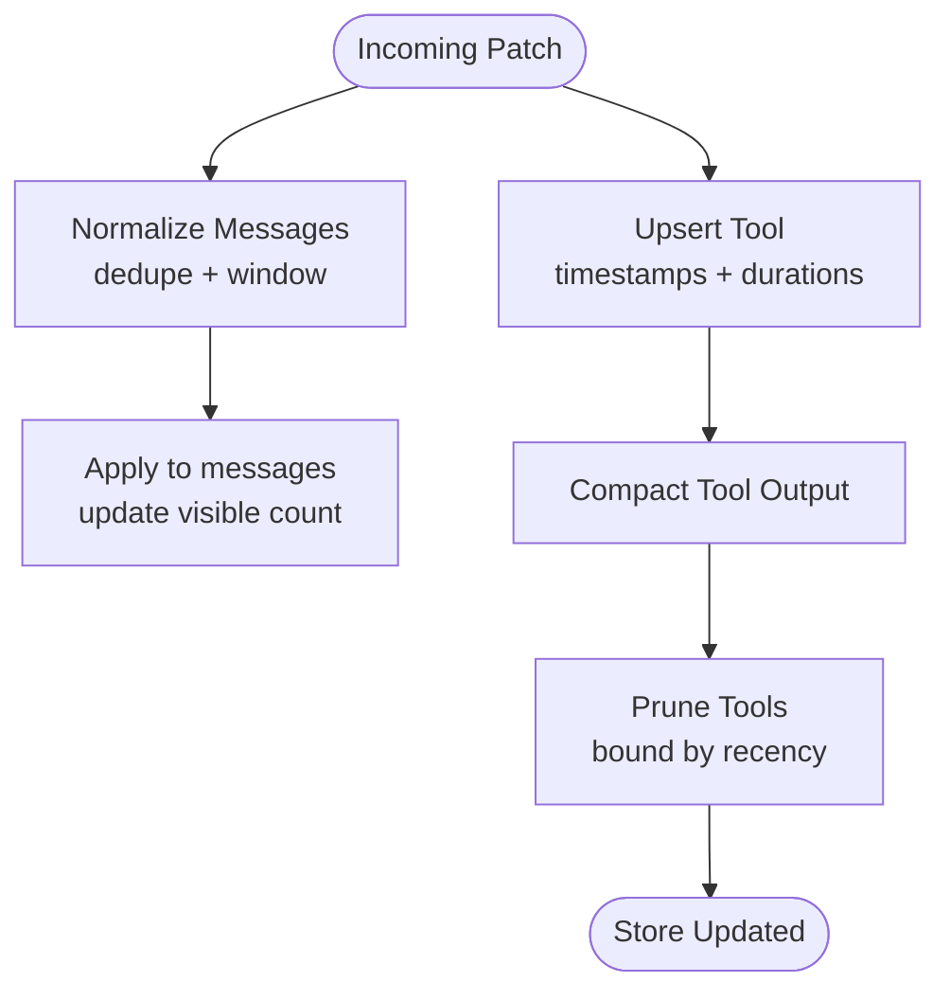

**Diagram sources**
- [app-store.ts:102-127](file://src/client/src/state/app-store.ts#L102-L127)
- [app-store.ts:137-156](file://src/client/src/state/app-store.ts#L137-L156)
- [app-store.ts:172-184](file://src/client/src/state/app-store.ts#L172-L184)
- [app-store.ts:208-218](file://src/client/src/state/app-store.ts#L208-L218)

**Section sources**
- [app-store.ts:33-58](file://src/client/src/state/app-store.ts#L33-L58)
- [app-store.ts:102-127](file://src/client/src/state/app-store.ts#L102-L127)
- [app-store.ts:137-156](file://src/client/src/state/app-store.ts#L137-L156)
- [app-store.ts:172-184](file://src/client/src/state/app-store.ts#L172-L184)
- [app-store.ts:208-218](file://src/client/src/state/app-store.ts#L208-L218)

### React Context Provider and Global State Access
- AppProvider exposes configuration, current model/thinking level, streaming flag, and helper actions
- Components consume via useAppContext for centralized access without prop drilling
- Tokenized authentication passed through window globals to HTTP client

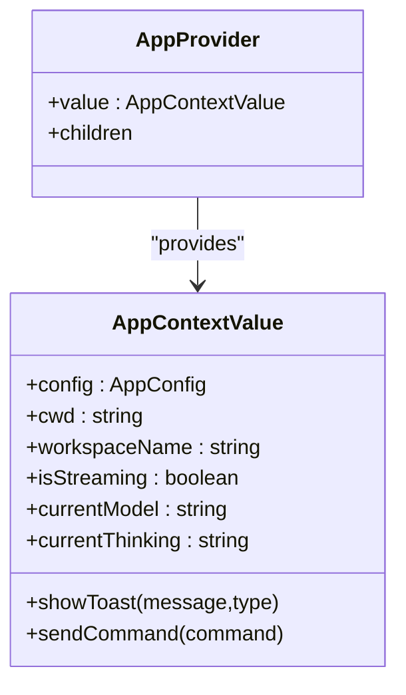

**Diagram sources**
- [app-context.tsx:14-31](file://src/client/src/state/app-context.tsx#L14-L31)
- [app-context.tsx:33-57](file://src/client/src/state/app-context.tsx#L33-L57)

**Section sources**
- [app-context.tsx:14-31](file://src/client/src/state/app-context.tsx#L14-L31)
- [app-context.tsx:33-57](file://src/client/src/state/app-context.tsx#L33-L57)
- [api.ts:7](file://src/client/src/lib/api.ts#L7)

### API Integration Layer and SSE Handling
- HTTP client wraps fetch with token injection and standardized error parsing
- SSE hub manages connections, buffering, and broadcasting events
- Main orchestrator subscribes to SSE, parses events, and updates store accordingly
- Periodic refresh and reconciliation on focus/visibility to mitigate network issues

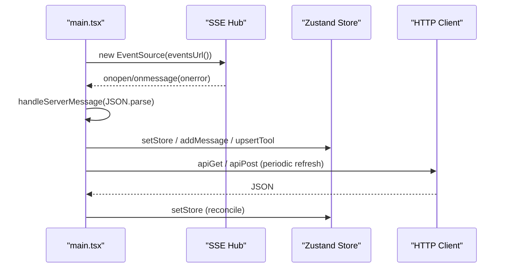

**Diagram sources**
- [main.tsx:569-588](file://src/client/src/main.tsx#L569-L588)
- [main.tsx:1178-1191](file://src/client/src/main.tsx#L1178-L1191)
- [api.ts:9-58](file://src/client/src/lib/api.ts#L9-L58)
- [sse.ts:6-31](file://src/server/sse.ts#L6-L31)

**Section sources**
- [api.ts:9-58](file://src/client/src/lib/api.ts#L9-L58)
- [sse.ts:6-31](file://src/server/sse.ts#L6-L31)
- [main.tsx:569-588](file://src/client/src/main.tsx#L569-L588)
- [main.tsx:1178-1191](file://src/client/src/main.tsx#L1178-L1191)

### Component Lifecycle Management and Cleanup
- EventSource lifecycle: Opened on mount, closed on unmount; also canceled scheduled updates
- Focus/visibility listeners: Reconcile state when window regains focus or becomes visible
- Periodic polling: Interval checks for idle agents to trigger reconciliation
- Refs and requestAnimationFrame: Used to coalesce updates and cancel pending frames

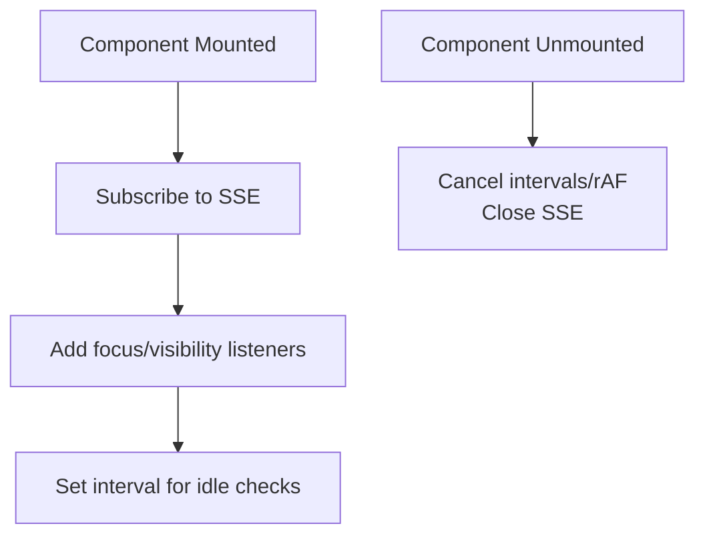

**Diagram sources**
- [main.tsx:569-588](file://src/client/src/main.tsx#L569-L588)
- [main.tsx:590-606](file://src/client/src/main.tsx#L590-L606)
- [main.tsx:608-615](file://src/client/src/main.tsx#L608-L615)

**Section sources**
- [main.tsx:569-588](file://src/client/src/main.tsx#L569-L588)
- [main.tsx:590-606](file://src/client/src/main.tsx#L590-L606)
- [main.tsx:608-615](file://src/client/src/main.tsx#L608-L615)

### Prop Drilling Solutions and Context Providers
- AppProvider eliminates prop drilling by exposing a typed context value
- Components access store and context via hooks, avoiding deep prop chains
- Toast stack and confirm providers are composed at the root for global availability

**Section sources**
- [app-context.tsx:33-57](file://src/client/src/state/app-context.tsx#L33-L57)
- [main.tsx:1373-1375](file://src/client/src/main.tsx#L1373-L1375)

### Event Handling Patterns
- Keyboard shortcuts: Toggle panels, open palettes, and terminal via modifiers and key combinations
- Mouse/touch: Drag resizing, context menus, and pointer interactions
- Composition and editing: Paste images, manage context chips, and submit prompts

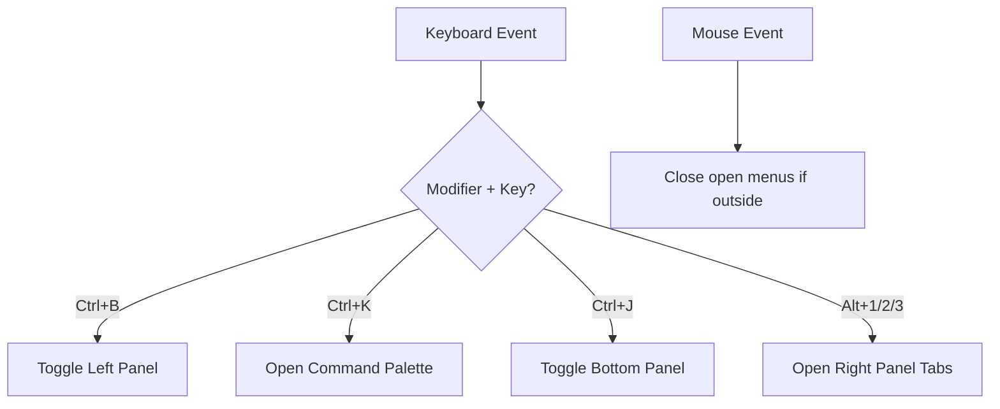

**Diagram sources**
- [main.tsx:618-641](file://src/client/src/main.tsx#L618-L641)
- [main.tsx:655-665](file://src/client/src/main.tsx#L655-L665)

**Section sources**
- [main.tsx:618-641](file://src/client/src/main.tsx#L618-L641)
- [main.tsx:655-665](file://src/client/src/main.tsx#L655-L665)

### State Synchronization Between Components and Store
- Streaming updates: Coalesced via requestAnimationFrame to avoid render thrashing
- Tool updates: Batched per tool ID and applied once per frame
- Timeline rendering: Uses memoized selections and bounded windows for performance
- Markdown rendering: Dual-path rendering—streaming lightweight renderer during SSE chunks, then rich renderer after settlement

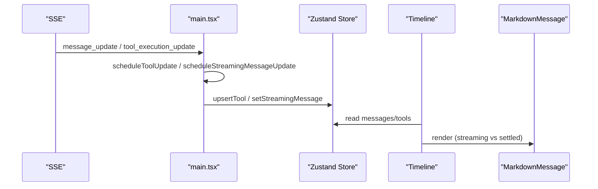

**Diagram sources**
- [main.tsx:1263-1286](file://src/client/src/main.tsx#L1263-L1286)
- [main.tsx:1293-1302](file://src/client/src/main.tsx#L1293-L1302)
- [main.tsx:1990-1994](file://src/client/src/main.tsx#L1990-L1994)
- [StreamingMarkdown.tsx:195-210](file://src/client/src/components/markdown/StreamingMarkdown.tsx#L195-L210)
- [MarkdownMessage.tsx:49-69](file://src/client/src/components/markdown/MarkdownMessage.tsx#L49-L69)

**Section sources**
- [main.tsx:1263-1286](file://src/client/src/main.tsx#L1263-L1286)
- [main.tsx:1293-1302](file://src/client/src/main.tsx#L1293-L1302)
- [main.tsx:1990-1994](file://src/client/src/main.tsx#L1990-L1994)
- [StreamingMarkdown.tsx:195-210](file://src/client/src/components/markdown/StreamingMarkdown.tsx#L195-L210)
- [MarkdownMessage.tsx:49-69](file://src/client/src/components/markdown/MarkdownMessage.tsx#L49-L69)

### Error Boundaries, Loading States, and Optimistic Updates
- Error boundaries: Implemented via toast stack and error toast generation
- Loading states: Per-resource loading flags to avoid flicker and improve UX
- Optimistic updates: Immediate UI changes (e.g., model selection) with fallbacks and reconciliation

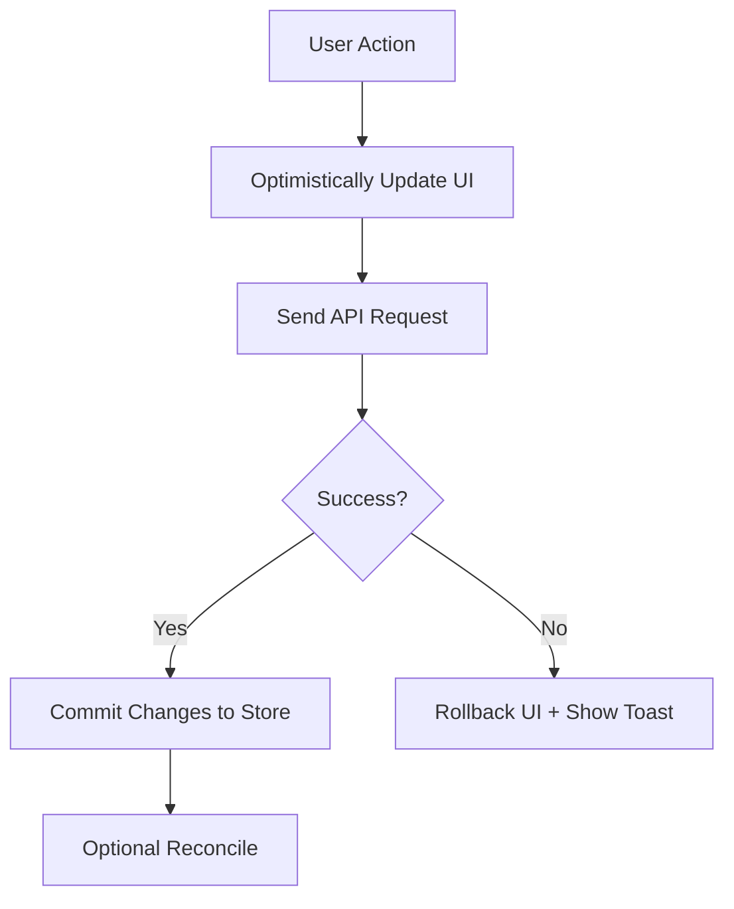

**Diagram sources**
- [main.tsx:826-843](file://src/client/src/main.tsx#L826-L843)
- [main.tsx:800-809](file://src/client/src/main.tsx#L800-L809)
- [Feedback.tsx:5-37](file://src/client/src/components/common/Feedback.tsx#L5-L37)

**Section sources**
- [main.tsx:826-843](file://src/client/src/main.tsx#L826-L843)
- [main.tsx:800-809](file://src/client/src/main.tsx#L800-L809)
- [Feedback.tsx:5-37](file://src/client/src/components/common/Feedback.tsx#L5-L37)

### Component Interaction Examples

#### Markdown Rendering and Tool Notices
- StreamingMarkdown renders lightweight during SSE chunks
- MarkdownMessage renders rich content after settlement
- Tool notices aggregate live and historical tool runs

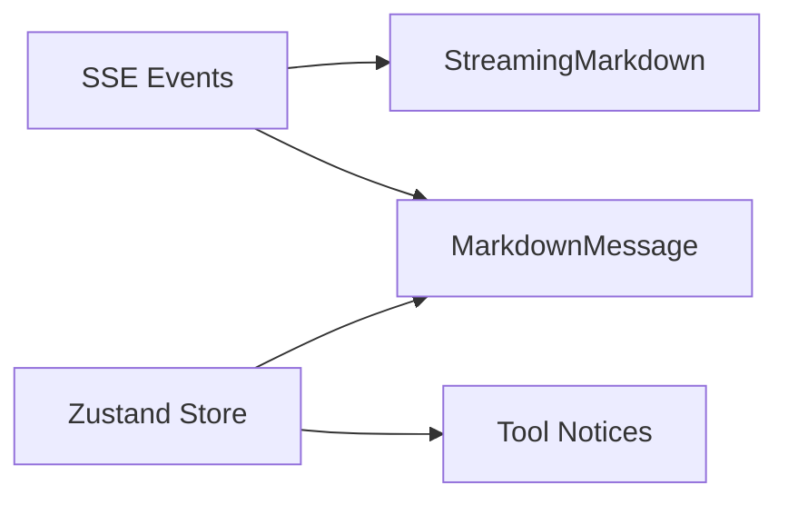

**Diagram sources**
- [StreamingMarkdown.tsx:195-210](file://src/client/src/components/markdown/StreamingMarkdown.tsx#L195-L210)
- [MarkdownMessage.tsx:49-69](file://src/client/src/components/markdown/MarkdownMessage.tsx#L49-L69)
- [ToolRenderer.tsx:20-51](file://src/client/src/components/tools/ToolRenderer.tsx#L20-L51)

**Section sources**
- [StreamingMarkdown.tsx:195-210](file://src/client/src/components/markdown/StreamingMarkdown.tsx#L195-L210)
- [MarkdownMessage.tsx:49-69](file://src/client/src/components/markdown/MarkdownMessage.tsx#L49-L69)
- [ToolRenderer.tsx:20-51](file://src/client/src/components/tools/ToolRenderer.tsx#L20-L51)

#### Terminal Panel Integration
- TerminalPanel displays output, handles scroll lock, and integrates with SSE terminal events
- ANSI renderer supports color and styling for terminal output

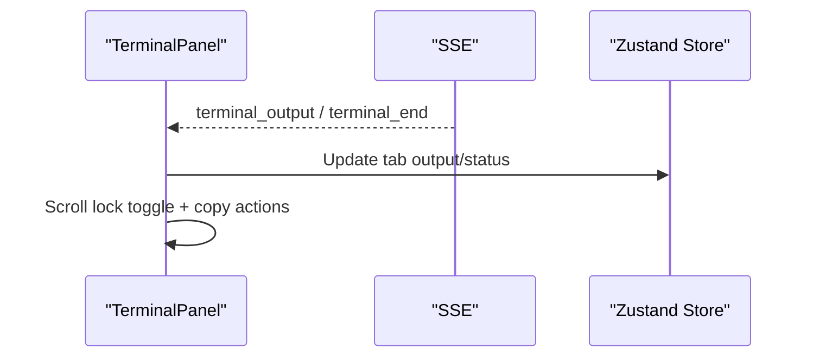

**Diagram sources**
- [TerminalPanel.tsx:9-78](file://src/client/src/components/terminal/TerminalPanel.tsx#L9-L78)
- [main.tsx:1328-1346](file://src/client/src/main.tsx#L1328-L1346)

**Section sources**
- [TerminalPanel.tsx:9-78](file://src/client/src/components/terminal/TerminalPanel.tsx#L9-L78)
- [main.tsx:1328-1346](file://src/client/src/main.tsx#L1328-L1346)

## Dependency Analysis
- Store depends on Zustand for state management and normalization utilities
- Context depends on store for derived values and helper actions
- Main orchestrates API, SSE, and store updates
- UI components depend on store and context for state and actions

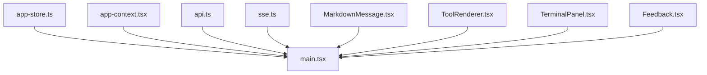

**Diagram sources**
- [app-store.ts:186-252](file://src/client/src/state/app-store.ts#L186-L252)
- [app-context.tsx:33-57](file://src/client/src/state/app-context.tsx#L33-L57)
- [api.ts:9-58](file://src/client/src/lib/api.ts#L9-L58)
- [sse.ts:6-31](file://src/server/sse.ts#L6-L31)
- [main.tsx:145-1572](file://src/client/src/main.tsx#L145-L1572)
- [MarkdownMessage.tsx:49-69](file://src/client/src/components/markdown/MarkdownMessage.tsx#L49-L69)
- [ToolRenderer.tsx:20-51](file://src/client/src/components/tools/ToolRenderer.tsx#L20-L51)
- [TerminalPanel.tsx:9-78](file://src/client/src/components/terminal/TerminalPanel.tsx#L9-L78)
- [Feedback.tsx:5-37](file://src/client/src/components/common/Feedback.tsx#L5-L37)

**Section sources**
- [app-store.ts:186-252](file://src/client/src/state/app-store.ts#L186-L252)
- [app-context.tsx:33-57](file://src/client/src/state/app-context.tsx#L33-L57)
- [api.ts:9-58](file://src/client/src/lib/api.ts#L9-L58)
- [sse.ts:6-31](file://src/server/sse.ts#L6-L31)
- [main.tsx:145-1572](file://src/client/src/main.tsx#L145-L1572)

## Performance Considerations
- Memoization: React.memo on heavy components (Timeline, MarkdownMessage, StreamingMarkdown)
- Virtualization: Native scroll with content-visibility to bound render work
- Coalescing: requestAnimationFrame batching for streaming and tool updates
- Bounding: Limits on messages, tools, and terminal output to prevent memory growth
- Lazy loading and code splitting: Suspense-wrapped heavy components (Editor, DiffEditor, TerminalPanel, XtermTerminal, Settings, Files, etc.)
- Storage resilience: LocalStorage helpers with graceful fallbacks for persistence

**Section sources**
- [main.tsx:1866-1866](file://src/client/src/main.tsx#L1866-L1866)
- [MarkdownMessage.tsx:69](file://src/client/src/components/markdown/MarkdownMessage.tsx#L69)
- [StreamingMarkdown.tsx:167-168](file://src/client/src/components/markdown/StreamingMarkdown.tsx#L167-L168)
- [main.tsx:1263-1286](file://src/client/src/main.tsx#L1263-L1286)
- [main.tsx:1293-1302](file://src/client/src/main.tsx#L1293-L1302)
- [app-store.ts:60-66](file://src/client/src/state/app-store.ts#L60-L66)
- [main.tsx:58-79](file://src/client/src/main.tsx#L58-L79)
- [storage.ts:1-49](file://src/client/src/lib/storage.ts#L1-L49)

## Troubleshooting Guide
- SSE connectivity issues: Warning guard and periodic reconciliation to recover from dropped connections
- Idle agent detection: Interval-based checks to trigger state settlement
- Error reporting: Centralized toast generation for API failures and SSE anomalies
- Focus/visibility recovery: Listeners to reconcile state when the page becomes active

Common symptoms and mitigations:
- Messages not updating: Verify SSE subscription and periodic reconciliation
- Tool updates lagging: Confirm requestAnimationFrame batching and pending update refs
- Memory growth: Ensure normalization and pruning thresholds are effective

**Section sources**
- [main.tsx:578-582](file://src/client/src/main.tsx#L578-L582)
- [main.tsx:608-615](file://src/client/src/main.tsx#L608-L615)
- [main.tsx:1193-1198](file://src/client/src/main.tsx#L1193-L1198)
- [Feedback.tsx:5-37](file://src/client/src/components/common/Feedback.tsx#L5-L37)

## Conclusion
The application achieves robust component interaction and state synchronization through:
- A centralized Zustand store with normalization and pruning
- React context for global access without prop drilling
- Event-driven SSE integration with coalesced updates
- Lifecycle hooks ensuring cleanup and recovery
- Performance-conscious patterns including memoization, virtualization, and lazy loading
These patterns collectively deliver responsive, resilient, and scalable UI interactions.
