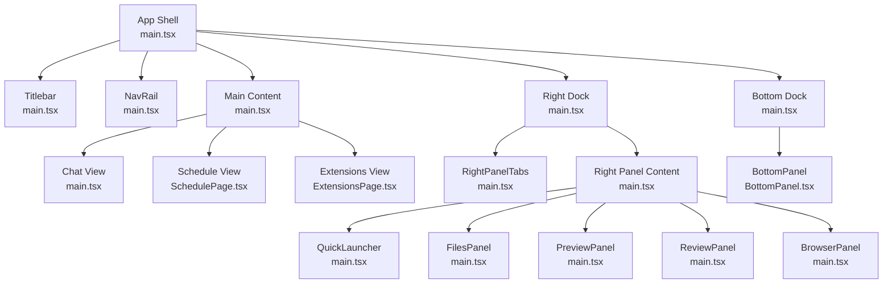
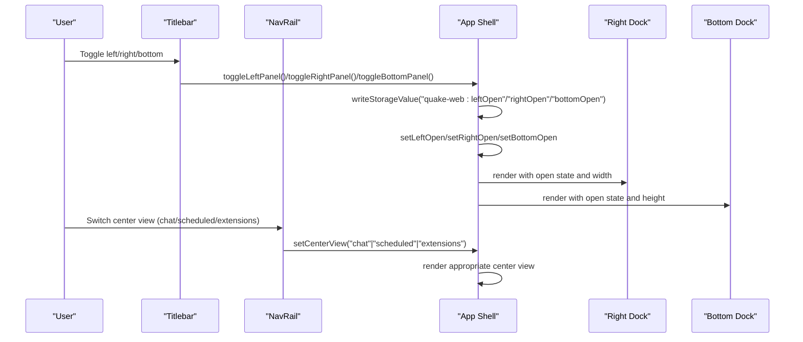
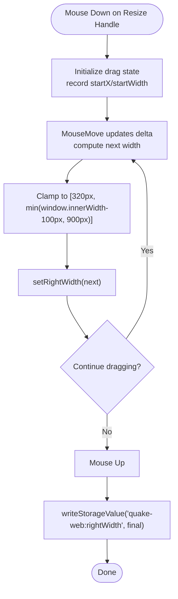
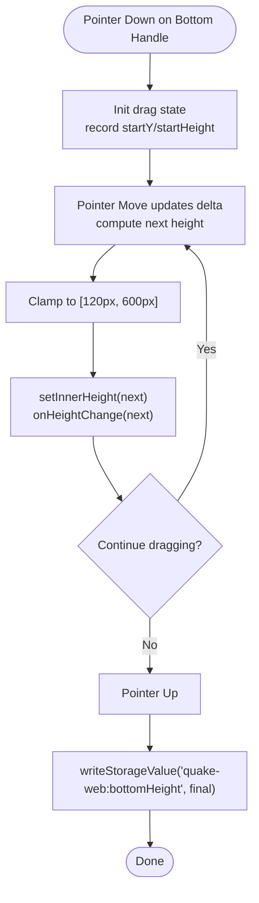
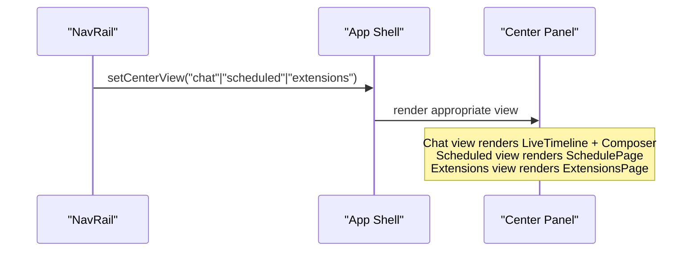
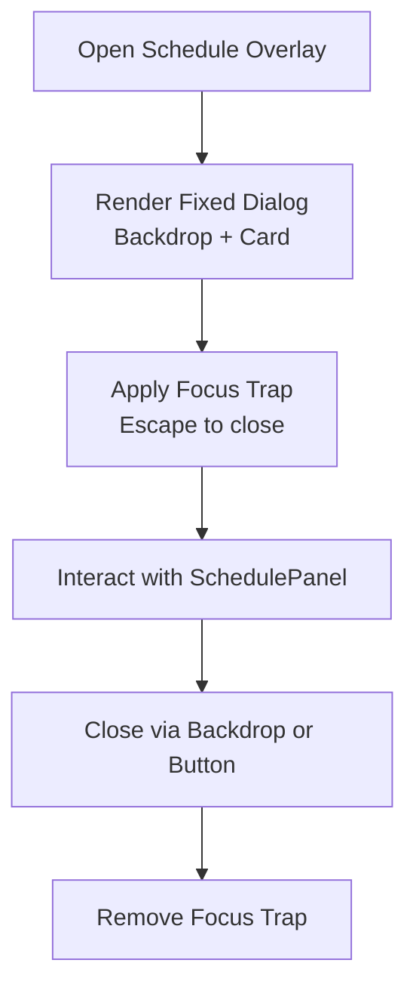
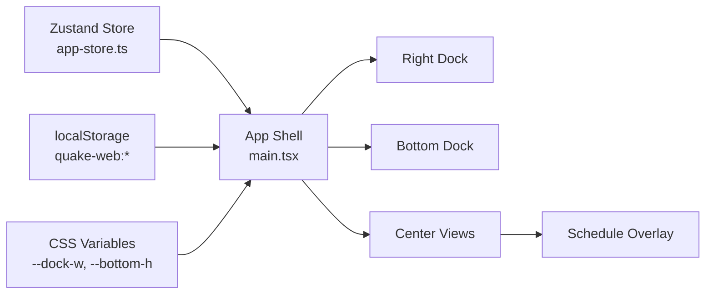

# Layout System

<cite>
**Referenced Files in This Document**
- [main.tsx](file://src/client/src/main.tsx)
- [BottomPanel.tsx](file://src/client/src/components/chrome/BottomPanel.tsx)
- [BottomPanel.module.css](file://src/client/src/components/chrome/BottomPanel.module.css)
- [SchedulePanel.tsx](file://src/client/src/components/dock/SchedulePanel.tsx)
- [SchedulePanel.module.css](file://src/client/src/components/dock/SchedulePanel.module.css)
</cite>

## Table of Contents
1. [Introduction](#introduction)
2. [Project Structure](#project-structure)
3. [Core Components](#core-components)
4. [Architecture Overview](#architecture-overview)
5. [Detailed Component Analysis](#detailed-component-analysis)
6. [Dependency Analysis](#dependency-analysis)
7. [Performance Considerations](#performance-considerations)
8. [Troubleshooting Guide](#troubleshooting-guide)
9. [Conclusion](#conclusion)

## Introduction
This document describes the layout management system that orchestrates the responsive grid with left/right/bottom panels, viewport adaptation, and main view modes. It covers:
- Main view modes: chat, scheduled sessions, and extensions
- Panel opening/closing with persistent state using localStorage
- Right panel drag-to-resize with keyboard alternatives
- Center panel layout switching between chat, schedule, and extensions
- Z-index management, overlay positioning, and modal handling
- Responsive breakpoints and mobile adaptation strategies
- Accessibility considerations
- Performance optimization for layout calculations and smooth transitions

## Project Structure
The layout system centers around a single application shell that manages three primary regions:
- Left sidebar (navigation rail)
- Main content area (center)
- Right dock (panel)
- Bottom dock (terminal)

**Diagram sources**
- [main.tsx:1414-1571](file://src/client/src/main.tsx#L1414-L1571)

**Section sources**
- [main.tsx:1414-1571](file://src/client/src/main.tsx#L1414-L1571)

## Core Components
- App shell and state management: central orchestration of panels, center view, and persistence
- Right panel: resizable dock with tabs and content areas
- Bottom panel: draggable terminal dock with height control
- Schedule overlay: modal dialog for scheduled sessions
- Main view modes: chat timeline, schedule page, and extensions page

Key responsibilities:
- Persist panel open/closed state and sizes to localStorage
- Provide keyboard-driven resizing and toggling
- Manage z-index and overlay stacking for dialogs and modals
- Adapt layout to viewport constraints and mobile breakpoints

**Section sources**
- [main.tsx:235-239](file://src/client/src/main.tsx#L235-L239)
- [main.tsx:463-484](file://src/client/src/main.tsx#L463-L484)
- [main.tsx:703-713](file://src/client/src/main.tsx#L703-L713)
- [main.tsx:1546-1567](file://src/client/src/main.tsx#L1546-L1567)

## Architecture Overview
The layout system uses React state hooks and CSS custom properties to manage panel visibility and sizing. The main container applies CSS-in-JS variables for dynamic widths and heights, enabling smooth transitions and responsive behavior.

**Diagram sources**
- [main.tsx:696-713](file://src/client/src/main.tsx#L696-L713)
- [main.tsx:1426-1448](file://src/client/src/main.tsx#L1426-L1448)
- [main.tsx:1501-1514](file://src/client/src/main.tsx#L1501-L1514)

## Detailed Component Analysis

### Right Panel Resizing and Tabs
The right panel supports mouse drag resizing and keyboard resizing. The drag handler clamps the width within minimum and maximum bounds and persists the final width to localStorage. Keyboard resizing uses arrow keys with optional shift for larger steps.

**Diagram sources**
- [main.tsx:738-780](file://src/client/src/main.tsx#L738-L780)

Additional keyboard resizing:
- ArrowLeft/ArrowRight adjust width by step (default 16px, 48px with Shift)
- Home sets width to 900px; End sets width to 320px

Right panel tabs:
- Launcher, Files, Preview, Review, Browser
- Terminal is managed via bottom dock; right dock tabs remain static except Preview

**Section sources**
- [main.tsx:738-780](file://src/client/src/main.tsx#L738-L780)
- [main.tsx:1547-1555](file://src/client/src/main.tsx#L1547-L1555)
- [main.tsx:2358-2378](file://src/client/src/main.tsx#L2358-L2378)

### Bottom Panel Height Control
The bottom panel uses a pointer-based drag handle to resize height, with clamping between 120px and 600px. Changes are persisted to localStorage and synchronized to the panel's internal state.

**Diagram sources**
- [BottomPanel.tsx:51-88](file://src/client/src/components/chrome/BottomPanel.tsx#L51-L88)

**Section sources**
- [BottomPanel.tsx:17-19](file://src/client/src/components/chrome/BottomPanel.tsx#L17-L19)
- [BottomPanel.tsx:51-88](file://src/client/src/components/chrome/BottomPanel.tsx#L51-L88)
- [main.tsx:1556-1559](file://src/client/src/main.tsx#L1556-L1559)

### Center Panel Layout Switching
The center panel switches among three main views:
- Chat: live timeline with composer, context chips, and image attachments
- Scheduled: schedule page with overlay dialog
- Extensions: extensions page with quick actions

**Diagram sources**
- [main.tsx:1434-1435](file://src/client/src/main.tsx#L1434-L1435)
- [main.tsx:1501-1514](file://src/client/src/main.tsx#L1501-L1514)

**Section sources**
- [main.tsx:1501-1514](file://src/client/src/main.tsx#L1501-L1514)

### Schedule Overlay (Modal)
The scheduled sessions overlay is a fixed-position modal with backdrop, centered dialog, and proper z-index stacking. It uses a focus trap and escape-key handling for accessibility.

**Diagram sources**
- [main.tsx:1562-1567](file://src/client/src/main.tsx#L1562-L1567)
- [SchedulePanel.tsx:50-75](file://src/client/src/components/dock/SchedulePanel.tsx#L50-L75)

**Section sources**
- [main.tsx:1562-1567](file://src/client/src/main.tsx#L1562-L1567)
- [SchedulePanel.tsx:50-75](file://src/client/src/components/dock/SchedulePanel.tsx#L50-L75)

### Persistent State Management
Panel open/closed states and sizes are persisted to localStorage with keys:
- quake-web:leftOpen
- quake-web:rightOpen
- quake-web:rightWidth
- quake-web:bottomHeight

These values are read on mount and written on toggle/resize.

**Section sources**
- [main.tsx:235-239](file://src/client/src/main.tsx#L235-L239)
- [main.tsx:463-484](file://src/client/src/main.tsx#L463-L484)
- [main.tsx:703-713](file://src/client/src/main.tsx#L703-L713)
- [main.tsx:759-762](file://src/client/src/main.tsx#L759-L762)
- [main.tsx:1559](file://src/client/src/main.tsx#L1559)

### Responsive Breakpoints and Mobile Adaptation
- Right panel minimum width: 320px
- Right panel maximum width: min(window.innerWidth - 100px, 900px)
- Bottom panel height clamp: 120pxÔÇô600px
- Schedule panel form adapts to narrow widths below 560px

**Section sources**
- [main.tsx:749-751](file://src/client/src/main.tsx#L749-L751)
- [main.tsx:1546](file://src/client/src/main.tsx#L1546)
- [BottomPanel.tsx:17-19](file://src/client/src/components/chrome/BottomPanel.tsx#L17-L19)
- [SchedulePanel.module.css:212-216](file://src/client/src/components/dock/SchedulePanel.module.css#L212-L216)

### Accessibility Considerations
- Keyboard navigation for resizing: Arrow keys, Home, End
- Focus trapping for modals and overlays
- ARIA roles and labels for draggable separators and panels
- Proper contrast and color tokens for dark/light themes

**Section sources**
- [main.tsx:768-780](file://src/client/src/main.tsx#L768-L780)
- [main.tsx:1587-1625](file://src/client/src/main.tsx#L1587-L1625)
- [main.tsx:1643-1651](file://src/client/src/main.tsx#L1643-L1651)
- [main.tsx:1663-1693](file://src/client/src/main.tsx#L1663-L1693)

## Dependency Analysis
The layout system depends on:
- Zustand store for global state (messages, tools, UI flags)
- localStorage for persistence
- CSS custom properties for dynamic sizing
- React lazy loading for heavy components

**Diagram sources**
- [main.tsx:1425](file://src/client/src/main.tsx#L1425)
- [main.tsx:1547-1567](file://src/client/src/main.tsx#L1547-L1567)

**Section sources**
- [main.tsx:1425](file://src/client/src/main.tsx#L1425)
- [main.tsx:1547-1567](file://src/client/src/main.tsx#L1547-L1567)

## Performance Considerations
- requestAnimationFrame batching for streaming updates and tool updates to avoid layout thrashing
- Virtualization-free timeline rendering with windowing and content-visibility to keep DOM manageable
- ResizeObserver throttled auto-follow behavior for live scrolling
- CSS custom properties for GPU-friendly transforms and layout recalculation minimization
- Lazy loading for heavy components (Monaco editor, terminal, settings)

Practical tips:
- Prefer keyboard resizing for smoother UX on constrained devices
- Avoid excessive tool activity during long streams to reduce re-renders
- Use content-visibility and overscan to keep timelines responsive

**Section sources**
- [main.tsx:1263-1302](file://src/client/src/main.tsx#L1263-L1302)
- [main.tsx:1996-2152](file://src/client/src/main.tsx#L1996-L2152)
- [main.tsx:2149-2151](file://src/client/src/main.tsx#L2149-L2151)

## Troubleshooting Guide
Common issues and resolutions:
- Right panel not resizing: ensure mouse move/up handlers are attached and not blocked by overlays
- Bottom panel height not sticking: verify onHeightChange is invoked and localStorage write occurs
- Schedule overlay not closing: check backdrop click handler and escape key listener
- Panels appear squished on small screens: confirm clamp limits and media queries are applied

Debugging steps:
- Inspect localStorage keys for quake-web:rightWidth and quake-web:bottomHeight
- Verify CSS variables --dock-w and --bottom-h are updating
- Confirm event listeners for drag and keyboard resize are registered

**Section sources**
- [main.tsx:738-780](file://src/client/src/main.tsx#L738-L780)
- [BottomPanel.tsx:51-88](file://src/client/src/components/chrome/BottomPanel.tsx#L51-L88)
- [main.tsx:1562-1567](file://src/client/src/main.tsx#L1562-L1567)

## Conclusion
The layout system provides a robust, responsive, and accessible foundation for the application. It balances flexibility (drag resizing, keyboard controls) with performance (batched updates, windowing) and persistence (localStorage). The modular design of panels and center views enables easy extension and maintenance.
