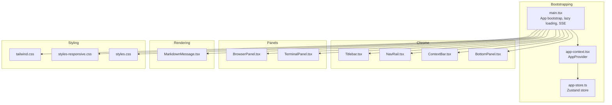
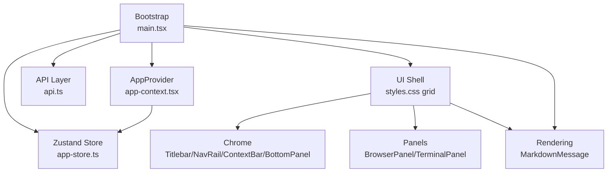
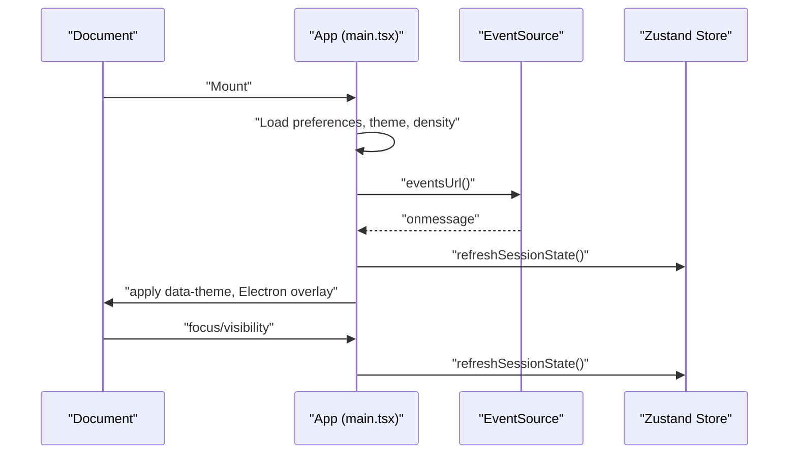
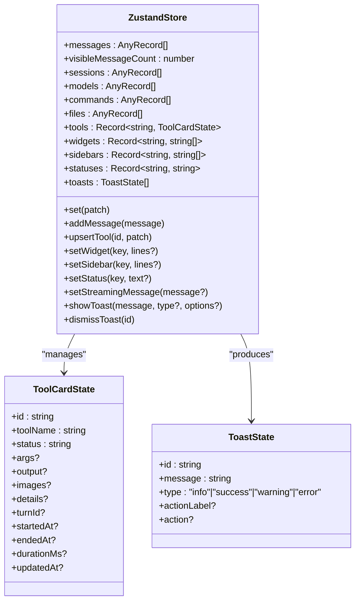
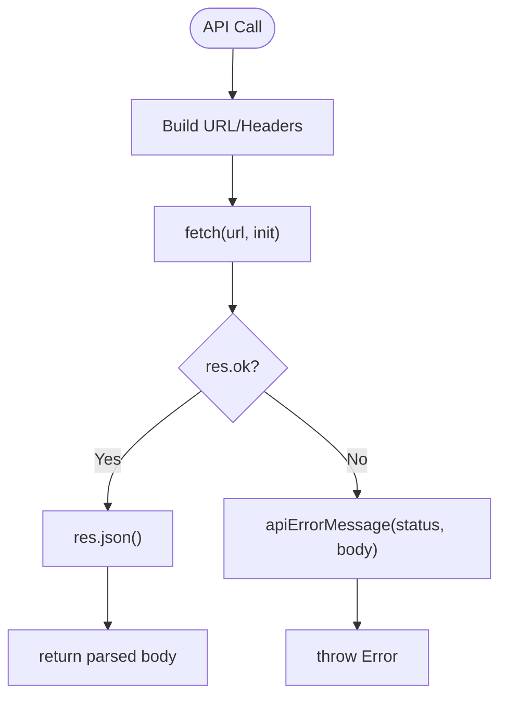
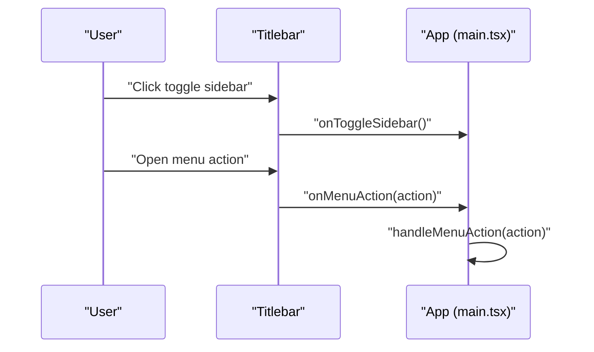
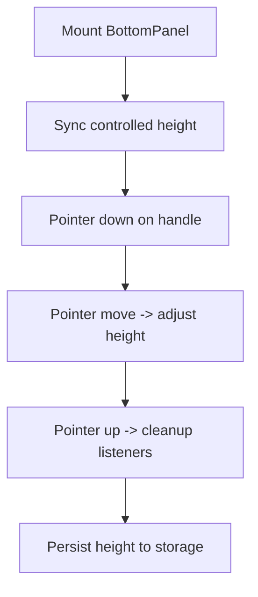
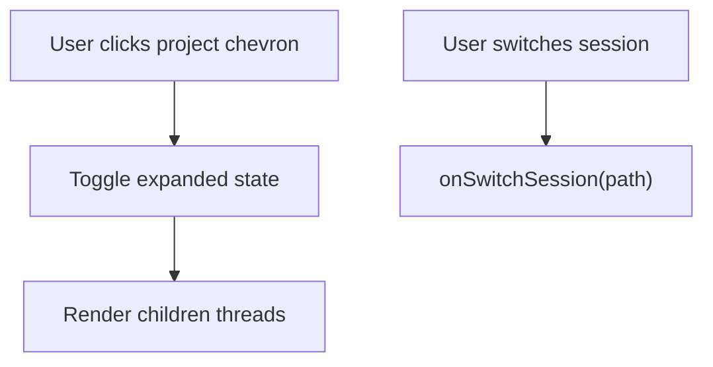
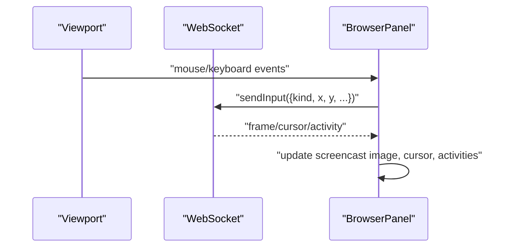
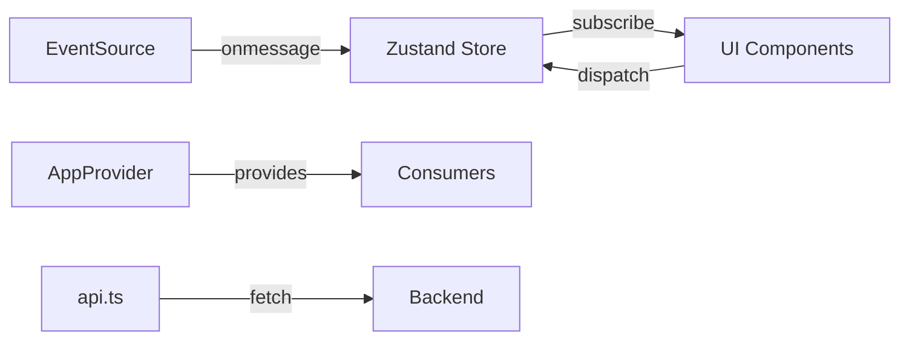

# Frontend Application

<cite>
**Referenced Files in This Document**
- [main.tsx](file://src/client/src/main.tsx)
- [app-context.tsx](file://src/client/src/state/app-context.tsx)
- [app-store.ts](file://src/client/src/state/app-store.ts)
- [api.ts](file://src/client/src/lib/api.ts)
- [types.ts](file://src/client/src/types.ts)
- [Titlebar.tsx](file://src/client/src/components/chrome/Titlebar.tsx)
- [BottomPanel.tsx](file://src/client/src/components/chrome/BottomPanel.tsx)
- [NavRail.tsx](file://src/client/src/components/chrome/NavRail.tsx)
- [ContextBar.tsx](file://src/client/src/components/chrome/ContextBar.tsx)
- [BrowserPanel.tsx](file://src/client/src/components/dock/BrowserPanel.tsx)
- [TerminalPanel.tsx](file://src/client/src/components/terminal/TerminalPanel.tsx)
- [MarkdownMessage.tsx](file://src/client/src/components/markdown/MarkdownMessage.tsx)
- [tailwind.css](file://src/client/tailwind.css)
- [styles-responsive.css](file://src/client/styles-responsive.css)
- [styles.css](file://src/client/styles.css)
</cite>

## Table of Contents
1. [Introduction](#introduction)
2. [Project Structure](#project-structure)
3. [Core Components](#core-components)
4. [Architecture Overview](#architecture-overview)
5. [Detailed Component Analysis](#detailed-component-analysis)
6. [Dependency Analysis](#dependency-analysis)
7. [Performance Considerations](#performance-considerations)
8. [Troubleshooting Guide](#troubleshooting-guide)
9. [Conclusion](#conclusion)
10. [Appendices](#appendices)

## Introduction
This document describes the React-based frontend application for the web interface. It covers the bootstrap process, component architecture, state management with Zustand, API integration patterns, Chrome components (Titlebar, BottomPanel, NavRail, ContextBar), Dock panels system, and Timeline-related rendering. It also explains component lifecycles, prop drilling solutions, context providers, event handling patterns, styling architecture with Tailwind CSS, responsive design, accessibility features, performance optimization, and code splitting strategies.

## Project Structure
The frontend is organized around a main entry that bootstraps the React application, wires Zustand stores, sets up providers, and mounts the UI shell. The UI is composed of Chrome components (top-level chrome), a central main area, a Dock (right-side panels), and a Bottom Dock (terminal). Styling is layered with Tailwind utilities and custom CSS variables, and responsive behavior is handled via media queries.

**Diagram sources**
- [main.tsx:145-284](file://src/client/src/main.tsx#L145-L284)
- [app-context.tsx:33-57](file://src/client/src/state/app-context.tsx#L33-L57)
- [app-store.ts:186-252](file://src/client/src/state/app-store.ts#L186-L252)
- [Titlebar.tsx:32-50](file://src/client/src/components/chrome/Titlebar.tsx#L32-L50)
- [NavRail.tsx:37-83](file://src/client/src/components/chrome/NavRail.tsx#L37-L83)
- [ContextBar.tsx:14-24](file://src/client/src/components/chrome/ContextBar.tsx#L14-L24)
- [BottomPanel.tsx:27-35](file://src/client/src/components/chrome/BottomPanel.tsx#L27-L35)
- [BrowserPanel.tsx:46-53](file://src/client/src/components/dock/BrowserPanel.tsx#L46-L53)
- [TerminalPanel.tsx:9-11](file://src/client/src/components/terminal/TerminalPanel.tsx#L9-L11)
- [MarkdownMessage.tsx:49-69](file://src/client/src/components/markdown/MarkdownMessage.tsx#L49-L69)
- [tailwind.css:12-82](file://src/client/tailwind.css#L12-L82)
- [styles-responsive.css:13-134](file://src/client/styles-responsive.css#L13-L134)
- [styles.css:460-495](file://src/client/styles.css#L460-L495)

**Section sources**
- [main.tsx:145-284](file://src/client/src/main.tsx#L145-L284)
- [styles.css:460-495](file://src/client/styles.css#L460-L495)

## Core Components
- App bootstrap and orchestration: Initializes Zustand store, loads preferences, sets up SSE, and wires keyboard shortcuts and theme resolution.
- State management: Centralized in a Zustand store with normalized message handling, tool state pruning, and toast notifications.
- Providers: AppProvider exposes runtime context (config, cwd, streaming state, current model/thinking, and command dispatch) to child components.
- API integration: Typed helpers for GET/POST/PATCH/DELETE with token support and SSE endpoint construction.
- Chrome components: Titlebar, NavRail, ContextBar, BottomPanel provide navigation, context, and terminal controls.
- Panels: BrowserPanel (remote browsing and screencast), TerminalPanel (tabs, commands, ANSI rendering).
- Rendering: MarkdownMessage renders markdown with code highlighting and tool notice integration.

**Section sources**
- [main.tsx:145-284](file://src/client/src/main.tsx#L145-L284)
- [app-store.ts:186-252](file://src/client/src/state/app-store.ts#L186-L252)
- [app-context.tsx:33-57](file://src/client/src/state/app-context.tsx#L33-L57)
- [api.ts:9-59](file://src/client/src/lib/api.ts#L9-L59)
- [MarkdownMessage.tsx:49-69](file://src/client/src/components/markdown/MarkdownMessage.tsx#L49-L69)

## Architecture Overview
The application follows a layered architecture:
- Bootstrap layer initializes the app, lazy-loads heavy components, and subscribes to server-sent events.
- State layer manages UI and agent state via Zustand with normalization and pruning.
- Provider layer exposes a typed context to decouple consumers from store internals.
- UI layer composes Chrome, panels, and rendering components.
- Styling layer integrates Tailwind utilities with CSS variables and responsive overrides.

**Diagram sources**
- [main.tsx:58-80](file://src/client/src/main.tsx#L58-L80)
- [main.tsx:573-588](file://src/client/src/main.tsx#L573-L588)
- [app-store.ts:186-252](file://src/client/src/state/app-store.ts#L186-L252)
- [app-context.tsx:33-57](file://src/client/src/state/app-context.tsx#L33-L57)
- [api.ts:9-59](file://src/client/src/lib/api.ts#L9-L59)
- [styles.css:460-495](file://src/client/styles.css#L460-L495)

## Detailed Component Analysis

### App Bootstrap and Lifecycle
- Lazy loading: Heavy components (Monaco editors, terminal, settings, panels, command palettes) are loaded on demand to reduce initial bundle size.
- Theme resolution: Resolves system preference and applies data attributes for downstream styling.
- SSE subscription: Subscribes to server events and reconciles state on focus/visibility changes.
- Keyboard shortcuts: Global handlers for toggling panels, opening palettes, and terminal panel.
- Preferences: Reads/writes local storage for layout, density, theme, and sizes.

**Diagram sources**
- [main.tsx:573-588](file://src/client/src/main.tsx#L573-L588)
- [main.tsx:590-606](file://src/client/src/main.tsx#L590-L606)
- [main.tsx:549-556](file://src/client/src/main.tsx#L549-L556)
- [api.ts:48-50](file://src/client/src/lib/api.ts#L48-L50)

**Section sources**
- [main.tsx:58-80](file://src/client/src/main.tsx#L58-L80)
- [main.tsx:549-556](file://src/client/src/main.tsx#L549-L556)
- [main.tsx:573-588](file://src/client/src/main.tsx#L573-L588)
- [main.tsx:590-606](file://src/client/src/main.tsx#L590-L606)

### State Management with Zustand
- Store shape: Holds messages, tools, sessions, models, commands, files, widgets, statuses, and toasts.
- Normalization: Deduplicates and prunes messages and tools to bounded limits.
- Tool state: Upserts tool entries with timestamps, durations, and capped output.
- Notifications: Toasts with auto-dismiss and action support.

**Diagram sources**
- [app-store.ts:33-58](file://src/client/src/state/app-store.ts#L33-L58)
- [app-store.ts:186-252](file://src/client/src/state/app-store.ts#L186-L252)

**Section sources**
- [app-store.ts:186-252](file://src/client/src/state/app-store.ts#L186-L252)

### API Integration Patterns
- Token-aware requests: Uses a global token header when present.
- Error handling: Parses error bodies and maps HTTP status to user-friendly messages.
- Events endpoint: Provides a streaming endpoint URL builder.

**Diagram sources**
- [api.ts:9-25](file://src/client/src/lib/api.ts#L9-L25)
- [api.ts:52-58](file://src/client/src/lib/api.ts#L52-L58)

**Section sources**
- [api.ts:9-25](file://src/client/src/lib/api.ts#L9-L25)
- [api.ts:52-58](file://src/client/src/lib/api.ts#L52-L58)

### Chrome Components

#### Titlebar
- Responsibilities: Toggle sidebar, open sessions modal, theme toggle, and dock/panel toggles.
- Accessibility: Proper ARIA roles and labels; keyboard navigation support.
- Desktop integration: Platform-specific overlay synchronization.

**Diagram sources**
- [Titlebar.tsx:32-50](file://src/client/src/components/chrome/Titlebar.tsx#L32-L50)
- [Titlebar.tsx:74-117](file://src/client/src/components/chrome/Titlebar.tsx#L74-L117)
- [main.tsx:727-736](file://src/client/src/main.tsx#L727-L736)

**Section sources**
- [Titlebar.tsx:32-50](file://src/client/src/components/chrome/Titlebar.tsx#L32-L50)
- [Titlebar.tsx:74-117](file://src/client/src/components/chrome/Titlebar.tsx#L74-L117)
- [main.tsx:727-736](file://src/client/src/main.tsx#L727-L736)

#### BottomPanel
- Responsibilities: Resizable terminal panel with status LED, tabs, and actions.
- Interaction: Pointer drag to resize, controlled height sync, and close action.

**Diagram sources**
- [BottomPanel.tsx:27-35](file://src/client/src/components/chrome/BottomPanel.tsx#L27-L35)
- [BottomPanel.tsx:51-88](file://src/client/src/components/chrome/BottomPanel.tsx#L51-L88)

**Section sources**
- [BottomPanel.tsx:27-35](file://src/client/src/components/chrome/BottomPanel.tsx#L27-L35)
- [BottomPanel.tsx:51-88](file://src/client/src/components/chrome/BottomPanel.tsx#L51-L88)

#### NavRail
- Responsibilities: Left navigation rail with quick actions, pinned threads, projects tree, and account.
- Behavior: Collapses to icons-only when sidebar is collapsed; supports expand/collapse per project.

**Diagram sources**
- [NavRail.tsx:236-264](file://src/client/src/components/chrome/NavRail.tsx#L236-L264)
- [NavRail.tsx:223-231](file://src/client/src/components/chrome/NavRail.tsx#L223-L231)

**Section sources**
- [NavRail.tsx:236-264](file://src/client/src/components/chrome/NavRail.tsx#L236-L264)
- [NavRail.tsx:223-231](file://src/client/src/components/chrome/NavRail.tsx#L223-L231)

#### ContextBar
- Responsibilities: Workspace, local working directory, and branch indicators; fetches branch when not provided.
- Behavior: Conditional rendering of branch chip; click handler opens workspace.

**Section sources**
- [ContextBar.tsx:14-24](file://src/client/src/components/chrome/ContextBar.tsx#L14-L24)
- [ContextBar.tsx:27-41](file://src/client/src/components/chrome/ContextBar.tsx#L27-L41)

### Dock Panels System

#### BrowserPanel
- Responsibilities: Navigation controls, address normalization, iframe/webview embedding, and screencast viewer.
- Screencast: Connects to a WebSocket for live frames, cursor, and activity feed; translates viewport events to agent input.
- Electron vs web: Uses webview when desktop; otherwise iframe with sandboxing.

**Diagram sources**
- [BrowserPanel.tsx:246-264](file://src/client/src/components/dock/BrowserPanel.tsx#L246-L264)
- [BrowserPanel.tsx:134-222](file://src/client/src/components/dock/BrowserPanel.tsx#L134-L222)

**Section sources**
- [BrowserPanel.tsx:46-53](file://src/client/src/components/dock/BrowserPanel.tsx#L46-L53)
- [BrowserPanel.tsx:134-222](file://src/client/src/components/dock/BrowserPanel.tsx#L134-L222)
- [BrowserPanel.tsx:246-264](file://src/client/src/components/dock/BrowserPanel.tsx#L246-L264)

#### TerminalPanel
- Responsibilities: Tabbed terminal, command input/history, run/stop, copy actions, ANSI rendering, and risk warnings.
- Integration: Dispatches terminal scroll lock events and integrates with agent context.

**Section sources**
- [TerminalPanel.tsx:9-11](file://src/client/src/components/terminal/TerminalPanel.tsx#L9-L11)
- [TerminalPanel.tsx:37-79](file://src/client/src/components/terminal/TerminalPanel.tsx#L37-L79)

### Timeline Components
- Timeline rendering is primarily handled by MarkdownMessage and related tool activity utilities. The component parses markdown blocks, highlights code, and renders tool notices while preserving open/closed state across remounts.
- Tool snapshots are passed to the message renderer to correlate tool executions with messages.

**Section sources**
- [MarkdownMessage.tsx:49-69](file://src/client/src/components/markdown/MarkdownMessage.tsx#L49-L69)
- [MarkdownMessage.tsx:32-40](file://src/client/src/components/markdown/MarkdownMessage.tsx#L32-L40)

## Dependency Analysis
- Component coupling: UI components depend on Zustand store via selectors and AppProvider context. This reduces prop drilling and keeps components testable.
- External dependencies: Zustand for state, Lucide icons for UI, Monaco editor for code editing, and Tailwind for utilities.
- Event-driven updates: SSE drives real-time updates; Zustand subscribers react to state changes.

**Diagram sources**
- [app-store.ts:186-252](file://src/client/src/state/app-store.ts#L186-L252)
- [app-context.tsx:33-57](file://src/client/src/state/app-context.tsx#L33-L57)
- [api.ts:9-25](file://src/client/src/lib/api.ts#L9-L25)
- [main.tsx:573-588](file://src/client/src/main.tsx#L573-L588)

**Section sources**
- [app-store.ts:186-252](file://src/client/src/state/app-store.ts#L186-L252)
- [app-context.tsx:33-57](file://src/client/src/state/app-context.tsx#L33-L57)
- [api.ts:9-25](file://src/client/src/lib/api.ts#L9-L25)
- [main.tsx:573-588](file://src/client/src/main.tsx#L573-L588)

## Performance Considerations
- Code splitting: React.lazy is used extensively for heavy panels and editors to defer loading until needed.
- Zustand normalization/pruning: Limits memory footprint by deduplicating messages and pruning tools after bounded thresholds.
- Memoization: Components like MarkdownMessage use memoization to avoid unnecessary re-renders.
- Animation and motion: Density and animation speed preferences are applied via CSS variables and data attributes to minimize layout thrashing.
- Event throttling: SSE reconnect and reconciliation are gated by sequence numbers and idle detection.

**Section sources**
- [main.tsx:58-80](file://src/client/src/main.tsx#L58-L80)
- [app-store.ts:102-127](file://src/client/src/state/app-store.ts#L102-L127)
- [app-store.ts:137-156](file://src/client/src/state/app-store.ts#L137-L156)
- [MarkdownMessage.tsx:49-69](file://src/client/src/components/markdown/MarkdownMessage.tsx#L49-L69)
- [main.tsx:667-676](file://src/client/src/main.tsx#L667-L676)

## Troubleshooting Guide
- SSE connection issues: The app reconciles state on open/error and periodically refreshes when idle. Check network connectivity and token validity.
- Toast notifications: Use the store's toast API to surface errors and warnings; ensure proper dismissal and auto-hide behavior.
- Terminal risks: Dangerous command patterns are detected and surfaced as warnings; review policy and confirm before execution.
- Local storage preferences: If UI state appears inconsistent, verify persisted values for theme, density, and panel widths.

**Section sources**
- [main.tsx:573-588](file://src/client/src/main.tsx#L573-L588)
- [app-store.ts:241-250](file://src/client/src/state/app-store.ts#L241-L250)
- [TerminalPanel.tsx:184-190](file://src/client/src/components/terminal/TerminalPanel.tsx#L184-L190)

## Conclusion
The frontend application employs a clean separation of concerns: a lean bootstrap layer, a robust Zustand store with normalization, provider-based context, and a modular UI built from Chrome, panels, and rendering components. Styling leverages Tailwind utilities integrated with CSS variables and responsive media queries. Performance is addressed through code splitting, memoization, and bounded state growth. The SSE-driven architecture ensures real-time updates with resilient reconciliation.

## Appendices

### Styling Architecture and Responsive Design
- Tailwind integration: Theme layer maps CSS variables to Tailwind color tokens; utilities are layered alongside existing styles.
- Responsive breakpoints: Media queries adapt sidebar, rightbar, and composer for mobile and touch devices.
- Print styles: Excludes chrome and modals for print media.

**Section sources**
- [tailwind.css:12-82](file://src/client/tailwind.css#L12-L82)
- [styles-responsive.css:13-134](file://src/client/styles-responsive.css#L13-L134)
- [styles-responsive.css:136-157](file://src/client/styles-responsive.css#L136-L157)
- [styles-responsive.css:159-182](file://src/client/styles-responsive.css#L159-L182)
- [styles-responsive.css:184-193](file://src/client/styles-responsive.css#L184-L193)
- [styles-responsive.css:195-214](file://src/client/styles-responsive.css#L195-L214)

### Accessibility Features
- ARIA roles and labels: Buttons, menus, and panels include appropriate ARIA attributes and labels.
- Keyboard navigation: Titlebar menus and terminal tabs support keyboard activation.
- Focus and visibility: Automatic reconciliation on focus and visibility change improves reliability for assistive technologies.

**Section sources**
- [Titlebar.tsx:56-72](file://src/client/src/components/chrome/Titlebar.tsx#L56-L72)
- [Titlebar.tsx:154-189](file://src/client/src/components/chrome/Titlebar.tsx#L154-L189)
- [TerminalPanel.tsx:42-45](file://src/client/src/components/terminal/TerminalPanel.tsx#L42-L45)
- [main.tsx:590-606](file://src/client/src/main.tsx#L590-L606)
