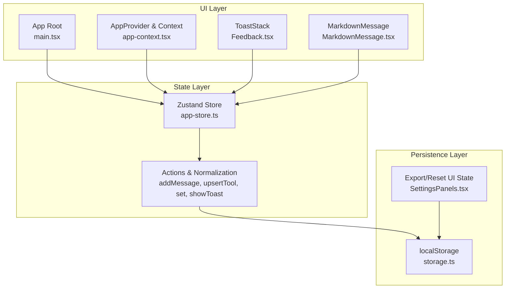
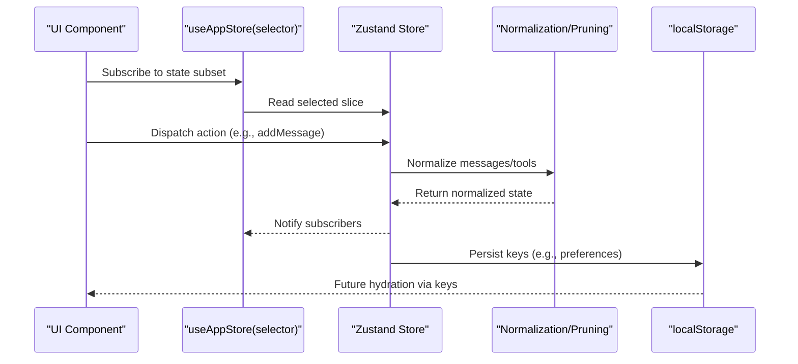
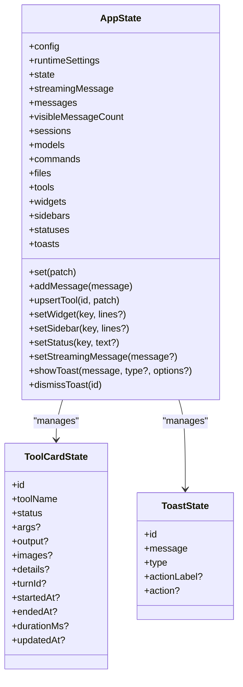
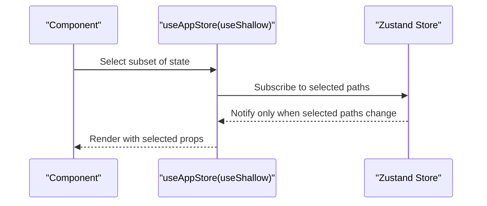
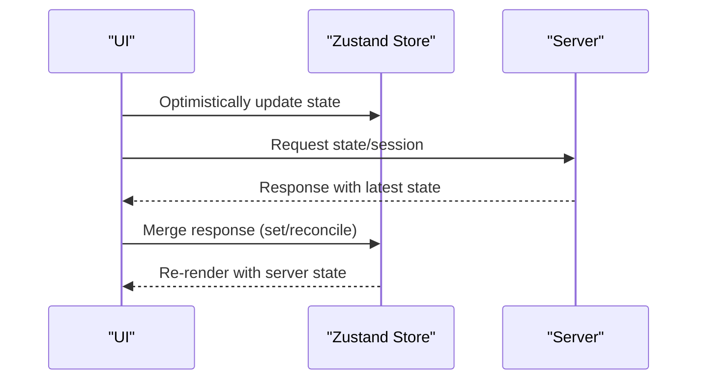
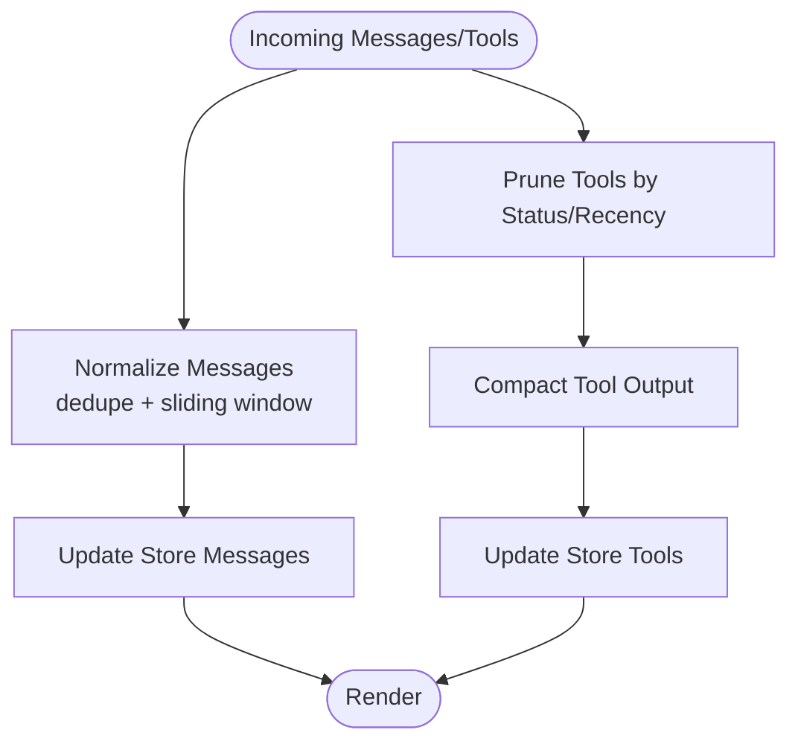
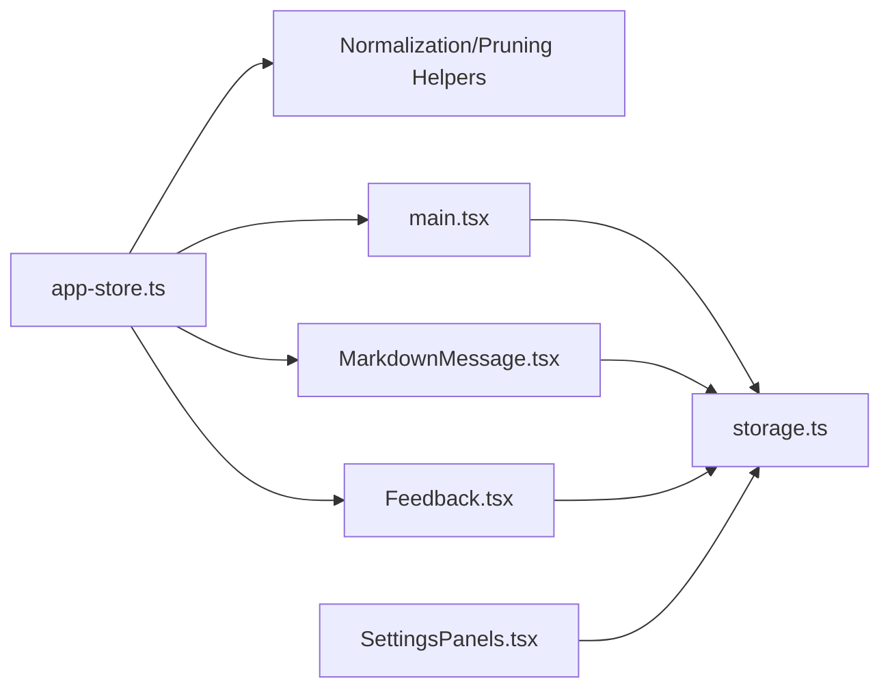

# State Management

<cite>
**Referenced Files in This Document**
- [app-store.ts](file://src/client/src/state/app-store.ts)
- [app-context.tsx](file://src/client/src/state/app-context.tsx)
- [main.tsx](file://src/client/src/main.tsx)
- [storage.ts](file://src/client/src/lib/storage.ts)
- [Feedback.tsx](file://src/client/src/components/common/Feedback.tsx)
- [MarkdownMessage.tsx](file://src/client/src/components/markdown/MarkdownMessage.tsx)
- [SettingsPanels.tsx](file://src/client/src/components/settings/SettingsPanels.tsx)
</cite>

## Table of Contents
1. [Introduction](#introduction)
2. [Project Structure](#project-structure)
3. [Core Components](#core-components)
4. [Architecture Overview](#architecture-overview)
5. [Detailed Component Analysis](#detailed-component-analysis)
6. [Dependency Analysis](#dependency-analysis)
7. [Performance Considerations](#performance-considerations)
8. [Troubleshooting Guide](#troubleshooting-guide)
9. [Conclusion](#conclusion)

## Introduction
This document explains the Zustand-based state management system used by the application. It covers the store architecture, state slices, hooks and selectors, normalization and pruning strategies, persistence and hydration via localStorage, optimistic updates, and debugging approaches. It also documents provider patterns, middleware usage, and performance monitoring techniques.

## Project Structure
The state management is centered around a single Zustand store with supporting utilities and context providers:
- Store definition and actions: [app-store.ts](file://src/client/src/state/app-store.ts)
- Provider and derived context: [app-context.tsx](file://src/client/src/state/app-context.tsx)
- Global usage and selectors: [main.tsx](file://src/client/src/main.tsx)
- Local storage utilities: [storage.ts](file://src/client/src/lib/storage.ts)
- UI components consuming state: [Feedback.tsx](file://src/client/src/components/common/Feedback.tsx), [MarkdownMessage.tsx](file://src/client/src/components/markdown/MarkdownMessage.tsx)
- Persistence and export utilities: [SettingsPanels.tsx](file://src/client/src/components/settings/SettingsPanels.tsx)

**Diagram sources**
- [app-store.ts:186-252](file://src/client/src/state/app-store.ts#L186-L252)
- [app-context.tsx:33-57](file://src/client/src/state/app-context.tsx#L33-L57)
- [main.tsx:145-187](file://src/client/src/main.tsx#L145-L187)
- [Feedback.tsx:5-37](file://src/client/src/components/common/Feedback.tsx#L5-L37)
- [MarkdownMessage.tsx:49-69](file://src/client/src/components/markdown/MarkdownMessage.tsx#L49-L69)
- [storage.ts:1-49](file://src/client/src/lib/storage.ts#L1-L49)
- [SettingsPanels.tsx:724-756](file://src/client/src/components/settings/SettingsPanels.tsx#L724-L756)

**Section sources**
- [app-store.ts:186-252](file://src/client/src/state/app-store.ts#L186-L252)
- [app-context.tsx:33-57](file://src/client/src/state/app-context.tsx#L33-L57)
- [main.tsx:145-187](file://src/client/src/main.tsx#L145-L187)
- [storage.ts:1-49](file://src/client/src/lib/storage.ts#L1-L49)
- [Feedback.tsx:5-37](file://src/client/src/components/common/Feedback.tsx#L5-L37)
- [MarkdownMessage.tsx:49-69](file://src/client/src/components/markdown/MarkdownMessage.tsx#L49-L69)
- [SettingsPanels.tsx:724-756](file://src/client/src/components/settings/SettingsPanels.tsx#L724-L756)

## Core Components
- Zustand store with typed state and actions
- Selector patterns using useShallow for fine-grained re-renders
- Normalization and pruning helpers for messages and tools
- Toast notifications with auto-dismissal
- Provider exposing derived values and convenience functions

Key implementation references:
- Store creation and actions: [app-store.ts:186-252](file://src/client/src/state/app-store.ts#L186-L252)
- Selector usage in main app: [main.tsx:165-184](file://src/client/src/main.tsx#L165-L184)
- Selector usage in MarkdownMessage: [MarkdownMessage.tsx:288](file://src/client/src/components/markdown/MarkdownMessage.tsx#L288)
- Toast stack consumption: [Feedback.tsx:5-37](file://src/client/src/components/common/Feedback.tsx#L5-L37)

**Section sources**
- [app-store.ts:186-252](file://src/client/src/state/app-store.ts#L186-L252)
- [main.tsx:165-184](file://src/client/src/main.tsx#L165-L184)
- [MarkdownMessage.tsx:288](file://src/client/src/components/markdown/MarkdownMessage.tsx#L288)
- [Feedback.tsx:5-37](file://src/client/src/components/common/Feedback.tsx#L5-L37)

## Architecture Overview
The store exposes a typed state shape and imperative actions. Consumers subscribe to subsets of state using useShallow to minimize re-renders. Derived values are computed in the provider for convenience. Persistence is handled via localStorage utilities and selective keys.

**Diagram sources**
- [app-store.ts:186-252](file://src/client/src/state/app-store.ts#L186-L252)
- [main.tsx:165-184](file://src/client/src/main.tsx#L165-L184)
- [storage.ts:1-49](file://src/client/src/lib/storage.ts#L1-L49)

## Detailed Component Analysis

### Zustand Store and State Slices
The store defines a comprehensive state shape with dedicated slices for messages, tools, UI widgets, statuses, and toasts. It exports typed actions for mutation and normalization.

- State shape and slices: [app-store.ts:33-58](file://src/client/src/state/app-store.ts#L33-L58)
- Store creation and actions: [app-store.ts:186-252](file://src/client/src/state/app-store.ts#L186-L252)
- Message normalization and deduplication: [app-store.ts:102-127](file://src/client/src/state/app-store.ts#L102-L127)
- Tools pruning and recency sorting: [app-store.ts:137-170](file://src/client/src/state/app-store.ts#L137-L170)
- Tool output compaction: [app-store.ts:172-184](file://src/client/src/state/app-store.ts#L172-L184)

**Diagram sources**
- [app-store.ts:33-58](file://src/client/src/state/app-store.ts#L33-L58)
- [app-store.ts:10-23](file://src/client/src/state/app-store.ts#L10-L23)
- [app-store.ts:25-31](file://src/client/src/state/app-store.ts#L25-L31)

**Section sources**
- [app-store.ts:33-58](file://src/client/src/state/app-store.ts#L33-L58)
- [app-store.ts:10-23](file://src/client/src/state/app-store.ts#L10-L23)
- [app-store.ts:25-31](file://src/client/src/state/app-store.ts#L25-L31)
- [app-store.ts:102-127](file://src/client/src/state/app-store.ts#L102-L127)
- [app-store.ts:137-170](file://src/client/src/state/app-store.ts#L137-L170)
- [app-store.ts:172-184](file://src/client/src/state/app-store.ts#L172-L184)

### Selector Patterns and useShallow
Consumers use useShallow to subscribe to specific fields, reducing unnecessary renders. The main app and MarkdownMessage demonstrate this pattern.

- Main app selectors: [main.tsx:165-184](file://src/client/src/main.tsx#L165-L184)
- Live tools selector in MarkdownMessage: [MarkdownMessage.tsx:288](file://src/client/src/components/markdown/MarkdownMessage.tsx#L288)

**Diagram sources**
- [main.tsx:165-184](file://src/client/src/main.tsx#L165-L184)
- [MarkdownMessage.tsx:288](file://src/client/src/components/markdown/MarkdownMessage.tsx#L288)

**Section sources**
- [main.tsx:165-184](file://src/client/src/main.tsx#L165-L184)
- [MarkdownMessage.tsx:288](file://src/client/src/components/markdown/MarkdownMessage.tsx#L288)

### State Subscription Mechanisms
Components subscribe directly to the store via hooks. The provider derives higher-level values (e.g., current model, workspace name) from store slices.

- Provider deriving values: [app-context.tsx:33-57](file://src/client/src/state/app-context.tsx#L33-L57)
- Direct subscription in Feedback: [Feedback.tsx:5-37](file://src/client/src/components/common/Feedback.tsx#L5-L37)

**Section sources**
- [app-context.tsx:33-57](file://src/client/src/state/app-context.tsx#L33-L57)
- [Feedback.tsx:5-37](file://src/client/src/components/common/Feedback.tsx#L5-L37)

### State Update Patterns and Optimistic Updates
- Batch updates: The main app dispatches multiple patches atomically via the store's set method.
- Optimistic updates: UI state is updated immediately upon user actions; server responses reconcile later.

References:
- Batch updates via set: [main.tsx:321-324](file://src/client/src/main.tsx#L321-L324)
- Refresh and reconciliation: [main.tsx:365-398](file://src/client/src/main.tsx#L365-L398)

**Diagram sources**
- [main.tsx:321-324](file://src/client/src/main.tsx#L321-L324)
- [main.tsx:365-398](file://src/client/src/main.tsx#L365-L398)

**Section sources**
- [main.tsx:321-324](file://src/client/src/main.tsx#L321-L324)
- [main.tsx:365-398](file://src/client/src/main.tsx#L365-L398)

### State Normalization and Pruning
Normalization ensures message history remains bounded and free of duplicates. Tools are pruned by recency and activity status to maintain performance.

- Message normalization: [app-store.ts:102-127](file://src/client/src/state/app-store.ts#L102-L127)
- Tool pruning: [app-store.ts:137-170](file://src/client/src/state/app-store.ts#L137-L170)
- Tool output compaction: [app-store.ts:172-184](file://src/client/src/state/app-store.ts#L172-L184)

**Diagram sources**
- [app-store.ts:102-127](file://src/client/src/state/app-store.ts#L102-L127)
- [app-store.ts:137-170](file://src/client/src/state/app-store.ts#L137-L170)
- [app-store.ts:172-184](file://src/client/src/state/app-store.ts#L172-L184)

**Section sources**
- [app-store.ts:102-127](file://src/client/src/state/app-store.ts#L102-L127)
- [app-store.ts:137-170](file://src/client/src/state/app-store.ts#L137-L170)
- [app-store.ts:172-184](file://src/client/src/state/app-store.ts#L172-L184)

### State Persistence and Hydration
- Local storage utilities: [storage.ts:1-49](file://src/client/src/lib/storage.ts#L1-L49)
- UI state export/reset: [SettingsPanels.tsx:724-756](file://src/client/src/components/settings/SettingsPanels.tsx#L724-L756)
- Hydration pattern: Components read localStorage keys during initialization and pass hydrated values to the store via set.

Notes:
- The store itself does not include middleware for persistence; persistence is implemented at the edges using localStorage utilities and selective keys.

**Section sources**
- [storage.ts:1-49](file://src/client/src/lib/storage.ts#L1-L49)
- [SettingsPanels.tsx:724-756](file://src/client/src/components/settings/SettingsPanels.tsx#L724-L756)

### Context Providers and Derived Values
The AppProvider computes derived values (e.g., current model, workspace name) from the store and exposes them via context, simplifying component usage.

- Provider implementation: [app-context.tsx:33-57](file://src/client/src/state/app-context.tsx#L33-L57)

**Section sources**
- [app-context.tsx:33-57](file://src/client/src/state/app-context.tsx#L33-L57)

### Devtools Integration and Debugging
- The store is created with Zustand's default behavior; there is no explicit middleware configuration for devtools in the provided code.
- Debugging tips:
  - Use shallow selectors to isolate re-render causes.
  - Log selector inputs and outputs in components to observe minimal re-renders.
  - Monitor toast and message counts to validate normalization behavior.

[No sources needed since this section provides general guidance]

## Dependency Analysis
The store depends on normalization/pruning helpers and is consumed by multiple UI components. Persistence is decoupled via localStorage utilities.

**Diagram sources**
- [app-store.ts:102-184](file://src/client/src/state/app-store.ts#L102-L184)
- [main.tsx:145-187](file://src/client/src/main.tsx#L145-L187)
- [MarkdownMessage.tsx:49-69](file://src/client/src/components/markdown/MarkdownMessage.tsx#L49-L69)
- [Feedback.tsx:5-37](file://src/client/src/components/common/Feedback.tsx#L5-L37)
- [storage.ts:1-49](file://src/client/src/lib/storage.ts#L1-L49)
- [SettingsPanels.tsx:724-756](file://src/client/src/components/settings/SettingsPanels.tsx#L724-L756)

**Section sources**
- [app-store.ts:102-184](file://src/client/src/state/app-store.ts#L102-L184)
- [main.tsx:145-187](file://src/client/src/main.tsx#L145-L187)
- [MarkdownMessage.tsx:49-69](file://src/client/src/components/markdown/MarkdownMessage.tsx#L49-L69)
- [Feedback.tsx:5-37](file://src/client/src/components/common/Feedback.tsx#L5-L37)
- [storage.ts:1-49](file://src/client/src/lib/storage.ts#L1-L49)
- [SettingsPanels.tsx:724-756](file://src/client/src/components/settings/SettingsPanels.tsx#L724-L756)

## Performance Considerations
- Prefer useShallow selectors to reduce re-renders.
- Normalize and prune frequently changing slices (messages, tools) to cap memory and rendering costs.
- Limit toast count and auto-dismiss intervals to avoid UI thrash.
- Defer heavy computations to background threads and update state optimistically.

[No sources needed since this section provides general guidance]

## Troubleshooting Guide
Common issues and remedies:
- Unexpected re-renders: Verify useShallow selectors include only necessary fields.
- Memory growth: Confirm normalization and pruning thresholds are effective.
- Lost UI state after reload: Ensure localStorage keys are written/read consistently.
- Toast not dismissing: Check toast type and timeout logic.

References:
- Toast behavior: [app-store.ts:241-250](file://src/client/src/state/app-store.ts#L241-L250)
- Toast UI: [Feedback.tsx:5-37](file://src/client/src/components/common/Feedback.tsx#L5-L37)
- Local storage utilities: [storage.ts:1-49](file://src/client/src/lib/storage.ts#L1-L49)

**Section sources**
- [app-store.ts:241-250](file://src/client/src/state/app-store.ts#L241-L250)
- [Feedback.tsx:5-37](file://src/client/src/components/common/Feedback.tsx#L5-L37)
- [storage.ts:1-49](file://src/client/src/lib/storage.ts#L1-L49)

## Conclusion
The application employs a focused Zustand store with normalization and pruning to manage large histories efficiently. Consumers use shallow selectors for optimal performance, and persistence is handled via localStorage utilities. The provider layer simplifies access to derived values. While devtools middleware is not configured in code, the architecture supports straightforward debugging and performance monitoring.
