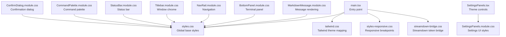
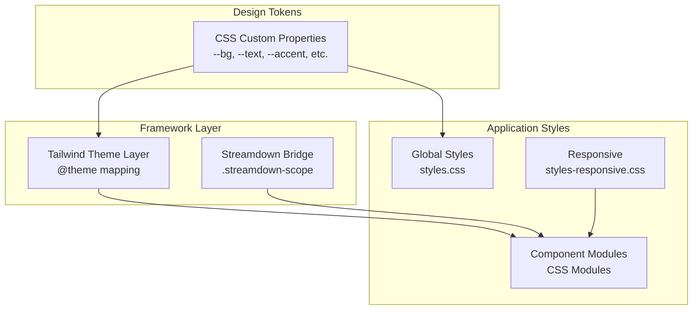
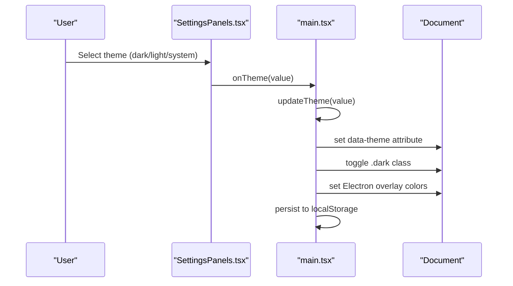
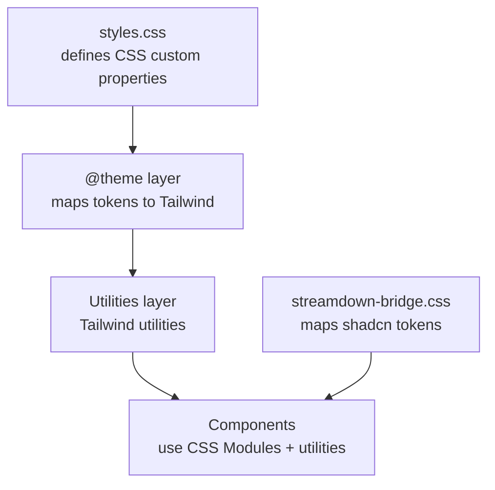
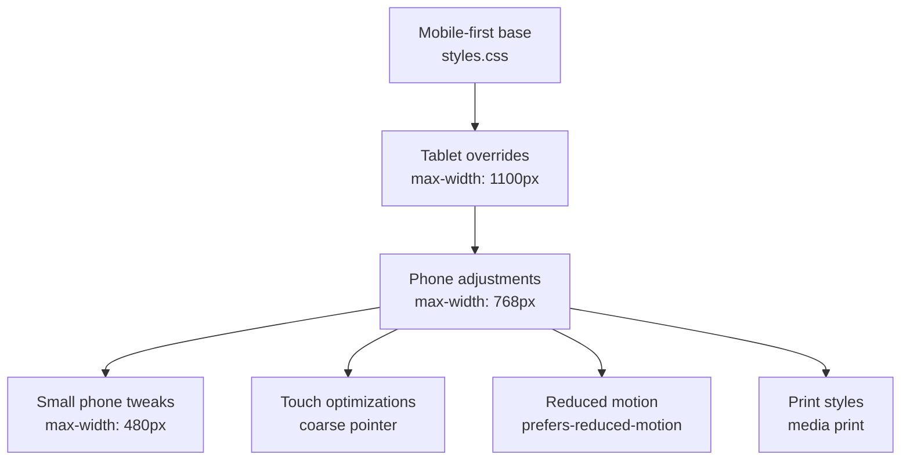
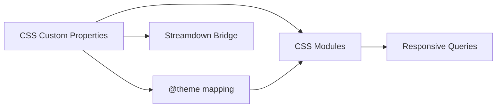

# Styling and Theming

<cite>
**Referenced Files in This Document**
- [main.tsx](file://src/client/src/main.tsx)
- [styles.css](file://src/client/styles.css)
- [tailwind.css](file://src/client/tailwind.css)
- [styles-responsive.css](file://src/client/styles-responsive.css)
- [SettingsPanels.tsx](file://src/client/src/components/settings/SettingsPanels.tsx)
- [SettingsPanels.module.css](file://src/client/src/components/settings/SettingsPanels.module.css)
- [MarkdownMessage.module.css](file://src/client/src/components/markdown/MarkdownMessage.module.css)
- [BottomPanel.module.css](file://src/client/src/components/chrome/BottomPanel.module.css)
- [NavRail.module.css](file://src/client/src/components/chrome/NavRail.module.css)
- [Titlebar.module.css](file://src/client/src/components/chrome/Titlebar.module.css)
- [StatusBar.module.css](file://src/client/src/components/chrome/StatusBar.module.css)
- [CommandPalette.module.css](file://src/client/src/components/command/CommandPalette.module.css)
- [ConfirmDialog.module.css](file://src/client/src/components/common/ConfirmDialog.module.css)
- [streamdown-bridge.css](file://src/client/streamdown-bridge.css)
</cite>

## Table of Contents
1. [Introduction](#introduction)
2. [Project Structure](#project-structure)
3. [Core Components](#core-components)
4. [Architecture Overview](#architecture-overview)
5. [Detailed Component Analysis](#detailed-component-analysis)
6. [Dependency Analysis](#dependency-analysis)
7. [Performance Considerations](#performance-considerations)
8. [Troubleshooting Guide](#troubleshooting-guide)
9. [Conclusion](#conclusion)

## Introduction
This document explains the styling architecture and theming system of the quake-web application. It covers Tailwind CSS integration, the utility-first approach, and the organization of custom CSS. It documents the theme system supporting dark, light, and system themes, CSS custom properties, and dynamic theme switching. It also describes responsive design patterns, breakpoint management, and a mobile-first approach. Component styling strategies, CSS Modules usage, and global style organization are included. Accessibility considerations such as color contrast and reduced motion support are addressed, along with performance optimization techniques for CSS delivery and rendering.

## Project Structure
The styling system is organized around three pillars:
- Global base styles and layout tokens in a central stylesheet
- Tailwind CSS integration via a layered theme mapping
- Component-specific styles using CSS Modules

**Diagram sources**
- [main.tsx:48-52](file://src/client/src/main.tsx#L48-L52)
- [styles.css:225-240](file://src/client/styles.css#L225-L240)
- [tailwind.css:12-16](file://src/client/tailwind.css#L12-L16)
- [styles-responsive.css:10-134](file://src/client/styles-responsive.css#L10-L134)
- [streamdown-bridge.css:7-20](file://src/client/streamdown-bridge.css#L7-L20)

**Section sources**
- [main.tsx:48-52](file://src/client/src/main.tsx#L48-L52)
- [styles.css:225-240](file://src/client/styles.css#L225-L240)
- [tailwind.css:12-16](file://src/client/tailwind.css#L12-L16)
- [styles-responsive.css:10-134](file://src/client/styles-responsive.css#L10-L134)
- [streamdown-bridge.css:7-20](file://src/client/streamdown-bridge.css#L7-L20)

## Core Components
- Theme system: resolves user preference (dark/light/system) and applies CSS custom properties and DOM attributes
- Tailwind integration: maps design tokens to Tailwind's color namespace while preserving existing styles
- Responsive design: mobile-first breakpoints with targeted overrides for tablets and phones
- Component styling: CSS Modules scoped per component with global layout tokens

Key implementation highlights:
- Theme resolution and persistence in the application entry
- CSS custom properties as the single source of truth for design tokens
- Tailwind theme layering and token bridging
- Streamdown token mapping for compatibility with markdown rendering

**Section sources**
- [main.tsx:204-210](file://src/client/src/main.tsx#L204-L210)
- [main.tsx:549-556](file://src/client/src/main.tsx#L549-L556)
- [main.tsx:787-791](file://src/client/src/main.tsx#L787-L791)
- [styles.css:225-240](file://src/client/styles.css#L225-L240)
- [tailwind.css:17-76](file://src/client/tailwind.css#L17-L76)
- [streamdown-bridge.css:7-20](file://src/client/streamdown-bridge.css#L7-L20)

## Architecture Overview
The styling architecture combines a utility-first framework with a custom design system:
- Global tokens are defined as CSS custom properties and consumed throughout the app
- Tailwind is integrated via theme layering, mapping tokens to Tailwind's color namespace
- Component styles are encapsulated with CSS Modules to prevent conflicts
- Responsive behavior is handled through media queries with a mobile-first approach

**Diagram sources**
- [styles.css:225-240](file://src/client/styles.css#L225-L240)
- [tailwind.css:17-76](file://src/client/tailwind.css#L17-L76)
- [streamdown-bridge.css:7-20](file://src/client/streamdown-bridge.css#L7-L20)
- [styles-responsive.css:10-134](file://src/client/styles-responsive.css#L10-L134)

## Detailed Component Analysis

### Theme System and Dynamic Switching
The theme system supports:
- User-selectable themes: dark, light, system
- Automatic detection of OS preference
- Persistence via local storage
- Runtime updates applied to the document element and Electron overlay

**Diagram sources**
- [SettingsPanels.tsx:252-259](file://src/client/src/components/settings/SettingsPanels.tsx#L252-L259)
- [SettingsPanels.tsx:226-293](file://src/client/src/components/settings/SettingsPanels.tsx#L226-L293)
- [main.tsx:204-210](file://src/client/src/main.tsx#L204-L210)
- [main.tsx:549-556](file://src/client/src/main.tsx#L549-L556)
- [main.tsx:787-791](file://src/client/src/main.tsx#L787-L791)

Implementation notes:
- Theme selection is persisted and restored on load
- The resolved theme is applied to the document element via a data attribute and a class for downstream selectors
- Electron overlay colors are synchronized with the active theme

**Section sources**
- [SettingsPanels.tsx:226-293](file://src/client/src/components/settings/SettingsPanels.tsx#L226-L293)
- [main.tsx:204-210](file://src/client/src/main.tsx#L204-L210)
- [main.tsx:549-556](file://src/client/src/main.tsx#L549-L556)
- [main.tsx:787-791](file://src/client/src/main.tsx#L787-L791)

### Tailwind CSS Integration and Utility-First Approach
Tailwind is integrated in a layered manner:
- Theme layer defines color tokens mapped to CSS custom properties
- Utilities layer provides utility classes without conflicting with existing base styles
- Streamdown utilities are supported by hoisting source references

**Diagram sources**
- [tailwind.css:12-16](file://src/client/tailwind.css#L12-L16)
- [tailwind.css:17-76](file://src/client/tailwind.css#L17-L76)
- [streamdown-bridge.css:7-20](file://src/client/streamdown-bridge.css#L7-L20)

Key points:
- Tailwind's preflight reset is intentionally omitted to avoid overriding existing styles
- Token mapping ensures utilities reflect the active theme automatically
- Streamdown utilities are supported by hoisted source references

**Section sources**
- [tailwind.css:12-16](file://src/client/tailwind.css#L12-L16)
- [tailwind.css:17-76](file://src/client/tailwind.css#L17-L76)
- [streamdown-bridge.css:7-20](file://src/client/streamdown-bridge.css#L7-L20)

### Responsive Design Patterns and Breakpoints
The responsive strategy follows a mobile-first approach:
- Base styles assume mobile screens
- Media queries progressively enhance layout for larger screens
- Specialized overrides for tablet and phone sizes
- Touch-friendly adjustments and reduced motion support

**Diagram sources**
- [styles-responsive.css:10-134](file://src/client/styles-responsive.css#L10-L134)
- [styles-responsive.css:136-157](file://src/client/styles-responsive.css#L136-L157)
- [styles-responsive.css:159-182](file://src/client/styles-responsive.css#L159-L182)
- [styles-responsive.css:184-193](file://src/client/styles-responsive.css#L184-L193)
- [styles-responsive.css:195-213](file://src/client/styles-responsive.css#L195-L213)

**Section sources**
- [styles-responsive.css:10-134](file://src/client/styles-responsive.css#L10-L134)
- [styles-responsive.css:136-157](file://src/client/styles-responsive.css#L136-L157)
- [styles-responsive.css:159-182](file://src/client/styles-responsive.css#L159-L182)
- [styles-responsive.css:184-193](file://src/client/styles-responsive.css#L184-L193)
- [styles-responsive.css:195-213](file://src/client/styles-responsive.css#L195-L213)

### Component Styling Strategies and CSS Modules
Each component encapsulates its styles using CSS Modules:
- Component-specific selectors avoid global conflicts
- Shared tokens are referenced from global CSS custom properties
- Layout and typography rely on global base styles

Examples of component module usage:
- Bottom panel, navigation rail, titlebar, status bar, command palette, confirm dialog, and markdown rendering each define scoped styles

**Section sources**
- [BottomPanel.module.css:1-116](file://src/client/src/components/chrome/BottomPanel.module.css#L1-L116)
- [NavRail.module.css:1-256](file://src/client/src/components/chrome/NavRail.module.css#L1-L256)
- [Titlebar.module.css:1-168](file://src/client/src/components/chrome/Titlebar.module.css#L1-L168)
- [StatusBar.module.css:1-32](file://src/client/src/components/chrome/StatusBar.module.css#L1-L32)
- [CommandPalette.module.css:1-126](file://src/client/src/components/command/CommandPalette.module.css#L1-L126)
- [ConfirmDialog.module.css:1-115](file://src/client/src/components/common/ConfirmDialog.module.css#L1-L115)
- [MarkdownMessage.module.css:1-664](file://src/client/src/components/markdown/MarkdownMessage.module.css#L1-L664)

### Accessibility Considerations
Accessibility features implemented:
- Reduced motion support: animations and shimmer effects are disabled or simplified under reduced motion preferences
- Color contrast: tokens are designed to maintain sufficient contrast across themes
- Focus and interaction states: hover and focus styles are defined consistently across components

Evidence in code:
- Reduced motion handling in markdown component styles
- Explicit focus and hover states in component modules
- Token-driven color system ensuring consistent contrast

**Section sources**
- [MarkdownMessage.module.css:646-663](file://src/client/src/components/markdown/MarkdownMessage.module.css#L646-L663)
- [BottomPanel.module.css:24-26](file://src/client/src/components/chrome/BottomPanel.module.css#L24-L26)
- [NavRail.module.css:52-57](file://src/client/src/components/chrome/NavRail.module.css#L52-L57)
- [CommandPalette.module.css:100-105](file://src/client/src/components/command/CommandPalette.module.css#L100-L105)

### Streamdown Integration and Token Bridge
Streamdown renders markdown with its own semantic tokens. A bridge maps Streamdown tokens to the application's design tokens:
- Scoped to a dedicated container to avoid global token clobbering
- Typography and code block styling adapted to match the app's type scale
- Table and inline code styling aligned with global tokens

**Section sources**
- [streamdown-bridge.css:7-20](file://src/client/streamdown-bridge.css#L7-L20)
- [streamdown-bridge.css:22-49](file://src/client/streamdown-bridge.css#L22-L49)
- [streamdown-bridge.css:187-261](file://src/client/streamdown-bridge.css#L187-L261)

## Dependency Analysis
The styling system exhibits low coupling and high cohesion:
- Global tokens are the single source of truth
- Tailwind consumes tokens via theme mapping
- Components depend on global tokens and Tailwind utilities
- Streamdown bridge depends on global tokens for consistent rendering

**Diagram sources**
- [styles.css:225-240](file://src/client/styles.css#L225-L240)
- [tailwind.css:17-76](file://src/client/tailwind.css#L17-L76)
- [streamdown-bridge.css:7-20](file://src/client/streamdown-bridge.css#L7-L20)
- [styles-responsive.css:10-134](file://src/client/styles-responsive.css#L10-L134)

**Section sources**
- [styles.css:225-240](file://src/client/styles.css#L225-L240)
- [tailwind.css:17-76](file://src/client/tailwind.css#L17-L76)
- [streamdown-bridge.css:7-20](file://src/client/streamdown-bridge.css#L7-L20)
- [styles-responsive.css:10-134](file://src/client/styles-responsive.css#L10-L134)

## Performance Considerations
- CSS custom properties enable efficient theme switching without recalculation of derived values
- Tailwind utilities are generated from a controlled subset of tokens, minimizing bundle size
- Streamdown utilities are hoisted to avoid scanning the entire node_modules tree
- Component-scoped CSS Modules reduce specificity wars and improve cacheability
- Media queries are selective and scoped to actual breakpoints used in the UI

[No sources needed since this section provides general guidance]

## Troubleshooting Guide
Common issues and resolutions:
- Theme not applying: verify the data-theme attribute and .dark class are set on the document element
- Tailwind utilities missing: ensure the theme layer is loaded and tokens are defined
- Streamdown rendering mismatch: check the .streamdown-scope container and token mapping
- Responsive layout glitches: review media queries and ensure mobile-first assumptions hold

**Section sources**
- [main.tsx:549-556](file://src/client/src/main.tsx#L549-L556)
- [tailwind.css:12-16](file://src/client/tailwind.css#L12-L16)
- [streamdown-bridge.css:7-20](file://src/client/streamdown-bridge.css#L7-L20)
- [styles-responsive.css:10-134](file://src/client/styles-responsive.css#L10-L134)

## Conclusion
The styling architecture balances a utility-first approach with a cohesive design system. CSS custom properties serve as the single source of truth, Tailwind integrates seamlessly via theme mapping, and CSS Modules provide encapsulation. The theme system is robust, responsive patterns follow a mobile-first strategy, and accessibility is considered through reduced motion and contrast. Streamdown integration ensures consistent rendering across markdown components. These choices deliver a maintainable, performant, and accessible styling foundation.
