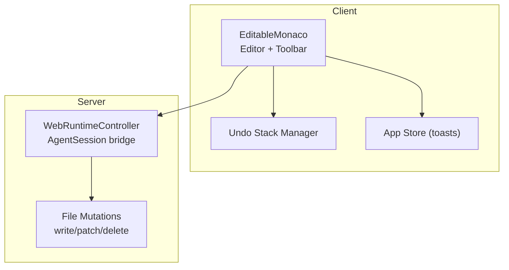
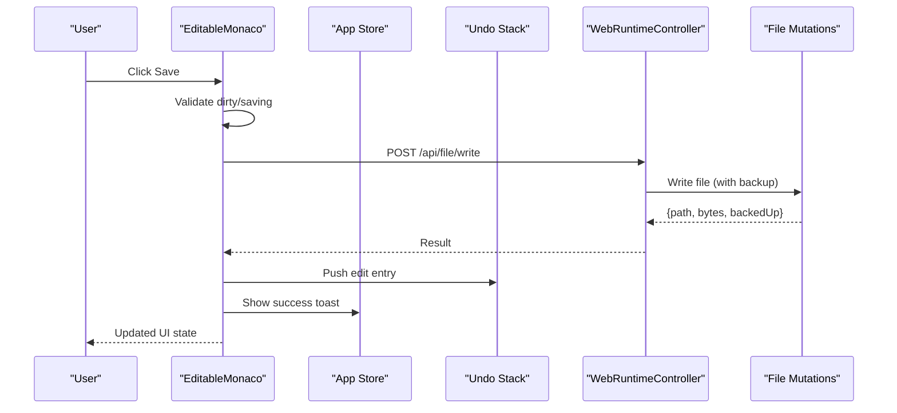
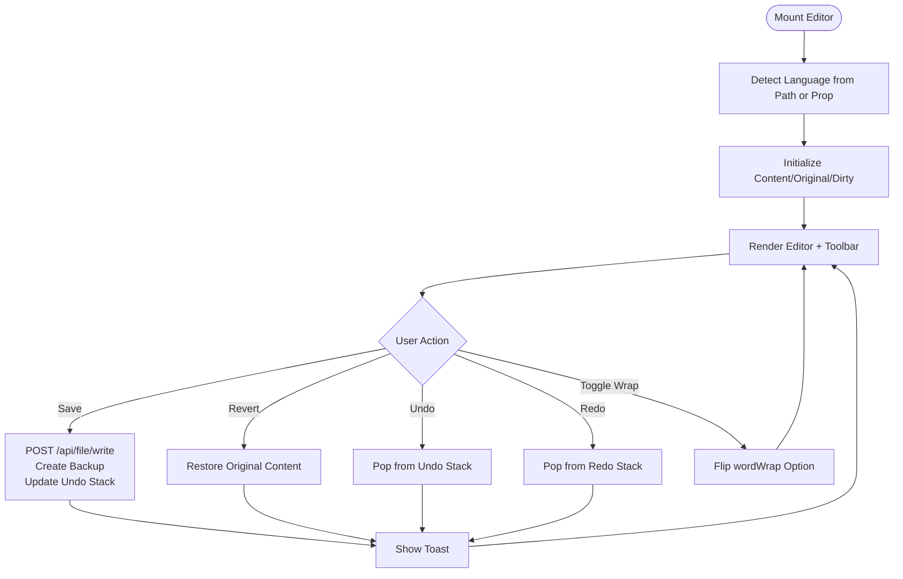
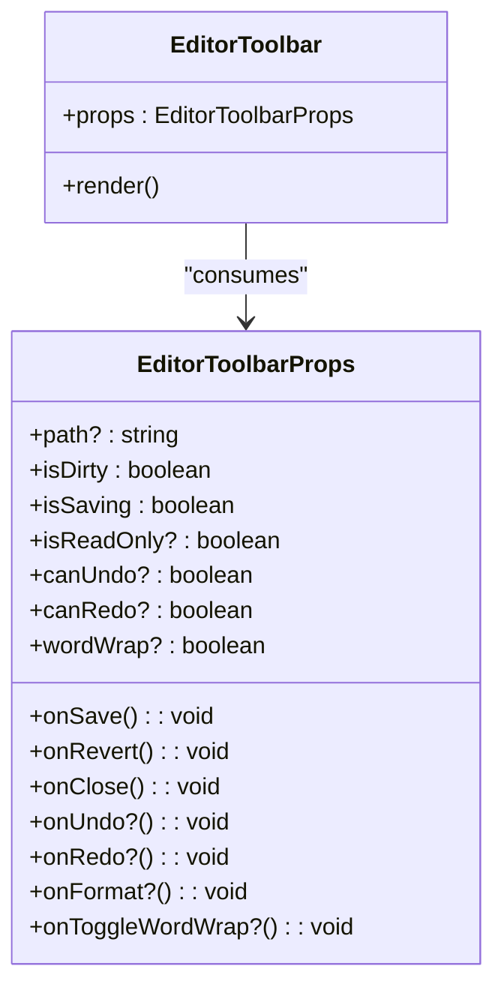
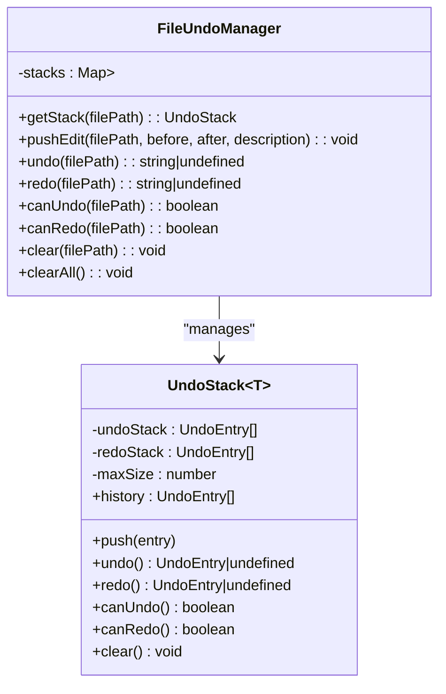
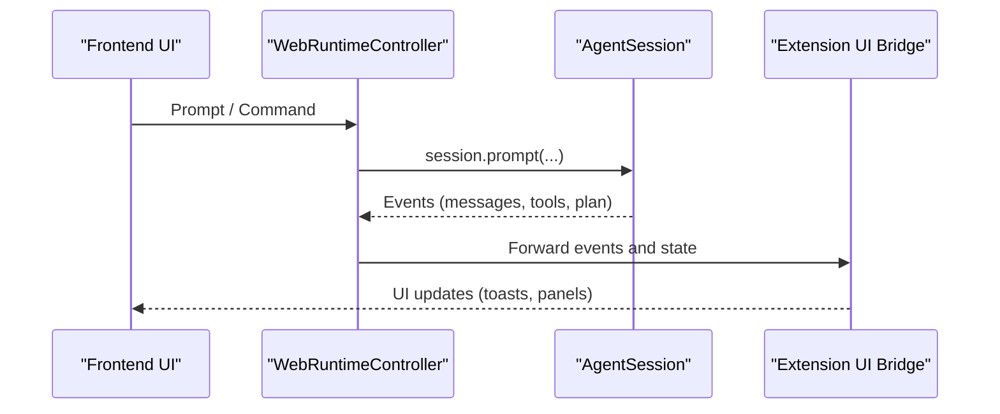
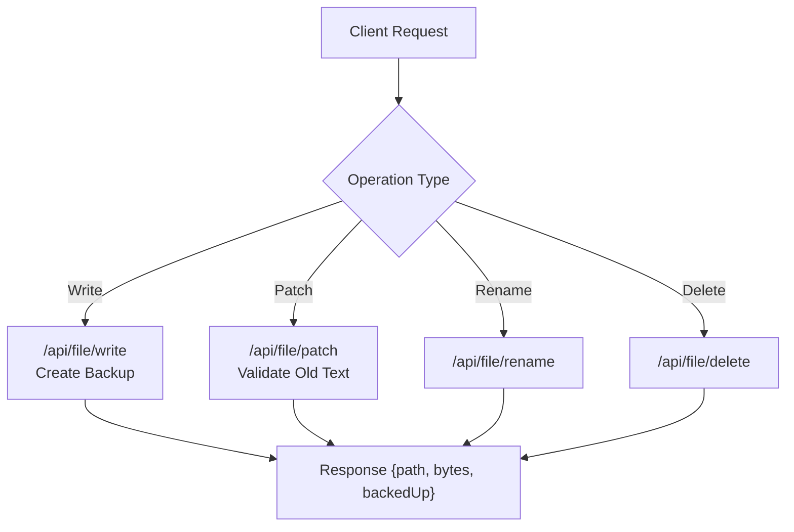
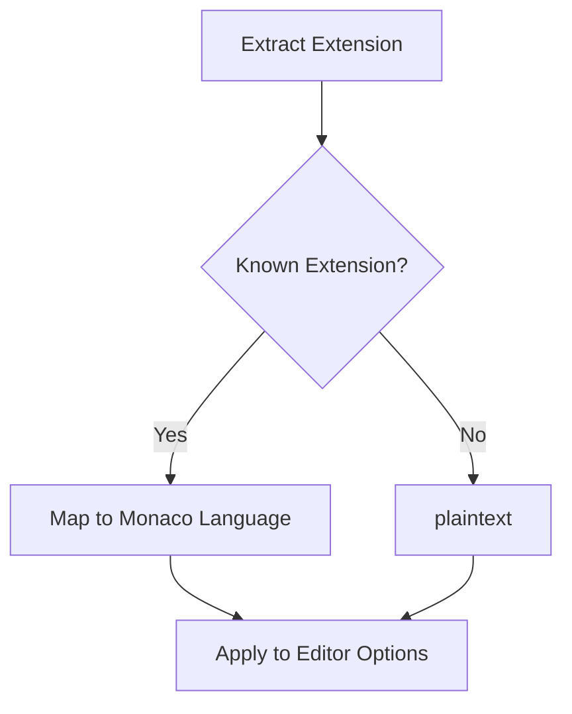
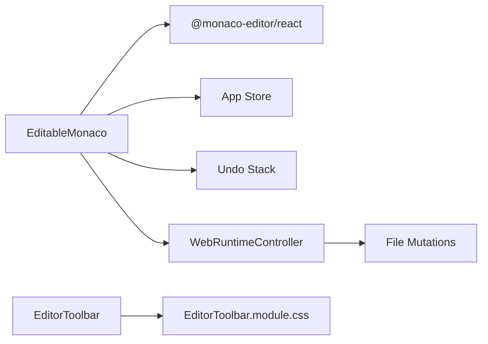

# Code Editor Integration

<cite>
**Referenced Files in This Document**
- [EditableMonaco.tsx](file://src/client/src/components/editor/EditableMonaco.tsx)
- [EditorToolbar.tsx](file://src/client/src/components/editor/EditorToolbar.tsx)
- [EditorToolbar.module.css](file://src/client/src/components/editor/EditorToolbar.module.css)
- [index.ts](file://src/client/src/components/editor/index.ts)
- [undo-stack.ts](file://src/client/src/lib/undo-stack.ts)
- [app-store.ts](file://src/client/src/state/app-store.ts)
- [runtime.ts](file://src/server/runtime.ts)
- [file-mutations.ts](file://src/server/file-mutations.ts)
- [keyboard-shortcuts.md](file://docs/keyboard-shortcuts.md)
- [styles.css](file://src/client/src/styles.css)
- [main.tsx](file://src/client/src/main.tsx)
</cite>

## Table of Contents
1. [Introduction](#introduction)
2. [Project Structure](#project-structure)
3. [Core Components](#core-components)
4. [Architecture Overview](#architecture-overview)
5. [Detailed Component Analysis](#detailed-component-analysis)
6. [Dependency Analysis](#dependency-analysis)
7. [Performance Considerations](#performance-considerations)
8. [Troubleshooting Guide](#troubleshooting-guide)
9. [Conclusion](#conclusion)

## Introduction
This document explains the Monaco Editor integration and code editing capabilities in the project. It covers the EditableMonaco component, syntax highlighting configuration, collaborative editing features, editor toolbar functionality, AI-assisted editing via AgentSession runtime, keyboard shortcuts, accessibility, customization, and performance considerations for large files.

## Project Structure
The editor integration centers around a React component that wraps @monaco-editor/react, integrates with a local undo stack, and communicates with the backend for file operations. The toolbar provides actions for saving, reverting, undo/redo, formatting, and toggling word wrap. The server-side runtime bridges the frontend to the AgentSession for AI-assisted editing.

**Diagram sources**
- [EditableMonaco.tsx:17-151](file://src/client/src/components/editor/EditableMonaco.tsx#L17-L151)
- [undo-stack.ts:60-99](file://src/client/src/lib/undo-stack.ts#L60-L99)
- [app-store.ts:186-252](file://src/client/src/state/app-store.ts#L186-L252)
- [runtime.ts:12-456](file://src/server/runtime.ts#L12-L456)
- [file-mutations.ts:36-98](file://src/server/file-mutations.ts#L36-L98)

**Section sources**
- [EditableMonaco.tsx:17-151](file://src/client/src/components/editor/EditableMonaco.tsx#L17-L151)
- [EditorToolbar.tsx:21-64](file://src/client/src/components/editor/EditorToolbar.tsx#L21-L64)
- [index.ts:1-5](file://src/client/src/components/editor/index.ts#L1-L5)

## Core Components
- EditableMonaco: A wrapper around Monaco Editor providing file-aware editing, language detection, save/revert/undo/redo, and word wrap toggle. It integrates with the undo stack and backend write API.
- EditorToolbar: A toolbar offering file metadata, dirty indicator, read-only badge, word wrap toggle, optional format button, undo/redo, revert, save, and close actions.
- Undo Stack Manager: A per-file undo/redo system with bounded history and entry metadata.
- App Store: Centralized toast notifications for user feedback during save/revert operations.
- WebRuntimeController: Bridges the frontend to AgentSession runtime for AI-assisted editing and tool orchestration.
- File Mutations: Server-side handlers for writing, patching, renaming, deleting, and backup creation.

**Section sources**
- [EditableMonaco.tsx:8-15](file://src/client/src/components/editor/EditableMonaco.tsx#L8-L15)
- [EditorToolbar.tsx:4-19](file://src/client/src/components/editor/EditorToolbar.tsx#L4-L19)
- [undo-stack.ts:1-99](file://src/client/src/lib/undo-stack.ts#L1-L99)
- [app-store.ts:25-58](file://src/client/src/state/app-store.ts#L25-L58)
- [runtime.ts:12-456](file://src/server/runtime.ts#L12-L456)
- [file-mutations.ts:36-98](file://src/server/file-mutations.ts#L36-L98)

## Architecture Overview
The editor pipeline connects UI actions to server-side file mutations and AgentSession runtime for AI assistance.

**Diagram sources**
- [EditableMonaco.tsx:64-85](file://src/client/src/components/editor/EditableMonaco.tsx#L64-L85)
- [runtime.ts:12-456](file://src/server/runtime.ts#L12-L456)
- [file-mutations.ts:36-98](file://src/server/file-mutations.ts#L36-L98)
- [app-store.ts:241-250](file://src/client/src/state/app-store.ts#L241-L250)
- [undo-stack.ts:70-72](file://src/client/src/lib/undo-stack.ts#L70-L72)

## Detailed Component Analysis

### EditableMonaco Component
- Responsibilities:
  - Mounts Monaco Editor with theme, language, and options.
  - Detects language from file extension or prop.
  - Manages content state, dirty flag, and read-only mode.
  - Integrates save, revert, undo, redo, and word wrap toggle.
  - Registers a custom save action bound to Ctrl+S.
- Key behaviors:
  - Language detection maps common extensions to Monaco languages.
  - Save writes content via API, creates backup, updates undo stack, and notifies via toast.
  - Revert restores original content and clears dirty state.
  - Undo/Redo manipulate the per-file undo stack and update toolbar availability.
  - Word wrap toggle switches editor option and persists UI preference.

**Diagram sources**
- [EditableMonaco.tsx:29-40](file://src/client/src/components/editor/EditableMonaco.tsx#L29-L40)
- [EditableMonaco.tsx:42-52](file://src/client/src/components/editor/EditableMonaco.tsx#L42-L52)
- [EditableMonaco.tsx:54-62](file://src/client/src/components/editor/EditableMonaco.tsx#L54-L62)
- [EditableMonaco.tsx:64-85](file://src/client/src/components/editor/EditableMonaco.tsx#L64-L85)
- [EditableMonaco.tsx:87-109](file://src/client/src/components/editor/EditableMonaco.tsx#L87-L109)
- [undo-stack.ts:60-99](file://src/client/src/lib/undo-stack.ts#L60-L99)
- [app-store.ts:241-250](file://src/client/src/state/app-store.ts#L241-L250)

**Section sources**
- [EditableMonaco.tsx:17-151](file://src/client/src/components/editor/EditableMonaco.tsx#L17-L151)
- [undo-stack.ts:60-99](file://src/client/src/lib/undo-stack.ts#L60-L99)
- [app-store.ts:241-250](file://src/client/src/state/app-store.ts#L241-L250)

### EditorToolbar Component
- Displays file name/path, dirty dot, and read-only badge.
- Provides buttons for word wrap toggle, format placeholder, undo, redo, revert, save, and close.
- Uses CSS module for consistent styling and hover/disabled states.

**Diagram sources**
- [EditorToolbar.tsx:4-19](file://src/client/src/components/editor/EditorToolbar.tsx#L4-L19)

**Section sources**
- [EditorToolbar.tsx:21-64](file://src/client/src/components/editor/EditorToolbar.tsx#L21-L64)
- [EditorToolbar.module.css:1-75](file://src/client/src/components/editor/EditorToolbar.module.css#L1-L75)

### Undo Stack Manager
- Maintains per-file undo/redo stacks with bounded capacity.
- Exposes push, undo, redo, canUndo, canRedo, and clear operations.
- Used by EditableMonaco to reflect availability and update content.

**Diagram sources**
- [undo-stack.ts:9-58](file://src/client/src/lib/undo-stack.ts#L9-L58)
- [undo-stack.ts:60-99](file://src/client/src/lib/undo-stack.ts#L60-L99)

**Section sources**
- [undo-stack.ts:1-99](file://src/client/src/lib/undo-stack.ts#L1-L99)

### AgentSession Runtime Integration
- WebRuntimeController binds the AgentSession runtime and forwards events to the UI.
- Provides session lifecycle operations (new, fork, switch, reload) and emits state updates.
- Integrates with extension UI bridge for plan/clarification workflows and tool execution contexts.

**Diagram sources**
- [runtime.ts:12-456](file://src/server/runtime.ts#L12-L456)

**Section sources**
- [runtime.ts:12-456](file://src/server/runtime.ts#L12-L456)

### File Operations and Collaborative Editing
- Backend supports write, patch, rename, delete, and backup creation.
- Patch operations validate presence of old text and apply replacements atomically.
- Collaborative editing is not explicitly implemented in the examined code; however, the architecture supports building collaborative features on top of the existing file mutation APIs and AgentSession runtime.

**Diagram sources**
- [file-mutations.ts:36-98](file://src/server/file-mutations.ts#L36-L98)

**Section sources**
- [file-mutations.ts:36-98](file://src/server/file-mutations.ts#L36-L98)

### Syntax Highlighting Configuration
- Language detection maps file extensions to Monaco language identifiers.
- Editor options enable bracket pair colorization, whitespace rendering, and padding.

**Diagram sources**
- [EditableMonaco.tsx:29-40](file://src/client/src/components/editor/EditableMonaco.tsx#L29-L40)
- [EditableMonaco.tsx:135-146](file://src/client/src/components/editor/EditableMonaco.tsx#L135-L146)

**Section sources**
- [EditableMonaco.tsx:29-40](file://src/client/src/components/editor/EditableMonaco.tsx#L29-L40)
- [EditableMonaco.tsx:135-146](file://src/client/src/components/editor/EditableMonaco.tsx#L135-L146)

### Editor Toolbar Functionality
- Formatting options: Placeholder for format action; intended to be wired to a formatter in future iterations.
- Language detection: Derived from file path; can be overridden by passing language prop.
- File operations: Save, revert, undo, redo, close; integrated with backend and undo stack.

**Section sources**
- [EditorToolbar.tsx:37-41](file://src/client/src/components/editor/EditorToolbar.tsx#L37-L41)
- [EditableMonaco.tsx:29-40](file://src/client/src/components/editor/EditableMonaco.tsx#L29-L40)
- [EditableMonaco.tsx:64-109](file://src/client/src/components/editor/EditableMonaco.tsx#L64-L109)

### Accessibility and Customization
- Editor options include smooth scrolling, cursor animations, and padding for readability.
- Theme is set to a dark variant suitable for code editing.
- CSS classes define toolbar styling and responsive behavior.

**Section sources**
- [EditableMonaco.tsx:135-146](file://src/client/src/components/editor/EditableMonaco.tsx#L135-L146)
- [EditorToolbar.module.css:1-75](file://src/client/src/components/editor/EditorToolbar.module.css#L1-L75)
- [styles.css:447-449](file://src/client/src/styles.css#L447-L449)

### Keyboard Shortcuts
- Global shortcuts include toggling sidebars, opening command palette, and terminal drawer.
- The editor registers a Ctrl+S action internally; global shortcuts are documented separately.

**Section sources**
- [keyboard-shortcuts.md:1-37](file://docs/keyboard-shortcuts.md#L1-L37)
- [EditableMonaco.tsx:56-62](file://src/client/src/components/editor/EditableMonaco.tsx#L56-L62)

## Dependency Analysis
- EditableMonaco depends on:
  - @monaco-editor/react for the editor instance.
  - App Store for toast notifications.
  - Undo Stack Manager for edit history.
  - Server runtime for file write operations.
- EditorToolbar depends on CSS module for styling and receives callbacks from parent.
- Undo Stack Manager is a standalone utility used by EditableMonaco.
- WebRuntimeController orchestrates AgentSession and forwards events to UI.

**Diagram sources**
- [EditableMonaco.tsx:1-6](file://src/client/src/components/editor/EditableMonaco.tsx#L1-L6)
- [EditorToolbar.tsx:1-2](file://src/client/src/components/editor/EditorToolbar.tsx#L1-L2)
- [undo-stack.ts:60-99](file://src/client/src/lib/undo-stack.ts#L60-L99)
- [runtime.ts:12-456](file://src/server/runtime.ts#L12-L456)
- [file-mutations.ts:36-98](file://src/server/file-mutations.ts#L36-L98)

**Section sources**
- [index.ts:1-5](file://src/client/src/components/editor/index.ts#L1-L5)

## Performance Considerations
- Large files:
  - Server enforces a maximum file size for patch operations to prevent excessive memory usage.
  - Consider lazy-loading editor content for very large files or splitting editing sessions.
- Memory management:
  - Undo stack has a bounded capacity; older entries are evicted to control memory growth.
  - Tool output is compacted to limit DOM/text rendering overhead.
- Editor state synchronization:
  - Use controlled value updates and debounced saves to avoid frequent backend writes.
  - Track dirty state to minimize unnecessary save attempts.

**Section sources**
- [file-mutations.ts:80-81](file://src/server/file-mutations.ts#L80-L81)
- [undo-stack.ts:14-27](file://src/client/src/lib/undo-stack.ts#L14-L27)
- [app-store.ts:172-184](file://src/client/src/state/app-store.ts#L172-L184)

## Troubleshooting Guide
- Save fails:
  - Verify network connectivity and backend endpoint availability.
  - Check toast messages for error details.
  - Ensure the file is not locked or read-only.
- Undo/Redo unavailable:
  - Confirm that edits were pushed to the undo stack and that the file path matches.
- Formatting not available:
  - The format action is a placeholder; wire a formatter implementation to the toolbar's onFormat callback.
- Collaborative editing:
  - Not present in current implementation; integrate real-time collaboration libraries or build atop the existing file mutation APIs.

**Section sources**
- [EditableMonaco.tsx:80-84](file://src/client/src/components/editor/EditableMonaco.tsx#L80-L84)
- [undo-stack.ts:70-88](file://src/client/src/lib/undo-stack.ts#L70-L88)
- [EditorToolbar.tsx:37-41](file://src/client/src/components/editor/EditorToolbar.tsx#L37-L41)

## Conclusion
The Monaco Editor integration provides a robust foundation for code editing with language detection, save/revert/undo/redo, and a configurable toolbar. The AgentSession runtime enables AI-assisted editing workflows, while server-side file mutations support safe, backup-enabled file operations. Future enhancements can include a formatter hook, collaborative editing, and improved performance strategies for large files.
