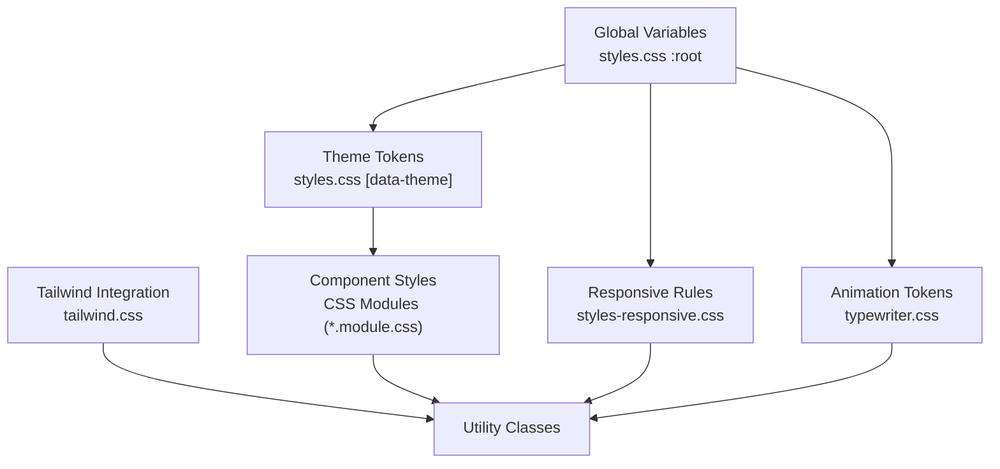
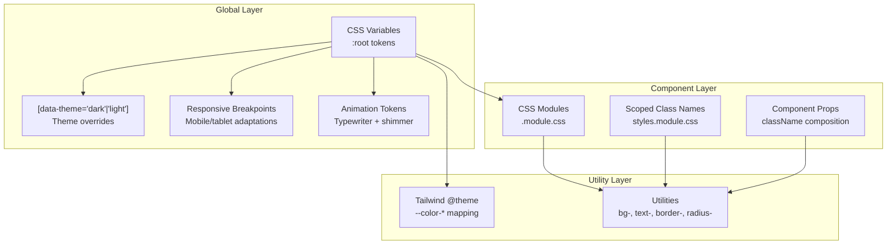
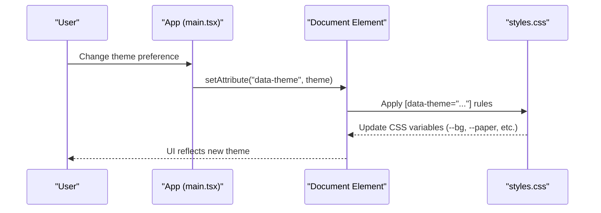
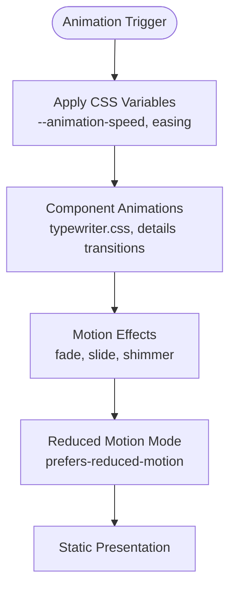
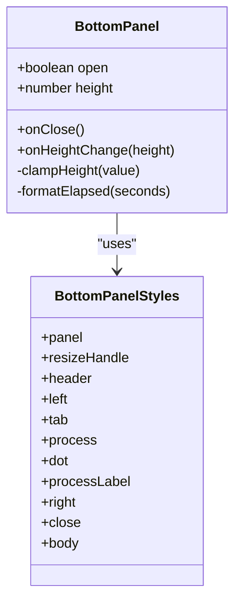
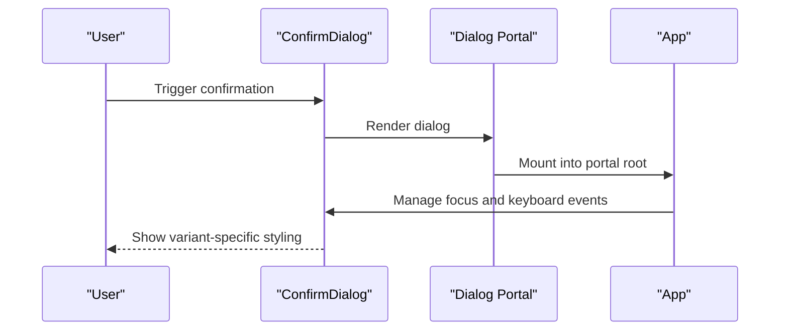
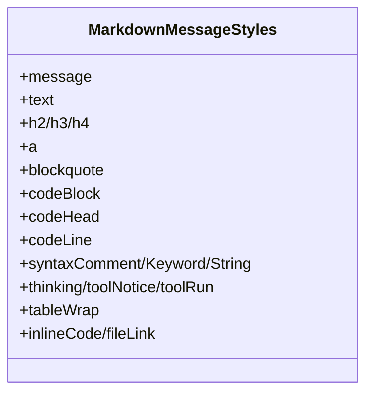
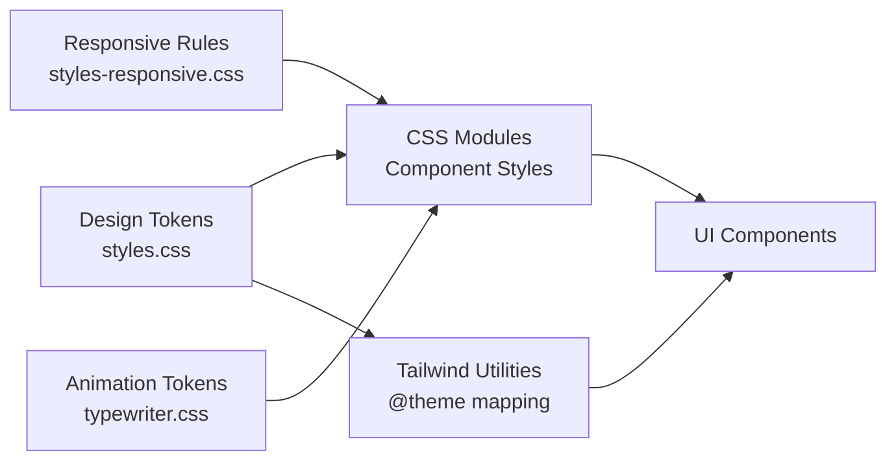

# Component Styling and Theming

<cite>
**Referenced Files in This Document**
- [main.tsx](file://src/client/src/main.tsx)
- [styles.css](file://src/client/styles.css)
- [tailwind.css](file://src/client/tailwind.css)
- [styles-responsive.css](file://src/client/styles-responsive.css)
- [typewriter.css](file://src/client/src/components/typewriter.css)
- [BottomPanel.module.css](file://src/client/src/components/chrome/BottomPanel.module.css)
- [BottomPanel.tsx](file://src/client/src/components/chrome/BottomPanel.tsx)
- [ConfirmDialog.module.css](file://src/client/src/components/common/ConfirmDialog.module.css)
- [ConfirmDialog.tsx](file://src/client/src/components/common/ConfirmDialog.tsx)
- [MarkdownMessage.module.css](file://src/client/src/components/markdown/MarkdownMessage.module.css)
- [SettingsPanels.tsx](file://src/client/src/components/settings/SettingsPanels.tsx)
- [EditorToolbar.module.css](file://src/client/src/components/editor/EditorToolbar.module.css)
- [EditorToolbar.tsx](file://src/client/src/components/editor/EditorToolbar.tsx)
</cite>

## Table of Contents
1. [Introduction](#introduction)
2. [Project Structure](#project-structure)
3. [Core Components](#core-components)
4. [Architecture Overview](#architecture-overview)
5. [Detailed Component Analysis](#detailed-component-analysis)
6. [Dependency Analysis](#dependency-analysis)
7. [Performance Considerations](#performance-considerations)
8. [Troubleshooting Guide](#troubleshooting-guide)
9. [Conclusion](#conclusion)

## Introduction
This document explains the styling architecture and design system used throughout the UI components. It covers the CSS Modules approach, Tailwind integration, theming system, color schemes, typography hierarchy, responsive design principles, animation system, and accessibility considerations. The goal is to help developers understand how styles are organized, applied, and customized consistently across the application.

## Project Structure
The styling system combines three primary layers:
- Global CSS variables and base styles
- CSS Modules scoped to individual components
- Tailwind CSS utilities integrated alongside existing styles

**Diagram sources**
- [styles.css:1860-1933](file://src/client/styles.css#L1860-L1933)
- [tailwind.css:1-82](file://src/client/tailwind.css#L1-L82)
- [styles-responsive.css:1-214](file://src/client/styles-responsive.css#L1-L214)
- [typewriter.css:1-87](file://src/client/src/components/typewriter.css#L1-L87)

**Section sources**
- [styles.css:1860-1933](file://src/client/styles.css#L1860-L1933)
- [tailwind.css:1-82](file://src/client/tailwind.css#L1-L82)
- [styles-responsive.css:1-214](file://src/client/styles-responsive.css#L1-L214)
- [typewriter.css:1-87](file://src/client/src/components/typewriter.css#L1-L87)

## Core Components
The styling architecture centers around a cohesive design token system and modular component styling:

- Design tokens: CSS variables define surfaces, text, accents, borders, semantic colors, spacing, radii, and shimmer animations.
- Theming: A single data-theme attribute switches between dark and light themes, with system preference support.
- Component scoping: CSS Modules provide local class names and predictable specificity.
- Utility integration: Tailwind utilities consume the same design tokens via @theme mapping.
- Responsive behavior: Media queries adapt layout and spacing for mobile and touch devices.
- Animation tokens: Shared easing and timing functions enable consistent motion.

Key implementation highlights:
- Token definition and light theme overrides in styles.css
- Tailwind theme mapping to CSS variables
- Component-scoped styles using CSS Modules
- Responsive breakpoints and mobile-first adaptations
- Typewriter animation tokens for streaming text

**Section sources**
- [styles.css:1860-1933](file://src/client/styles.css#L1860-L1933)
- [tailwind.css:17-76](file://src/client/tailwind.css#L17-L76)
- [styles-responsive.css:1-214](file://src/client/styles-responsive.css#L1-L214)
- [typewriter.css:1-87](file://src/client/src/components/typewriter.css#L1-L87)

## Architecture Overview
The styling architecture integrates global tokens, component scoping, and utility classes while maintaining a unified theming system.

**Diagram sources**
- [styles.css:1860-1933](file://src/client/styles.css#L1860-L1933)
- [tailwind.css:17-76](file://src/client/tailwind.css#L17-L76)
- [styles-responsive.css:1-214](file://src/client/styles-responsive.css#L1-L214)
- [typewriter.css:1-87](file://src/client/src/components/typewriter.css#L1-L87)

## Detailed Component Analysis

### Theming System and Color Schemes
The theming system uses a single data-theme attribute on the document element to switch between dark and light modes. The dark theme is the default; light theme is opt-in. System preference detection updates the resolved theme automatically.

**Diagram sources**
- [main.tsx:549-556](file://src/client/src/main.tsx#L549-L556)
- [styles.css:1903-1933](file://src/client/styles.css#L1903-L1933)

Design tokens and semantic colors are defined centrally and consumed by both component styles and Tailwind utilities. The light theme overrides only color values, preserving spacing, radii, and animation tokens.

**Section sources**
- [main.tsx:204-209](file://src/client/src/main.tsx#L204-L209)
- [main.tsx:549-556](file://src/client/src/main.tsx#L549-L556)
- [styles.css:1860-1933](file://src/client/styles.css#L1860-L1933)
- [tailwind.css:17-76](file://src/client/tailwind.css#L17-L76)

### Typography Hierarchy
Typography relies on CSS variables for font families and sizes, with density controls adjusting base font size and spacing. Headings, body text, and monospace content are styled consistently across components.

Key characteristics:
- Font families: --font-sans and --font-mono cascade from :root
- Base font size controlled via --font-size with density variants
- Heading scaling and letter-spacing for readability
- Monospace used for code blocks and technical content

**Section sources**
- [styles.css:229-240](file://src/client/styles.css#L229-L240)
- [styles.css:1871-1872](file://src/client/styles.css#L1871-L1872)

### Responsive Design Principles
Responsive behavior follows a mobile-first approach with media queries adapting layout and spacing for tablets and phones. Sidebar navigation transforms into a bottom rail on small screens, and right-side panels become modal overlays.

Highlights:
- Mobile breakpoint adjusts sidebar to bottom rail with fixed positioning
- Rightbar becomes a slide-in overlay with transform transitions
- Density controls impact padding and spacing at smaller widths
- Touch-friendly minimum sizes for interactive elements

**Section sources**
- [styles-responsive.css:13-134](file://src/client/styles-responsive.css#L13-L134)
- [styles-responsive.css:136-182](file://src/client/styles-responsive.css#L136-L182)
- [styles-responsive.css:185-193](file://src/client/styles-responsive.css#L185-L193)

### Animation System
The animation system provides consistent motion primitives for text streaming, panel transitions, and interactive feedback. Tokens define easing curves and durations, ensuring smooth and accessible animations.

**Diagram sources**
- [typewriter.css:1-87](file://src/client/src/components/typewriter.css#L1-L87)
- [MarkdownMessage.module.css:148-169](file://src/client/src/components/markdown/MarkdownMessage.module.css#L148-L169)

Animation tokens and reduced motion handling:
- Typewriter streaming uses word-level fade-ins with stable keys to avoid repeated animations
- Panel open/close transitions leverage CSS custom properties for speed control
- Reduced motion media query disables animations for accessibility compliance

**Section sources**
- [typewriter.css:14-47](file://src/client/src/components/typewriter.css#L14-L47)
- [MarkdownMessage.module.css:148-169](file://src/client/src/components/markdown/MarkdownMessage.module.css#L148-L169)

### Component-Specific Styling Patterns

#### Panels and Dock Areas
Panels use a layered surface system with borders, shadows, and consistent spacing. The bottom panel demonstrates draggable resizing with hover states and process indicators.

**Diagram sources**
- [BottomPanel.tsx:27-125](file://src/client/src/components/chrome/BottomPanel.tsx#L27-L125)
- [BottomPanel.module.css:1-116](file://src/client/src/components/chrome/BottomPanel.module.css#L1-L116)

Styling highlights:
- Surface tokens for backgrounds and borders
- Hover states with accent soft colors
- Accessible ARIA attributes and keyboard interactions
- Draggable resize handle with pointer events

**Section sources**
- [BottomPanel.tsx:27-125](file://src/client/src/components/chrome/BottomPanel.tsx#L27-L125)
- [BottomPanel.module.css:1-116](file://src/client/src/components/chrome/BottomPanel.module.css#L1-L116)

#### Dialogs and Overlays
Dialogs use backdrop filters and themed borders with variant-specific color accents. Focus management ensures keyboard accessibility and proper modal behavior.

**Diagram sources**
- [ConfirmDialog.tsx:57-79](file://src/client/src/components/common/ConfirmDialog.tsx#L57-L79)
- [ConfirmDialog.module.css:1-115](file://src/client/src/components/common/ConfirmDialog.module.css#L1-L115)

Accessibility and UX:
- Focus trapping and tab navigation within the dialog
- Escape key closes the dialog
- Disabled states for confirm actions when conditions are not met
- Variant-specific color accents for danger, warning, and info dialogs

**Section sources**
- [ConfirmDialog.tsx:15-79](file://src/client/src/components/common/ConfirmDialog.tsx#L15-L79)
- [ConfirmDialog.module.css:1-115](file://src/client/src/components/common/ConfirmDialog.module.css#L1-L115)

#### Markdown Messages and Code Blocks
Markdown rendering leverages CSS variables for consistent typography and syntax highlighting. Code blocks include line numbering and diff-aware coloring.

**Diagram sources**
- [MarkdownMessage.module.css:1-664](file://src/client/src/components/markdown/MarkdownMessage.module.css#L1-L664)

Key features:
- Semantic typography with heading scaling and letter-spacing
- Syntax highlighting with diff-aware additions/removals
- Animated details for collapsible content
- Scrollbar customization with theme-aware colors

**Section sources**
- [MarkdownMessage.module.css:1-664](file://src/client/src/components/markdown/MarkdownMessage.module.css#L1-L664)

#### Editor Toolbar
The editor toolbar demonstrates compact, theme-consistent controls with hover states and disabled states.

**Section sources**
- [EditorToolbar.module.css:1-75](file://src/client/src/components/editor/EditorToolbar.module.css#L1-L75)
- [EditorToolbar.tsx:21-64](file://src/client/src/components/editor/EditorToolbar.tsx#L21-L64)

### Settings and Form Elements
Settings panels integrate theme cards, switches, and form controls using the same design tokens. Form elements inherit consistent borders, backgrounds, and focus states.

**Section sources**
- [SettingsPanels.tsx:130-200](file://src/client/src/components/settings/SettingsPanels.tsx#L130-L200)
- [styles.css:434-473](file://src/client/styles.css#L434-L473)

## Dependency Analysis
The styling system exhibits low coupling and high cohesion:
- Global tokens drive component styles and Tailwind utilities
- CSS Modules encapsulate component-specific concerns
- Responsive rules apply uniformly across components
- Animation tokens unify motion behavior

**Diagram sources**
- [styles.css:1860-1933](file://src/client/styles.css#L1860-L1933)
- [tailwind.css:17-76](file://src/client/tailwind.css#L17-L76)
- [styles-responsive.css:1-214](file://src/client/styles-responsive.css#L1-L214)
- [typewriter.css:1-87](file://src/client/src/components/typewriter.css#L1-L87)

**Section sources**
- [styles.css:1860-1933](file://src/client/styles.css#L1860-L1933)
- [tailwind.css:17-76](file://src/client/tailwind.css#L17-L76)
- [styles-responsive.css:1-214](file://src/client/styles-responsive.css#L1-L214)
- [typewriter.css:1-87](file://src/client/src/components/typewriter.css#L1-L87)

## Performance Considerations
- CSS variables minimize redundant property declarations and enable efficient theme switching.
- Tailwind utilities are scoped to avoid scanning unused classes globally.
- Animation tokens use transform and opacity for GPU-accelerated transitions.
- Content visibility and contain-intrinsic-size optimize rendering for long lists and code blocks.
- Reduced motion media query prevents unnecessary animations for accessibility.

## Troubleshooting Guide
Common styling issues and resolutions:
- Theme not applying: Verify data-theme attribute on document element and ensure [data-theme] rules are present.
- Tailwind utilities missing: Confirm @theme mapping and that source files are included for scanning.
- Animation flicker on streaming: Ensure stable keys for newly appended words to prevent repeated animations.
- Scrollbars inconsistent: Check global scrollbar rules and theme-specific overrides.
- Focus ring visibility: Confirm focus-visible styles and ensure sufficient color contrast against themed backgrounds.

**Section sources**
- [main.tsx:549-556](file://src/client/src/main.tsx#L549-L556)
- [tailwind.css:78-82](file://src/client/tailwind.css#L78-L82)
- [typewriter.css:14-47](file://src/client/src/components/typewriter.css#L14-L47)
- [styles.css:243-259](file://src/client/styles.css#L243-L259)

## Conclusion
The styling architecture employs a robust design token system, CSS Modules for component scoping, and Tailwind utilities for rapid, consistent UI development. The theming system, responsive design, and animation tokens work together to deliver a cohesive, accessible, and performant user experience. By adhering to these patterns, developers can maintain visual consistency while extending functionality across components.
