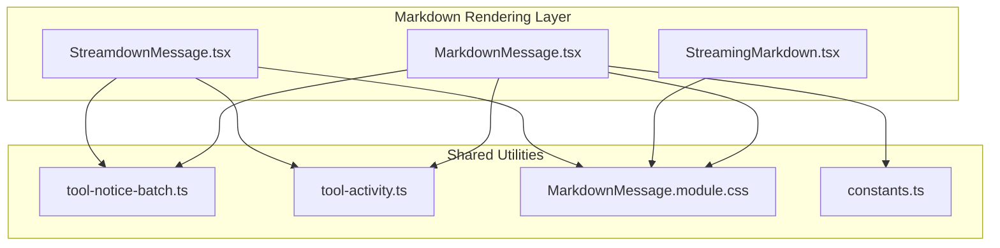
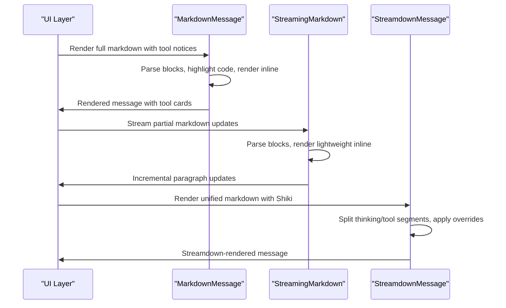
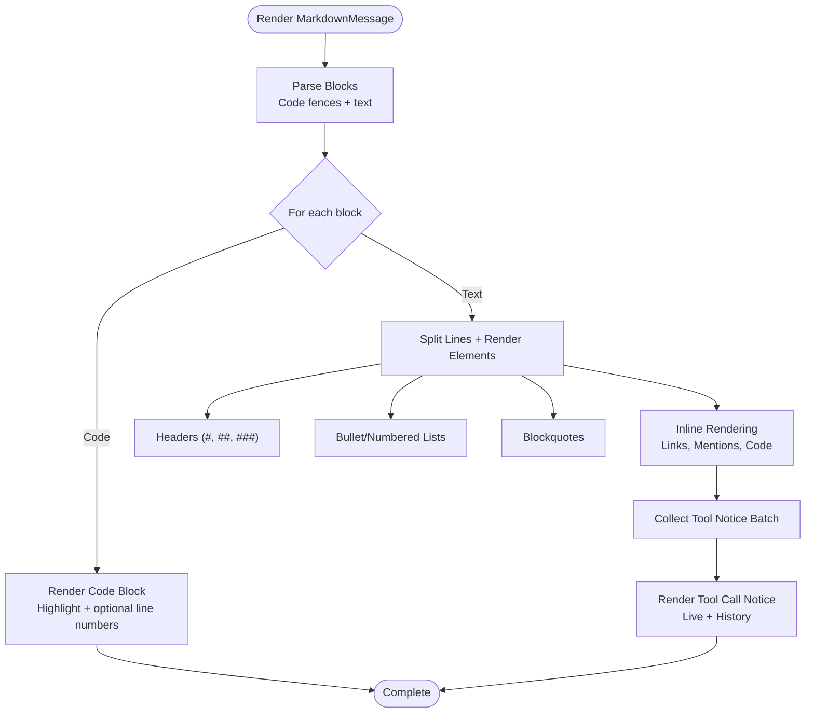
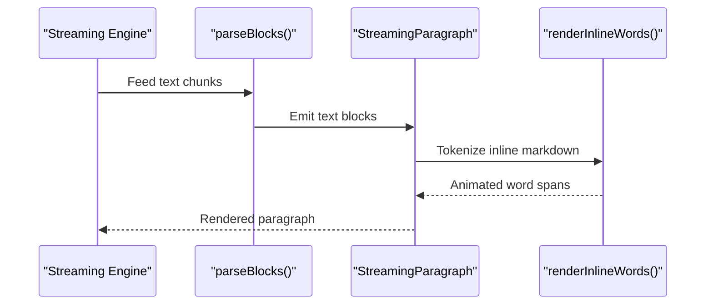
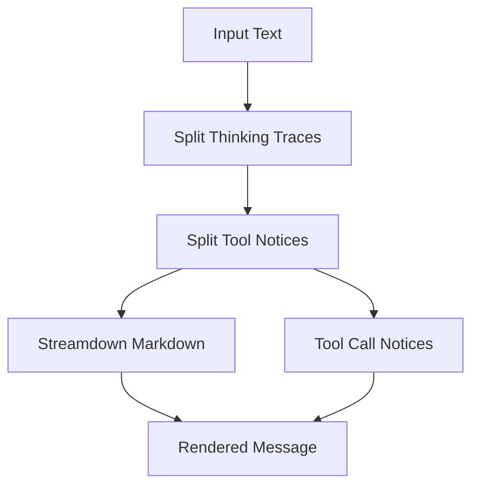
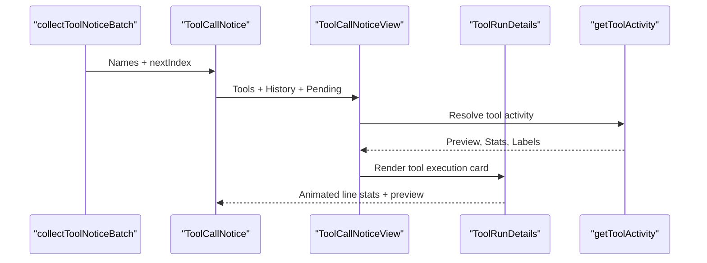
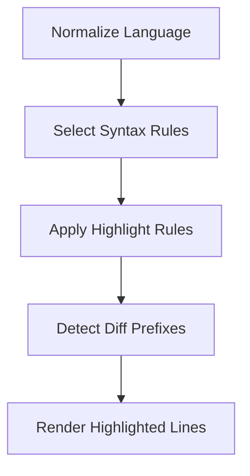
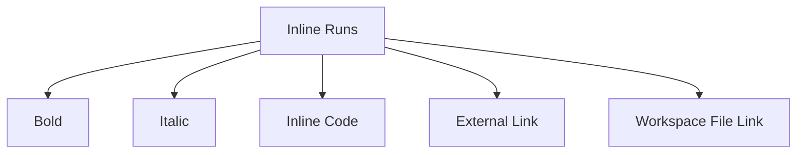
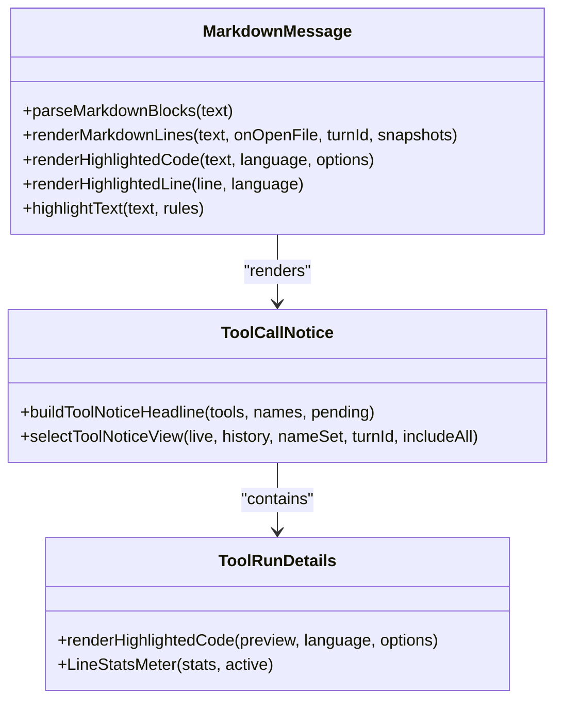
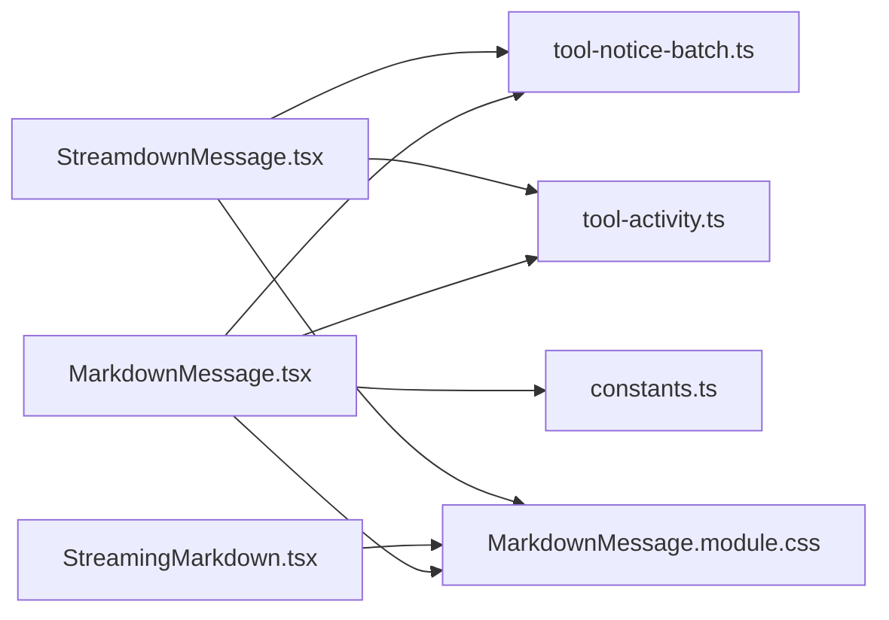

# Markdown Rendering System

<cite>
**Referenced Files in This Document**
- [MarkdownMessage.tsx](file://src/client/src/components/markdown/MarkdownMessage.tsx)
- [StreamingMarkdown.tsx](file://src/client/src/components/markdown/StreamingMarkdown.tsx)
- [StreamdownMessage.tsx](file://src/client/src/components/markdown/StreamdownMessage.tsx)
- [tool-notice-batch.ts](file://src/client/src/components/markdown/tool-notice-batch.ts)
- [MarkdownMessage.module.css](file://src/client/src/components/markdown/MarkdownMessage.module.css)
- [tool-activity.ts](file://src/client/src/lib/tool-activity.ts)
- [constants.ts](file://src/client/src/constants.ts)
</cite>

## Table of Contents
1. [Introduction](#introduction)
2. [Project Structure](#project-structure)
3. [Core Components](#core-components)
4. [Architecture Overview](#architecture-overview)
5. [Detailed Component Analysis](#detailed-component-analysis)
6. [Dependency Analysis](#dependency-analysis)
7. [Performance Considerations](#performance-considerations)
8. [Troubleshooting Guide](#troubleshooting-guide)
9. [Conclusion](#conclusion)

## Introduction
This document describes the markdown rendering system used in the application, focusing on three primary components: MarkdownMessage, StreamingMarkdown, and StreamdownMessage. It explains how markdown blocks are parsed, how syntax highlighting is applied across multiple languages, how inline elements (links and mentions) are rendered, and how tool call notices integrate with live tool execution previews and summaries. The document also covers the component architecture for headers, lists, tables, and code blocks, the syntax highlighting engine with line numbering and diff highlighting, tool activity integration, styling patterns, accessibility features, and performance optimizations for large content.

## Project Structure
The markdown rendering system is organized around three main components:
- MarkdownMessage: Full-featured renderer with syntax highlighting, tool call notices, and live tool previews.
- StreamingMarkdown: Lightweight renderer optimized for streaming updates with minimal re-rendering.
- StreamdownMessage: Unified renderer using Streamdown (GFM + Shiki) with app-specific integrations.

**Diagram sources**
- [MarkdownMessage.tsx:1-1137](file://src/client/src/components/markdown/MarkdownMessage.tsx#L1-L1137)
- [StreamingMarkdown.tsx:1-211](file://src/client/src/components/markdown/StreamingMarkdown.tsx#L1-L211)
- [StreamdownMessage.tsx:1-154](file://src/client/src/components/markdown/StreamdownMessage.tsx#L1-L154)
- [tool-notice-batch.ts:1-35](file://src/client/src/components/markdown/tool-notice-batch.ts#L1-L35)
- [tool-activity.ts:1-973](file://src/client/src/lib/tool-activity.ts#L1-L973)
- [MarkdownMessage.module.css:1-664](file://src/client/src/components/markdown/MarkdownMessage.module.css#L1-L664)
- [constants.ts:1-35](file://src/client/src/constants.ts#L1-L35)

**Section sources**
- [MarkdownMessage.tsx:1-1137](file://src/client/src/components/markdown/MarkdownMessage.tsx#L1-L1137)
- [StreamingMarkdown.tsx:1-211](file://src/client/src/components/markdown/StreamingMarkdown.tsx#L1-L211)
- [StreamdownMessage.tsx:1-154](file://src/client/src/components/markdown/StreamdownMessage.tsx#L1-L154)
- [tool-notice-batch.ts:1-35](file://src/client/src/components/markdown/tool-notice-batch.ts#L1-L35)
- [tool-activity.ts:1-973](file://src/client/src/lib/tool-activity.ts#L1-L973)
- [MarkdownMessage.module.css:1-664](file://src/client/src/components/markdown/MarkdownMessage.module.css#L1-L664)
- [constants.ts:1-35](file://src/client/src/constants.ts#L1-L35)

## Core Components
- MarkdownMessage: Parses markdown into blocks, renders code with syntax highlighting, handles inline rendering, and integrates tool call notices with live previews and summaries.
- StreamingMarkdown: Optimized for streaming updates, renders paragraphs, headers, lists, tables, and code blocks with lightweight inline parsing and word-level animations.
- StreamdownMessage: Uses Streamdown/GFM with Shiki for syntax highlighting, supports app-specific integrations like thinking traces, tool notices, and file-open links.

Key capabilities:
- Parsing: Code fences, headers, lists, tables, blockquotes, and inline formatting.
- Syntax highlighting: Multi-language support with diff highlighting and optional line numbers.
- Tool integration: Live tool execution previews, mutation summaries, and animated line stats.
- Accessibility: Reduced motion support, semantic markup, and focus-friendly details toggles.
- Performance: Memoization, incremental rendering, and streaming optimizations.

**Section sources**
- [MarkdownMessage.tsx:49-69](file://src/client/src/components/markdown/MarkdownMessage.tsx#L49-L69)
- [StreamingMarkdown.tsx:1-211](file://src/client/src/components/markdown/StreamingMarkdown.tsx#L1-L211)
- [StreamdownMessage.tsx:1-154](file://src/client/src/components/markdown/StreamdownMessage.tsx#L1-L154)

## Architecture Overview
The system combines three rendering engines:
- MarkdownMessage: Full-featured renderer with custom syntax highlighting and tool integration.
- StreamingMarkdown: Lightweight renderer for real-time streaming with minimal re-rendering.
- StreamdownMessage: Unified renderer leveraging Streamdown/GFM/Shiki with app-specific overrides.

**Diagram sources**
- [MarkdownMessage.tsx:75-87](file://src/client/src/components/markdown/MarkdownMessage.tsx#L75-L87)
- [StreamingMarkdown.tsx:26-50](file://src/client/src/components/markdown/StreamingMarkdown.tsx#L26-L50)
- [StreamdownMessage.tsx:61-83](file://src/client/src/components/markdown/StreamdownMessage.tsx#L61-L83)

## Detailed Component Analysis

### MarkdownMessage Component
MarkdownMessage is the primary renderer responsible for:
- Block parsing: Separating code blocks from text using fenced code delimiters.
- Inline rendering: Headers, lists, blockquotes, and inline formatting.
- Syntax highlighting: Multi-language support with custom rules and diff highlighting.
- Tool integration: Tool call notices with live previews, mutation summaries, and animated stats.

**Diagram sources**
- [MarkdownMessage.tsx:75-87](file://src/client/src/components/markdown/MarkdownMessage.tsx#L75-L87)
- [MarkdownMessage.tsx:212-265](file://src/client/src/components/markdown/MarkdownMessage.tsx#L212-L265)
- [MarkdownMessage.tsx:276-325](file://src/client/src/components/markdown/MarkdownMessage.tsx#L276-L325)

Key implementation highlights:
- Block parsing uses a global regex to detect fenced code blocks and split text accordingly.
- Inline rendering supports bold, italic, inline code, and links; mentions are handled via workspace-aware link rendering.
- Syntax highlighting applies language-specific rules and includes diff highlighting for additions/deletions.
- Tool call notices integrate with live tool execution previews and summarize batches with animated line statistics.

**Section sources**
- [MarkdownMessage.tsx:75-87](file://src/client/src/components/markdown/MarkdownMessage.tsx#L75-L87)
- [MarkdownMessage.tsx:212-265](file://src/client/src/components/markdown/MarkdownMessage.tsx#L212-L265)
- [MarkdownMessage.tsx:276-325](file://src/client/src/components/markdown/MarkdownMessage.tsx#L276-L325)
- [MarkdownMessage.tsx:89-140](file://src/client/src/components/markdown/MarkdownMessage.tsx#L89-L140)
- [MarkdownMessage.tsx:142-193](file://src/client/src/components/markdown/MarkdownMessage.tsx#L142-L193)
- [MarkdownMessage.tsx:195-210](file://src/client/src/components/markdown/MarkdownMessage.tsx#L195-L210)

### StreamingMarkdown Component
StreamingMarkdown is optimized for streaming updates:
- Lightweight block parsing supporting unclosed code fences during streaming.
- Word-level inline rendering with fade animations per new word.
- Paragraph-level memoization to avoid re-rendering settled content.
- Support for headers, lists, tables, and code blocks.

**Diagram sources**
- [StreamingMarkdown.tsx:26-50](file://src/client/src/components/markdown/StreamingMarkdown.tsx#L26-L50)
- [StreamingMarkdown.tsx:142-168](file://src/client/src/components/markdown/StreamingMarkdown.tsx#L142-L168)
- [StreamingMarkdown.tsx:105-125](file://src/client/src/components/markdown/StreamingMarkdown.tsx#L105-L125)

**Section sources**
- [StreamingMarkdown.tsx:26-50](file://src/client/src/components/markdown/StreamingMarkdown.tsx#L26-L50)
- [StreamingMarkdown.tsx:142-168](file://src/client/src/components/markdown/StreamingMarkdown.tsx#L142-L168)
- [StreamingMarkdown.tsx:105-125](file://src/client/src/components/markdown/StreamingMarkdown.tsx#L105-L125)

### StreamdownMessage Component
StreamdownMessage leverages Streamdown/GFM with Shiki:
- Splits thinking traces and tool notice markers from markdown.
- Applies Streamdown with Shiki themes and plugins.
- Overrides components to handle workspace file links and inline code pointing to workspace paths.
- Integrates tool notices with live tool execution previews.

**Diagram sources**
- [StreamdownMessage.tsx:33-45](file://src/client/src/components/markdown/StreamdownMessage.tsx#L33-L45)
- [StreamdownMessage.tsx:61-83](file://src/client/src/components/markdown/StreamdownMessage.tsx#L61-L83)
- [StreamdownMessage.tsx:120-151](file://src/client/src/components/markdown/StreamdownMessage.tsx#L120-L151)

**Section sources**
- [StreamdownMessage.tsx:33-45](file://src/client/src/components/markdown/StreamdownMessage.tsx#L33-L45)
- [StreamdownMessage.tsx:61-83](file://src/client/src/components/markdown/StreamdownMessage.tsx#L61-L83)
- [StreamdownMessage.tsx:120-151](file://src/client/src/components/markdown/StreamdownMessage.tsx#L120-L151)

### Tool Call Notices Integration
Tool call notices are collected from consecutive tool markers and integrated into the message:
- Batch collection identifies tool call markers and groups them.
- Notices display live tool execution previews with animated line counts and mutation summaries.
- Tool activity integration provides action labels, subjects, panel titles, and result labels.

**Diagram sources**
- [tool-notice-batch.ts:13-34](file://src/client/src/components/markdown/tool-notice-batch.ts#L13-L34)
- [MarkdownMessage.tsx:276-325](file://src/client/src/components/markdown/MarkdownMessage.tsx#L276-L325)
- [MarkdownMessage.tsx:495-527](file://src/client/src/components/markdown/MarkdownMessage.tsx#L495-L527)
- [tool-activity.ts:59-83](file://src/client/src/lib/tool-activity.ts#L59-L83)

**Section sources**
- [tool-notice-batch.ts:1-35](file://src/client/src/components/markdown/tool-notice-batch.ts#L1-L35)
- [MarkdownMessage.tsx:276-325](file://src/client/src/components/markdown/MarkdownMessage.tsx#L276-L325)
- [MarkdownMessage.tsx:495-527](file://src/client/src/components/markdown/MarkdownMessage.tsx#L495-L527)
- [tool-activity.ts:59-83](file://src/client/src/lib/tool-activity.ts#L59-L83)

### Syntax Highlighting Engine
The syntax highlighting engine supports multiple languages with customizable rules:
- Language normalization based on explicit language hints or content heuristics.
- Diff highlighting for code lines prefixed with +/- indicators.
- Optional line numbering for readability.
- Multi-language rules for HTML, CSS, JSON, Python, Shell, and TypeScript/JavaScript.

**Diagram sources**
- [MarkdownMessage.tsx:195-210](file://src/client/src/components/markdown/MarkdownMessage.tsx#L195-L210)
- [MarkdownMessage.tsx:142-193](file://src/client/src/components/markdown/MarkdownMessage.tsx#L142-L193)
- [MarkdownMessage.tsx:91-111](file://src/client/src/components/markdown/MarkdownMessage.tsx#L91-L111)

**Section sources**
- [MarkdownMessage.tsx:195-210](file://src/client/src/components/markdown/MarkdownMessage.tsx#L195-L210)
- [MarkdownMessage.tsx:142-193](file://src/client/src/components/markdown/MarkdownMessage.tsx#L142-L193)
- [MarkdownMessage.tsx:91-111](file://src/client/src/components/markdown/MarkdownMessage.tsx#L91-L111)

### Inline Rendering for Links and Mentions
Inline rendering supports:
- Bold, italic, and inline code formatting.
- Links with external targets and workspace file links.
- Mentions resolved to clickable workspace paths.

**Diagram sources**
- [MarkdownMessage.tsx:212-265](file://src/client/src/components/markdown/MarkdownMessage.tsx#L212-L265)
- [StreamdownMessage.tsx:102-118](file://src/client/src/components/markdown/StreamdownMessage.tsx#L102-L118)

**Section sources**
- [MarkdownMessage.tsx:212-265](file://src/client/src/components/markdown/MarkdownMessage.tsx#L212-L265)
- [StreamdownMessage.tsx:102-118](file://src/client/src/components/markdown/StreamdownMessage.tsx#L102-L118)

### Component Architecture for Markdown Elements
- Headers: Rendered as h2/h3/h4 depending on level.
- Lists: Bullet and numbered lists with styled items.
- Tables: Parsed and rendered with proper alignment and inline cell rendering.
- Code blocks: Fenced code blocks with language detection and optional line numbers.

**Diagram sources**
- [MarkdownMessage.tsx:75-87](file://src/client/src/components/markdown/MarkdownMessage.tsx#L75-L87)
- [MarkdownMessage.tsx:212-265](file://src/client/src/components/markdown/MarkdownMessage.tsx#L212-L265)
- [MarkdownMessage.tsx:89-140](file://src/client/src/components/markdown/MarkdownMessage.tsx#L89-L140)
- [MarkdownMessage.tsx:276-325](file://src/client/src/components/markdown/MarkdownMessage.tsx#L276-L325)
- [MarkdownMessage.tsx:495-527](file://src/client/src/components/markdown/MarkdownMessage.tsx#L495-L527)

**Section sources**
- [MarkdownMessage.tsx:75-87](file://src/client/src/components/markdown/MarkdownMessage.tsx#L75-L87)
- [MarkdownMessage.tsx:212-265](file://src/client/src/components/markdown/MarkdownMessage.tsx#L212-L265)
- [MarkdownMessage.tsx:89-140](file://src/client/src/components/markdown/MarkdownMessage.tsx#L89-L140)
- [MarkdownMessage.tsx:276-325](file://src/client/src/components/markdown/MarkdownMessage.tsx#L276-L325)
- [MarkdownMessage.tsx:495-527](file://src/client/src/components/markdown/MarkdownMessage.tsx#L495-L527)

## Dependency Analysis
The components depend on shared utilities and styles:
- tool-notice-batch: Extracts tool call markers and batches them.
- tool-activity: Provides tool activity metadata, preview text, line stats, and classification.
- constants: Defines limits and thresholds used across rendering and tool scanning.
- CSS: Provides styling for code blocks, tool notices, tables, and animations.

**Diagram sources**
- [MarkdownMessage.tsx:1-22](file://src/client/src/components/markdown/MarkdownMessage.tsx#L1-L22)
- [tool-notice-batch.ts:1-35](file://src/client/src/components/markdown/tool-notice-batch.ts#L1-L35)
- [tool-activity.ts:1-2](file://src/client/src/lib/tool-activity.ts#L1-L2)
- [constants.ts](file://src/client/src/constants.ts#L25)
- [MarkdownMessage.module.css:1-664](file://src/client/src/components/markdown/MarkdownMessage.module.css#L1-L664)
- [StreamingMarkdown.tsx:1-2](file://src/client/src/components/markdown/StreamingMarkdown.tsx#L1-L2)
- [StreamdownMessage.tsx:1-8](file://src/client/src/components/markdown/StreamdownMessage.tsx#L1-L8)

**Section sources**
- [MarkdownMessage.tsx:1-22](file://src/client/src/components/markdown/MarkdownMessage.tsx#L1-L22)
- [tool-notice-batch.ts:1-35](file://src/client/src/components/markdown/tool-notice-batch.ts#L1-L35)
- [tool-activity.ts:1-2](file://src/client/src/lib/tool-activity.ts#L1-L2)
- [constants.ts](file://src/client/src/constants.ts#L25)
- [MarkdownMessage.module.css:1-664](file://src/client/src/components/markdown/MarkdownMessage.module.css#L1-L664)
- [StreamingMarkdown.tsx:1-2](file://src/client/src/components/markdown/StreamingMarkdown.tsx#L1-L2)
- [StreamdownMessage.tsx:1-8](file://src/client/src/components/markdown/StreamdownMessage.tsx#L1-L8)

## Performance Considerations
- Memoization: React.memo on paragraph and code components prevents unnecessary re-renders.
- Incremental rendering: StreamingMarkdown updates only the growing paragraph, minimizing layout thrash.
- Content visibility: CSS content-visibility and contain-intrinsic-size optimize rendering of large code blocks and tool cards.
- Animation throttling: Animated line numbers and stats use requestAnimationFrame with easing and capped durations.
- Scanning limits: Tool scanning and preview generation enforce text limits to prevent heavy computations.
- Streaming thresholds: Type writer character limits balance smoothness and responsiveness for large outputs.

Practical tips:
- Prefer StreamingMarkdown for long-running streams to minimize re-parsing.
- Use line numbers selectively for readability vs. performance trade-offs.
- Limit tool preview sizes to keep UI responsive during live execution.

**Section sources**
- [MarkdownMessage.tsx:32-40](file://src/client/src/components/markdown/MarkdownMessage.tsx#L32-L40)
- [MarkdownMessage.tsx:554-586](file://src/client/src/components/markdown/MarkdownMessage.tsx#L554-L586)
- [MarkdownMessage.tsx:684-708](file://src/client/src/components/markdown/MarkdownMessage.tsx#L684-L708)
- [constants.ts:25-32](file://src/client/src/constants.ts#L25-L32)
- [MarkdownMessage.module.css:36-38](file://src/client/src/components/markdown/MarkdownMessage.module.css#L36-L38)
- [MarkdownMessage.module.css:453-454](file://src/client/src/components/markdown/MarkdownMessage.module.css#L453-L454)

## Troubleshooting Guide
Common issues and resolutions:
- Clipboard copy failures: The renderer checks for clipboard availability and shows appropriate toast notifications.
- Tool preview language mismatches: Language inference considers command types, file extensions, and content heuristics.
- Excessive memory usage: Tool scanning and preview generation enforce text limits; consider reducing limits if needed.
- Accessibility concerns: Reduced motion media queries disable animations for users who prefer reduced motion.

Debugging steps:
- Verify tool call markers are properly formatted and consecutive.
- Inspect tool activity cache and mutation kind resolution.
- Check inline rendering for malformed links or unescaped content.

**Section sources**
- [MarkdownMessage.tsx:52-64](file://src/client/src/components/markdown/MarkdownMessage.tsx#L52-L64)
- [tool-activity.ts:321-352](file://src/client/src/lib/tool-activity.ts#L321-L352)
- [tool-activity.ts:829-875](file://src/client/src/lib/tool-activity.ts#L829-L875)
- [MarkdownMessage.module.css:646-663](file://src/client/src/components/markdown/MarkdownMessage.module.css#L646-L663)

## Conclusion
The markdown rendering system provides a robust, modular solution for displaying rich content with live tool integration. MarkdownMessage offers comprehensive rendering and tool previews, StreamingMarkdown optimizes streaming performance, and StreamdownMessage delivers a unified GFM experience with Shiki. Together, they support multi-language syntax highlighting, inline formatting, tool call notices, and accessibility, while maintaining performance for large documents and live updates.
