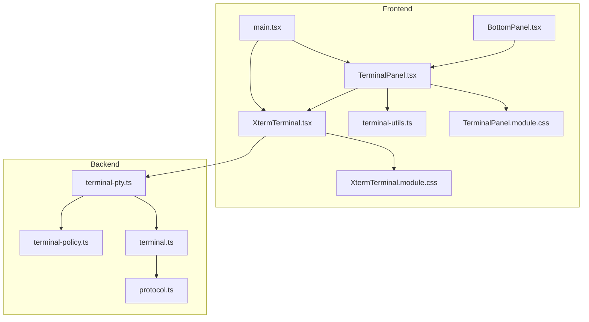
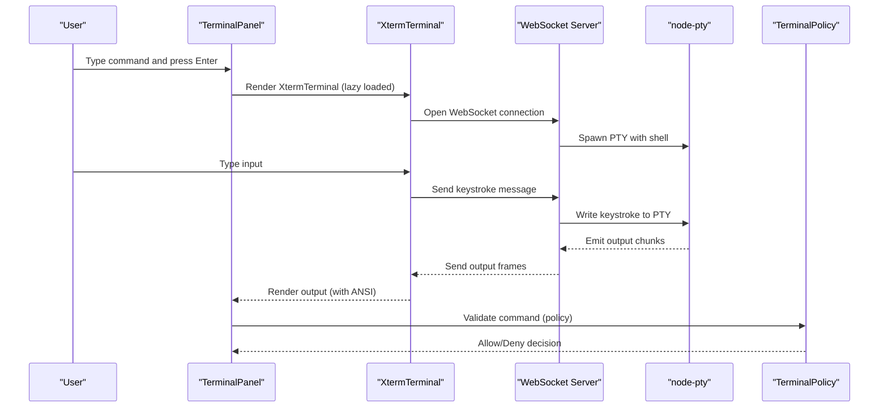
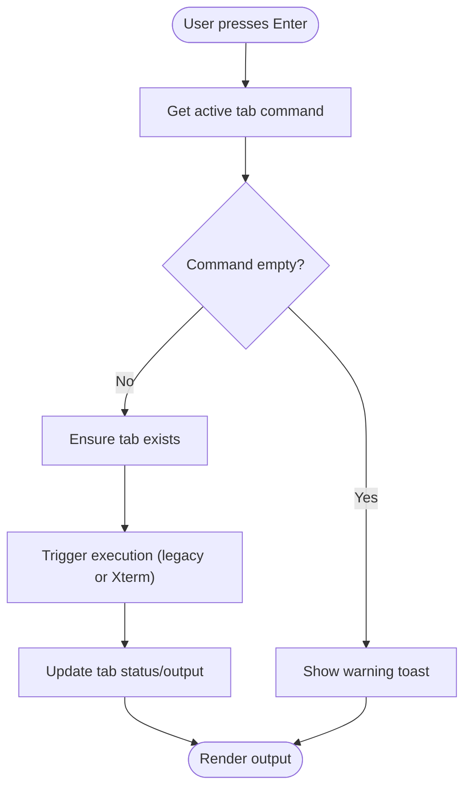
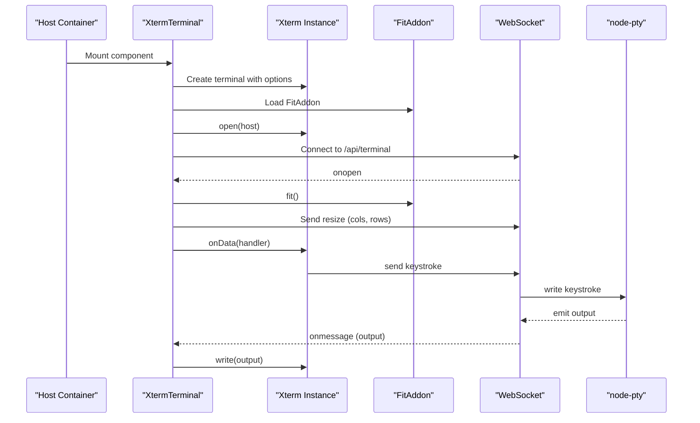
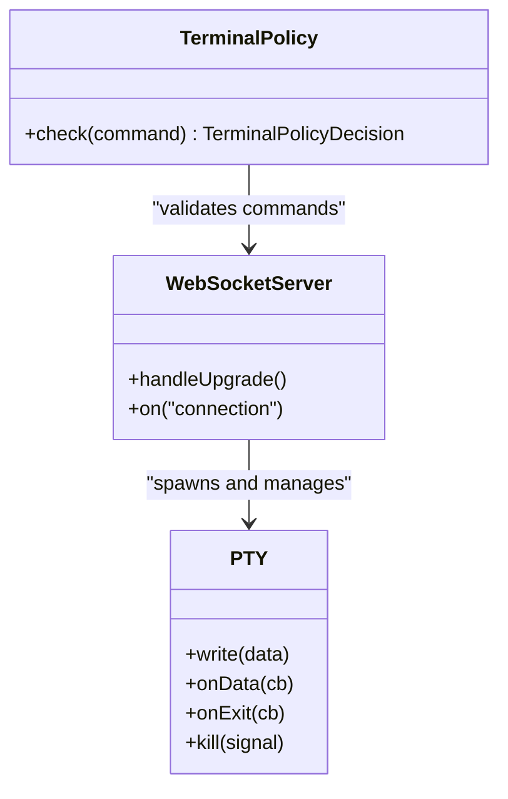
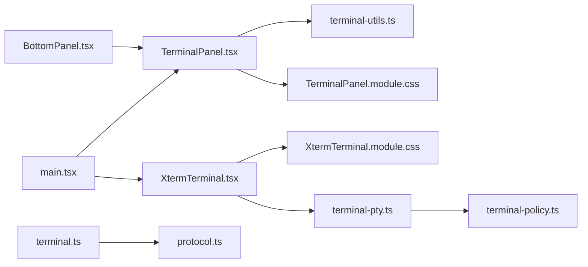

# Terminal Emulation System

<cite>
**Referenced Files in This Document**
- [TerminalPanel.tsx](file://src/client/src/components/terminal/TerminalPanel.tsx)
- [XtermTerminal.tsx](file://src/client/src/components/terminal/XtermTerminal.tsx)
- [terminal-utils.ts](file://src/client/src/components/terminal/terminal-utils.ts)
- [TerminalPanel.module.css](file://src/client/src/components/terminal/TerminalPanel.module.css)
- [XtermTerminal.module.css](file://src/client/src/components/terminal/XtermTerminal.module.css)
- [terminal.ts](file://src/server/terminal.ts)
- [terminal-pty.ts](file://src/server/terminal-pty.ts)
- [terminal-policy.ts](file://src/server/terminal-policy.ts)
- [protocol.ts](file://src/shared/protocol.ts)
- [main.tsx](file://src/client/src/main.tsx)
- [BottomPanel.tsx](file://src/client/src/components/chrome/BottomPanel.tsx)
</cite>

## Table of Contents
1. [Introduction](#introduction)
2. [Project Structure](#project-structure)
3. [Core Components](#core-components)
4. [Architecture Overview](#architecture-overview)
5. [Detailed Component Analysis](#detailed-component-analysis)
6. [Dependency Analysis](#dependency-analysis)
7. [Performance Considerations](#performance-considerations)
8. [Troubleshooting Guide](#troubleshooting-guide)
9. [Conclusion](#conclusion)

## Introduction
This document describes the terminal emulation system built with Xterm.js integration. It covers the frontend terminal panel with tab management, command execution handling, and output streaming, along with the backend terminal service that powers interactive PTY sessions. The system emphasizes secure command execution via policy enforcement, responsive terminal rendering, and accessibility-friendly controls.

## Project Structure
The terminal system spans frontend React components and backend Node.js services:
- Frontend: TerminalPanel for UI and UX, XtermTerminal for the Xterm.js integration, and terminal-utils for tab state management
- Backend: A WebSocket endpoint backed by node-pty for interactive shells, plus a policy engine for command safety
- Shared: Protocol definitions for agent-server communication and terminal events

**Diagram sources**
- [TerminalPanel.tsx:1-217](file://src/client/src/components/terminal/TerminalPanel.tsx#L1-L217)
- [XtermTerminal.tsx:1-138](file://src/client/src/components/terminal/XtermTerminal.tsx#L1-L138)
- [terminal-utils.ts:1-6](file://src/client/src/components/terminal/terminal-utils.ts#L1-L6)
- [TerminalPanel.module.css:1-121](file://src/client/src/components/terminal/TerminalPanel.module.css#L1-L121)
- [XtermTerminal.module.css:1-20](file://src/client/src/components/terminal/XtermTerminal.module.css#L1-L20)
- [terminal-pty.ts:1-95](file://src/server/terminal-pty.ts#L1-L95)
- [terminal-policy.ts:1-39](file://src/server/terminal-policy.ts#L1-L39)
- [terminal.ts:1-87](file://src/server/terminal.ts#L1-L87)
- [protocol.ts:161-169](file://src/shared/protocol.ts#L161-L169)
- [main.tsx:66-69](file://src/client/src/main.tsx#L66-L69)
- [BottomPanel.tsx:1-129](file://src/client/src/components/chrome/BottomPanel.tsx#L1-L129)

**Section sources**
- [TerminalPanel.tsx:1-217](file://src/client/src/components/terminal/TerminalPanel.tsx#L1-L217)
- [XtermTerminal.tsx:1-138](file://src/client/src/components/terminal/XtermTerminal.tsx#L1-L138)
- [terminal-utils.ts:1-6](file://src/client/src/components/terminal/terminal-utils.ts#L1-L6)
- [terminal-pty.ts:1-95](file://src/server/terminal-pty.ts#L1-L95)
- [terminal-policy.ts:1-39](file://src/server/terminal-policy.ts#L1-L39)
- [terminal.ts:1-87](file://src/server/terminal.ts#L1-L87)
- [protocol.ts:161-169](file://src/shared/protocol.ts#L161-L169)
- [main.tsx:66-69](file://src/client/src/main.tsx#L66-L69)
- [BottomPanel.tsx:1-129](file://src/client/src/components/chrome/BottomPanel.tsx#L1-L129)

## Core Components
- TerminalPanel: Renders the terminal UI, manages tabs, handles command input/history, and displays output with ANSI support
- XtermTerminal: Integrates Xterm.js with a WebSocket-backed PTY for interactive terminal sessions
- terminal-utils: Defines tab state and helpers for ensuring a tab exists
- Backend terminal service: Validates commands via policy, spawns PTY processes, streams output, and emits lifecycle events
- Protocol: Defines terminal-related events for agent-server communication

**Section sources**
- [TerminalPanel.tsx:9-79](file://src/client/src/components/terminal/TerminalPanel.tsx#L9-L79)
- [XtermTerminal.tsx:64-135](file://src/client/src/components/terminal/XtermTerminal.tsx#L64-L135)
- [terminal-utils.ts:1-6](file://src/client/src/components/terminal/terminal-utils.ts#L1-L6)
- [terminal.ts:21-87](file://src/server/terminal.ts#L21-L87)
- [protocol.ts:161-169](file://src/shared/protocol.ts#L161-L169)

## Architecture Overview
The system combines a React terminal panel with a WebSocket-based PTY backend:
- Frontend: TerminalPanel renders the UI and delegates execution to either the legacy runner or the XtermTerminal component
- XtermTerminal: Creates a Terminal instance, loads addons, connects to a WebSocket endpoint, and streams input/output
- Backend: terminal-pty.ts upgrades HTTP requests to WebSocket connections, spawns a PTY per connection, and forwards keystrokes and resize events
- Policy: terminal-policy.ts enforces safe command patterns before execution

**Diagram sources**
- [TerminalPanel.tsx:48-66](file://src/client/src/components/terminal/TerminalPanel.tsx#L48-L66)
- [XtermTerminal.tsx:98-114](file://src/client/src/components/terminal/XtermTerminal.tsx#L98-L114)
- [terminal-pty.ts:44-94](file://src/server/terminal-pty.ts#L44-L94)
- [terminal-policy.ts:24-32](file://src/server/terminal-policy.ts#L24-L32)

## Detailed Component Analysis

### TerminalPanel Component
Responsibilities:
- Manage terminal tabs and active tab state
- Provide command input with history navigation (arrow keys)
- Display output with ANSI parsing and optional stripping
- Control actions: run, stop, copy (with ANSI stripping), scroll lock, re-run, analyze
- Show status indicators and warnings for risky commands

Key behaviors:
- Tab management: ensure a tab exists for a given ID and initialize with empty output and running status
- Command input: Enter runs the current command; Up/Down navigate history
- Output rendering: ANSI sequences parsed and mapped to CSS classes for colors/bold/underline
- Risk detection: heuristic patterns detect potentially dangerous commands and surface warnings
- Accessibility: proper ARIA roles and keyboard navigation for tabs and buttons

**Diagram sources**
- [TerminalPanel.tsx:9-79](file://src/client/src/components/terminal/TerminalPanel.tsx#L9-L79)
- [terminal-utils.ts:3-5](file://src/client/src/components/terminal/terminal-utils.ts#L3-L5)

**Section sources**
- [TerminalPanel.tsx:9-79](file://src/client/src/components/terminal/TerminalPanel.tsx#L9-L79)
- [terminal-utils.ts:1-6](file://src/client/src/components/terminal/terminal-utils.ts#L1-L6)

### XtermTerminal Component
Responsibilities:
- Initialize Xterm.js with FitAddon, WebLinksAddon, and SearchAddon
- Connect to a WebSocket endpoint (/api/terminal) with authentication token and initial dimensions
- Forward keystrokes to the backend PTY and render output frames
- Handle resize events and theme updates based on CSS variables
- Dispose resources safely on unmount

Integration highlights:
- Uses FitAddon to compute terminal dimensions from the container
- Sends resize messages to the backend when the container resizes
- Applies theme derived from CSS variables for background, foreground, and ANSI palette
- Focuses the terminal after connection opens

**Diagram sources**
- [XtermTerminal.tsx:64-135](file://src/client/src/components/terminal/XtermTerminal.tsx#L64-L135)
- [terminal-pty.ts:44-94](file://src/server/terminal-pty.ts#L44-L94)

**Section sources**
- [XtermTerminal.tsx:64-135](file://src/client/src/components/terminal/XtermTerminal.tsx#L64-L135)
- [XtermTerminal.module.css:1-20](file://src/client/src/components/terminal/XtermTerminal.module.css#L1-L20)

### Terminal Utilities
Defines the tab state shape and ensures a tab exists for a given ID. Tabs carry metadata such as status, output buffer, and scroll lock state.

**Section sources**
- [terminal-utils.ts:1-6](file://src/client/src/components/terminal/terminal-utils.ts#L1-L6)

### Backend Terminal Service (Interactive PTY)
The WebSocket endpoint creates a PTY per connection:
- Authentication: validates incoming requests before upgrade
- PTY spawn: selects shell based on platform and sets environment variables
- Bidirectional stream: forwards keystrokes to PTY and emits output frames
- Lifecycle: sends exit code on close and cleans up resources

**Diagram sources**
- [terminal-pty.ts:25-94](file://src/server/terminal-pty.ts#L25-L94)
- [terminal-policy.ts:21-33](file://src/server/terminal-policy.ts#L21-L33)

**Section sources**
- [terminal-pty.ts:1-95](file://src/server/terminal-pty.ts#L1-L95)
- [terminal-policy.ts:1-39](file://src/server/terminal-policy.ts#L1-L39)

### Legacy Terminal Runner (Non-interactive)
For comparison, the legacy terminal runner executes commands synchronously with timeouts and output limits. It enforces policy checks and streams stdout/stderr to callbacks.

**Section sources**
- [terminal.ts:21-87](file://src/server/terminal.ts#L21-L87)

### Protocol Events
The agent-server protocol defines terminal-related events for UI synchronization and analytics:
- terminal_start: emitted when a terminal session begins
- terminal_output: streamed stdout/stderr chunks
- terminal_end: emitted on completion with exit code, signal, and duration

**Section sources**
- [protocol.ts:161-169](file://src/shared/protocol.ts#L161-L169)

## Dependency Analysis
- Frontend dependencies:
  - TerminalPanel depends on terminal-utils for tab state and on CSS modules for styling
  - XtermTerminal depends on Xterm.js and WebSocket APIs; it also listens to theme changes
  - BottomPanel hosts the terminal UI and manages height/resizing
  - main.tsx lazy-loads Terminal components and integrates them into the app layout
- Backend dependencies:
  - terminal-pty.ts depends on node-pty and ws for WebSocket handling
  - terminal.ts depends on TerminalPolicy for command validation
  - protocol.ts defines terminal event shapes used by the agent

**Diagram sources**
- [TerminalPanel.tsx:1-10](file://src/client/src/components/terminal/TerminalPanel.tsx#L1-L10)
- [XtermTerminal.tsx:1-8](file://src/client/src/components/terminal/XtermTerminal.tsx#L1-L8)
- [terminal-utils.ts:1-6](file://src/client/src/components/terminal/terminal-utils.ts#L1-L6)
- [terminal-pty.ts:1-26](file://src/server/terminal-pty.ts#L1-L26)
- [terminal-policy.ts:1-22](file://src/server/terminal-policy.ts#L1-L22)
- [terminal.ts:1-27](file://src/server/terminal.ts#L1-L27)
- [protocol.ts:161-169](file://src/shared/protocol.ts#L161-L169)
- [main.tsx:66-69](file://src/client/src/main.tsx#L66-L69)
- [BottomPanel.tsx:1-129](file://src/client/src/components/chrome/BottomPanel.tsx#L1-L129)

**Section sources**
- [TerminalPanel.tsx:1-10](file://src/client/src/components/terminal/TerminalPanel.tsx#L1-L10)
- [XtermTerminal.tsx:1-8](file://src/client/src/components/terminal/XtermTerminal.tsx#L1-L8)
- [terminal-utils.ts:1-6](file://src/client/src/components/terminal/terminal-utils.ts#L1-L6)
- [terminal-pty.ts:1-26](file://src/server/terminal-pty.ts#L1-L26)
- [terminal-policy.ts:1-22](file://src/server/terminal-policy.ts#L1-L22)
- [terminal.ts:1-27](file://src/server/terminal.ts#L1-L27)
- [protocol.ts:161-169](file://src/shared/protocol.ts#L161-L169)
- [main.tsx:66-69](file://src/client/src/main.tsx#L66-L69)
- [BottomPanel.tsx:1-129](file://src/client/src/components/chrome/BottomPanel.tsx#L1-L129)

## Performance Considerations
- Output buffering: The backend trims output buffers to a fixed limit to prevent memory growth during long-running commands
- Scrollback: Xterm.js scrollback is capped to reduce DOM overhead
- Resize handling: FitAddon computes dimensions efficiently; resize messages are sent only when needed
- Lazy loading: Terminal components are code-split to minimize initial bundle size
- Theme updates: CSS variable-based theme avoids expensive reinitializations

[No sources needed since this section provides general guidance]

## Troubleshooting Guide
Common issues and resolutions:
- Terminal does not appear:
  - Verify WebSocket connection to /api/terminal and authentication token propagation
  - Check browser console for WebSocket errors and PTY spawn failures
- No output or blank screen:
  - Ensure FitAddon has measured the container; initial fit is deferred by one frame
  - Confirm theme CSS variables are present on the root element
- Commands fail immediately:
  - Review TerminalPolicy decisions; commands matching dangerous patterns are rejected
  - Check backend logs for spawn errors or permission issues
- Copy/paste issues:
  - Use the provided copy actions; ANSI stripping removes escape codes for clean text
- Scroll lock problems:
  - Toggle scroll lock via the UI; ensure the active tab's scrollLock state is dispatched via custom events

**Section sources**
- [XtermTerminal.tsx:95-122](file://src/client/src/components/terminal/XtermTerminal.tsx#L95-L122)
- [terminal-policy.ts:24-32](file://src/server/terminal-policy.ts#L24-L32)
- [TerminalPanel.tsx:12-25](file://src/client/src/components/terminal/TerminalPanel.tsx#L12-L25)

## Conclusion
The terminal emulation system combines a responsive React UI with a robust WebSocket-backed PTY service. It balances interactivity, security, and performance while providing a familiar terminal experience with ANSI support and theme-aware rendering. The modular architecture allows for future enhancements such as session persistence, advanced search, and expanded policy configurations.
