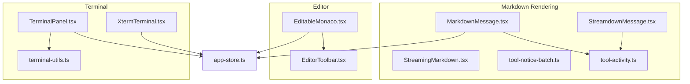
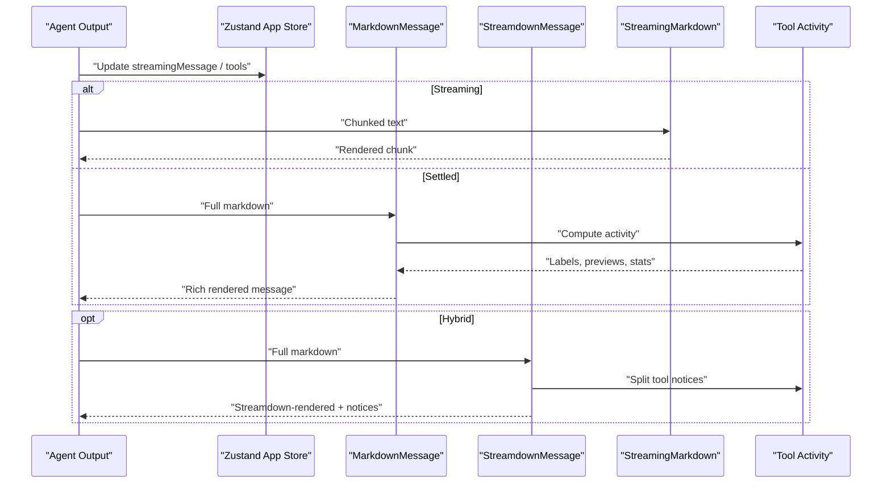
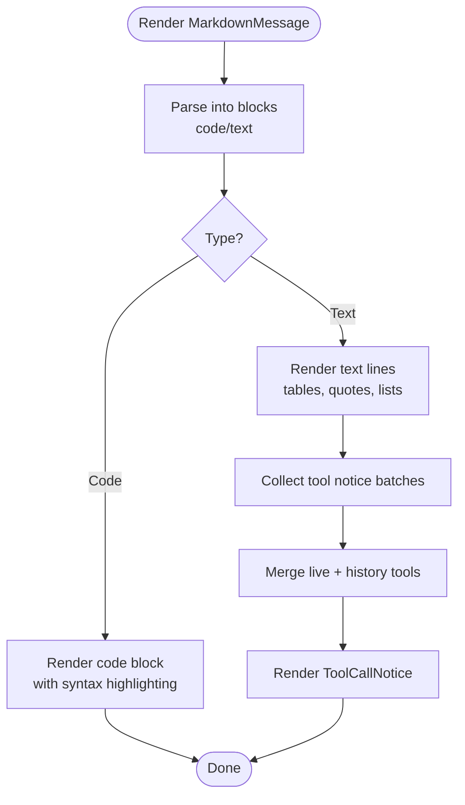
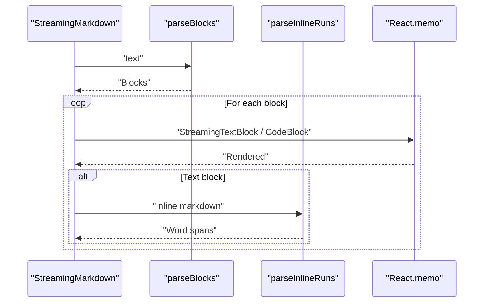
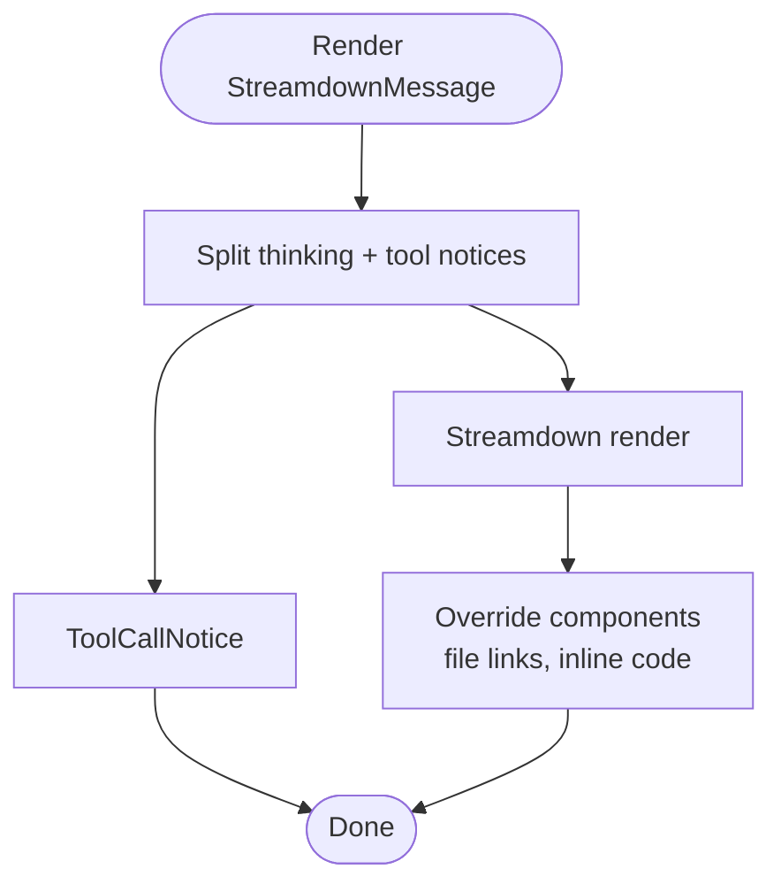
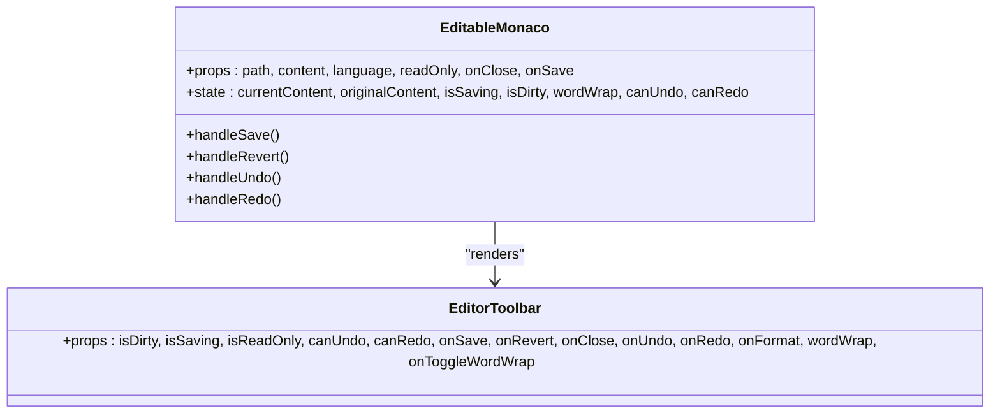
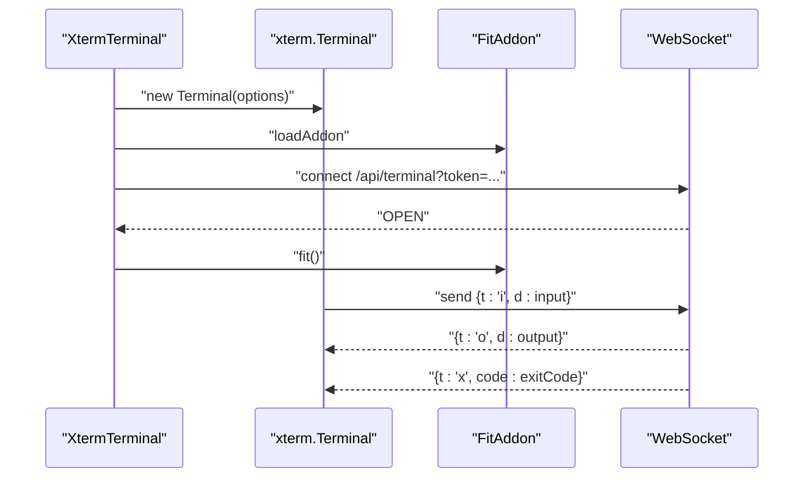
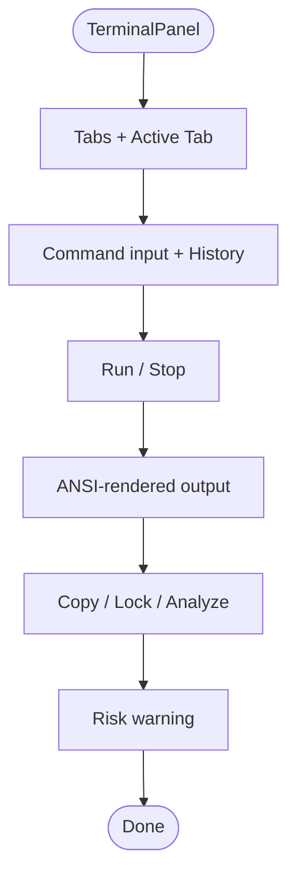
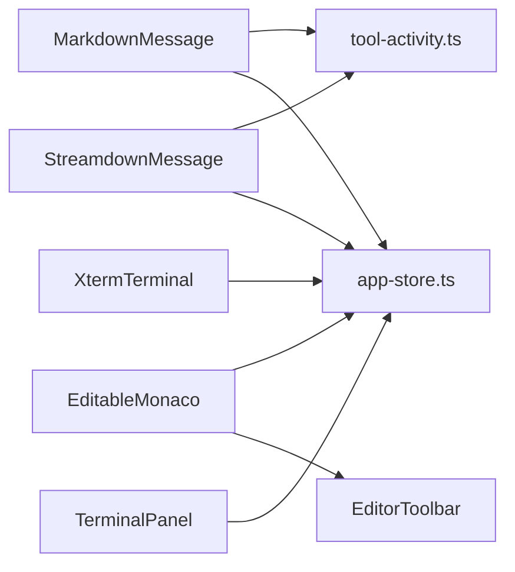

# UI Components

<cite>
**Referenced Files in This Document**
- [MarkdownMessage.tsx](file://src/client/src/components/markdown/MarkdownMessage.tsx)
- [MarkdownMessage.module.css](file://src/client/src/components/markdown/MarkdownMessage.module.css)
- [StreamingMarkdown.tsx](file://src/client/src/components/markdown/StreamingMarkdown.tsx)
- [StreamdownMessage.tsx](file://src/client/src/components/markdown/StreamdownMessage.tsx)
- [tool-notice-batch.ts](file://src/client/src/components/markdown/tool-notice-batch.ts)
- [tool-activity.ts](file://src/client/src/lib/tool-activity.ts)
- [app-store.ts](file://src/client/src/state/app-store.ts)
- [EditableMonaco.tsx](file://src/client/src/components/editor/EditableMonaco.tsx)
- [EditorToolbar.tsx](file://src/client/src/components/editor/EditorToolbar.tsx)
- [XtermTerminal.tsx](file://src/client/src/components/terminal/XtermTerminal.tsx)
- [XtermTerminal.module.css](file://src/client/src/components/terminal/XtermTerminal.module.css)
- [TerminalPanel.tsx](file://src/client/src/components/terminal/TerminalPanel.tsx)
- [TerminalPanel.module.css](file://src/client/src/components/terminal/TerminalPanel.module.css)
- [terminal-utils.ts](file://src/client/src/components/terminal/terminal-utils.ts)
</cite>

## Table of Contents
1. [Introduction](#introduction)
2. [Project Structure](#project-structure)
3. [Core Components](#core-components)
4. [Architecture Overview](#architecture-overview)
5. [Detailed Component Analysis](#detailed-component-analysis)
6. [Dependency Analysis](#dependency-analysis)
7. [Performance Considerations](#performance-considerations)
8. [Accessibility and UX Features](#accessibility-and-ux-features)
9. [Testing Strategies](#testing-strategies)
10. [Troubleshooting Guide](#troubleshooting-guide)
11. [Conclusion](#conclusion)

## Introduction
This document describes the UI component library and specialized components that render AI agent outputs, support code authoring, and provide interactive terminals. It covers:
- Markdown rendering pipeline with three engines: lightweight streaming renderer, legacy full-featured renderer, and a modern hybrid renderer powered by Streamdown
- Monaco Editor integration for code editing, syntax highlighting, and collaboration-ready features
- Xterm.js terminal with real-time streaming, theming, and WebSocket-backed PTY communication
- Theming, responsiveness, accessibility, and performance strategies

## Project Structure
The UI components are organized by domain:
- Markdown rendering: MarkdownMessage, StreamingMarkdown, StreamdownMessage
- Editor: EditableMonaco and EditorToolbar
- Terminal: XtermTerminal and TerminalPanel
- Shared utilities: tool-activity helpers and Zustand app store

**Diagram sources**
- [MarkdownMessage.tsx:1-1137](file://src/client/src/components/markdown/MarkdownMessage.tsx#L1-L1137)
- [StreamingMarkdown.tsx:1-211](file://src/client/src/components/markdown/StreamingMarkdown.tsx#L1-L211)
- [StreamdownMessage.tsx:1-154](file://src/client/src/components/markdown/StreamdownMessage.tsx#L1-L154)
- [tool-notice-batch.ts:1-35](file://src/client/src/components/markdown/tool-notice-batch.ts#L1-L35)
- [tool-activity.ts:1-973](file://src/client/src/lib/tool-activity.ts#L1-L973)
- [app-store.ts:1-253](file://src/client/src/state/app-store.ts#L1-L253)
- [EditableMonaco.tsx:1-152](file://src/client/src/components/editor/EditableMonaco.tsx#L1-L152)
- [EditorToolbar.tsx:1-65](file://src/client/src/components/editor/EditorToolbar.tsx#L1-L65)
- [XtermTerminal.tsx:1-138](file://src/client/src/components/terminal/XtermTerminal.tsx#L1-L138)
- [TerminalPanel.tsx:1-217](file://src/client/src/components/terminal/TerminalPanel.tsx#L1-L217)
- [terminal-utils.ts:1-6](file://src/client/src/components/terminal/terminal-utils.ts#L1-L6)

**Section sources**
- [MarkdownMessage.tsx:1-1137](file://src/client/src/components/markdown/MarkdownMessage.tsx#L1-L1137)
- [StreamingMarkdown.tsx:1-211](file://src/client/src/components/markdown/StreamingMarkdown.tsx#L1-L211)
- [StreamdownMessage.tsx:1-154](file://src/client/src/components/markdown/StreamdownMessage.tsx#L1-L154)
- [tool-notice-batch.ts:1-35](file://src/client/src/components/markdown/tool-notice-batch.ts#L1-L35)
- [tool-activity.ts:1-973](file://src/client/src/lib/tool-activity.ts#L1-L973)
- [app-store.ts:1-253](file://src/client/src/state/app-store.ts#L1-L253)
- [EditableMonaco.tsx:1-152](file://src/client/src/components/editor/EditableMonaco.tsx#L1-L152)
- [EditorToolbar.tsx:1-65](file://src/client/src/components/editor/EditorToolbar.tsx#L1-L65)
- [XtermTerminal.tsx:1-138](file://src/client/src/components/terminal/XtermTerminal.tsx#L1-L138)
- [TerminalPanel.tsx:1-217](file://src/client/src/components/terminal/TerminalPanel.tsx#L1-L217)
- [terminal-utils.ts:1-6](file://src/client/src/components/terminal/terminal-utils.ts#L1-L6)

## Core Components
- MarkdownMessage: Full-featured renderer supporting code blocks with syntax highlighting, tool-call notices, thinking traces, tables, and inline formatting. Integrates with tool activity and live tool snapshots.
- StreamingMarkdown: Lightweight streaming renderer optimized for frequent updates during streaming, with word-by-word animations and minimal re-rendering.
- StreamdownMessage: Modern hybrid renderer using Streamdown (GFM + Shiki) with app-specific extensions for tool notices and file links.
- EditableMonaco: Monaco-based editor with language detection, save/revert actions, undo/redo stack, and toolbar integration.
- XtermTerminal: Real terminal backed by xterm.js and a WebSocket PTY bridge, with theme-awareness and automatic resizing.
- TerminalPanel: Terminal UI with tabs, command input/history, output rendering, ANSI parsing, and safety warnings.

**Section sources**
- [MarkdownMessage.tsx:42-69](file://src/client/src/components/markdown/MarkdownMessage.tsx#L42-L69)
- [StreamingMarkdown.tsx:24-50](file://src/client/src/components/markdown/StreamingMarkdown.tsx#L24-L50)
- [StreamdownMessage.tsx:18-25](file://src/client/src/components/markdown/StreamdownMessage.tsx#L18-L25)
- [EditableMonaco.tsx:8-16](file://src/client/src/components/editor/EditableMonaco.tsx#L8-L16)
- [XtermTerminal.tsx:19-29](file://src/client/src/components/terminal/XtermTerminal.tsx#L19-L29)
- [TerminalPanel.tsx:9-11](file://src/client/src/components/terminal/TerminalPanel.tsx#L9-L11)

## Architecture Overview
The rendering and editing systems integrate with a central Zustand store for tool state and streaming metadata. Tool activity utilities compute previews, labels, and statistics for tool-call notices.

**Diagram sources**
- [app-store.ts:186-252](file://src/client/src/state/app-store.ts#L186-L252)
- [MarkdownMessage.tsx:276-325](file://src/client/src/components/markdown/MarkdownMessage.tsx#L276-L325)
- [StreamdownMessage.tsx:120-151](file://src/client/src/components/markdown/StreamdownMessage.tsx#L120-L151)
- [StreamingMarkdown.tsx:195-210](file://src/client/src/components/markdown/StreamingMarkdown.tsx#L195-L210)
- [tool-activity.ts:59-83](file://src/client/src/lib/tool-activity.ts#L59-L83)

## Detailed Component Analysis

### Markdown Rendering System

#### MarkdownMessage
- Purpose: Rich markdown rendering with syntax-highlighted code blocks, tool-call notices, thinking traces, tables, and inline formatting.
- Key features:
  - Parses text into code and text blocks
  - Renders code with syntax highlighting per language
  - Highlights diffs with +/- prefixes and line numbering
  - Builds tool-call notices from batches and merges live and historical tool states
  - Provides animated line stats and shimmer effects for pending states
- Props:
  - text: string
  - onOpenFile: (path: string) => void
  - turnId?: number
  - toolSnapshots?: ToolCardState[]
- Events: None (renders via pure functions)
- Customization:
  - Uses CSS modules for typography, colors, and animations
  - Supports line numbers and diff highlighting
  - Tool notices integrate with live tool store and history scopes

**Diagram sources**
- [MarkdownMessage.tsx:75-101](file://src/client/src/components/markdown/MarkdownMessage.tsx#L75-L101)
- [MarkdownMessage.tsx:212-265](file://src/client/src/components/markdown/MarkdownMessage.tsx#L212-L265)
- [MarkdownMessage.tsx:276-325](file://src/client/src/components/markdown/MarkdownMessage.tsx#L276-L325)

**Section sources**
- [MarkdownMessage.tsx:42-69](file://src/client/src/components/markdown/MarkdownMessage.tsx#L42-L69)
- [MarkdownMessage.tsx:75-101](file://src/client/src/components/markdown/MarkdownMessage.tsx#L75-L101)
- [MarkdownMessage.tsx:142-193](file://src/client/src/components/markdown/MarkdownMessage.tsx#L142-L193)
- [MarkdownMessage.tsx:212-265](file://src/client/src/components/markdown/MarkdownMessage.tsx#L212-L265)
- [MarkdownMessage.tsx:276-325](file://src/client/src/components/markdown/MarkdownMessage.tsx#L276-L325)
- [MarkdownMessage.module.css:1-664](file://src/client/src/components/markdown/MarkdownMessage.module.css#L1-L664)

#### StreamingMarkdown
- Purpose: Lightweight streaming renderer optimized for frequent updates without heavy parsing.
- Key features:
  - Parses blocks with support for unclosed code fences
  - Renders inline markdown with word-level spans and fade animations
  - Memoized paragraph rendering to avoid re-rendering settled content
  - Renders tables via innerHTML once headers are available
- Props:
  - text: string
- Events: None
- Customization:
  - Uses CSS classes for inline code and table wrapping
  - Word-level animation via keyed spans

**Diagram sources**
- [StreamingMarkdown.tsx:26-50](file://src/client/src/components/markdown/StreamingMarkdown.tsx#L26-L50)
- [StreamingMarkdown.tsx:75-90](file://src/client/src/components/markdown/StreamingMarkdown.tsx#L75-L90)
- [StreamingMarkdown.tsx:142-168](file://src/client/src/components/markdown/StreamingMarkdown.tsx#L142-L168)

**Section sources**
- [StreamingMarkdown.tsx:24-50](file://src/client/src/components/markdown/StreamingMarkdown.tsx#L24-L50)
- [StreamingMarkdown.tsx:75-90](file://src/client/src/components/markdown/StreamingMarkdown.tsx#L75-L90)
- [StreamingMarkdown.tsx:142-168](file://src/client/src/components/markdown/StreamingMarkdown.tsx#L142-L168)

#### StreamdownMessage
- Purpose: Modern hybrid renderer combining Streamdown (GFM + Shiki) with app-specific extensions.
- Key features:
  - Splits thinking blocks and tool notices from markdown
  - Overrides components to open workspace files on click
  - Integrates tool notices with live store
  - Configures animated word-level rendering and controls
- Props:
  - text: string
  - isStreaming?: boolean
  - turnId?: number
  - toolSnapshots?: ToolCardState[]
  - onOpenFile: (path: string) => void
- Events: None
- Customization:
  - Shiki theme pair for light/dark modes
  - Plugins and icons configured for code/table controls

**Diagram sources**
- [StreamdownMessage.tsx:33-45](file://src/client/src/components/markdown/StreamdownMessage.tsx#L33-L45)
- [StreamdownMessage.tsx:61-83](file://src/client/src/components/markdown/StreamdownMessage.tsx#L61-L83)
- [StreamdownMessage.tsx:120-151](file://src/client/src/components/markdown/StreamdownMessage.tsx#L120-L151)

**Section sources**
- [StreamdownMessage.tsx:18-25](file://src/client/src/components/markdown/StreamdownMessage.tsx#L18-L25)
- [StreamdownMessage.tsx:33-45](file://src/client/src/components/markdown/StreamdownMessage.tsx#L33-L45)
- [StreamdownMessage.tsx:100-118](file://src/client/src/components/markdown/StreamdownMessage.tsx#L100-L118)
- [StreamdownMessage.tsx:120-151](file://src/client/src/components/markdown/StreamdownMessage.tsx#L120-L151)

#### Tool Call Notices and Activity
- Tool notice batching: Collects consecutive tool-call markers into batches and advances the parser accordingly.
- Tool activity computation: Computes labels, previews, languages, and line stats for tool executions.
- Integration: Both MarkdownMessage and StreamdownMessage rely on these utilities to render tool-call summaries and previews.

**Section sources**
- [tool-notice-batch.ts:1-35](file://src/client/src/components/markdown/tool-notice-batch.ts#L1-L35)
- [tool-activity.ts:59-83](file://src/client/src/lib/tool-activity.ts#L59-L83)
- [tool-activity.ts:128-144](file://src/client/src/lib/tool-activity.ts#L128-L144)
- [tool-activity.ts:269-352](file://src/client/src/lib/tool-activity.ts#L269-L352)

### Monaco Editor Integration

#### EditableMonaco
- Purpose: Full-featured code editor with language detection, save/revert, undo/redo, and toolbar integration.
- Key features:
  - Auto-detects language from file path extension
  - Integrates with backend via API for saving
  - Maintains per-file undo stack
  - Exposes actions like Save (Ctrl+S)
- Props:
  - path: string
  - content: string
  - language?: string
  - readOnly?: boolean
  - onClose?: () => void
  - onSave?: (path: string, content: string) => void
- Events:
  - Save triggers API call and updates undo stack
  - Revert restores original content
  - Undo/Redo manipulate per-file stacks
- Customization:
  - Theme: vs-dark
  - Options: minimap off, automatic layout, word wrap toggle, line numbers, bracket pair colorization

**Diagram sources**
- [EditableMonaco.tsx:8-16](file://src/client/src/components/editor/EditableMonaco.tsx#L8-L16)
- [EditableMonaco.tsx:17-151](file://src/client/src/components/editor/EditableMonaco.tsx#L17-L151)
- [EditorToolbar.tsx:4-19](file://src/client/src/components/editor/EditorToolbar.tsx#L4-L19)
- [EditorToolbar.tsx:21-64](file://src/client/src/components/editor/EditorToolbar.tsx#L21-L64)

**Section sources**
- [EditableMonaco.tsx:8-16](file://src/client/src/components/editor/EditableMonaco.tsx#L8-L16)
- [EditableMonaco.tsx:29-40](file://src/client/src/components/editor/EditableMonaco.tsx#L29-L40)
- [EditableMonaco.tsx:54-62](file://src/client/src/components/editor/EditableMonaco.tsx#L54-L62)
- [EditableMonaco.tsx:64-85](file://src/client/src/components/editor/EditableMonaco.tsx#L64-L85)
- [EditableMonaco.tsx:111-151](file://src/client/src/components/editor/EditableMonaco.tsx#L111-L151)
- [EditorToolbar.tsx:4-19](file://src/client/src/components/editor/EditorToolbar.tsx#L4-L19)
- [EditorToolbar.tsx:21-64](file://src/client/src/components/editor/EditorToolbar.tsx#L21-L64)

### Terminal Component Implementation

#### XtermTerminal
- Purpose: Real-time terminal using xterm.js with WebSocket-backed PTY.
- Key features:
  - Theme-aware: builds ITheme from CSS variables on #app
  - Fit addon for terminal sizing, web links, and search addons
  - WebSocket transport for input/output synchronization
  - Automatic resize and theme change handling
- Props: None
- Events:
  - onData sends input to server
  - onmessage writes output to terminal
  - onclose indicates connection termination
- Customization:
  - Font family and size from design tokens
  - Scrollback buffer and cursor blink options

**Diagram sources**
- [XtermTerminal.tsx:73-114](file://src/client/src/components/terminal/XtermTerminal.tsx#L73-L114)
- [XtermTerminal.tsx:119-122](file://src/client/src/components/terminal/XtermTerminal.tsx#L119-L122)

**Section sources**
- [XtermTerminal.tsx:19-29](file://src/client/src/components/terminal/XtermTerminal.tsx#L19-L29)
- [XtermTerminal.tsx:37-62](file://src/client/src/components/terminal/XtermTerminal.tsx#L37-L62)
- [XtermTerminal.tsx:67-132](file://src/client/src/components/terminal/XtermTerminal.tsx#L67-L132)
- [XtermTerminal.module.css:1-20](file://src/client/src/components/terminal/XtermTerminal.module.css#L1-L20)

#### TerminalPanel
- Purpose: Terminal UI with tabs, command input/history, output rendering, and safety checks.
- Key features:
  - ANSI parser renders styled output
  - Scroll lock and copy actions (with and without ANSI)
  - Command risk detection and warnings
  - Tab lifecycle and status indicators
- Props:
  - tabs: TerminalTabState[]
  - activeId: string
  - onActive, onNew, onClose
  - terminalText, setTerminalText
  - terminalHistory, runTerminal, stopTerminal
  - onAsk, onAddContext
- Events:
  - Keyboard navigation for input (Enter to run, arrow keys for history)
  - Copy actions for raw and cleaned output
- Customization:
  - Status LED and emoji indicators
  - ANSI classes mapped to CSS variables

**Diagram sources**
- [TerminalPanel.tsx:9-79](file://src/client/src/components/terminal/TerminalPanel.tsx#L9-L79)
- [TerminalPanel.tsx:159-182](file://src/client/src/components/terminal/TerminalPanel.tsx#L159-L182)
- [TerminalPanel.tsx:184-190](file://src/client/src/components/terminal/TerminalPanel.tsx#L184-L190)

**Section sources**
- [TerminalPanel.tsx:9-79](file://src/client/src/components/terminal/TerminalPanel.tsx#L9-L79)
- [TerminalPanel.tsx:83-182](file://src/client/src/components/terminal/TerminalPanel.tsx#L83-L182)
- [TerminalPanel.tsx:184-217](file://src/client/src/components/terminal/TerminalPanel.tsx#L184-L217)
- [TerminalPanel.module.css:1-121](file://src/client/src/components/terminal/TerminalPanel.module.css#L1-L121)
- [terminal-utils.ts:1-6](file://src/client/src/components/terminal/terminal-utils.ts#L1-L6)

## Dependency Analysis
- MarkdownMessage depends on:
  - Tool activity utilities for labels, previews, and stats
  - Zustand store for live tool state and streaming metadata
  - CSS modules for styling and animations
- StreamdownMessage depends on:
  - Tool activity utilities for tool notices
  - Streamdown engine for markdown rendering
- EditableMonaco depends on:
  - Zustand store for toast notifications
  - Undo stack manager for per-file edits
  - Monaco React wrapper for editor lifecycle
- XtermTerminal depends on:
  - xterm.js ecosystem (fit, web-links, search)
  - WebSocket bridge for PTY communication
  - CSS variables for theme synchronization

**Diagram sources**
- [MarkdownMessage.tsx:1-21](file://src/client/src/components/markdown/MarkdownMessage.tsx#L1-L21)
- [StreamdownMessage.tsx:1-8](file://src/client/src/components/markdown/StreamdownMessage.tsx#L1-L8)
- [EditableMonaco.tsx:1-6](file://src/client/src/components/editor/EditableMonaco.tsx#L1-L6)
- [XtermTerminal.tsx:1-8](file://src/client/src/components/terminal/XtermTerminal.tsx#L1-L8)
- [TerminalPanel.tsx:1-5](file://src/client/src/components/terminal/TerminalPanel.tsx#L1-L5)
- [app-store.ts:1-58](file://src/client/src/state/app-store.ts#L1-L58)
- [tool-activity.ts:1-58](file://src/client/src/lib/tool-activity.ts#L1-L58)

**Section sources**
- [MarkdownMessage.tsx:1-21](file://src/client/src/components/markdown/MarkdownMessage.tsx#L1-L21)
- [StreamdownMessage.tsx:1-8](file://src/client/src/components/markdown/StreamdownMessage.tsx#L1-L8)
- [EditableMonaco.tsx:1-6](file://src/client/src/components/editor/EditableMonaco.tsx#L1-L6)
- [XtermTerminal.tsx:1-8](file://src/client/src/components/terminal/XtermTerminal.tsx#L1-L8)
- [TerminalPanel.tsx:1-5](file://src/client/src/components/terminal/TerminalPanel.tsx#L1-L5)
- [app-store.ts:1-58](file://src/client/src/state/app-store.ts#L1-L58)
- [tool-activity.ts:1-58](file://src/client/src/lib/tool-activity.ts#L1-L58)

## Performance Considerations
- MarkdownMessage
  - Uses React.memo on top-level and internal components to minimize re-renders
  - Code highlighting computed per block; language normalization reduces regex overhead
  - Animated line numbers and shimmer effects are gated behind memoization
- StreamingMarkdown
  - Memoized paragraph rendering avoids re-rendering settled content
  - Word-level spans with keys prevent unnecessary animations on unchanged words
  - Inline parsing uses run-based segmentation to avoid nested regex backtracking
- StreamdownMessage
  - Uses Streamdown's streaming mode with word-level animations
  - Controls enable/disable features to balance fidelity and performance
- EditableMonaco
  - Automatic layout and minimap disabled to reduce layout cost
  - Per-file undo stack prevents global state churn
- XtermTerminal
  - FitAddon resizes efficiently; ResizeObserver ensures responsive layout
  - Theme rebuild triggered only on data-theme changes

[No sources needed since this section provides general guidance]

## Accessibility and UX Features
- Focus and keyboard navigation
  - Tool details and terminal tabs support Enter/Space activation
  - Command input supports ArrowUp/ArrowDown for history navigation
- Screen reader compatibility
  - Details elements include aria-labels for thinking traces and tool summaries
  - Tool run summaries expose action and subject via aria-label
  - Terminal output uses semantic markup for structured reading
- Visual design
  - Reduced motion support disables animations
  - Clear status LEDs and emoji indicate terminal state
  - Copy actions distinguish between raw and cleaned output
- Safety
  - Terminal warns on potentially dangerous commands
  - Clipboard APIs guarded with feature detection and user feedback

**Section sources**
- [MarkdownMessage.tsx:270-274](file://src/client/src/components/markdown/MarkdownMessage.tsx#L270-L274)
- [MarkdownMessage.tsx:509-513](file://src/client/src/components/markdown/MarkdownMessage.tsx#L509-L513)
- [TerminalPanel.tsx:48-65](file://src/client/src/components/terminal/TerminalPanel.tsx#L48-L65)
- [TerminalPanel.tsx:184-190](file://src/client/src/components/terminal/TerminalPanel.tsx#L184-L190)
- [MarkdownMessage.module.css:646-663](file://src/client/src/components/markdown/MarkdownMessage.module.css#L646-L663)

## Testing Strategies
- Unit tests for parsing and rendering logic
  - MarkdownMessage: verify block parsing, code highlighting rules, and tool notice merging
  - StreamingMarkdown: verify inline run segmentation and memoization behavior
  - StreamdownMessage: verify thinking splitting and component overrides
- Editor tests
  - EditableMonaco: verify save/revert flows, undo/redo stack transitions, and language detection
  - EditorToolbar: verify button states and keyboard shortcuts
- Terminal tests
  - XtermTerminal: verify theme building, WebSocket messaging, and resize handling
  - TerminalPanel: verify ANSI parsing, copy actions, and command risk detection
- Integration tests
  - End-to-end flows: streaming markdown rendering, tool notice updates, and terminal command execution

[No sources needed since this section provides general guidance]

## Troubleshooting Guide
- Markdown rendering issues
  - If code blocks lack syntax highlighting, verify language normalization and CSS class presence
  - Tool notices not updating: confirm live tool store updates and turnId scoping
- Streaming performance
  - If streaming stutters, ensure StreamingMarkdown is used for ongoing updates and MarkdownMessage for final render
- Editor problems
  - Save failures: check API response and toast messages; ensure backup creation flag is supported
  - Undo/redo not working: verify per-file undo stack initialization and push/pop sequences
- Terminal issues
  - Blank terminal: confirm WebSocket connection and initial fit sizing
  - Theme mismatch: verify data-theme attribute and CSS variable availability
  - ANSI artifacts: ensure ANSI cleanup in copy operations and output rendering

**Section sources**
- [MarkdownMessage.tsx:195-210](file://src/client/src/components/markdown/MarkdownMessage.tsx#L195-L210)
- [StreamingMarkdown.tsx:173-180](file://src/client/src/components/markdown/StreamingMarkdown.tsx#L173-L180)
- [StreamdownMessage.tsx:120-151](file://src/client/src/components/markdown/StreamdownMessage.tsx#L120-L151)
- [EditableMonaco.tsx:64-85](file://src/client/src/components/editor/EditableMonaco.tsx#L64-L85)
- [XtermTerminal.tsx:98-114](file://src/client/src/components/terminal/XtermTerminal.tsx#L98-L114)
- [TerminalPanel.tsx:12-25](file://src/client/src/components/terminal/TerminalPanel.tsx#L12-L25)

## Conclusion
The UI component library combines robust markdown rendering, efficient streaming updates, and powerful authoring and terminal experiences. By leveraging memoization, targeted animations, and theme-aware components, the system balances fidelity with performance. Tool activity utilities unify agent output presentation, while Monaco and xterm.js deliver professional-grade editing and terminal capabilities.

[No sources needed since this section summarizes without analyzing specific files]
