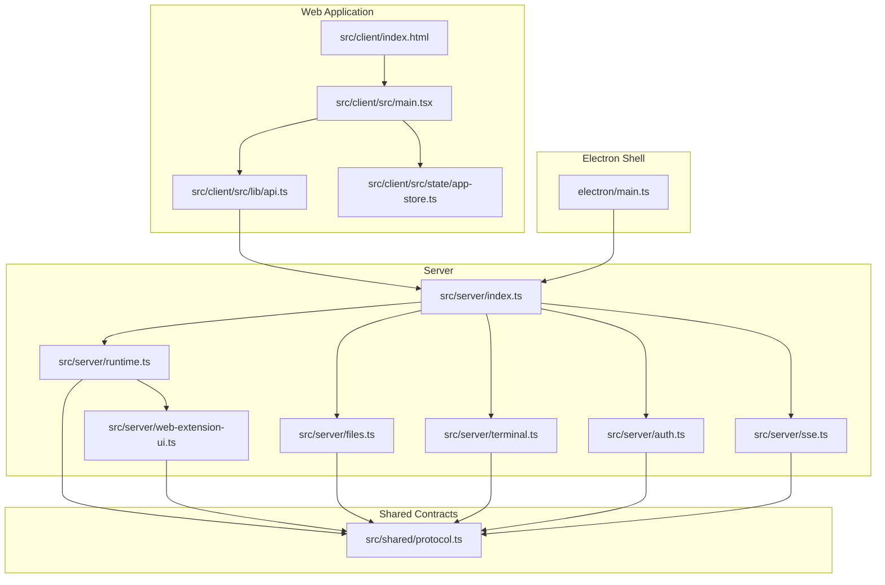
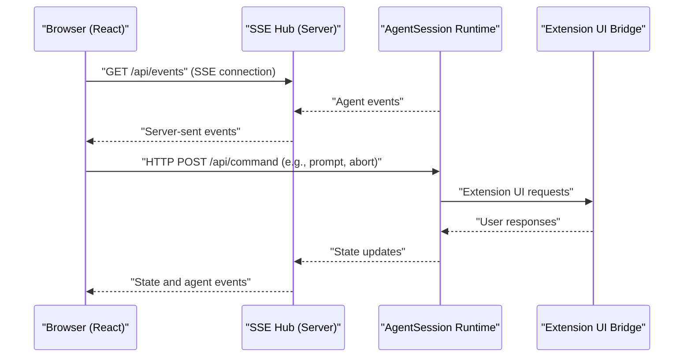
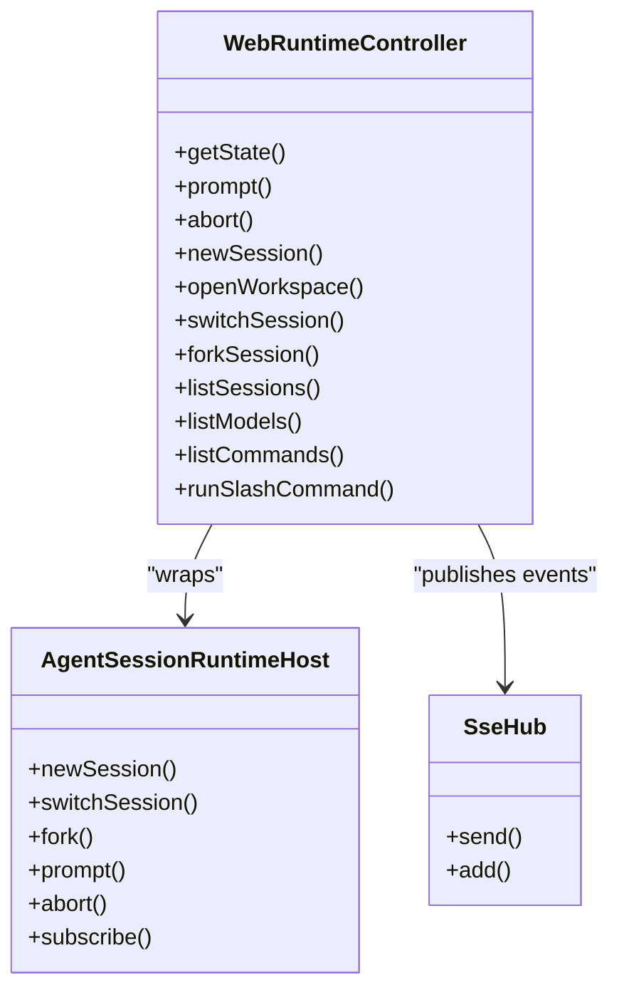
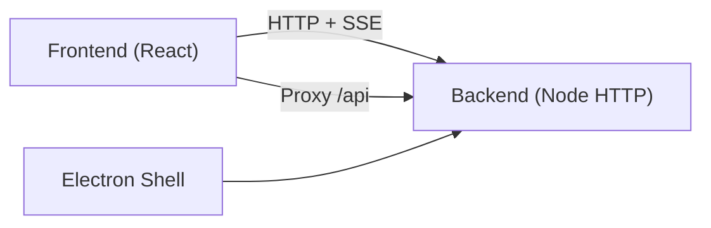

# Getting Started

<cite>
**Referenced Files in This Document**
- [README.md](file://README.md)
- [package.json](file://package.json)
- [vite.config.ts](file://vite.config.ts)
- [tsconfig.json](file://tsconfig.json)
- [src/client/index.html](file://src/client/index.html)
- [src/client/src/main.tsx](file://src/client/src/main.tsx)
- [src/server/index.ts](file://src/server/index.ts)
- [src/server/runtime.ts](file://src/server/runtime.ts)
- [src/shared/protocol.ts](file://src/shared/protocol.ts)
- [electron/main.ts](file://electron/main.ts)
- [docs/architecture.md](file://docs/architecture.md)
- [.quake-code/web-settings.json](file://.quake-code/web-settings.json)
</cite>

## Table of Contents
1. [Introduction](#introduction)
2. [Project Structure](#project-structure)
3. [Core Components](#core-components)
4. [Architecture Overview](#architecture-overview)
5. [Detailed Component Analysis](#detailed-component-analysis)
6. [Dependency Analysis](#dependency-analysis)
7. [Performance Considerations](#performance-considerations)
8. [Troubleshooting Guide](#troubleshooting-guide)
9. [Conclusion](#conclusion)
10. [Appendices](#appendices)

## Introduction
This guide helps you install, configure, and run Quake Code Web locally. It covers prerequisites, development environment setup, npm workspace usage, environment variables, and how the web application integrates with the AgentSession runtime. You will learn how to start the development server, access the UI, and understand the project's architecture and security posture.

## Project Structure
Quake Code Web is a React + TypeScript + Vite application with a Node.js HTTP server and an embedded Electron desktop shell. The frontend (React) communicates with the backend (Node server) over HTTP and Server-Sent Events (SSE). The backend hosts the AgentSession runtime and bridges it to the browser.

**Diagram sources**
- [src/client/index.html:1-27](file://src/client/index.html#L1-L27)
- [src/client/src/main.tsx:1-120](file://src/client/src/main.tsx#L1-L120)
- [src/server/index.ts:1-120](file://src/server/index.ts#L1-L120)
- [src/server/runtime.ts:1-60](file://src/server/runtime.ts#L1-L60)
- [src/shared/protocol.ts:1-60](file://src/shared/protocol.ts#L1-L60)
- [electron/main.ts:1-60](file://electron/main.ts#L1-L60)

**Section sources**
- [docs/architecture.md:1-45](file://docs/architecture.md#L1-L45)
- [README.md:1-120](file://README.md#L1-L120)

## Core Components
- Frontend (React/Vite): Provides the IDE-like UI, session management, file explorer, terminal, settings, and markdown rendering. It connects to the backend via HTTP and SSE.
- Backend (Node HTTP server): Exposes REST endpoints and SSE for runtime events. It owns the AgentSession runtime and extension bindings.
- Electron shell: Bundles the server and frontend into a desktop app, manages window lifecycle, and proxies to the local server.
- Shared protocol: Defines event/command contracts between frontend and backend.

Key entry points:
- Frontend: [src/client/index.html:1-27](file://src/client/index.html#L1-L27), [src/client/src/main.tsx:570-620](file://src/client/src/main.tsx#L570-L620)
- Backend: [src/server/index.ts:400-470](file://src/server/index.ts#L400-L470)
- Electron: [electron/main.ts:120-171](file://electron/main.ts#L120-L171)

**Section sources**
- [src/client/src/main.tsx:570-620](file://src/client/src/main.tsx#L570-L620)
- [src/server/index.ts:400-470](file://src/server/index.ts#L400-L470)
- [electron/main.ts:120-171](file://electron/main.ts#L120-L171)

## Architecture Overview
Quake Code Web follows a strict runtime parity model: the browser uses the same AgentSession runtime as the TUI. The server initializes the runtime, subscribes to events, and streams them to the browser via SSE. The frontend renders the UI and sends commands back to the server.

**Diagram sources**
- [src/server/index.ts:400-470](file://src/server/index.ts#L400-L470)
- [src/server/runtime.ts:450-456](file://src/server/runtime.ts#L450-L456)
- [src/shared/protocol.ts:161-169](file://src/shared/protocol.ts#L161-L169)

**Section sources**
- [docs/architecture.md:1-45](file://docs/architecture.md#L1-L45)
- [src/server/runtime.ts:12-30](file://src/server/runtime.ts#L12-L30)

## Detailed Component Analysis

### Development Environment Setup
- Prerequisites
  - Node.js LTS and npm
  - Git (for workspace operations)
  - Optional: Python (for scripts)
- Install dependencies
  - Use the workspace-aware npm scripts defined in the package manifest.
- Start the development server
  - Run the combined dev script to launch the backend and frontend concurrently.
  - Access the UI at the Vite dev server address.

Step-by-step:
1. Open a terminal in the repository root.
2. Install dependencies using the workspace-aware npm command.
3. Start the dev server with the provided script.
4. Open the UI in your browser at the Vite address.

Environment variables (commonly used):
- Host/port binding and workspace root
- Token and auth behavior
- Terminal policy
- Remote access allowance

**Section sources**
- [README.md:30-62](file://README.md#L30-L62)
- [package.json:8-24](file://package.json#L8-L24)
- [vite.config.ts:43-48](file://vite.config.ts#L43-L48)

### Running Locally
- Dev server
  - The dev script starts the Node server and Vite dev server concurrently.
  - The Vite dev server serves the React app and proxies API requests to the backend.
- Desktop shell
  - Electron launches the app, starts the backend, and loads the UI.
  - In development, Electron waits for the backend and Vite servers to be ready.

**Section sources**
- [README.md:30-62](file://README.md#L30-L62)
- [package.json:17-18](file://package.json#L17-L18)
- [electron/main.ts:26-43](file://electron/main.ts#L26-L43)

### Environment Variables
Configure behavior via environment variables. Defaults bind to localhost and enable local token auth.

Common variables:
- Host and port binding
- Workspace root
- Token and auth controls
- Terminal policy
- Remote access allowance
- Workspace allowlist

Notes:
- The server validates host and workspace settings and refuses wildcard remote binds unless explicitly allowed.
- Token injection is supported for development builds.

**Section sources**
- [README.md:116-130](file://README.md#L116-L130)
- [src/server/index.ts:56-61](file://src/server/index.ts#L56-L61)
- [vite.config.ts:6-19](file://vite.config.ts#L6-L19)

### Accessing the Development Server
- Vite dev server: http://127.0.0.1:5173
- Production build: http://127.0.0.1:3737 (by default)
- Proxy: Vite proxies /api to the backend server.

**Section sources**
- [README.md:36-61](file://README.md#L36-L61)
- [vite.config.ts:43-48](file://vite.config.ts#L43-L48)

### Project Structure Overview
- Client (frontend)
  - HTML shell, React app entry, state/store, and UI components
- Server (backend)
  - HTTP/SSE entrypoint, runtime bridge, file operations, terminal, auth, and settings
- Shared contracts
  - Protocol types for events, commands, and state
- Electron
  - Desktop app bootstrap, window management, and server lifecycle

**Section sources**
- [docs/architecture.md:15-45](file://docs/architecture.md#L15-L45)
- [src/client/index.html:1-27](file://src/client/index.html#L1-L27)
- [src/server/index.ts:1-120](file://src/server/index.ts#L1-L120)
- [src/shared/protocol.ts:1-60](file://src/shared/protocol.ts#L1-L60)

### Key Dependencies
- Frontend
  - React, ReactDOM, Zustand for state, Monaco Editor, xterm.js, Tailwind CSS, and streaming libraries
- Backend
  - Node HTTP server, SSE hub, terminal runner, file services, and security utilities
- Electron
  - Window lifecycle, IPC, and server process management

**Section sources**
- [package.json:25-67](file://package.json#L25-L67)

### Development Workflow
- Start dev: concurrently runs the backend and frontend
- Build: compiles the frontend and prepares the server bundle
- Type check: validates TypeScript definitions
- Desktop: builds the Electron main process and runs the app

**Section sources**
- [package.json:8-24](file://package.json#L8-L24)

### Relationship Between Web App and AgentSession Runtime
- The server creates and owns the AgentSession runtime and subscribes to events.
- The frontend listens to SSE events and renders the UI.
- Commands from the UI are sent to the backend, which executes them against the runtime.
- Extension UI requests are bridged from the runtime to the UI.

**Diagram sources**
- [src/server/runtime.ts:12-30](file://src/server/runtime.ts#L12-L30)
- [src/server/runtime.ts:32-54](file://src/server/runtime.ts#L32-L54)
- [src/server/runtime.ts:452-456](file://src/server/runtime.ts#L452-L456)

**Section sources**
- [src/server/runtime.ts:12-30](file://src/server/runtime.ts#L12-L30)
- [src/shared/protocol.ts:161-169](file://src/shared/protocol.ts#L161-L169)

## Dependency Analysis
- Frontend-to-backend communication
  - HTTP endpoints for commands and data
  - SSE for real-time runtime events
- Electron-to-server
  - Electron starts the backend and loads the UI
  - Proxies API calls to the backend during development

**Diagram sources**
- [vite.config.ts:43-48](file://vite.config.ts#L43-L48)
- [electron/main.ts:120-171](file://electron/main.ts#L120-L171)

**Section sources**
- [vite.config.ts:43-48](file://vite.config.ts#L43-L48)
- [electron/main.ts:120-171](file://electron/main.ts#L120-L171)

## Performance Considerations
- SSE is used for event streaming; avoid excessive event volume.
- Terminal output streaming uses SSE; consider timeouts and limits.
- Frontend lazy-loads heavy components (Monaco, terminal) to reduce initial bundle size.
- Chunking separates vendor and editor bundles for caching.

**Section sources**
- [src/client/src/main.tsx:59-80](file://src/client/src/main.tsx#L59-L80)
- [vite.config.ts:36-42](file://vite.config.ts#L36-L42)

## Troubleshooting Guide
- Cannot start dev server
  - Ensure Node.js and npm are installed and the workspace is initialized.
  - Verify the dev script runs both backend and frontend concurrently.
- Port conflicts
  - Change the backend port via environment variable.
  - Ensure the Vite dev server port is free.
- Authentication errors
  - Local token auth is enabled by default; ensure the token is present or disable auth only for trusted local experiments.
- Remote access refused
  - By default, the server refuses wildcard remote binds; set the allow flag only after hardening.
- Electron fails to start
  - Electron waits for backend and Vite to be ready; confirm both are listening.

**Section sources**
- [README.md:116-130](file://README.md#L116-L130)
- [src/server/index.ts:56-61](file://src/server/index.ts#L56-L61)
- [electron/main.ts:26-43](file://electron/main.ts#L26-L43)

## Conclusion
You are now ready to develop and run Quake Code Web locally. The web app shares the same AgentSession runtime as the TUI, ensuring parity in sessions, models, tools, and extensions. Use the provided scripts and environment variables to tailor the development experience, and rely on the SSE-based event stream for real-time updates.

## Appendices

### A. Environment Variable Reference
- Host and port binding
- Workspace root and allowlist
- Token and auth controls
- Terminal policy
- Remote access allowance

**Section sources**
- [README.md:116-128](file://README.md#L116-L128)

### B. Initial Configuration Tips
- Set the workspace root to your project folder.
- Configure models and settings via the runtime and web settings.
- Adjust terminal policy for your environment.

**Section sources**
- [.quake-code/web-settings.json:1-11](file://.quake-code/web-settings.json#L1-L11)
- [src/server/web-settings.ts:1-40](file://src/server/web-settings.ts#L1-L40)
