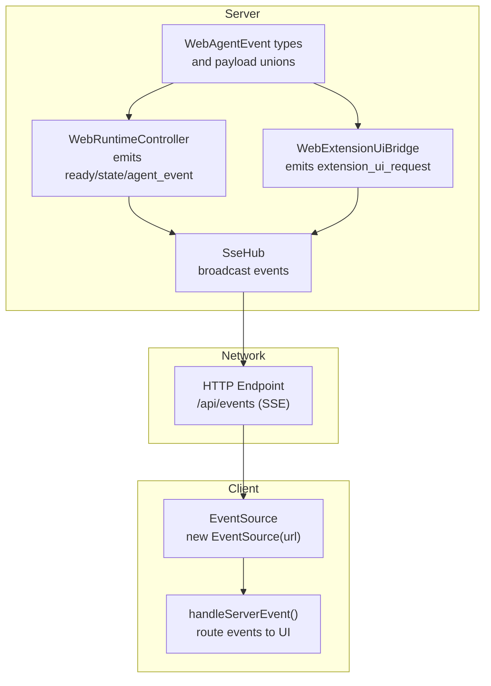
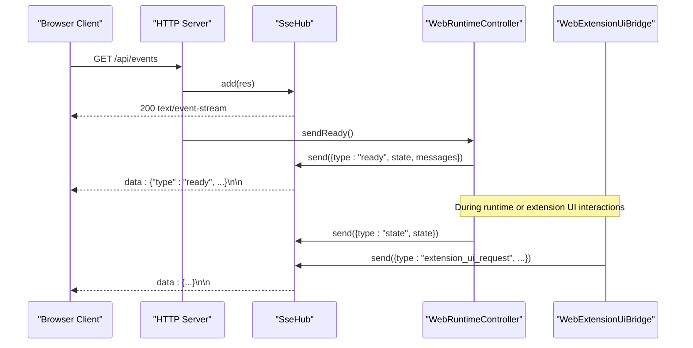
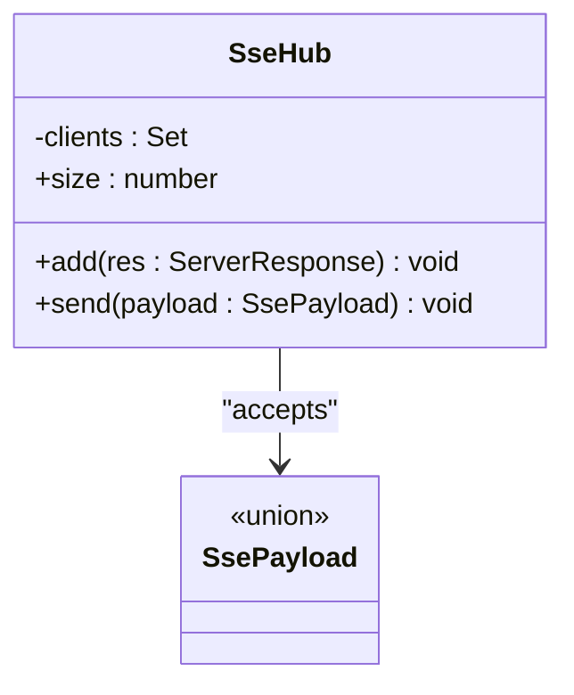
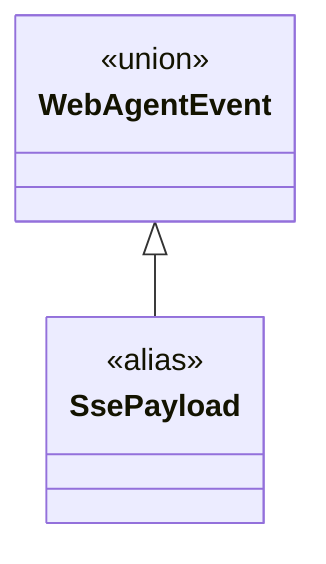
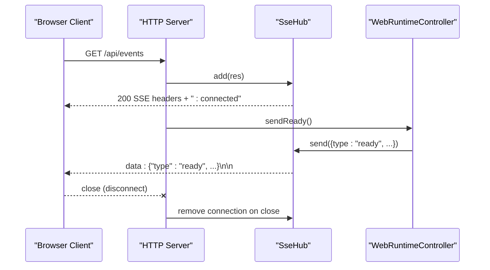
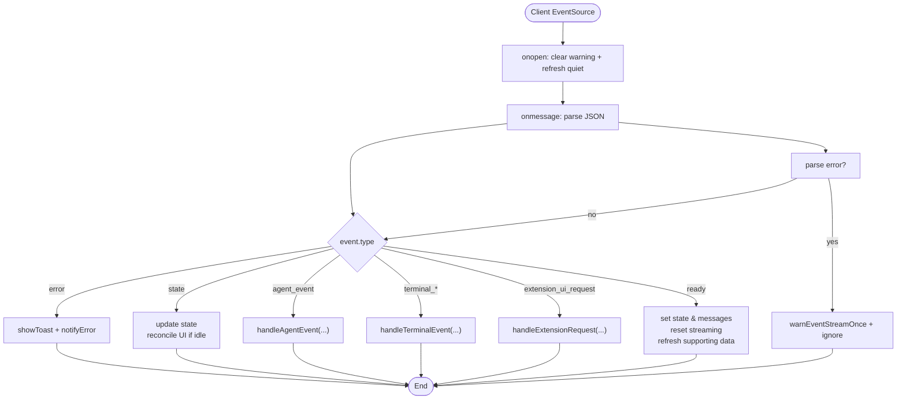
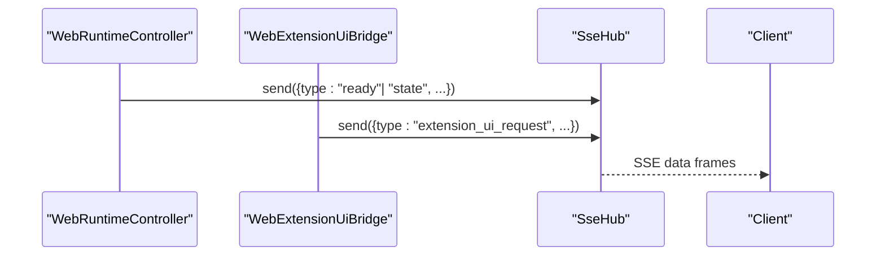
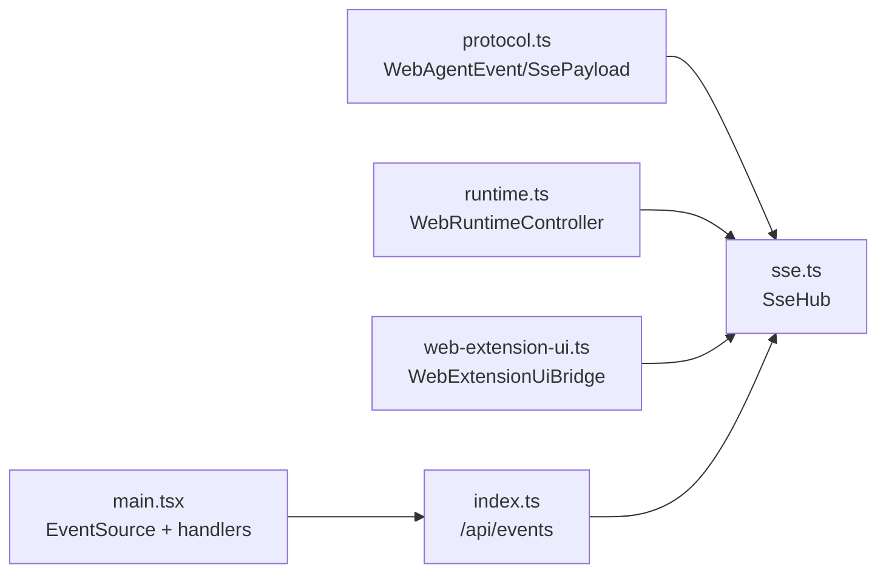

# Event System and SSE

<cite>
**Referenced Files in This Document**
- [sse.ts](file://src/server/sse.ts)
- [protocol.ts](file://src/shared/protocol.ts)
- [index.ts](file://src/server/index.ts)
- [runtime.ts](file://src/server/runtime.ts)
- [web-extension-ui.ts](file://src/server/web-extension-ui.ts)
- [main.tsx](file://src/client/src/main.tsx)
</cite>

## Table of Contents
1. [Introduction](#introduction)
2. [Project Structure](#project-structure)
3. [Core Components](#core-components)
4. [Architecture Overview](#architecture-overview)
5. [Detailed Component Analysis](#detailed-component-analysis)
6. [Dependency Analysis](#dependency-analysis)
7. [Performance Considerations](#performance-considerations)
8. [Troubleshooting Guide](#troubleshooting-guide)
9. [Conclusion](#conclusion)

## Introduction
This document explains the Server-Sent Events (SSE) implementation that powers real-time communication between the server and browser client. It covers the SseHub class architecture, event broadcasting mechanisms, client-side event listeners, WebAgentEvent types, subscription management, and connection lifecycle. It also documents error handling, reconnection strategies, and performance optimizations for high-frequency events. Practical examples demonstrate how to implement new event types, debug event streams, and handle network interruptions gracefully.

## Project Structure
The SSE system spans three layers:
- Server-side hub and event types
- Server-side runtime and extension UI bridge
- Client-side EventSource listener and event handlers

**Diagram sources**
- [sse.ts:6-31](file://src/server/sse.ts#L6-L31)
- [runtime.ts:56-58](file://src/server/runtime.ts#L56-L58)
- [web-extension-ui.ts:62-122](file://src/server/web-extension-ui.ts#L62-L122)
- [protocol.ts:161-169](file://src/shared/protocol.ts#L161-L169)
- [index.ts:408-412](file://src/server/index.ts#L408-L412)
- [main.tsx:572-588](file://src/client/src/main.tsx#L572-L588)

**Section sources**
- [sse.ts:1-32](file://src/server/sse.ts#L1-L32)
- [protocol.ts:161-169](file://src/shared/protocol.ts#L161-L169)
- [index.ts:408-412](file://src/server/index.ts#L408-L412)
- [main.tsx:572-588](file://src/client/src/main.tsx#L572-L588)

## Core Components
- SseHub: Manages SSE connections and broadcasts payloads to all connected clients.
- WebAgentEvent: Union of server-to-client event types (ready, state, agent_event, terminal_* variants, error, extension_ui_request).
- WebRuntimeController: Emits initial ready event and periodic state updates.
- WebExtensionUiBridge: Bridges extension UI requests to the client via SSE.
- Client EventSource: Subscribes to /api/events and routes incoming events to UI handlers.

Key responsibilities:
- Server registers SSE endpoint and delegates subscription to SseHub.
- Runtime emits ready and state events; extension UI emits UI request events.
- Client opens EventSource, parses messages, and dispatches to handlers.

**Section sources**
- [sse.ts:6-31](file://src/server/sse.ts#L6-L31)
- [protocol.ts:161-169](file://src/shared/protocol.ts#L161-L169)
- [runtime.ts:56-58](file://src/server/runtime.ts#L56-L58)
- [web-extension-ui.ts:62-122](file://src/server/web-extension-ui.ts#L62-L122)
- [main.tsx:1144-1177](file://src/client/src/main.tsx#L1144-L1177)

## Architecture Overview
The SSE pipeline connects server-side runtime and extension UI to the browser via a dedicated HTTP endpoint.

**Diagram sources**
- [index.ts:408-412](file://src/server/index.ts#L408-L412)
- [sse.ts:9-19](file://src/server/sse.ts#L9-L19)
- [runtime.ts:56-58](file://src/server/runtime.ts#L56-L58)
- [web-extension-ui.ts:62-122](file://src/server/web-extension-ui.ts#L62-L122)

## Detailed Component Analysis

### SseHub: SSE Broadcast Engine
SseHub maintains a set of active ServerResponse connections and writes SSE-formatted payloads to all clients.

Implementation highlights:
- Sets SSE headers and writes an initial keepalive comment upon subscription.
- On client close, removes the connection from the set.
- Serializes payloads to JSON and sends as SSE data blocks.

Operational notes:
- No batching or throttling; each event is written immediately to all clients.
- Clients are tracked via ServerResponse instances; connection cleanup occurs on close.

**Diagram sources**
- [sse.ts:6-31](file://src/server/sse.ts#L6-L31)

**Section sources**
- [sse.ts:6-31](file://src/server/sse.ts#L6-L31)

### WebAgentEvent Types and Payloads
WebAgentEvent defines the server-to-client event contract. It includes:
- ready: Initial handshake with session state and messages.
- state: Periodic session state updates.
- agent_event: Arbitrary agent-generated events.
- terminal_*: Lifecycle and streaming events for terminal sessions.
- error: Error notifications.
- extension_ui_request: UI dialog and widget requests initiated by extensions.

These types are unioned into SsePayload, enabling SseHub to broadcast either WebAgentEvent or WebCommandResponse.

**Diagram sources**
- [protocol.ts:161-169](file://src/shared/protocol.ts#L161-L169)
- [sse.ts:4](file://src/server/sse.ts#L4)

**Section sources**
- [protocol.ts:161-169](file://src/shared/protocol.ts#L161-L169)
- [sse.ts:4](file://src/server/sse.ts#L4)

### Server Subscription and Connection Lifecycle
The server exposes /api/events as an SSE endpoint. Upon subscription:
- The response headers are set for SSE.
- A keepalive comment is sent.
- The connection is registered in SseHub.
- On close, the connection is removed.

The runtime triggers the initial ready event after subscription.

**Diagram sources**
- [index.ts:408-412](file://src/server/index.ts#L408-L412)
- [sse.ts:9-19](file://src/server/sse.ts#L9-L19)
- [runtime.ts:56-58](file://src/server/runtime.ts#L56-L58)

**Section sources**
- [index.ts:408-412](file://src/server/index.ts#L408-L412)
- [sse.ts:9-19](file://src/server/sse.ts#L9-L19)
- [runtime.ts:56-58](file://src/server/runtime.ts#L56-L58)

### Client-Side Event Listeners and Handlers
The client opens an EventSource to /api/events and handles:
- onopen: Clears warnings and refreshes session state quietly.
- onmessage: Parses JSON and dispatches to handleServerEvent.
- onerror: Refreshes session state if streaming is not active and dangling UI state exists.
- cleanup: Closes the EventSource on unmount.

The handler routes events to specialized processors:
- ready: Initializes state, resets streaming, and refreshes supporting data.
- state: Updates session state; reconciles UI if streaming ends.
- agent_event: Processes agent-specific events.
- terminal_*: Handles terminal lifecycle and output.
- extension_ui_request: Renders extension UI dialogs/widgets.
- error: Displays error notifications.

**Diagram sources**
- [main.tsx:572-588](file://src/client/src/main.tsx#L572-L588)
- [main.tsx:1144-1177](file://src/client/src/main.tsx#L1144-L1177)
- [main.tsx:1178-1191](file://src/client/src/main.tsx#L1178-L1191)

**Section sources**
- [main.tsx:572-588](file://src/client/src/main.tsx#L572-L588)
- [main.tsx:1144-1177](file://src/client/src/main.tsx#L1144-L1177)
- [main.tsx:1178-1191](file://src/client/src/main.tsx#L1178-L1191)

### Runtime and Extension UI Event Emission
WebRuntimeController emits:
- ready: Initial session state and messages.
- state: Periodic state snapshots.

WebExtensionUiBridge emits:
- extension_ui_request: UI dialogs, notifications, status updates, widgets, and editor text updates.

Both rely on SseHub.send to broadcast to all clients.

**Diagram sources**
- [runtime.ts:56-58](file://src/server/runtime.ts#L56-L58)
- [web-extension-ui.ts:62-122](file://src/server/web-extension-ui.ts#L62-L122)
- [sse.ts:21-26](file://src/server/sse.ts#L21-L26)

**Section sources**
- [runtime.ts:56-58](file://src/server/runtime.ts#L56-L58)
- [web-extension-ui.ts:62-122](file://src/server/web-extension-ui.ts#L62-L122)
- [sse.ts:21-26](file://src/server/sse.ts#L21-L26)

## Dependency Analysis
High-level dependencies:
- SseHub depends on WebAgentEvent/WebCommandResponse types.
- WebRuntimeController and WebExtensionUiBridge depend on SseHub.
- Server HTTP endpoint depends on SseHub and WebRuntimeController.
- Client EventSource depends on server SSE endpoint and main.tsx handlers.

**Diagram sources**
- [protocol.ts:161-169](file://src/shared/protocol.ts#L161-L169)
- [sse.ts:4](file://src/server/sse.ts#L4)
- [runtime.ts:56-58](file://src/server/runtime.ts#L56-L58)
- [web-extension-ui.ts:62-122](file://src/server/web-extension-ui.ts#L62-L122)
- [index.ts:408-412](file://src/server/index.ts#L408-L412)
- [main.tsx:572-588](file://src/client/src/main.tsx#L572-L588)

**Section sources**
- [protocol.ts:161-169](file://src/shared/protocol.ts#L161-L169)
- [sse.ts:4](file://src/server/sse.ts#L4)
- [runtime.ts:56-58](file://src/server/runtime.ts#L56-L58)
- [web-extension-ui.ts:62-122](file://src/server/web-extension-ui.ts#L62-L122)
- [index.ts:408-412](file://src/server/index.ts#L408-L412)
- [main.tsx:572-588](file://src/client/src/main.tsx#L572-L588)

## Performance Considerations
- Connection scale: SseHub stores all ServerResponse connections in memory. Each outgoing event iterates over all clients and writes synchronously. For many concurrent clients, consider:
  - Connection pooling and pruning idle connections.
  - Backpressure: drop or coalesce events when client count exceeds thresholds.
  - Compression or binary framing (requires protocol change).
- Event frequency: Terminal output and agent events can be high-frequency. To reduce overhead:
  - Batch small terminal_output events per tick.
  - Debounce frequent state updates.
  - Use selective subscriptions (future enhancement).
- Serialization cost: JSON.stringify is called per client per event. Consider:
  - Reuse serialized buffers when payloads are identical.
  - Avoid deep cloning of large payloads.
- Network buffering: X-Accel-Buffering is disabled to prevent proxy buffering. Ensure upstream proxies are configured appropriately.

[No sources needed since this section provides general guidance]

## Troubleshooting Guide
Common issues and remedies:
- Broken or malformed events:
  - Client ignores unparsable messages and logs a single warning. Verify server payloads conform to WebAgentEvent/WebCommandResponse.
- Frequent reconnects:
  - SSE keepalive comment is sent on connect. If the client's onerror triggers repeated refreshes, check whether streaming is active or dangling UI state remains.
- Missing initial state:
  - Ensure /api/events is requested after server startup and that runtime.sendReady is invoked post-subscription.
- Terminal output gaps:
  - Verify terminal hooks emit terminal_start, terminal_output, and terminal_end events consistently.
- Extension UI not appearing:
  - Confirm extension_ui_request events are emitted and routed to handleExtensionRequest.

Debugging tips:
- Inspect browser DevTools Network tab for /api/events SSE stream.
- Add logging around SseHub.send and client onmessage to trace delivery.
- Validate event shapes against WebAgentEvent union.

**Section sources**
- [main.tsx:1178-1191](file://src/client/src/main.tsx#L1178-L1191)
- [runtime.ts:56-58](file://src/server/runtime.ts#L56-L58)
- [index.ts:408-412](file://src/server/index.ts#L408-L412)

## Conclusion
The SSE implementation provides a lightweight, scalable mechanism for server-to-browser real-time updates. SseHub centralizes connection management and broadcasting, while WebAgentEvent defines a clear contract for diverse event types. The client's EventSource listener and robust handler routing ensure resilient UI updates. For production workloads, consider batching, debouncing, and connection pruning to optimize performance under high-frequency or many-concurrent-client scenarios.
