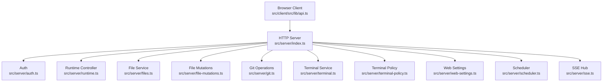
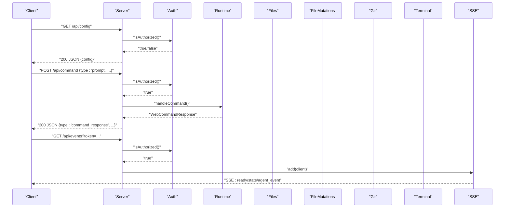
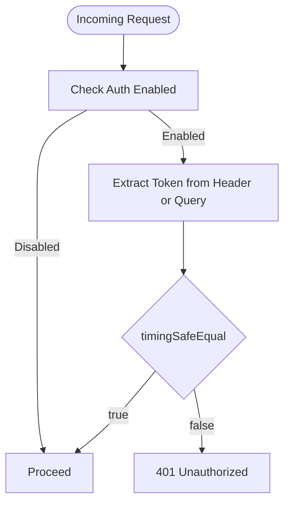
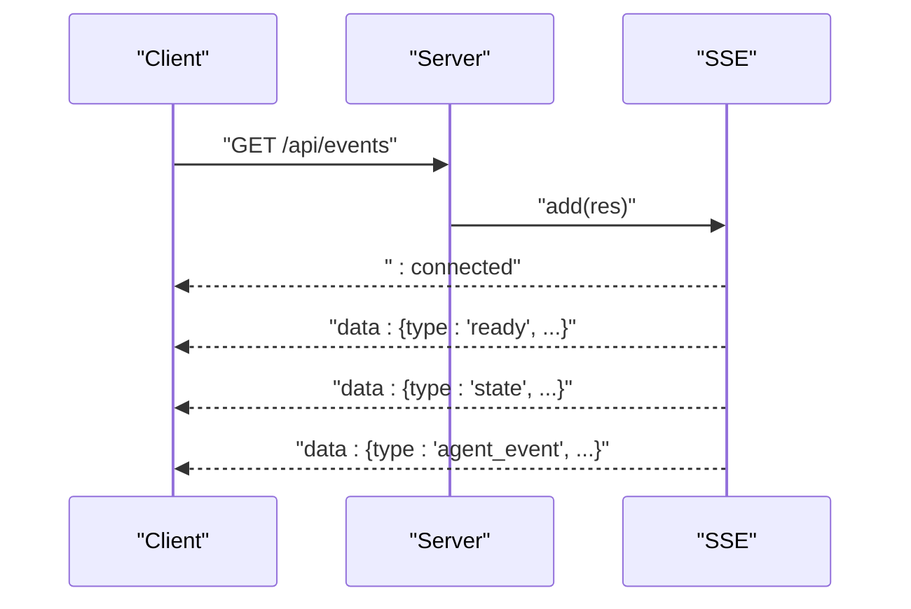
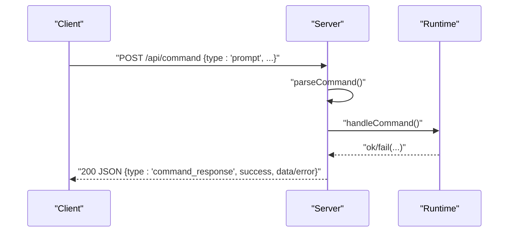
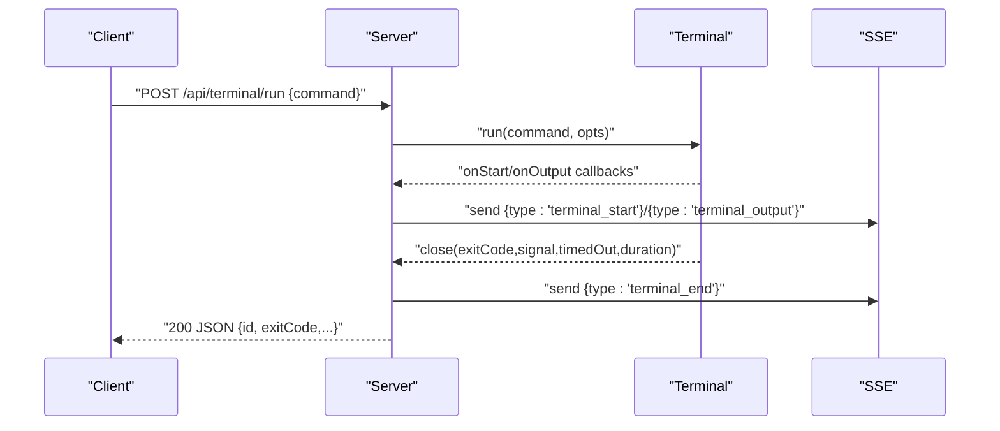
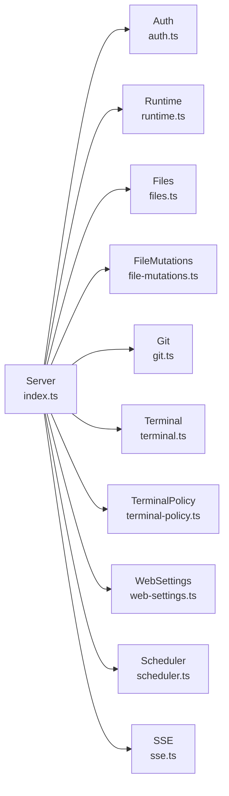

# HTTP API Contracts

<cite>
**Referenced Files in This Document**
- [index.ts](file://src/server/index.ts)
- [auth.ts](file://src/server/auth.ts)
- [protocol.ts](file://src/shared/protocol.ts)
- [api.ts](file://src/client/src/lib/api.ts)
- [files.ts](file://src/server/files.ts)
- [file-mutations.ts](file://src/server/file-mutations.ts)
- [git.ts](file://src/server/git.ts)
- [terminal.ts](file://src/server/terminal.ts)
- [terminal-policy.ts](file://src/server/terminal-policy.ts)
- [web-settings.ts](file://src/server/web-settings.ts)
- [runtime.ts](file://src/server/runtime.ts)
- [sse.ts](file://src/server/sse.ts)
- [scheduler.ts](file://src/server/scheduler.ts)
</cite>

## Table of Contents
1. [Introduction](#introduction)
2. [Project Structure](#project-structure)
3. [Core Components](#core-components)
4. [Architecture Overview](#architecture-overview)
5. [Detailed Component Analysis](#detailed-component-analysis)
6. [Dependency Analysis](#dependency-analysis)
7. [Performance Considerations](#performance-considerations)
8. [Troubleshooting Guide](#troubleshooting-guide)
9. [Conclusion](#conclusion)
10. [Appendices](#appendices)

## Introduction
This document defines the HTTP API contracts for the Quake Code Web server. It covers all REST endpoints, request and response formats, authentication, session and command handling, file operations, terminal execution, scheduling, and security headers. It also documents the WebClientCommand types and WebCommandResponse handling, along with error response formats and practical client implementation guidance.

## Project Structure
The HTTP server is implemented in a single entry module and orchestrates services for runtime, files, terminals, settings, scheduling, and Git operations. Client-side API helpers encapsulate authentication and request semantics.

**Diagram sources**
- [index.ts:401-662](file://src/server/index.ts#L401-L662)
- [auth.ts:6-55](file://src/server/auth.ts#L6-L55)
- [runtime.ts:12-30](file://src/server/runtime.ts#L12-L30)
- [files.ts:13-131](file://src/server/files.ts#L13-L131)
- [file-mutations.ts:13-140](file://src/server/file-mutations.ts#L13-L140)
- [git.ts:165-334](file://src/server/git.ts#L165-L334)
- [terminal.ts:21-87](file://src/server/terminal.ts#L21-L87)
- [terminal-policy.ts:21-39](file://src/server/terminal-policy.ts#L21-L39)
- [web-settings.ts:13-64](file://src/server/web-settings.ts#L13-L64)
- [scheduler.ts:54-242](file://src/server/scheduler.ts#L54-L242)
- [sse.ts:6-32](file://src/server/sse.ts#L6-L32)

**Section sources**
- [index.ts:401-662](file://src/server/index.ts#L401-L662)

## Core Components
- Authentication: Token-based protection via header or query parameter; token injected into HTML for client usage.
- Command API: JSON payload sent to POST /api/command; responses conform to WebCommandResponse.
- SSE Events: Long-lived connection at /api/events for real-time updates.
- File APIs: List, search, read, write, patch, delete, mkdir, rename, and history.
- Terminal APIs: Run and stop commands with policy enforcement and streaming output.
- Git APIs: Status, branch, diff, stage/unstage, commit, push, and PR creation.
- Scheduler APIs: CRUD and run-now for scheduled tasks.
- Settings: Read and patch web settings.

**Section sources**
- [auth.ts:15-29](file://src/server/auth.ts#L15-L29)
- [protocol.ts:171-198](file://src/shared/protocol.ts#L171-L198)
- [sse.ts:6-32](file://src/server/sse.ts#L6-L32)
- [files.ts:16-61](file://src/server/files.ts#L16-L61)
- [file-mutations.ts:21-98](file://src/server/file-mutations.ts#L21-L98)
- [git.ts:165-334](file://src/server/git.ts#L165-L334)
- [terminal.ts:36-85](file://src/server/terminal.ts#L36-L85)
- [web-settings.ts:21-60](file://src/server/web-settings.ts#L21-L60)
- [scheduler.ts:75-154](file://src/server/scheduler.ts#L75-L154)

## Architecture Overview
The server exposes REST endpoints and SSE for real-time updates. Authentication is enforced for protected routes. Commands are parsed and dispatched to the runtime controller, which interacts with services for files, terminals, Git, and scheduling.

**Diagram sources**
- [index.ts:401-662](file://src/server/index.ts#L401-L662)
- [auth.ts:15-29](file://src/server/auth.ts#L15-L29)
- [runtime.ts:255-374](file://src/server/runtime.ts#L255-L374)
- [sse.ts:9-26](file://src/server/sse.ts#L9-L26)

## Detailed Component Analysis

### Authentication and Authorization
- Mechanism: Optional token-based auth. Enabled when environment variable indicates so.
- Methods:
  - Header: X-Quake-Web-Token
  - Query: token
- Token injection: HTML served to client includes a script tag embedding the token for client usage.
- Behavior: Requests to protected routes are rejected with 401 if unauthorized.

**Diagram sources**
- [auth.ts:15-29](file://src/server/auth.ts#L15-L29)
- [index.ts:404-407](file://src/server/index.ts#L404-L407)

**Section sources**
- [auth.ts:6-55](file://src/server/auth.ts#L6-L55)
- [api.ts:7-14](file://src/client/src/lib/api.ts#L7-L14)

### Security Headers
The server sets defensive headers on all JSON responses and static assets.

- Headers: X-Content-Type-Options, Referrer-Policy, Cross-Origin-Resource-Policy, Cross-Origin-Opener-Policy, Permissions-Policy

**Section sources**
- [index.ts:97-105](file://src/server/index.ts#L97-L105)

### SSE Event Stream
- Endpoint: GET /api/events
- Purpose: Establish long-lived connection for real-time updates.
- Payloads: WebAgentEvent variants including ready, state, agent_event, terminal_* events, and command responses.

**Diagram sources**
- [index.ts:408-412](file://src/server/index.ts#L408-L412)
- [sse.ts:9-26](file://src/server/sse.ts#L9-L26)
- [protocol.ts:161-169](file://src/shared/protocol.ts#L161-L169)

**Section sources**
- [sse.ts:6-32](file://src/server/sse.ts#L6-L32)

### Command API
- Endpoint: POST /api/command
- Request: JSON body parsed as WebClientCommand
- Response: WebCommandResponse indicating success or failure with optional data

Supported command types include prompt, abort, session/workspace/session management, model/thinking settings, plan clarifications, slash commands, and extension UI responses.

**Diagram sources**
- [index.ts:626-630](file://src/server/index.ts#L626-L630)
- [protocol.ts:171-198](file://src/shared/protocol.ts#L171-L198)
- [runtime.ts:255-374](file://src/server/runtime.ts#L255-L374)

**Section sources**
- [index.ts:626-630](file://src/server/index.ts#L626-L630)
- [protocol.ts:171-198](file://src/shared/protocol.ts#L171-L198)

### File Operations API
- List entries: GET /api/files?path=...&hidden=1&generated=1
- Search entries: GET /api/files/search?q=...&hidden=1&generated=1&limit=...
- Read file preview: GET /api/file?path=...
- Write file: POST /api/file/write {path, content, createBackup?}
- Patch file: POST /api/file/patch {path, patches: [{oldText,newText},...]}
- Delete file: POST /api/file/delete {path}
- Create directory: POST /api/file/mkdir {path}
- Rename entry: POST /api/file/rename {from,to}
- History: GET /api/file/history?path=...
- Restore: POST /api/file/restore {versionId}

Responses are JSON objects. Errors include 400/403/404/413 depending on operation and validation.

**Section sources**
- [index.ts:568-625](file://src/server/index.ts#L568-L625)
- [files.ts:16-61](file://src/server/files.ts#L16-L61)
- [file-mutations.ts:21-98](file://src/server/file-mutations.ts#L21-L98)

### Terminal Execution API
- Run command: POST /api/terminal/run {id?, command, timeoutMs?}
  - Emits terminal_start, terminal_output, terminal_end via SSE
  - Returns {id, exitCode, signal, stdout, stderr, durationMs, timedOut}
- Stop command: POST /api/terminal/stop {id}
  - Returns {stopped: boolean}

Policy enforcement prevents dangerous commands based on configured mode.

**Diagram sources**
- [index.ts:631-650](file://src/server/index.ts#L631-L650)
- [terminal.ts:36-85](file://src/server/terminal.ts#L36-L85)
- [terminal-policy.ts:24-32](file://src/server/terminal-policy.ts#L24-L32)
- [sse.ts:21-26](file://src/server/sse.ts#L21-L26)

**Section sources**
- [index.ts:631-650](file://src/server/index.ts#L631-L650)
- [terminal.ts:21-87](file://src/server/terminal.ts#L21-L87)
- [terminal-policy.ts:1-39](file://src/server/terminal-policy.ts#L1-L39)

### Git Operations API
- Status: GET /api/git/status
- Branch: GET /api/git/branch
- Diff: GET /api/git/diff?path=&staged=0|1
- Stage: POST /api/git/stage {paths:[]}
- Unstage: POST /api/git/unstage {paths:[]}
- Commit: POST /api/git/commit {message}
- Push: POST /api/git/push
- PR: POST /api/git/pr {title,body}

Responses are JSON with operation-specific shapes; errors indicate underlying Git failures or missing prerequisites.

**Section sources**
- [index.ts:478-513](file://src/server/index.ts#L478-L513)
- [git.ts:165-334](file://src/server/git.ts#L165-L334)

### Scheduler API
- List tasks: GET /api/scheduled
- Create task: POST /api/scheduled {name,cron,prompt,enabled?}
- Update task: PATCH /api/scheduled/:id {fields}
- Remove task: DELETE /api/scheduled/:id
- Run now: POST /api/scheduled/:id/run

Tasks are persisted to workspace-local JSON and executed on schedule with a 30-second tick.

**Section sources**
- [index.ts:520-562](file://src/server/index.ts#L520-L562)
- [scheduler.ts:54-242](file://src/server/scheduler.ts#L54-L242)

### Settings API
- Read web settings: GET /api/web-settings
- Patch web settings: POST /api/web-settings {partial settings}
- Toggle extension enablement: POST /api/extensions/toggle {name, enabled}

**Section sources**
- [index.ts:444-466](file://src/server/index.ts#L444-L466)
- [web-settings.ts:21-60](file://src/server/web-settings.ts#L21-L60)

### Additional Metadata Endpoints
- Config: GET /api/config → {config: WebServerConfig}
- State: GET /api/state → {state: WebSessionState, messages, locks}
- Sessions: GET /api/sessions?all=1 → {sessions: WebSessionSummary[]}
- Settings: GET /api/settings → {settings: WebRuntimeSettings}
- Models: GET /api/models → {models: WebModelSummary[]}
- Commands: GET /api/commands → {commands: WebCommandInfo[]}
- Extensions: GET /api/extensions → {extensions: [{name,description,enabled}]}
- Skills: GET /api/skills → {skills: [{name,description,source}]}
- Prompts: GET /api/prompts → {prompts: [{name,description}]}
- Workspace Roots: GET /api/workspace/roots → {roots: [{label,path,kind}]}
- Browse Workspace: GET /api/workspace/browse?path=... → {path,parent,entries}
- Workspace Changes: GET /api/workspace/changes → {files,added,removed,paths}

**Section sources**
- [index.ts:413-477](file://src/server/index.ts#L413-L477)
- [runtime.ts:208-259](file://src/server/runtime.ts#L208-L259)

## Dependency Analysis
The server composes multiple services. The runtime controller coordinates commands and state. File services provide listing, searching, and reading previews. File mutation service handles writes, deletes, renames, and patches with backups. Git operations wrap external commands. Terminal service enforces policy and streams output. Scheduler persists and executes tasks. SSE broadcasts events to clients.

**Diagram sources**
- [index.ts:10-25](file://src/server/index.ts#L10-L25)
- [auth.ts:6-55](file://src/server/auth.ts#L6-L55)
- [runtime.ts:12-30](file://src/server/runtime.ts#L12-L30)
- [files.ts:13-131](file://src/server/files.ts#L13-L131)
- [file-mutations.ts:13-140](file://src/server/file-mutations.ts#L13-L140)
- [git.ts:165-334](file://src/server/git.ts#L165-L334)
- [terminal.ts:21-87](file://src/server/terminal.ts#L21-L87)
- [terminal-policy.ts:21-39](file://src/server/terminal-policy.ts#L21-L39)
- [web-settings.ts:13-64](file://src/server/web-settings.ts#L13-L64)
- [scheduler.ts:54-242](file://src/server/scheduler.ts#L54-L242)
- [sse.ts:6-32](file://src/server/sse.ts#L6-L32)

**Section sources**
- [index.ts:10-25](file://src/server/index.ts#L10-L25)

## Performance Considerations
- SSE buffering: Outputs are capped to prevent excessive memory usage during terminal sessions.
- File previews: Reads enforce a maximum preview size to avoid large payloads.
- Directory listings: Limits entries processed per request.
- Scheduler tick: Periodic 30-second check avoids tight loops and minimizes overhead.
- Terminal timeouts: Enforced per command with reasonable upper bounds.

[No sources needed since this section provides general guidance]

## Troubleshooting Guide
Common error scenarios and resolutions:
- 401 Unauthorized: Missing or invalid token. Ensure X-Quake-Web-Token header or token query parameter matches server token.
- 403 Forbidden: Static asset path traversal attempt or workspace path outside allowlist.
- 404 Not Found: Nonexistent endpoint or resource.
- 413 Payload Too Large: File preview exceeds size limits or mutation exceeds maximum file size.
- 5xx Server errors: Internal failures; inspect server logs.

Client-side helpers throw descriptive errors based on status and response body.

**Section sources**
- [index.ts:231-234](file://src/server/index.ts#L231-L234)
- [index.ts:388-398](file://src/server/index.ts#L388-L398)
- [files.ts:54-61](file://src/server/files.ts#L54-L61)
- [file-mutations.ts:75-98](file://src/server/file-mutations.ts#L75-L98)
- [api.ts:52-58](file://src/client/src/lib/api.ts#L52-L58)

## Conclusion
The HTTP API provides a cohesive set of endpoints for runtime commands, file operations, terminal execution, Git integration, scheduling, and settings. Authentication is mandatory for protected routes, and SSE enables real-time updates. Client libraries simplify request construction and error handling.

[No sources needed since this section summarizes without analyzing specific files]

## Appendices

### API Reference Summary

- Authentication
  - Header: X-Quake-Web-Token
  - Query: token
  - HTML injection: window.__QUAKE_WEB_TOKEN__

- Base URL
  - http://HOST:PORT

- Protected Routes
  - All /api/* except GET /api/config, GET /api/events

- Endpoints
  - GET /api/config
  - GET /api/state
  - GET /api/sessions?all=1
  - GET /api/settings
  - GET /api/models
  - GET /api/commands
  - GET /api/extensions
  - POST /api/extensions/toggle
  - GET /api/skills
  - GET /api/prompts
  - GET /api/web-settings
  - POST /api/web-settings
  - GET /api/workspace/roots
  - GET /api/workspace/browse?path=...
  - GET /api/workspace/changes
  - GET /api/git/status
  - GET /api/git/branch
  - GET /api/git/diff?path=&staged=0|1
  - POST /api/git/stage
  - POST /api/git/unstage
  - POST /api/git/commit
  - POST /api/git/push
  - POST /api/git/pr
  - GET /api/search?q=...
  - GET /api/scheduled
  - POST /api/scheduled
  - PATCH /api/scheduled/:id
  - DELETE /api/scheduled/:id
  - POST /api/scheduled/:id/run
  - GET /api/files?path=&hidden=&generated=
  - GET /api/files/search?q=&hidden=&generated=&limit=
  - GET /api/file?path=
  - POST /api/file/write
  - POST /api/file/patch
  - POST /api/file/delete
  - POST /api/file/mkdir
  - POST /api/file/rename
  - GET /api/file/history?path=
  - POST /api/file/restore
  - POST /api/command
  - POST /api/terminal/run
  - POST /api/terminal/stop
  - GET /api/events

- Request/Response Formats
  - JSON bodies for POST/PATCH requests
  - JSON responses for all endpoints
  - WebCommandResponse for /api/command
  - SSE payloads for /api/events

- Error Responses
  - 401 Unauthorized
  - 403 Forbidden
  - 404 Not Found
  - 413 Payload Too Large
  - 4xx/5xx with error message

- Security Headers
  - X-Content-Type-Options: nosniff
  - Referrer-Policy: no-referrer
  - Cross-Origin-Resource-Policy: same-origin
  - Cross-Origin-Opener-Policy: same-origin
  - Permissions-Policy: camera=(), microphone=(), geolocation=()

**Section sources**
- [index.ts:401-662](file://src/server/index.ts#L401-L662)
- [auth.ts:15-29](file://src/server/auth.ts#L15-L29)
- [protocol.ts:195-198](file://src/shared/protocol.ts#L195-L198)
- [sse.ts:21-26](file://src/server/sse.ts#L21-L26)

### Client Implementation Notes
- Use apiGet/apiPost/apiPatch/apiDelete helpers for consistent auth and error handling.
- For SSE, construct URL with token query parameter when available.
- Serialize WebClientCommand payloads for POST /api/command.
- Respect terminal policy and timeouts when invoking terminal endpoints.

**Section sources**
- [api.ts:9-50](file://src/client/src/lib/api.ts#L9-L50)
- [protocol.ts:171-198](file://src/shared/protocol.ts#L171-L198)
