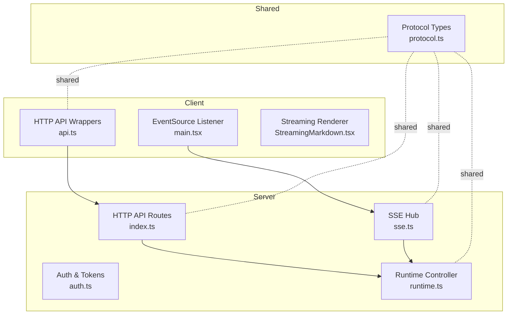
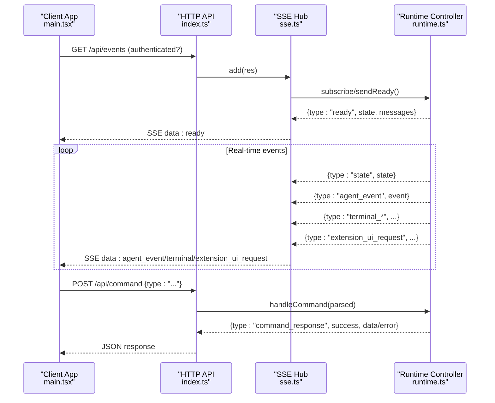
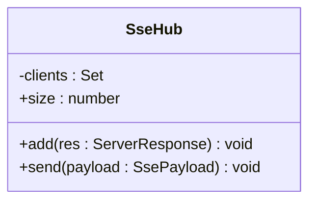
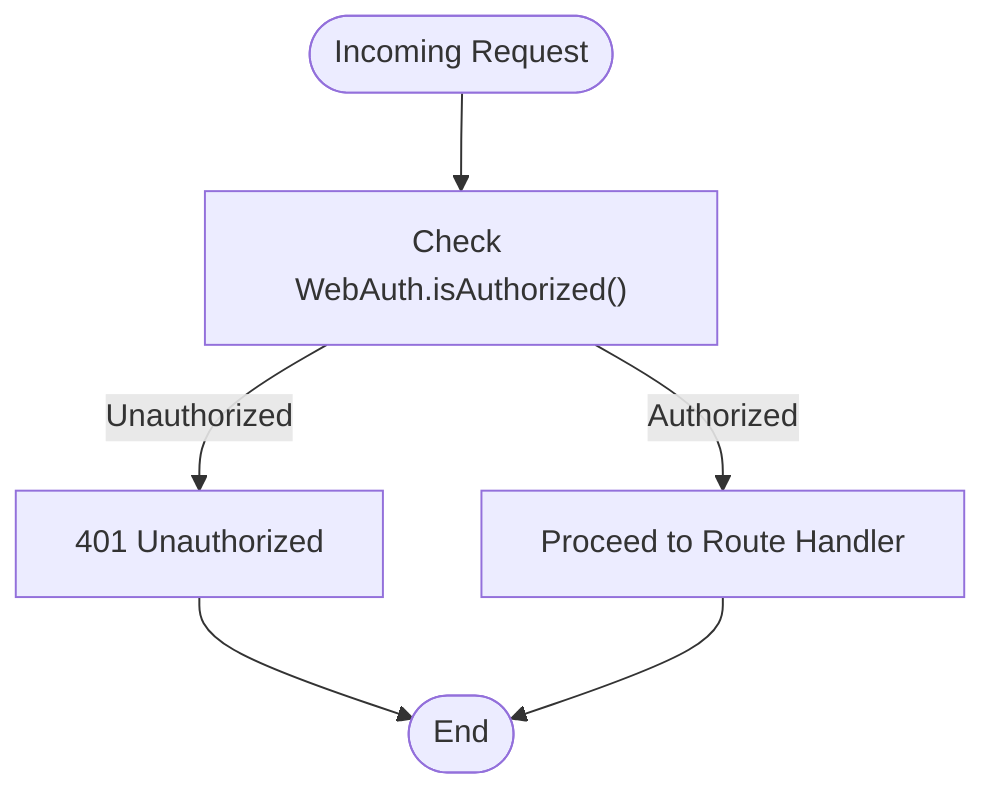
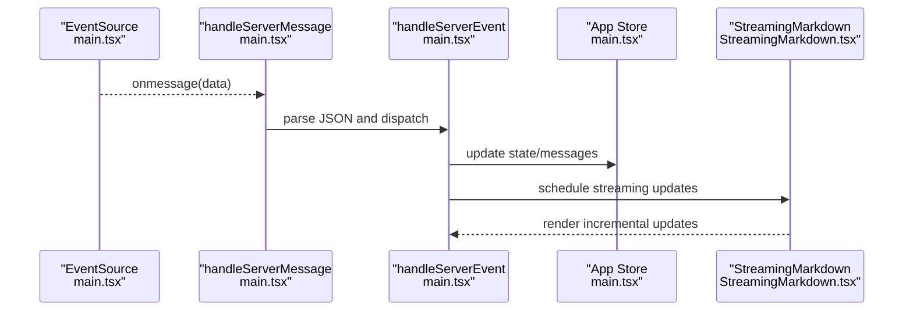
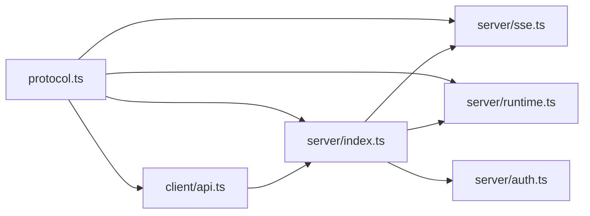

# Protocol and Communication

<cite>
**Referenced Files in This Document**
- [protocol.ts](file://src/shared/protocol.ts)
- [sse.ts](file://src/server/sse.ts)
- [index.ts](file://src/server/index.ts)
- [auth.ts](file://src/server/auth.ts)
- [runtime.ts](file://src/server/runtime.ts)
- [api.ts](file://src/client/src/lib/api.ts)
- [main.tsx](file://src/client/src/main.tsx)
- [StreamingMarkdown.tsx](file://src/client/src/components/markdown/StreamingMarkdown.tsx)
- [notifications.ts](file://src/client/src/lib/notifications.ts)
</cite>

## Table of Contents
1. [Introduction](#introduction)
2. [Project Structure](#project-structure)
3. [Core Components](#core-components)
4. [Architecture Overview](#architecture-overview)
5. [Detailed Component Analysis](#detailed-component-analysis)
6. [Dependency Analysis](#dependency-analysis)
7. [Performance Considerations](#performance-considerations)
8. [Troubleshooting Guide](#troubleshooting-guide)
9. [Conclusion](#conclusion)

## Introduction
This document describes the type-safe communication layer between the Quake Web client and server. It covers shared protocol definitions, event schemas, command contracts, and message formats. It explains the Server-Sent Events (SSE) implementation for real-time event streaming, client-side event handling, HTTP API contracts, authentication tokens, and security considerations. It also outlines protocol evolution strategies, backward compatibility maintenance, and debugging techniques for communication issues.

## Project Structure
The communication system spans three layers:
- Shared protocol definitions used by both client and server
- Server-side HTTP API and SSE event hub
- Client-side HTTP API wrappers and SSE event handlers

**Diagram sources**
- [api.ts:1-59](file://src/client/src/lib/api.ts#L1-L59)
- [main.tsx:573-588](file://src/client/src/main.tsx#L573-L588)
- [protocol.ts:1-198](file://src/shared/protocol.ts#L1-L198)
- [index.ts:401-659](file://src/server/index.ts#L401-L659)
- [sse.ts:6-31](file://src/server/sse.ts#L6-L31)
- [auth.ts:6-56](file://src/server/auth.ts#L6-L56)
- [runtime.ts:12-30](file://src/server/runtime.ts#L12-L30)

**Section sources**
- [protocol.ts:1-198](file://src/shared/protocol.ts#L1-L198)
- [index.ts:401-659](file://src/server/index.ts#L401-L659)
- [sse.ts:6-31](file://src/server/sse.ts#L6-L31)
- [api.ts:1-59](file://src/client/src/lib/api.ts#L1-L59)
- [main.tsx:573-588](file://src/client/src/main.tsx#L573-L588)

## Core Components
- Shared protocol types define the canonical shapes for:
  - Web session state and summaries
  - Runtime settings and plan state
  - Server configuration
  - File entries
  - Extension UI requests
  - Agent events and client commands
  - Command responses
- Server-side SSE hub manages long-lived connections and broadcasts typed events.
- Server-side HTTP routes expose APIs for configuration, state, sessions, models, files, Git operations, scheduling, and terminal execution.
- Client-side API wrappers encapsulate HTTP requests and authentication headers.
- Client-side event handling subscribes to SSE, parses incoming events, reconciles UI state, and drives rendering updates.

**Section sources**
- [protocol.ts:6-198](file://src/shared/protocol.ts#L6-L198)
- [sse.ts:6-31](file://src/server/sse.ts#L6-L31)
- [index.ts:401-659](file://src/server/index.ts#L401-L659)
- [api.ts:9-59](file://src/client/src/lib/api.ts#L9-L59)
- [main.tsx:1144-1191](file://src/client/src/main.tsx#L1144-L1191)

## Architecture Overview
The client establishes an SSE connection to receive typed events from the server. Commands are sent via POST /api/command. Authentication is enforced via a shared token injected into the client page when enabled.

**Diagram sources**
- [index.ts:408-411](file://src/server/index.ts#L408-L411)
- [index.ts:626-630](file://src/server/index.ts#L626-L630)
- [sse.ts:9-26](file://src/server/sse.ts#L9-L26)
- [runtime.ts:56-58](file://src/server/runtime.ts#L56-L58)
- [main.tsx:573-588](file://src/client/src/main.tsx#L573-L588)

## Detailed Component Analysis

### Shared Protocol Definitions
The shared protocol defines:
- Data transfer models: WebSessionState, WebSessionSummary, WebRuntimeSettings, WebPlanState, WebServerConfig, WebFileEntry
- Event union types: WebAgentEvent (ready, state, agent_event, terminal_start/output/end, error, extension_ui_request)
- Command union types: WebClientCommand (prompt, abort, new_session, open_workspace, switch_session, fork_session, set_* settings, plan_* actions, slash_command, extension_ui_response)
- Command response shape: WebCommandResponse (success/error)

These types ensure compile-time safety between client and server.

**Section sources**
- [protocol.ts:6-198](file://src/shared/protocol.ts#L6-L198)

### Server-Sent Events Hub
The SSE hub maintains a set of active connections and writes typed payloads to all clients. It sets appropriate headers for streaming and buffering control.

**Diagram sources**
- [sse.ts:6-31](file://src/server/sse.ts#L6-L31)

**Section sources**
- [sse.ts:6-31](file://src/server/sse.ts#L6-L31)

### Server HTTP API Contracts
The server exposes a comprehensive set of HTTP endpoints:
- GET /api/config: returns WebServerConfig
- GET /api/state: returns runtime state and messages
- GET /api/sessions: lists sessions
- GET /api/settings: runtime settings
- GET /api/models: available models
- GET /api/commands: registered commands
- GET /api/extensions, /api/skills, /api/prompts: categorized commands
- POST /api/extensions/toggle: enable/disable extension
- GET /api/web-settings: persisted web settings
- GET /api/workspace/*: roots, browse, changes
- GET /api/git/* and POST /api/git/*: status, branch, diff, stage/unstage, commit, push, pr
- GET /api/search: search across sessions
- GET /api/scheduled and POST/PATCH/DELETE /api/scheduled/{id}(/run): scheduler CRUD
- POST /api/web-settings: patch settings
- GET /api/files and /api/file/*: list/search/read/write/patch/delete/mkdir/rename/history/restore
- POST /api/command: executes WebClientCommand and returns WebCommandResponse
- POST /api/terminal/run: runs a terminal command and streams terminal_* events
- POST /api/terminal/stop: stops a terminal run
- GET (static): serves client assets with optional token injection

Authentication is enforced for protected routes; otherwise, requests are served publicly.

**Section sources**
- [index.ts:401-659](file://src/server/index.ts#L401-L659)

### Authentication and Tokens
Authentication is controlled by WebAuth:
- Token generation: random base64url token, persisted to a file with restrictive permissions
- Token retrieval: header X-Quake-Web-Token or query param token
- Client token injection: when enabled, the server injects a script tag containing the token into index.html
- Request rejection: 401 Unauthorized for unauthorized requests

**Diagram sources**
- [auth.ts:15-29](file://src/server/auth.ts#L15-L29)
- [index.ts:404-407](file://src/server/index.ts#L404-L407)

**Section sources**
- [auth.ts:6-56](file://src/server/auth.ts#L6-L56)
- [index.ts:401-659](file://src/server/index.ts#L401-L659)

### Client-Side Event Handling and Rendering
The client:
- Establishes an EventSource connection to /api/events
- Parses incoming SSE messages into WebAgentEvent variants
- Handles ready/state/agent_event/terminal_* and extension_ui_request
- Updates local state and triggers reconciliation
- Streams Markdown rendering via a lightweight streaming renderer optimized for frequent updates

**Diagram sources**
- [main.tsx:573-588](file://src/client/src/main.tsx#L573-L588)
- [main.tsx:1178-1191](file://src/client/src/main.tsx#L1178-L1191)
- [main.tsx:1144-1191](file://src/client/src/main.tsx#L1144-L1191)
- [StreamingMarkdown.tsx:142-180](file://src/client/src/components/markdown/StreamingMarkdown.tsx#L142-L180)

**Section sources**
- [main.tsx:573-588](file://src/client/src/main.tsx#L573-L588)
- [main.tsx:1144-1191](file://src/client/src/main.tsx#L1144-L1191)
- [StreamingMarkdown.tsx:1-211](file://src/client/src/components/markdown/StreamingMarkdown.tsx#L1-L211)

### Client-Side HTTP API Wrappers
The client wraps fetch with helpers that:
- Attach the shared token via X-Quake-Web-Token header
- Parse JSON responses and throw on non-OK status
- Provide convenience functions for GET, POST, PATCH, DELETE
- Build the SSE URL with token query parameter when applicable

**Section sources**
- [api.ts:9-59](file://src/client/src/lib/api.ts#L9-L59)

### Terminal Streaming and Execution
Terminal execution is integrated with SSE:
- POST /api/terminal/run starts a command and emits terminal_start, terminal_output, and terminal_end events
- The client renders real-time output and final status

**Section sources**
- [index.ts:631-644](file://src/server/index.ts#L631-L644)
- [main.tsx:1328-1358](file://src/client/src/main.tsx#L1328-L1358)

### Notifications and User Feedback
The client surfaces server-generated notifications and errors via toast messages and optional browser notifications.

**Section sources**
- [main.tsx:1172-1175](file://src/client/src/main.tsx#L1172-L1175)
- [notifications.ts:46-97](file://src/client/src/lib/notifications.ts#L46-L97)

## Dependency Analysis
The client depends on shared protocol types for typing HTTP payloads and SSE events. The server composes multiple services around the SSE hub and runtime controller. Authentication is centralized in WebAuth.

**Diagram sources**
- [protocol.ts:1-198](file://src/shared/protocol.ts#L1-L198)
- [api.ts:1-59](file://src/client/src/lib/api.ts#L1-L59)
- [index.ts:10-25](file://src/server/index.ts#L10-L25)
- [sse.ts:1-4](file://src/server/sse.ts#L1-L4)
- [runtime.ts:1-11](file://src/server/runtime.ts#L1-L11)
- [auth.ts:1-6](file://src/server/auth.ts#L1-L6)

**Section sources**
- [protocol.ts:1-198](file://src/shared/protocol.ts#L1-L198)
- [index.ts:10-25](file://src/server/index.ts#L10-L25)

## Performance Considerations
- SSE streaming: The server sends minimal JSON payloads per event; the client coalesces frequent updates using requestAnimationFrame to reduce layout thrash.
- Markdown streaming: A lightweight renderer renders incremental words with CSS transitions, deferring heavy rendering until the stream completes.
- Terminal output: Streaming chunks are appended efficiently and formatted per event.
- Client-side reconciliation: On SSE disconnects or idle timeouts, the client refreshes state to recover from missed events.

[No sources needed since this section provides general guidance]

## Troubleshooting Guide
Common issues and remedies:
- Authentication failures
  - Symptom: 401 Unauthorized on protected routes
  - Cause: Missing or incorrect X-Quake-Web-Token header or token mismatch
  - Fix: Ensure the client includes the token header; verify server token file permissions and regeneration if needed
- SSE connection drops
  - Symptom: No new events; UI becomes stale
  - Cause: Network interruption or client focus/visibility reconciliation
  - Fix: The client automatically refreshes state; check server logs for SSE errors
- Command execution errors
  - Symptom: WebCommandResponse.success=false with error message
  - Cause: Validation or runtime error during command handling
  - Fix: Inspect the returned error field and adjust command parameters
- Terminal execution issues
  - Symptom: No output or immediate end without output
  - Cause: Policy restrictions or command not permitted
  - Fix: Verify terminal policy mode and command validity; check terminal_start/output/end events

**Section sources**
- [index.ts:404-407](file://src/server/index.ts#L404-L407)
- [main.tsx:578-582](file://src/client/src/main.tsx#L578-L582)
- [index.ts:255-374](file://src/server/index.ts#L255-L374)
- [index.ts:631-644](file://src/server/index.ts#L631-L644)

## Protocol Evolution and Backward Compatibility
Guidelines for evolving the protocol:
- Versioned readiness
  - The server sends a ready event with a protocolVersion field; clients can guard against incompatible versions
- Union types and discriminators
  - Use discriminated unions (e.g., WebAgentEvent, WebClientCommand) to safely extend message types
- Optional fields
  - Add new fields as optional to maintain backward compatibility for older clients
- Deprecation policy
  - Mark obsolete fields with comments and introduce new alternatives; keep old handlers for a migration period
- Validation and defaults
  - Server-side parse and validate incoming commands; provide sensible defaults for missing optional fields
- Client-side resilience
  - Ignore unknown event types gracefully; fall back to refreshSessionState to reconcile state

**Section sources**
- [protocol.ts:161-169](file://src/shared/protocol.ts#L161-L169)
- [protocol.ts:171-193](file://src/shared/protocol.ts#L171-L193)
- [runtime.ts:56-58](file://src/server/runtime.ts#L56-L58)

## Conclusion
The Quake Web communication layer is built on a shared protocol, robust SSE streaming, and typed HTTP APIs. Authentication is enforced consistently, and the client handles real-time updates with efficient rendering. Following the outlined evolution and troubleshooting practices ensures reliable, type-safe, and backward-compatible communication between client and server.
