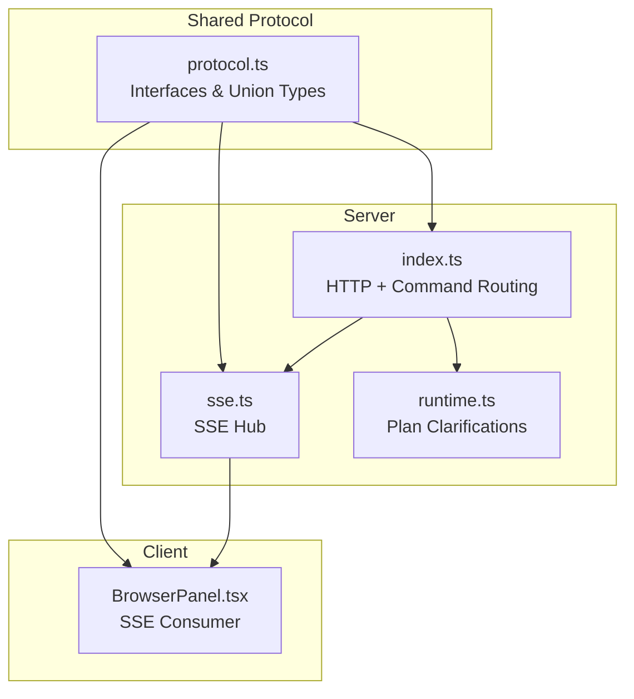
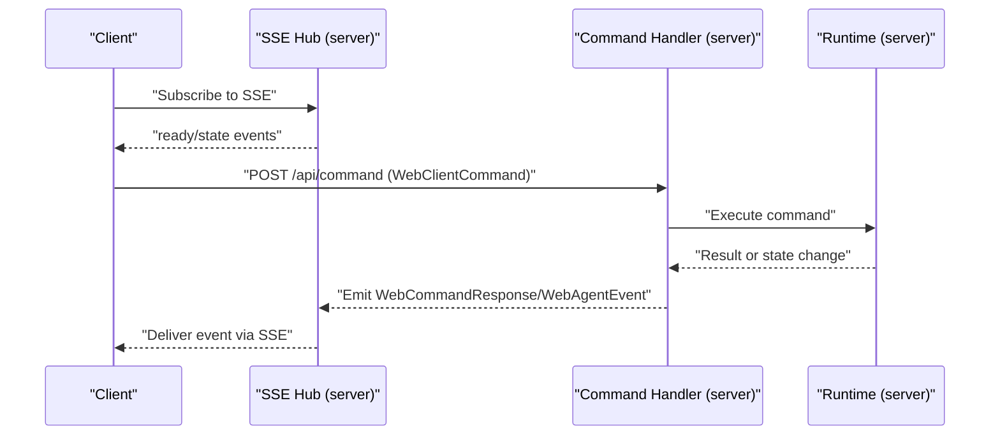
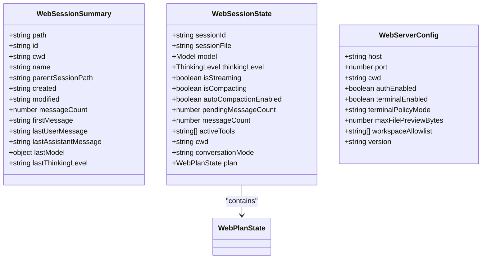
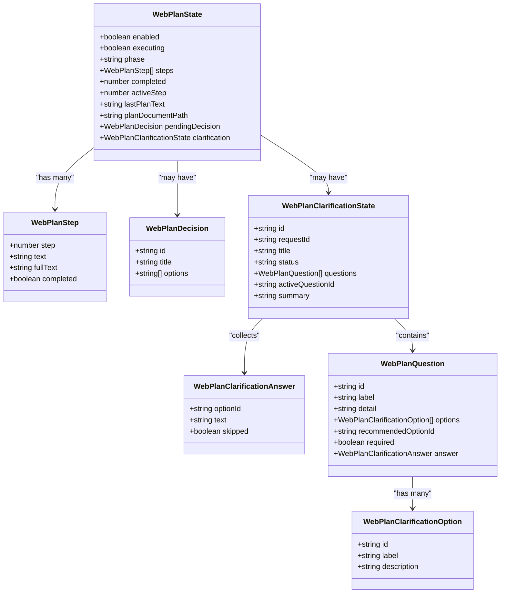
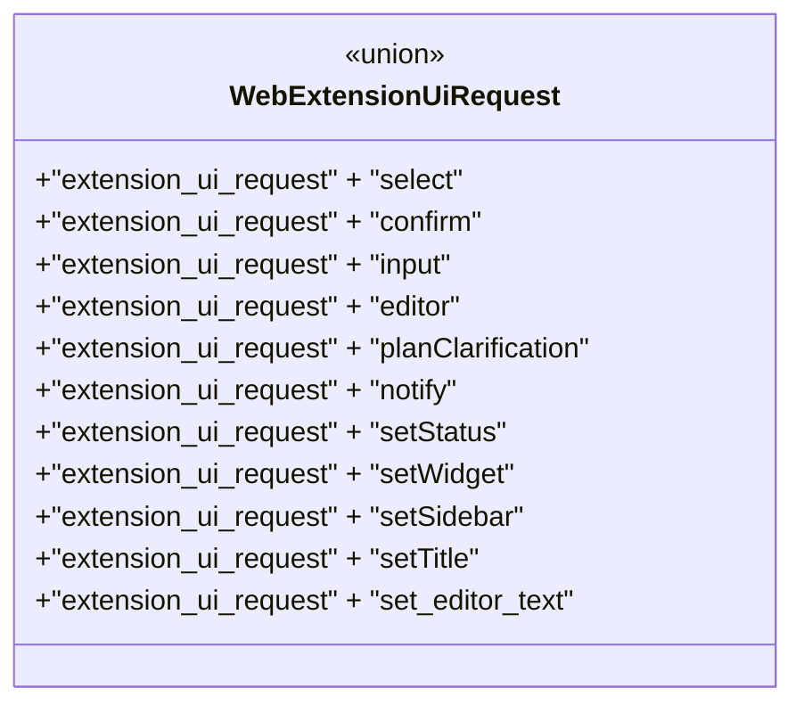
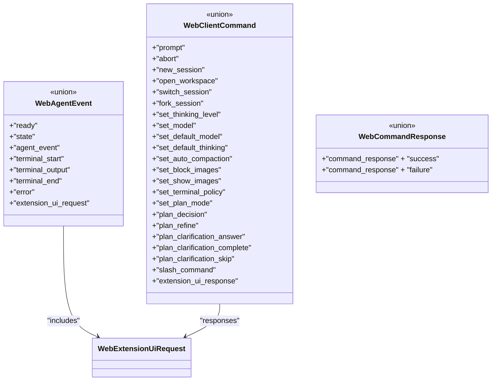
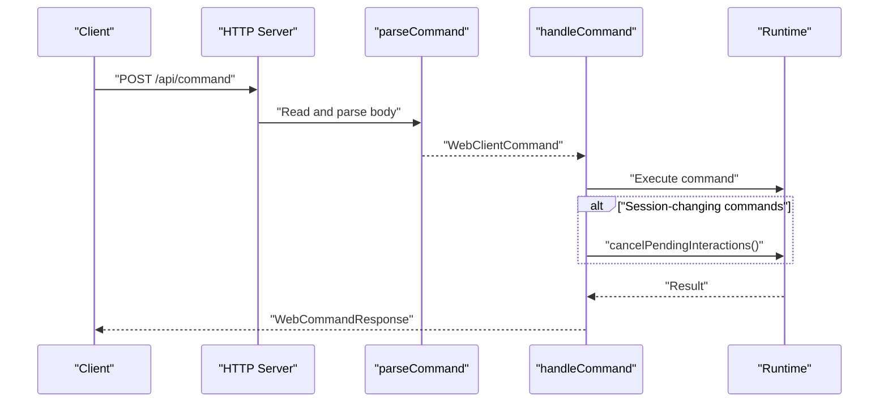
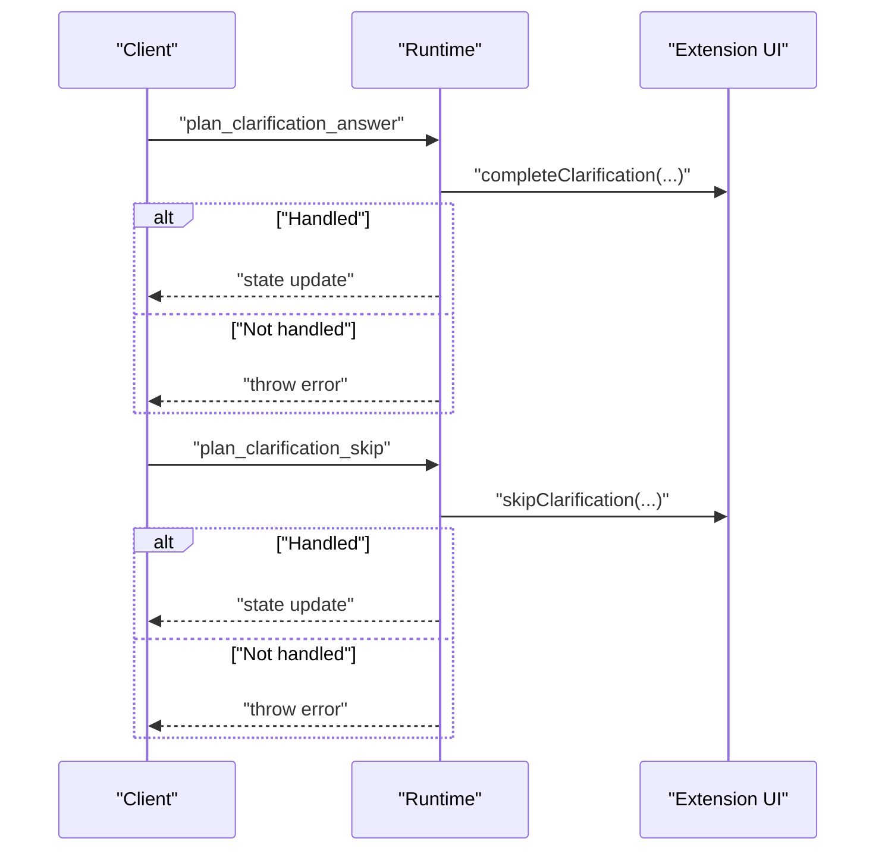
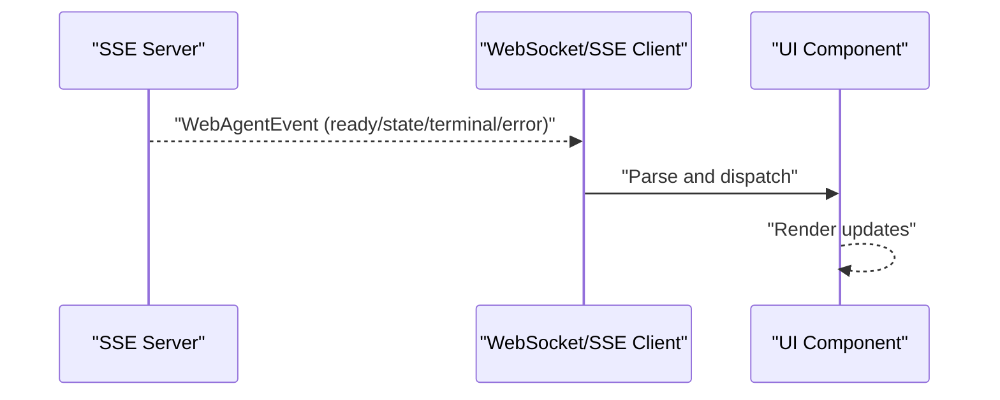
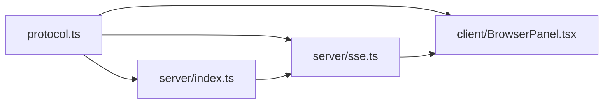

# Shared Protocol Definitions

<cite>
**Referenced Files in This Document**
- [protocol.ts](file://src/shared/protocol.ts)
- [index.ts](file://src/server/index.ts)
- [sse.ts](file://src/server/sse.ts)
- [runtime.ts](file://src/server/runtime.ts)
- [BrowserPanel.tsx](file://src/client/src/components/dock/BrowserPanel.tsx)
- [architecture.md](file://docs/architecture.md)
</cite>

## Table of Contents
1. [Introduction](#introduction)
2. [Project Structure](#project-structure)
3. [Core Components](#core-components)
4. [Architecture Overview](#architecture-overview)
5. [Detailed Component Analysis](#detailed-component-analysis)
6. [Dependency Analysis](#dependency-analysis)
7. [Performance Considerations](#performance-considerations)
8. [Troubleshooting Guide](#troubleshooting-guide)
9. [Conclusion](#conclusion)

## Introduction
This document describes the shared protocol definitions that enable type-safe communication between the client and server in the quake-web application. It focuses on the TypeScript interfaces and union types that define the message contract for session management, model configuration, file operations, extension UI requests, and plan execution. The protocol leverages a strict type system to ensure compile-time safety across the client-server boundary, while supporting forward-compatible evolution through explicit event schemas and controlled command sets.

## Project Structure
The protocol definitions live in a single shared module and are consumed by both server and client components:
- Shared protocol definitions: [protocol.ts](file://src/shared/protocol.ts)
- Server-side command handling and SSE transport: [index.ts](file://src/server/index.ts), [sse.ts](file://src/server/sse.ts)
- Server-side runtime integration for plan clarifications: [runtime.ts](file://src/server/runtime.ts)
- Client-side SSE consumption example: [BrowserPanel.tsx](file://src/client/src/components/dock/BrowserPanel.tsx)
- Transport architecture overview: [architecture.md](file://docs/architecture.md)

**Diagram sources**
- [protocol.ts](file://src/shared/protocol.ts)
- [index.ts](file://src/server/index.ts)
- [sse.ts](file://src/server/sse.ts)
- [runtime.ts](file://src/server/runtime.ts)
- [BrowserPanel.tsx](file://src/client/src/components/dock/BrowserPanel.tsx)

**Section sources**
- [protocol.ts](file://src/shared/protocol.ts)
- [index.ts](file://src/server/index.ts)
- [sse.ts](file://src/server/sse.ts)
- [runtime.ts](file://src/server/runtime.ts)
- [BrowserPanel.tsx](file://src/client/src/components/dock/BrowserPanel.tsx)
- [architecture.md](file://docs/architecture.md)

## Core Components
This section documents the primary TypeScript interfaces and union types that form the shared protocol.

- JsonValue: A recursive type representing JSON-compatible values used for generic payload data.
- WebSessionSummary: Lightweight session metadata for browsing and navigation.
- WebModelSummary: Model metadata including provider, identifiers, capabilities, and configuration state.
- WebCommandInfo: Describes commands exposed by built-in, extension, prompt, or skill sources.
- WebRuntimeSettings: Runtime preferences such as default provider/model, thinking level, and UI image policies.
- WebConversationMode: Conversation modes ("execute" or "plan").
- WebPlanStep: Individual step in a plan with completion status.
- WebPlanDecision: Decision node with selectable options.
- WebPlanPhase: Lifecycle phases of plan execution.
- WebPlanClarificationOption: Option presented during plan clarification.
- WebPlanClarificationAnswer: Answer provided by the user for a clarification question.
- WebPlanQuestion: Question with optional options and recommended selection.
- WebPlanClarificationState: Complete state of a clarification dialog.
- WebPlanState: Aggregated plan state including steps, decisions, and clarification.
- WebServerConfig: Server configuration including host/port, auth, terminal policy, and limits.
- WebFileEntry: File or directory entry for file operations.
- WebSessionState: Full session state including model, thinking level, streaming flags, tool set, working directory, conversation mode, and plan state.
- WebExtensionUiRequest: Union of extension UI request variants covering selection, confirmation, input prompts, editor prefills, plan clarifications, notifications, status updates, widget placement, sidebar updates, title changes, and editor text updates.
- WebAgentEvent: Server-to-client events including ready/state updates, agent events, terminal lifecycle, error notifications, and extension UI requests.
- WebClientCommand: Client-to-server commands for prompting, aborting, session management, model configuration, runtime toggles, plan actions, slash commands, and extension UI responses.
- WebCommandResponse: Standardized command response envelope with success/failure and optional data.

**Section sources**
- [protocol.ts](file://src/shared/protocol.ts)

## Architecture Overview
The protocol uses a unidirectional server-to-client streaming channel (SSE) for events and HTTP POST endpoints for commands. The SSE transport carries both agent events and command responses, enabling real-time updates for UI rendering and state synchronization.

**Diagram sources**
- [sse.ts](file://src/server/sse.ts)
- [index.ts](file://src/server/index.ts)
- [protocol.ts](file://src/shared/protocol.ts)

**Section sources**
- [architecture.md](file://docs/architecture.md)
- [sse.ts](file://src/server/sse.ts)
- [index.ts](file://src/server/index.ts)
- [protocol.ts](file://src/shared/protocol.ts)

## Detailed Component Analysis

### Session Management Interfaces
The session-related interfaces encapsulate session metadata and runtime state for UI and operational needs.

**Diagram sources**
- [protocol.ts](file://src/shared/protocol.ts)

**Section sources**
- [protocol.ts](file://src/shared/protocol.ts)

### Plan Execution Data Structures
Plan execution introduces structured steps, decisions, and clarification workflows.

**Diagram sources**
- [protocol.ts](file://src/shared/protocol.ts)

**Section sources**
- [protocol.ts](file://src/shared/protocol.ts)

### Extension UI Request Schema
Extension UI requests are modeled as a discriminated union to support various UI interaction patterns.

**Diagram sources**
- [protocol.ts](file://src/shared/protocol.ts)

**Section sources**
- [protocol.ts](file://src/shared/protocol.ts)

### Event and Command Type System
The protocol defines strongly typed events and commands using union types with discriminators.

**Diagram sources**
- [protocol.ts](file://src/shared/protocol.ts)

**Section sources**
- [protocol.ts](file://src/shared/protocol.ts)

### Command Handling Flow
Commands are parsed from HTTP POST bodies and routed to handlers, which may trigger state changes and emit events.

**Diagram sources**
- [index.ts](file://src/server/index.ts)
- [protocol.ts](file://src/shared/protocol.ts)

**Section sources**
- [index.ts](file://src/server/index.ts)
- [protocol.ts](file://src/shared/protocol.ts)

### Plan Clarification Flow
The server coordinates plan clarifications and ensures state consistency.

**Diagram sources**
- [runtime.ts](file://src/server/runtime.ts)
- [protocol.ts](file://src/shared/protocol.ts)

**Section sources**
- [runtime.ts](file://src/server/runtime.ts)
- [protocol.ts](file://src/shared/protocol.ts)

### Client-Side SSE Consumption Example
The client consumes SSE streams and handles specific event types.

**Diagram sources**
- [BrowserPanel.tsx](file://src/client/src/components/dock/BrowserPanel.tsx)
- [sse.ts](file://src/server/sse.ts)

**Section sources**
- [BrowserPanel.tsx](file://src/client/src/components/dock/BrowserPanel.tsx)
- [sse.ts](file://src/server/sse.ts)

## Dependency Analysis
The protocol module is imported and used across server and client boundaries. The server depends on the protocol for type-safe command parsing and response generation, while the client consumes the protocol for event handling and UI updates.

**Diagram sources**
- [protocol.ts](file://src/shared/protocol.ts)
- [index.ts](file://src/server/index.ts)
- [sse.ts](file://src/server/sse.ts)
- [BrowserPanel.tsx](file://src/client/src/components/dock/BrowserPanel.tsx)

**Section sources**
- [protocol.ts](file://src/shared/protocol.ts)
- [index.ts](file://src/server/index.ts)
- [sse.ts](file://src/server/sse.ts)
- [BrowserPanel.tsx](file://src/client/src/components/dock/BrowserPanel.tsx)

## Performance Considerations
- SSE streaming avoids polling overhead and enables real-time updates for terminal output and state changes.
- Command responses are compact envelopes that minimize payload size while preserving type safety.
- Plan clarification operations are validated against current state to prevent inconsistent updates.
- Large request bodies are bounded to avoid resource exhaustion.

[No sources needed since this section provides general guidance]

## Troubleshooting Guide
Common issues and resolutions:
- Unsupported command: The handler returns a standardized failure response with the command type included.
- Parse errors: Body parsing failures lead to explicit error responses.
- Terminal policy changes: Updating terminal policy triggers reinitialization and reflects new state in the response payload.
- Plan clarification invalid: Attempting to finalize or skip a clarification that is no longer valid throws an error indicating state was refreshed.

**Section sources**
- [index.ts](file://src/server/index.ts)
- [protocol.ts](file://src/shared/protocol.ts)

## Conclusion
The shared protocol establishes a robust, type-safe contract for client-server communication. Through discriminated unions, standardized envelopes, and explicit event schemas, it ensures compile-time safety while enabling flexible evolution. The SSE-based transport and HTTP command endpoints provide a scalable foundation for real-time updates and interactive features such as plan execution and extension UI workflows.
