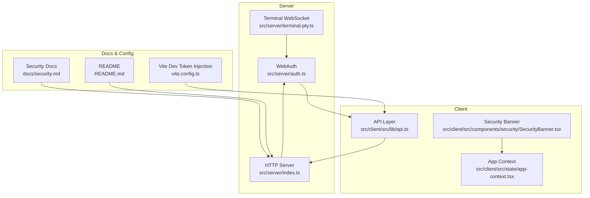
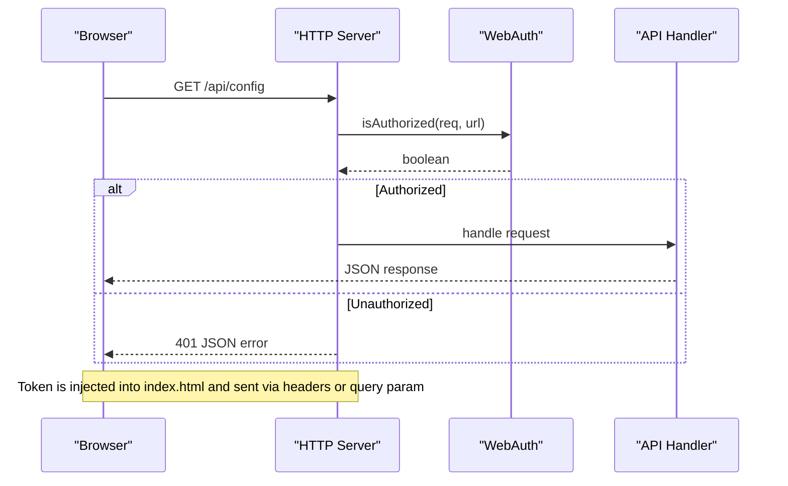
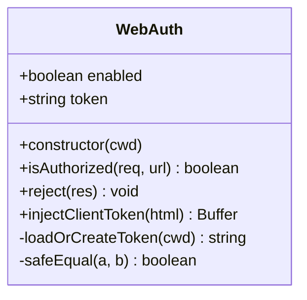
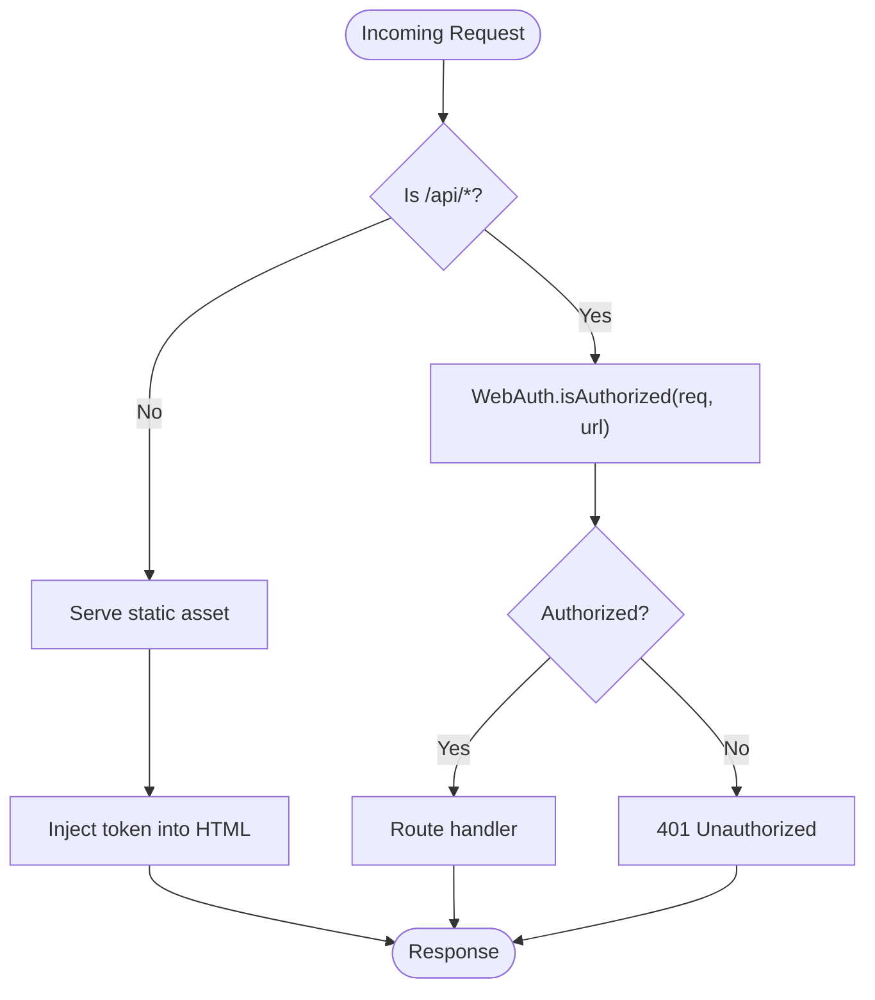
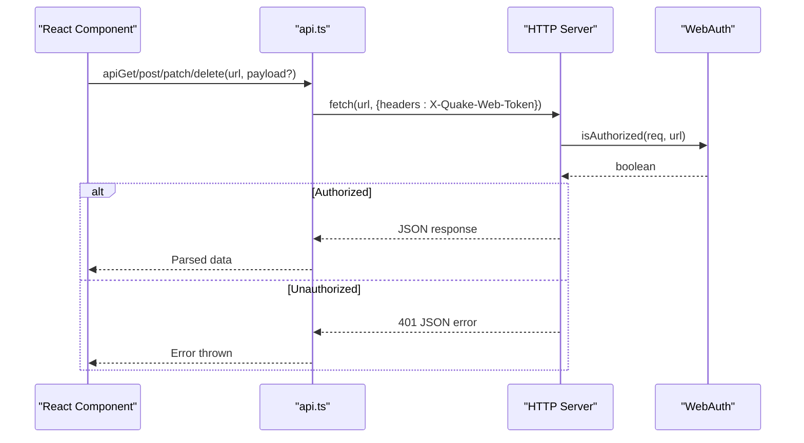
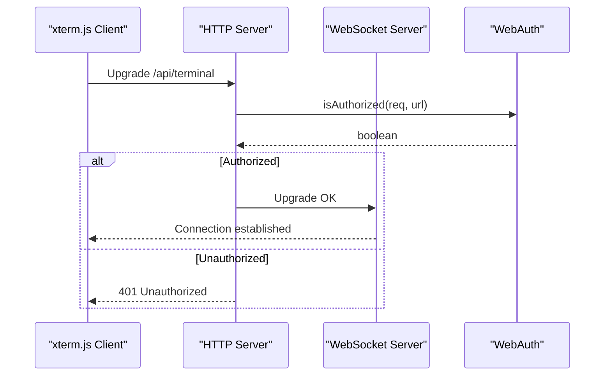
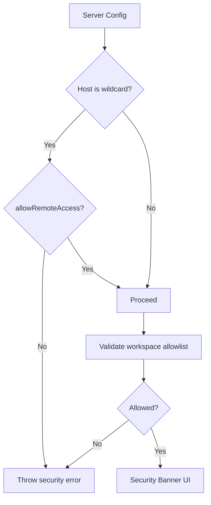
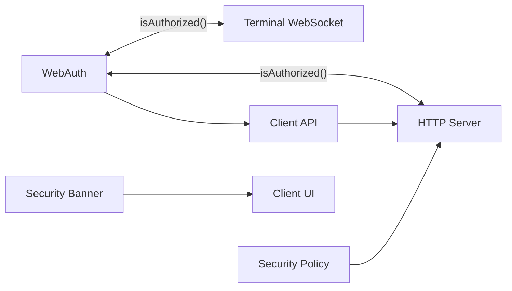

# Authentication System

<cite>
**Referenced Files in This Document**
- [auth.ts](file://src/server/auth.ts)
- [index.ts](file://src/server/index.ts)
- [api.ts](file://src/client/src/lib/api.ts)
- [security.md](file://docs/security.md)
- [README.md](file://README.md)
- [terminal-pty.ts](file://src/server/terminal-pty.ts)
- [security.ts](file://src/server/security.ts)
- [app-context.tsx](file://src/client/src/state/app-context.tsx)
- [SecurityBanner.tsx](file://src/client/src/components/security/SecurityBanner.tsx)
- [vite.config.ts](file://vite.config.ts)
</cite>

## Table of Contents
1. [Introduction](#introduction)
2. [Project Structure](#project-structure)
3. [Core Components](#core-components)
4. [Architecture Overview](#architecture-overview)
5. [Detailed Component Analysis](#detailed-component-analysis)
6. [Dependency Analysis](#dependency-analysis)
7. [Performance Considerations](#performance-considerations)
8. [Troubleshooting Guide](#troubleshooting-guide)
9. [Conclusion](#conclusion)

## Introduction
This document explains the local token-based authentication system used by Quake Code Web. It covers how tokens are generated and stored, how they are validated during requests, and how they are transmitted securely. It also documents environment variable configuration, security considerations, and practical examples of authentication flows and failures.

## Project Structure
The authentication system spans three main areas:
- Server-side token management and validation
- Client-side token injection and transmission
- Security policies and warnings surfaced to users

**Diagram sources**
- [auth.ts:1-56](file://src/server/auth.ts#L1-L56)
- [index.ts:1-679](file://src/server/index.ts#L1-L679)
- [api.ts:1-59](file://src/client/src/lib/api.ts#L1-L59)
- [terminal-pty.ts:1-95](file://src/server/terminal-pty.ts#L1-L95)
- [security.md:1-48](file://docs/security.md#L1-L48)
- [README.md:1-223](file://README.md#L1-L223)
- [vite.config.ts:1-19](file://vite.config.ts#L1-L19)

**Section sources**
- [auth.ts:1-56](file://src/server/auth.ts#L1-L56)
- [index.ts:1-679](file://src/server/index.ts#L1-L679)
- [api.ts:1-59](file://src/client/src/lib/api.ts#L1-L59)
- [security.md:1-48](file://docs/security.md#L1-L48)
- [README.md:105-130](file://README.md#L105-L130)
- [terminal-pty.ts:1-95](file://src/server/terminal-pty.ts#L1-L95)
- [vite.config.ts:1-19](file://vite.config.ts#L1-L19)

## Core Components
- WebAuth: Manages token generation, persistence, validation, and client injection.
- HTTP Server: Enforces authentication on API routes and serves static assets with token injection.
- Client API: Sends token via HTTP headers and SSE query parameters.
- Terminal WebSocket: Validates tokens for interactive terminal sessions.
- Security Policies: Enforce host binding and workspace allowlists.
- Client UI: Surfaces security warnings and token presence.

**Section sources**
- [auth.ts:6-55](file://src/server/auth.ts#L6-L55)
- [index.ts:401-407](file://src/server/index.ts#L401-L407)
- [api.ts:9-50](file://src/client/src/lib/api.ts#L9-L50)
- [terminal-pty.ts:25-42](file://src/server/terminal-pty.ts#L25-L42)
- [security.ts:24-41](file://src/server/security.ts#L24-L41)
- [SecurityBanner.tsx:13-20](file://src/client/src/components/security/SecurityBanner.tsx#L13-L20)

## Architecture Overview
The authentication system is local-first and designed to protect the powerful runtime behind a simple token. Tokens are injected into the client at build/dev time and sent with every request.

**Diagram sources**
- [index.ts:401-407](file://src/server/index.ts#L401-L407)
- [auth.ts:15-20](file://src/server/auth.ts#L15-L20)
- [api.ts:9-14](file://src/client/src/lib/api.ts#L9-L14)

## Detailed Component Analysis

### WebAuth: Token Management and Validation
WebAuth encapsulates:
- Configuration: Reads environment variables for enabling auth and setting token values.
- Persistence: Stores a per-process token in a secure file with restrictive permissions.
- Validation: Compares incoming tokens using constant-time comparison.
- Client Injection: Injects the token into the HTML head for client-side access.

Key behaviors:
- Token generation: Creates a cryptographically random token when none exists.
- Storage location: Uses a configurable file path or defaults under the workspace directory.
- Validation: Accepts token via HTTP header or query parameter.
- Timing-safe comparison: Prevents timing attacks during token verification.

**Diagram sources**
- [auth.ts:6-55](file://src/server/auth.ts#L6-L55)

**Section sources**
- [auth.ts:10-13](file://src/server/auth.ts#L10-L13)
- [auth.ts:37-47](file://src/server/auth.ts#L37-L47)
- [auth.ts:15-20](file://src/server/auth.ts#L15-L20)
- [auth.ts:49-54](file://src/server/auth.ts#L49-L54)

### HTTP Server: Request Authorization and Static Injection
The server enforces authentication on all API routes and injects the token into the HTML for the client.

Highlights:
- Authorization enforcement: Blocks unauthorized API requests with a 401 response.
- Static injection: Adds a script tag containing the token to the page head.
- SSE and terminal endpoints: Both protected by the same token validation logic.

**Diagram sources**
- [index.ts:401-407](file://src/server/index.ts#L401-L407)
- [index.ts:383-399](file://src/server/index.ts#L383-L399)
- [auth.ts:31-35](file://src/server/auth.ts#L31-L35)

**Section sources**
- [index.ts:401-407](file://src/server/index.ts#L401-L407)
- [index.ts:383-399](file://src/server/index.ts#L383-L399)
- [index.ts:662-662](file://src/server/index.ts#L662-L662)

### Client API: Token Transmission
The client sends the token using two mechanisms:
- HTTP headers: Adds the token to all fetch requests when available.
- SSE query parameter: Passes the token as a query parameter for Server-Sent Events.

Error handling:
- Parses JSON responses and throws descriptive errors on non-OK status codes.

**Diagram sources**
- [api.ts:9-25](file://src/client/src/lib/api.ts#L9-L25)
- [api.ts:48-50](file://src/client/src/lib/api.ts#L48-L50)
- [index.ts:401-407](file://src/server/index.ts#L401-L407)

**Section sources**
- [api.ts:7-7](file://src/client/src/lib/api.ts#L7-L7)
- [api.ts:9-25](file://src/client/src/lib/api.ts#L9-L25)
- [api.ts:27-36](file://src/client/src/lib/api.ts#L27-L36)
- [api.ts:38-46](file://src/client/src/lib/api.ts#L38-L46)
- [api.ts:48-50](file://src/client/src/lib/api.ts#L48-L50)

### Terminal WebSocket: Token-Protected Interactive Sessions
Interactive terminal sessions are protected by the same token validation used for HTTP requests.

**Diagram sources**
- [terminal-pty.ts:25-42](file://src/server/terminal-pty.ts#L25-L42)
- [auth.ts:15-20](file://src/server/auth.ts#L15-L20)

**Section sources**
- [terminal-pty.ts:25-42](file://src/server/terminal-pty.ts#L25-L42)

### Security Policies and Client Warnings
Security policies enforce:
- Host binding restrictions: Remote binds are disallowed unless explicitly allowed.
- Workspace allowlists: Restrict valid working directories.
- Client warnings: A banner displays security status including auth state and token presence.

**Diagram sources**
- [security.ts:24-41](file://src/server/security.ts#L24-L41)
- [SecurityBanner.tsx:13-20](file://src/client/src/components/security/SecurityBanner.tsx#L13-L20)

**Section sources**
- [security.ts:24-41](file://src/server/security.ts#L24-L41)
- [SecurityBanner.tsx:13-20](file://src/client/src/components/security/SecurityBanner.tsx#L13-L20)

## Dependency Analysis
The authentication system has clear boundaries and minimal coupling:
- Server depends on WebAuth for token logic.
- HTTP server and terminal WebSocket both depend on WebAuth for validation.
- Client depends on the token being present in the page head.
- Security policies are enforced early in server initialization.

**Diagram sources**
- [auth.ts:15-20](file://src/server/auth.ts#L15-L20)
- [index.ts:401-407](file://src/server/index.ts#L401-L407)
- [terminal-pty.ts:36-42](file://src/server/terminal-pty.ts#L36-L42)
- [api.ts:9-14](file://src/client/src/lib/api.ts#L9-L14)
- [security.ts:24-41](file://src/server/security.ts#L24-L41)
- [SecurityBanner.tsx:13-20](file://src/client/src/components/security/SecurityBanner.tsx#L13-L20)

**Section sources**
- [auth.ts:1-56](file://src/server/auth.ts#L1-L56)
- [index.ts:1-679](file://src/server/index.ts#L1-L679)
- [terminal-pty.ts:1-95](file://src/server/terminal-pty.ts#L1-L95)
- [api.ts:1-59](file://src/client/src/lib/api.ts#L1-L59)
- [security.ts:1-47](file://src/server/security.ts#L1-L47)
- [SecurityBanner.tsx:1-21](file://src/client/src/components/security/SecurityBanner.tsx#L1-L21)

## Performance Considerations
- Constant-time comparison prevents timing attacks without significant overhead.
- Token file I/O occurs only on first boot or when no persisted token exists.
- Header-based token passing avoids query parameter overhead for most requests.
- SSE query parameter is only used when the client cannot set headers.

## Troubleshooting Guide

Common issues and resolutions:
- 401 Unauthorized responses
  - Cause: Missing or invalid token in headers or query parameter.
  - Resolution: Ensure the token is present in the page head and included in requests.
  - Reference: [index.ts:401-407](file://src/server/index.ts#L401-L407), [auth.ts:15-20](file://src/server/auth.ts#L15-L20)

- Token not found in client
  - Cause: Authentication disabled or token file missing.
  - Resolution: Enable authentication or allow automatic token generation.
  - Reference: [auth.ts:10-13](file://src/server/auth.ts#L10-L13), [vite.config.ts:9-17](file://vite.config.ts#L9-L17)

- Remote access blocked
  - Cause: Binding to wildcard host without enabling remote access.
  - Resolution: Set the allow flag or bind to localhost.
  - Reference: [security.ts:24-29](file://src/server/security.ts#L24-L29)

- Workspace outside allowlist
  - Cause: Working directory not permitted.
  - Resolution: Configure workspace allowlist or move to an allowed root.
  - Reference: [security.ts:31-41](file://src/server/security.ts#L31-L41)

- Terminal connection fails
  - Cause: Token validation failure for WebSocket upgrade.
  - Resolution: Verify token presence and correctness.
  - Reference: [terminal-pty.ts:36-42](file://src/server/terminal-pty.ts#L36-L42)

- Client security warnings
  - Cause: Auth disabled or token missing in client.
  - Resolution: Enable auth and ensure token injection.
  - Reference: [SecurityBanner.tsx:13-20](file://src/client/src/components/security/SecurityBanner.tsx#L13-L20)

**Section sources**
- [index.ts:401-407](file://src/server/index.ts#L401-L407)
- [auth.ts:10-13](file://src/server/auth.ts#L10-L13)
- [vite.config.ts:9-17](file://vite.config.ts#L9-L17)
- [security.ts:24-41](file://src/server/security.ts#L24-L41)
- [terminal-pty.ts:36-42](file://src/server/terminal-pty.ts#L36-L42)
- [SecurityBanner.tsx:13-20](file://src/client/src/components/security/SecurityBanner.tsx#L13-L20)

## Conclusion
Quake Code Web's authentication system is intentionally local-first and simple: a single token protects all API endpoints, SSE streams, and terminal sessions. It generates tokens automatically, persists them securely, and injects them into the client for seamless operation. Security policies further constrain exposure by restricting remote access and workspace scope. Following the environment configuration and troubleshooting guidance ensures reliable and secure operation.
