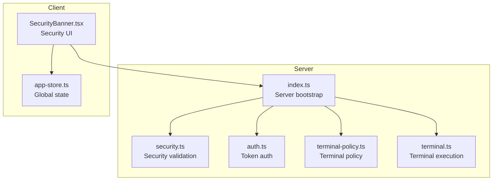
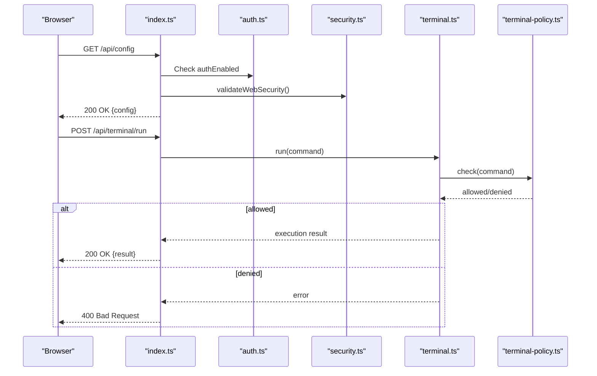
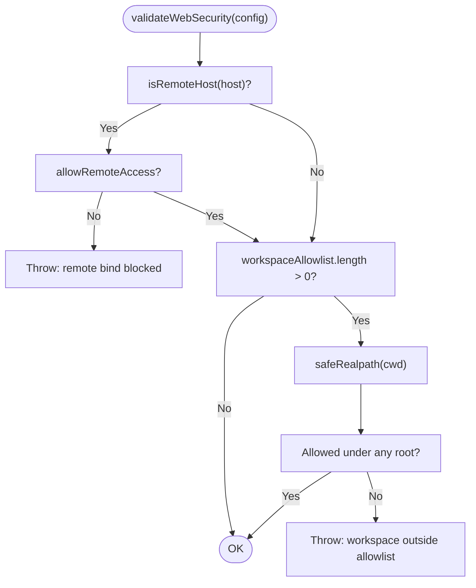
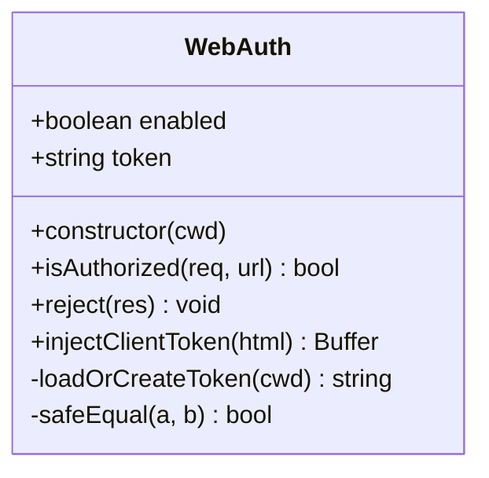
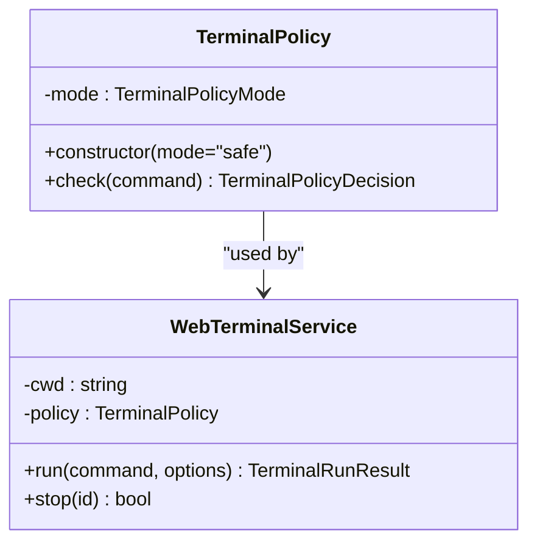
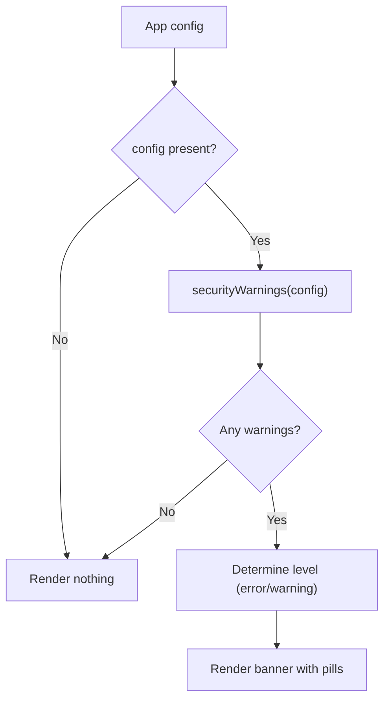
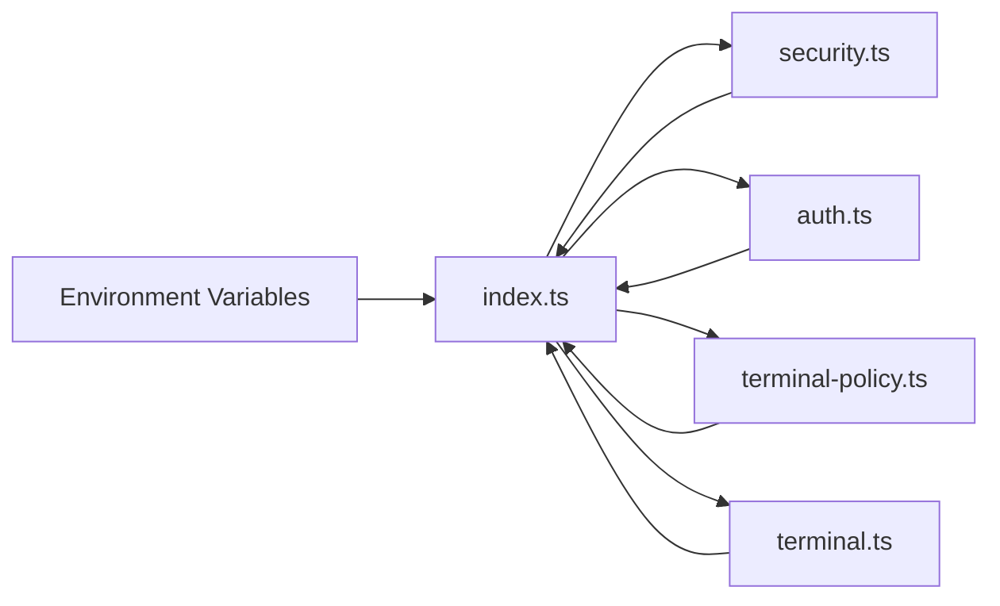

# Security Configuration

<cite>
**Referenced Files in This Document**
- [docs/security.md](file://docs/security.md)
- [README.md](file://README.md)
- [src/server/security.ts](file://src/server/security.ts)
- [src/server/auth.ts](file://src/server/auth.ts)
- [src/server/index.ts](file://src/server/index.ts)
- [src/server/terminal-policy.ts](file://src/server/terminal-policy.ts)
- [src/server/terminal.ts](file://src/server/terminal.ts)
- [src/client/src/components/security/SecurityBanner.tsx](file://src/client/src/components/security/SecurityBanner.tsx)
- [src/client/src/state/app-store.ts](file://src/client/src/state/app-store.ts)
</cite>

## Table of Contents
1. [Introduction](#introduction)
2. [Project Structure](#project-structure)
3. [Core Components](#core-components)
4. [Architecture Overview](#architecture-overview)
5. [Detailed Component Analysis](#detailed-component-analysis)
6. [Dependency Analysis](#dependency-analysis)
7. [Performance Considerations](#performance-considerations)
8. [Troubleshooting Guide](#troubleshooting-guide)
9. [Conclusion](#conclusion)
10. [Appendices](#appendices)

## Introduction
This document provides comprehensive guidance for configuring security settings in Quake Code Web. It documents all security-related environment variables, configuration options, and their impact on system security. It explains security flags such as QUAKE_WEB_ALLOW_REMOTE, workspace allowlist configuration, and terminal policy settings. It covers security best practices for different deployment scenarios, development versus production configurations, and security hardening recommendations. It includes configuration examples for various security profiles, security audit procedures, and troubleshooting security configuration issues.

## Project Structure
Security-related configuration spans both server-side and client-side components:
- Server-side security enforcement and configuration parsing
- Authentication and token management
- Terminal policy enforcement
- Client-side security UI feedback

**Diagram sources**
- [src/server/index.ts:55-61](file://src/server/index.ts#L55-L61)
- [src/server/security.ts:24-41](file://src/server/security.ts#L24-L41)
- [src/server/auth.ts:10-13](file://src/server/auth.ts#L10-L13)
- [src/server/terminal-policy.ts:21-33](file://src/server/terminal-policy.ts#L21-L33)
- [src/server/terminal.ts:36-43](file://src/server/terminal.ts#L36-L43)
- [src/client/src/components/security/SecurityBanner.tsx:4-20](file://src/client/src/components/security/SecurityBanner.tsx#L4-L20)
- [src/client/src/state/app-store.ts:33-58](file://src/client/src/state/app-store.ts#L33-L58)

**Section sources**
- [src/server/index.ts:55-61](file://src/server/index.ts#L55-L61)
- [src/server/security.ts:24-41](file://src/server/security.ts#L24-L41)
- [src/server/auth.ts:10-13](file://src/server/auth.ts#L10-L13)
- [src/server/terminal-policy.ts:21-33](file://src/server/terminal-policy.ts#L21-L33)
- [src/server/terminal.ts:36-43](file://src/server/terminal.ts#L36-L43)
- [src/client/src/components/security/SecurityBanner.tsx:4-20](file://src/client/src/components/security/SecurityBanner.tsx#L4-L20)
- [src/client/src/state/app-store.ts:33-58](file://src/client/src/state/app-store.ts#L33-L58)

## Core Components
- Security validation and defaults: Validates host binding, workspace allowlist, and remote access flag.
- Authentication: Local token-based auth with optional fixed token or token file.
- Terminal policy: Enforces safe defaults with configurable modes and dangerous command detection.
- Client security UI: Surfaces security state and warnings to users.

Key security environment variables:
- QUAKE_WEB_HOST: Server host binding (default: 127.0.0.1).
- QUAKE_WEB_PORT: Server port (default: 3737).
- QUAKE_WEB_CWD: Working directory for the workspace.
- QUAKE_WEB_TOKEN: Fixed token for authentication.
- QUAKE_WEB_TOKEN_FILE: Path to a token file.
- QUAKE_WEB_AUTH: Disable local token auth (0 to disable).
- QUAKE_WEB_ALLOW_REMOTE: Allow wildcard binds (0 to require localhost).
- QUAKE_WEB_WORKSPACE_ALLOWLIST: Colon-separated (or semicolon on Windows) list of allowed workspace roots.
- QUAKE_WEB_TERMINAL_POLICY: Terminal policy mode (safe | allow-all | disabled).

**Section sources**
- [docs/security.md:15-28](file://docs/security.md#L15-L28)
- [README.md:116-128](file://README.md#L116-L128)
- [src/server/security.ts:4-9](file://src/server/security.ts#L4-L9)
- [src/server/auth.ts:10-13](file://src/server/auth.ts#L10-L13)
- [src/server/terminal-policy.ts:1-6](file://src/server/terminal-policy.ts#L1-L6)

## Architecture Overview
The server validates security configuration early during startup and applies security headers to all responses. Authentication is enforced for all /api/* endpoints. The terminal service enforces policy decisions before executing commands. The client displays a security banner reflecting current configuration state.

**Diagram sources**
- [src/server/index.ts:55-61](file://src/server/index.ts#L55-L61)
- [src/server/auth.ts:15-20](file://src/server/auth.ts#L15-L20)
- [src/server/security.ts:24-41](file://src/server/security.ts#L24-L41)
- [src/server/terminal.ts:36-43](file://src/server/terminal.ts#L36-L43)
- [src/server/terminal-policy.ts:24-32](file://src/server/terminal-policy.ts#L24-L32)

## Detailed Component Analysis

### Security Validation and Defaults
- Remote host detection prevents wildcard binds unless QUAKE_WEB_ALLOW_REMOTE=1.
- Workspace allowlist restricts valid CWD values to configured roots.
- Realpath resolution ensures robust path comparisons.

**Diagram sources**
- [src/server/security.ts:20-41](file://src/server/security.ts#L20-L41)

**Section sources**
- [src/server/security.ts:20-41](file://src/server/security.ts#L20-L41)

### Authentication and Token Management
- Local token auth is enabled by default unless QUAKE_WEB_AUTH=0.
- Token can be provided via QUAKE_WEB_TOKEN or loaded from QUAKE_WEB_TOKEN_FILE.
- Client HTML injection includes the token for dev/proxy scenarios.
- Timing-safe comparison prevents timing attacks.

**Diagram sources**
- [src/server/auth.ts:6-55](file://src/server/auth.ts#L6-L55)

**Section sources**
- [src/server/auth.ts:10-13](file://src/server/auth.ts#L10-L13)
- [src/server/auth.ts:31-35](file://src/server/auth.ts#L31-L35)
- [src/server/auth.ts:49-54](file://src/server/auth.ts#L49-L54)

### Terminal Policy Enforcement
- Terminal policy modes: safe (default), allow-all, disabled.
- Dangerous command patterns are detected and blocked.
- Command length limits and timeouts prevent abuse.
- Output truncation caps memory usage.

**Diagram sources**
- [src/server/terminal-policy.ts:21-33](file://src/server/terminal-policy.ts#L21-L33)
- [src/server/terminal.ts:21-27](file://src/server/terminal.ts#L21-L27)

**Section sources**
- [src/server/terminal-policy.ts:1-6](file://src/server/terminal-policy.ts#L1-L6)
- [src/server/terminal-policy.ts:24-32](file://src/server/terminal-policy.ts#L24-L32)
- [src/server/terminal.ts:36-43](file://src/server/terminal.ts#L36-L43)

### Client Security UI
- SecurityBanner displays warnings based on current configuration state.
- Warnings include auth enabled/disabled, missing token, remote bind, and workspace boundary status.
- Provides quick access to open settings.

**Diagram sources**
- [src/client/src/components/security/SecurityBanner.tsx:4-20](file://src/client/src/components/security/SecurityBanner.tsx#L4-L20)

**Section sources**
- [src/client/src/components/security/SecurityBanner.tsx:13-20](file://src/client/src/components/security/SecurityBanner.tsx#L13-L20)
- [src/client/src/state/app-store.ts:33-58](file://src/client/src/state/app-store.ts#L33-L58)

## Dependency Analysis
Security configuration depends on environment variables and is enforced at server startup and endpoint handlers.

**Diagram sources**
- [src/server/index.ts:55-61](file://src/server/index.ts#L55-L61)
- [src/server/security.ts:11-18](file://src/server/security.ts#L11-L18)
- [src/server/auth.ts:10-13](file://src/server/auth.ts#L10-L13)
- [src/server/terminal-policy.ts:35-38](file://src/server/terminal-policy.ts#L35-L38)
- [src/server/terminal.ts:24-27](file://src/server/terminal.ts#L24-L27)

**Section sources**
- [src/server/index.ts:55-61](file://src/server/index.ts#L55-L61)
- [src/server/security.ts:11-18](file://src/server/security.ts#L11-L18)
- [src/server/auth.ts:10-13](file://src/server/auth.ts#L10-L13)
- [src/server/terminal-policy.ts:35-38](file://src/server/terminal-policy.ts#L35-L38)
- [src/server/terminal.ts:24-27](file://src/server/terminal.ts#L24-L27)

## Performance Considerations
- Terminal command length limits and output truncation reduce resource consumption.
- Security headers are applied to all responses; minimal overhead.
- Workspace allowlist checks use realpath resolution to avoid symlink traversal issues.

[No sources needed since this section provides general guidance]

## Troubleshooting Guide
Common security configuration issues and resolutions:
- Remote bind blocked: Set QUAKE_WEB_ALLOW_REMOTE=1 after enabling auth and terminal policy.
- Workspace outside allowlist: Adjust QUAKE_WEB_WORKSPACE_ALLOWLIST to include the desired root(s).
- Missing token warning: Ensure QUAKE_WEB_AUTH is not disabled and the token is present or generated.
- Terminal policy denied: Switch to allow-all or disabled for testing, then tighten policy to safe.

Audit steps:
- Verify environment variables are set as intended.
- Confirm server startup logs reflect security configuration.
- Test terminal policy with known dangerous commands.
- Validate workspace allowlist behavior with different CWD values.

**Section sources**
- [docs/security.md:41-47](file://docs/security.md#L41-L47)
- [src/server/security.ts:24-41](file://src/server/security.ts#L24-L41)
- [src/server/auth.ts:10-13](file://src/server/auth.ts#L10-L13)
- [src/server/terminal-policy.ts:24-32](file://src/server/terminal-policy.ts#L24-L32)

## Conclusion
Quake Code Web's security model emphasizes local-first operation with strong defaults. Security is enforced through validated host binding, workspace allowlists, token-based authentication, and terminal policy enforcement. Proper configuration of environment variables ensures secure operation across development and production environments.

[No sources needed since this section summarizes without analyzing specific files]

## Appendices

### Security Profiles and Best Practices
- Development (trusted local):
  - QUAKE_WEB_AUTH=0 (disable token auth) for local experiments.
  - QUAKE_WEB_ALLOW_REMOTE=0 (localhost only).
  - Terminal policy safe or allow-all for convenience.
- Production (remote exposure):
  - QUAKE_WEB_AUTH=1 (enable token auth).
  - QUAKE_WEB_ALLOW_REMOTE=1 (only after auth and policy configured).
  - Terminal policy safe or project-specific allow/deny UI.
  - Workspace allowlist strictly defines allowed roots.
  - Apply security headers consistently (already included).

**Section sources**
- [docs/security.md:15-28](file://docs/security.md#L15-L28)
- [README.md:116-128](file://README.md#L116-L128)
- [src/server/index.ts:97-105](file://src/server/index.ts#L97-L105)

### Configuration Examples
- Minimal secure profile:
  - QUAKE_WEB_HOST=127.0.0.1
  - QUAKE_WEB_PORT=3737
  - QUAKE_WEB_AUTH=1
  - QUAKE_WEB_ALLOW_REMOTE=0
  - QUAKE_WEB_TERMINAL_POLICY=safe
- Remote with strict controls:
  - QUAKE_WEB_HOST=0.0.0.0
  - QUAKE_WEB_PORT=3737
  - QUAKE_WEB_AUTH=1
  - QUAKE_WEB_ALLOW_REMOTE=1
  - QUAKE_WEB_WORKSPACE_ALLOWLIST=/path/a:/path/b
  - QUAKE_WEB_TERMINAL_POLICY=safe

**Section sources**
- [docs/security.md:17-28](file://docs/security.md#L17-L28)
- [README.md:118-128](file://README.md#L118-L128)
