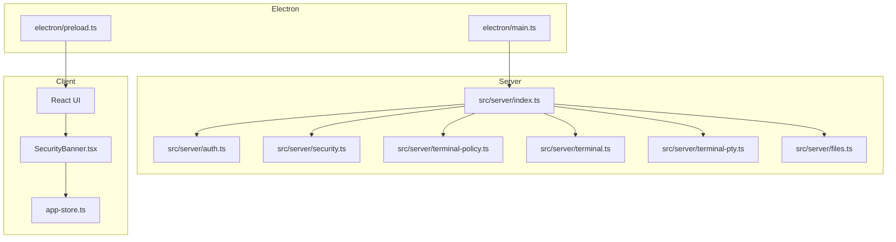
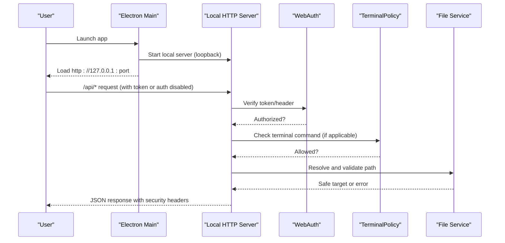
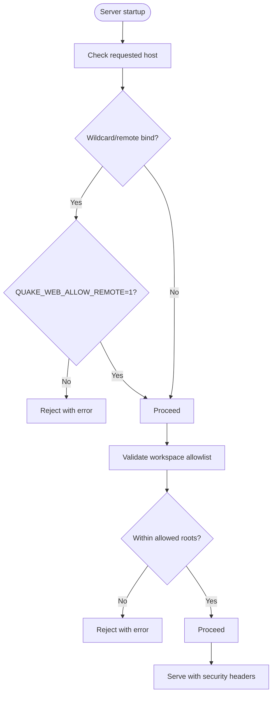
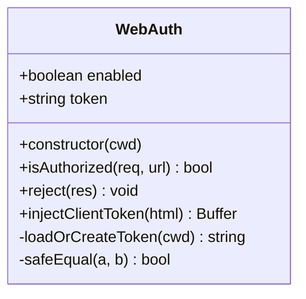
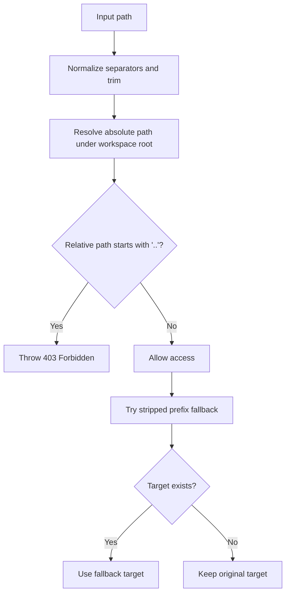
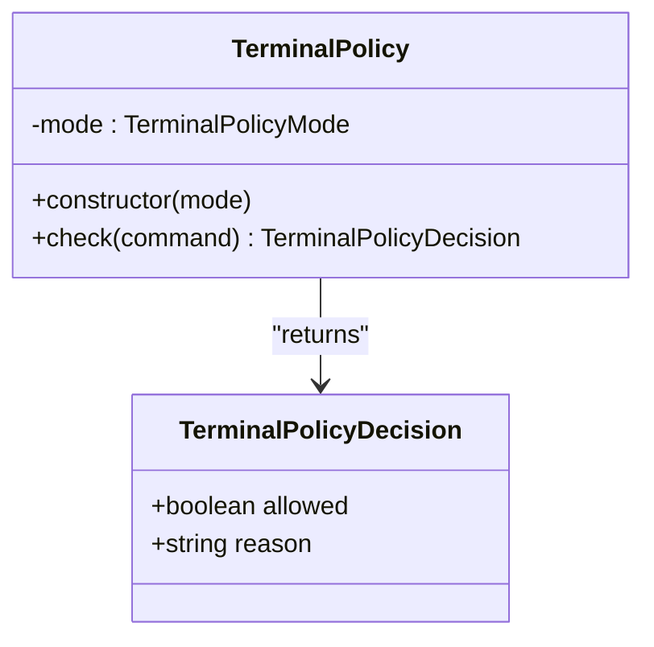
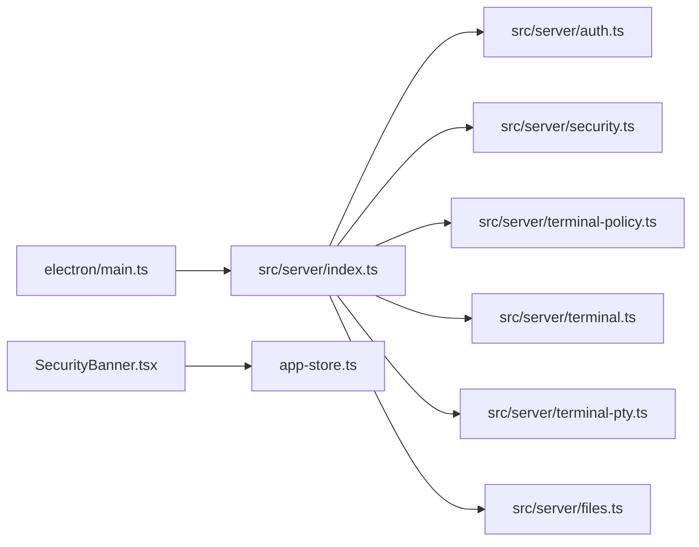

# Security Model

<cite>
**Referenced Files in This Document**
- [README.md](file://README.md)
- [docs/security.md](file://docs/security.md)
- [src/server/index.ts](file://src/server/index.ts)
- [src/server/auth.ts](file://src/server/auth.ts)
- [src/server/security.ts](file://src/server/security.ts)
- [src/server/terminal-policy.ts](file://src/server/terminal-policy.ts)
- [src/server/terminal-pty.ts](file://src/server/terminal-pty.ts)
- [src/server/terminal.ts](file://src/server/terminal.ts)
- [src/server/files.ts](file://src/server/files.ts)
- [src/client/src/components/security/SecurityBanner.tsx](file://src/client/src/components/security/SecurityBanner.tsx)
- [src/client/src/state/app-store.ts](file://src/client/src/state/app-store.ts)
- [electron/main.ts](file://electron/main.ts)
- [electron/preload.ts](file://electron/preload.ts)
- [src/server/web-settings.ts](file://src/server/web-settings.ts)
</cite>

## Table of Contents
1. [Introduction](#introduction)
2. [Project Structure](#project-structure)
3. [Core Components](#core-components)
4. [Architecture Overview](#architecture-overview)
5. [Detailed Component Analysis](#detailed-component-analysis)
6. [Dependency Analysis](#dependency-analysis)
7. [Performance Considerations](#performance-considerations)
8. [Troubleshooting Guide](#troubleshooting-guide)
9. [Conclusion](#conclusion)
10. [Appendices](#appendices)

## Introduction
This document explains the security model and implementation of Quake Code Web. It covers the local-first design, workspace isolation, authentication and authorization, terminal command policy, file system safeguards, output limits, configuration options, and hardening recommendations. It also includes threat modeling, vulnerability assessment, and best practices for local development and production deployment.

## Project Structure
Quake Code Web is a desktop-first Electron application with a local HTTP server and a React web UI. Security is enforced at multiple layers:
- Electron main process enforces a strict renderer sandbox and navigation restrictions.
- Local HTTP server enforces authentication, workspace allowlists, terminal policy, and file-system boundaries.
- Client-side UI surfaces security state and warnings.

**Diagram sources**
- [electron/main.ts:1-171](file://electron/main.ts#L1-L171)
- [electron/preload.ts:1-15](file://electron/preload.ts#L1-L15)
- [src/server/index.ts:83-279](file://src/server/index.ts#L83-L279)
- [src/server/auth.ts:1-56](file://src/server/auth.ts#L1-L56)
- [src/server/security.ts:1-47](file://src/server/security.ts#L1-L47)
- [src/server/terminal-policy.ts:1-39](file://src/server/terminal-policy.ts#L1-L39)
- [src/server/terminal.ts:29-60](file://src/server/terminal.ts#L29-L60)
- [src/server/terminal-pty.ts:1-94](file://src/server/terminal-pty.ts#L1-L94)
- [src/server/files.ts:80-131](file://src/server/files.ts#L80-L131)
- [src/client/src/components/security/SecurityBanner.tsx:1-21](file://src/client/src/components/security/SecurityBanner.tsx#L1-L21)
- [src/client/src/state/app-store.ts:1-253](file://src/client/src/state/app-store.ts#L1-L253)

**Section sources**
- [README.md:105-130](file://README.md#L105-L130)
- [docs/security.md:1-48](file://docs/security.md#L1-L48)
- [electron/main.ts:1-171](file://electron/main.ts#L1-L171)
- [src/server/index.ts:83-279](file://src/server/index.ts#L83-L279)

## Core Components
- Local-first server with optional authentication and workspace allowlists
- Terminal command policy with “safeÔÇØ, “allow-allÔÇØ, and “disabledÔÇØ modes
- File system boundary checks and safe path resolution
- Electron sandbox with navigation and window open restrictions
- Client-side security banner and configuration state

Key defaults and behaviors:
- Server binds to loopback by default and refuses wildcard binds unless explicitly allowed.
- Authentication is enabled by default and requires a token on API endpoints.
- File preview is restricted to the workspace root and limited in size.
- Terminal command duration and output size are bounded.

**Section sources**
- [docs/security.md:5-14](file://docs/security.md#L5-L14)
- [README.md:105-130](file://README.md#L105-L130)
- [src/server/index.ts:83-105](file://src/server/index.ts#L83-L105)
- [src/server/index.ts:92](file://src/server/index.ts#L92)
- [src/server/terminal.ts:36-60](file://src/server/terminal.ts#L36-L60)

## Architecture Overview
The security architecture combines server-side enforcement with client-side visibility and Electron sandboxing.

**Diagram sources**
- [electron/main.ts:26-43](file://electron/main.ts#L26-L43)
- [src/server/index.ts:83-105](file://src/server/index.ts#L83-L105)
- [src/server/auth.ts:15-20](file://src/server/auth.ts#L15-L20)
- [src/server/terminal-policy.ts:24-32](file://src/server/terminal-policy.ts#L24-L32)
- [src/server/files.ts:96-101](file://src/server/files.ts#L96-L101)

## Detailed Component Analysis

### Local-first Security Model
- Default host is loopback; wildcard binds are rejected unless explicitly allowed via configuration.
- Authentication is enabled by default and enforced on API endpoints.
- Workspace allowlist restricts valid working directories.
- Static HTML injection adds the client token when auth is enabled.

**Diagram sources**
- [src/server/security.ts:20-41](file://src/server/security.ts#L20-L41)
- [src/server/index.ts:211-219](file://src/server/index.ts#L211-L219)

**Section sources**
- [src/server/security.ts:1-47](file://src/server/security.ts#L1-L47)
- [src/server/index.ts:211-219](file://src/server/index.ts#L211-L219)
- [src/server/index.ts:97-105](file://src/server/index.ts#L97-L105)

### Authentication and Authorization
- Authentication can be enabled or disabled via environment variable.
- When enabled, requests require a token either in a header or query parameter.
- The server injects the token into the HTML for dev mode to align proxy behavior with production.
- Token persistence supports a file path override with secure permissions.

**Diagram sources**
- [src/server/auth.ts:6-55](file://src/server/auth.ts#L6-L55)

**Section sources**
- [src/server/auth.ts:1-56](file://src/server/auth.ts#L1-L56)
- [src/server/index.ts:393](file://src/server/index.ts#L393)

### Workspace Isolation and File System Safety
- Path resolution normalizes input and prevents escaping the workspace root.
- Fallback logic strips a workspace prefix to support legacy paths.
- Directory listing and file operations enforce boundaries and return errors on attempts to escape.

**Diagram sources**
- [src/server/files.ts:103-109](file://src/server/files.ts#L103-L109)
- [src/server/files.ts:96-101](file://src/server/files.ts#L96-L101)
- [src/server/files.ts:84-94](file://src/server/files.ts#L84-L94)

**Section sources**
- [src/server/files.ts:80-131](file://src/server/files.ts#L80-L131)

### Terminal Command Policy Enforcement
- Three modes: safe, allow-all, disabled.
- Safe mode blocks known destructive patterns (e.g., recursive deletes, disk formatting, publishing, piping downloads to shells, PowerShell Invoke-Expression, chmod 777).
- Commands are validated before execution; invalid commands are rejected with a reason.
- Interactive terminal WebSocket requires authentication and spawns a PTY with controlled environment.

**Diagram sources**
- [src/server/terminal-policy.ts:21-33](file://src/server/terminal-policy.ts#L21-L33)

**Section sources**
- [src/server/terminal-policy.ts:1-39](file://src/server/terminal-policy.ts#L1-L39)
- [src/server/terminal.ts:36-60](file://src/server/terminal.ts#L36-L60)
- [src/server/terminal-pty.ts:25-42](file://src/server/terminal-pty.ts#L25-L42)

### Output Limitations and Duration Bounds
- Terminal runs are bounded by a configurable timeout and output size.
- Excessive command length is rejected early.
- Client-side tool output is truncated to protect memory and rendering performance.

**Section sources**
- [src/server/terminal.ts:36-60](file://src/server/terminal.ts#L36-L60)
- [src/client/src/state/app-store.ts:172-184](file://src/client/src/state/app-store.ts#L172-L184)

### Electron Sandboxing and Navigation Controls
- Renderer is sandboxed with context isolation, no node integration, and a preload bridge exposing minimal APIs.
- Navigation is restricted to the local server; external links open in the system browser.
- Window open handler denies non-local targets.

**Section sources**
- [electron/main.ts:86-114](file://electron/main.ts#L86-L114)
- [electron/preload.ts:1-15](file://electron/preload.ts#L1-15)

### Client Security UI
- Security banner displays warnings for missing auth, missing token, remote bind, and unspecified workspace.
- Clicking the banner opens settings for remediation.

**Section sources**
- [src/client/src/components/security/SecurityBanner.tsx:1-21](file://src/client/src/components/security/SecurityBanner.tsx#L1-L21)
- [src/client/src/state/app-store.ts:33-58](file://src/client/src/state/app-store.ts#L33-L58)

## Dependency Analysis
Security depends on coordinated enforcement across modules:
- Electron main process sets the stage with sandboxing and navigation rules.
- Server initializes security headers, workspace allowlists, and policy modes.
- Auth and terminal policy are tightly coupled to request handling.
- File service ensures path safety regardless of client input.

**Diagram sources**
- [electron/main.ts:1-171](file://electron/main.ts#L1-L171)
- [src/server/index.ts:83-279](file://src/server/index.ts#L83-L279)
- [src/server/auth.ts:1-56](file://src/server/auth.ts#L1-L56)
- [src/server/security.ts:1-47](file://src/server/security.ts#L1-L47)
- [src/server/terminal-policy.ts:1-39](file://src/server/terminal-policy.ts#L1-L39)
- [src/server/terminal.ts:1-60](file://src/server/terminal.ts#L1-L60)
- [src/server/terminal-pty.ts:1-94](file://src/server/terminal-pty.ts#L1-L94)
- [src/server/files.ts:1-131](file://src/server/files.ts#L1-L131)
- [src/client/src/components/security/SecurityBanner.tsx:1-21](file://src/client/src/components/security/SecurityBanner.tsx#L1-L21)
- [src/client/src/state/app-store.ts:1-253](file://src/client/src/state/app-store.ts#L1-L253)

**Section sources**
- [electron/main.ts:1-171](file://electron/main.ts#L1-L171)
- [src/server/index.ts:83-279](file://src/server/index.ts#L83-L279)

## Performance Considerations
- Security headers are applied to all JSON responses to reduce risk without impacting throughput.
- File preview size is capped to limit memory usage during rendering.
- Terminal output truncation protects the UI from excessive data.
- Workspace allowlists prevent scanning large or sensitive filesystem areas.

[No sources needed since this section provides general guidance]

## Troubleshooting Guide
Common issues and remedies:
- Remote bind refused: Set the allow flag after configuring auth, workspace allowlist, and terminal policy.
- Unauthorized API requests: Ensure the token header/query parameter matches the server token or disable auth only for trusted local experiments.
- Workspace outside allowed roots: Adjust the workspace or add allowed roots to the allowlist.
- Terminal blocked: Switch policy mode to “allow-allÔÇØ for controlled testing or “safeÔÇØ for production.
- Client token missing: Rebuild or refresh the page to re-inject the token in dev mode.

**Section sources**
- [src/server/security.ts:24-41](file://src/server/security.ts#L24-L41)
- [src/server/auth.ts:15-20](file://src/server/auth.ts#L15-L20)
- [src/server/index.ts:393](file://src/server/index.ts#L393)
- [src/server/terminal-policy.ts:24-32](file://src/server/terminal-policy.ts#L24-L32)

## Conclusion
Quake Code Web's security model is built around a local-first, authenticated server with strong workspace and file-system boundaries, a robust terminal policy, and a hardened Electron renderer. Production deployments should keep remote binds disabled, enforce auth and allowlists, and maintain the “safeÔÇØ terminal policy. Ongoing hardening includes replacing SSE auth with cookies/WebSockets, adding explicit confirmations for destructive actions, and enhancing CORS coverage.

[No sources needed since this section summarizes without analyzing specific files]

## Appendices

### Security Configuration Options
- Host and port defaults to loopback; wildcard binds require explicit allowance.
- Authentication toggle and token management.
- Workspace allowlist for restricting valid working directories.
- Terminal policy mode selection.

**Section sources**
- [docs/security.md:15-28](file://docs/security.md#L15-L28)
- [README.md:116-128](file://README.md#L116-L128)

### Environment Variables
- Host and port selection
- Working directory and token configuration
- Auth enable/disable and token file location
- Allow remote access and workspace allowlist
- Terminal policy mode

**Section sources**
- [docs/security.md:17-26](file://docs/security.md#L17-L26)
- [README.md:118-127](file://README.md#L118-L127)

### Hardening Recommendations
- Replace SSE token auth with cookie or WebSocket-based auth before enabling remote access.
- Add project-specific terminal allow/deny policy UI.
- Add explicit confirmations for write/destructive actions.
- Add CORS tests and security regression smoke tests.
- Persist workspace allowlist in web settings once schema stabilizes.

**Section sources**
- [docs/security.md:41-47](file://docs/security.md#L41-L47)

### Threat Modeling and Vulnerabilities
- Risk: Exposure via wildcard bind
  - Mitigation: Require explicit allow flag and configure auth and allowlists first.
- Risk: Unauthenticated API access
  - Mitigation: Enforce token-based auth and inject token into HTML in dev mode.
- Risk: Path traversal and out-of-bounds file access
  - Mitigation: Normalize and validate paths against workspace root; deny escapes.
- Risk: Destructive terminal commands
  - Mitigation: Apply safe policy with explicit deny patterns; optionally disable interactive terminal.
- Risk: Excessive resource consumption
  - Mitigation: Enforce timeouts, output size caps, and client-side truncation.

**Section sources**
- [src/server/security.ts:20-41](file://src/server/security.ts#L20-L41)
- [src/server/auth.ts:15-20](file://src/server/auth.ts#L15-L20)
- [src/server/files.ts:96-101](file://src/server/files.ts#L96-L101)
- [src/server/terminal-policy.ts:8-19](file://src/server/terminal-policy.ts#L8-L19)
- [src/server/terminal.ts:36-60](file://src/server/terminal.ts#L36-L60)
- [src/client/src/state/app-store.ts:172-184](file://src/client/src/state/app-store.ts#L172-L184)
