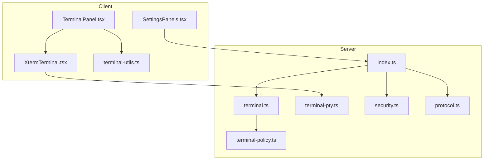
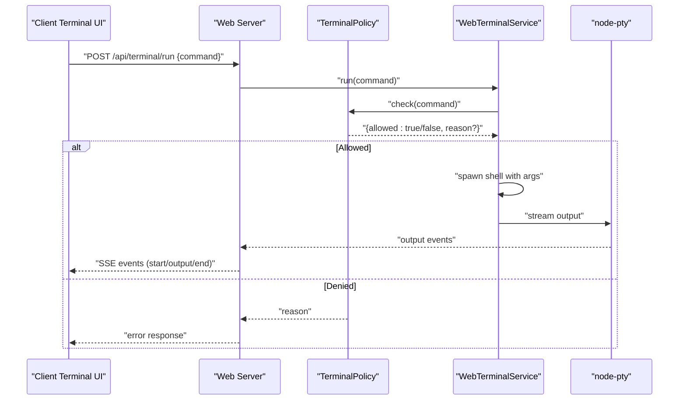
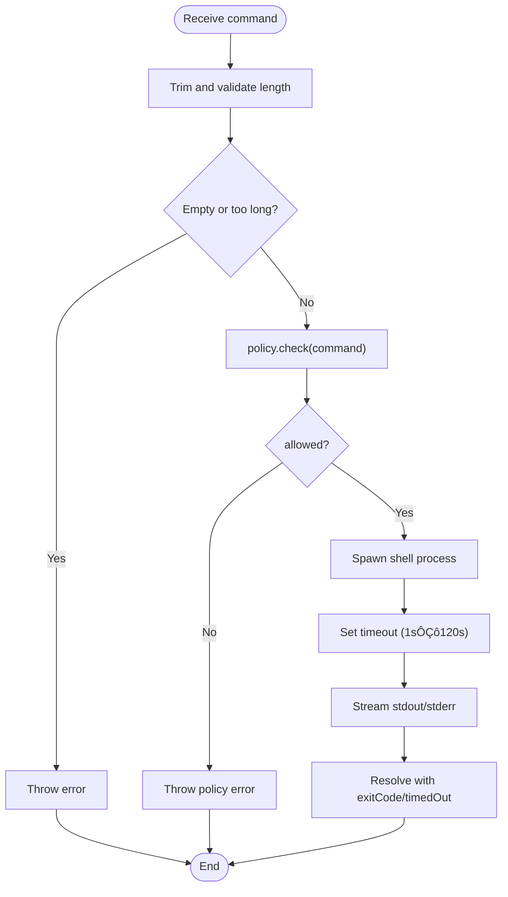
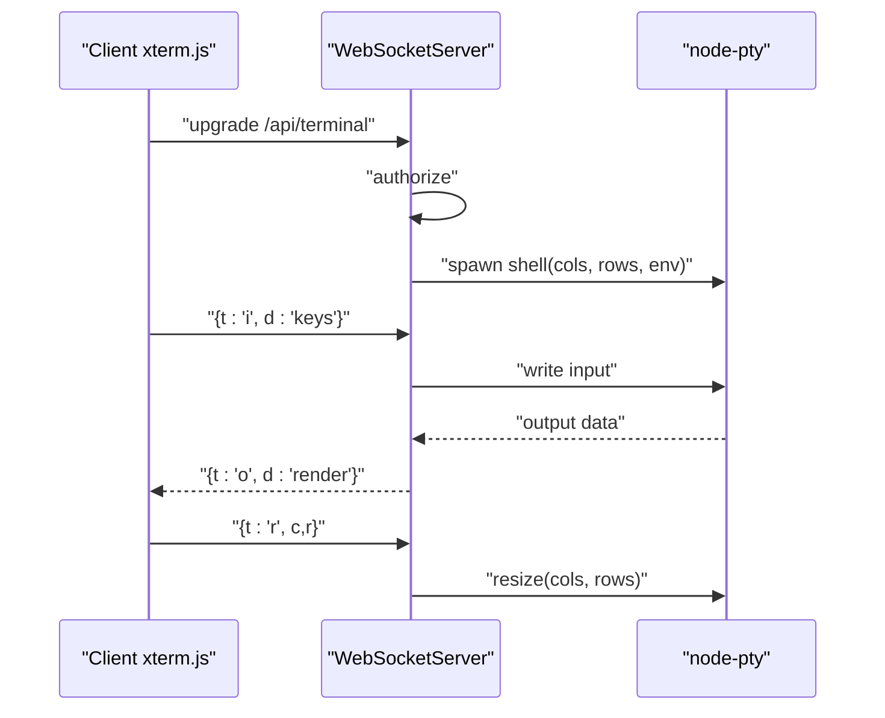
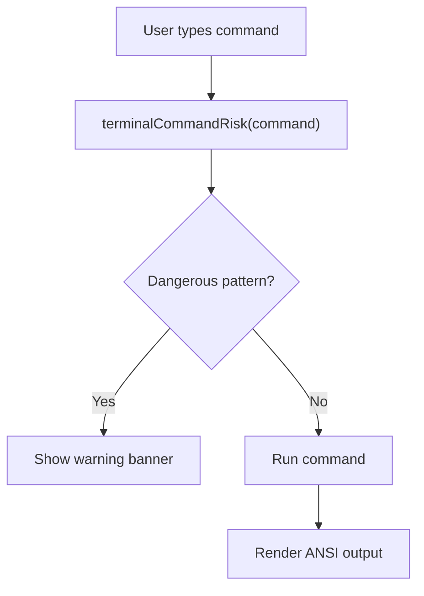
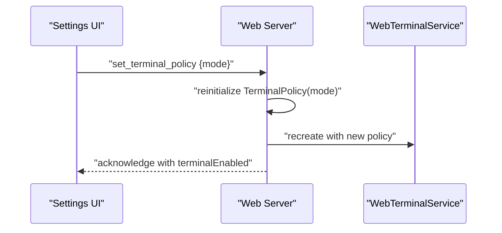
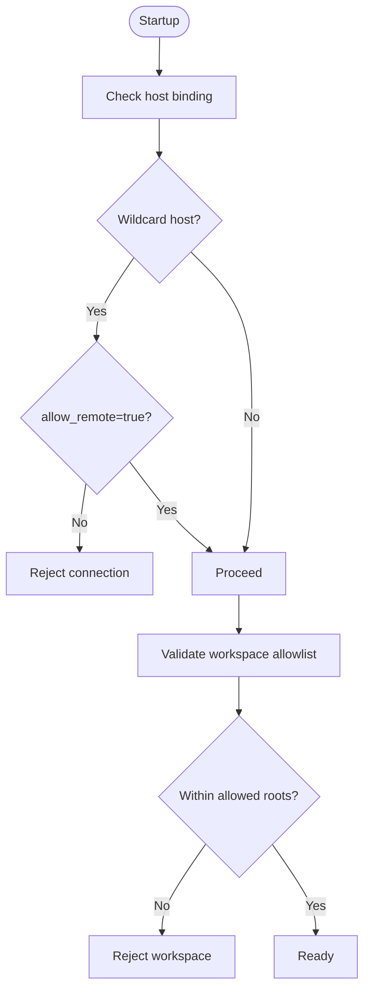
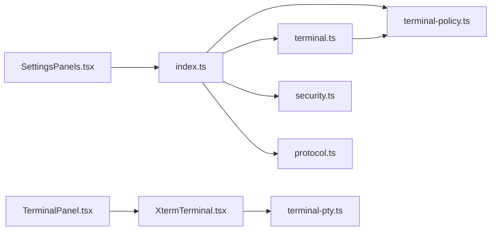

# Terminal Command Policies

<cite>
**Referenced Files in This Document**
- [terminal-policy.ts](file://src/server/terminal-policy.ts)
- [terminal.ts](file://src/server/terminal.ts)
- [index.ts](file://src/server/index.ts)
- [terminal-pty.ts](file://src/server/terminal-pty.ts)
- [protocol.ts](file://src/shared/protocol.ts)
- [TerminalPanel.tsx](file://src/client/src/components/terminal/TerminalPanel.tsx)
- [XtermTerminal.tsx](file://src/client/src/components/terminal/XtermTerminal.tsx)
- [terminal-utils.ts](file://src/client/src/components/terminal/terminal-utils.ts)
- [SettingsPanels.tsx](file://src/client/src/components/settings/SettingsPanels.tsx)
- [security.ts](file://src/server/security.ts)
- [README.md](file://README.md)
</cite>

## Table of Contents
1. [Introduction](#introduction)
2. [Project Structure](#project-structure)
3. [Core Components](#core-components)
4. [Architecture Overview](#architecture-overview)
5. [Detailed Component Analysis](#detailed-component-analysis)
6. [Dependency Analysis](#dependency-analysis)
7. [Performance Considerations](#performance-considerations)
8. [Troubleshooting Guide](#troubleshooting-guide)
9. [Conclusion](#conclusion)

## Introduction
This document explains the terminal command policy enforcement system in Quake Code Web. It covers how commands are filtered, how policy modes are configured and applied, and how execution is restricted. It also documents the terminal policy engine, validation rules, and security boundaries for local command execution. The guide includes configuration options, allowlists and blocklists, dynamic policy updates, examples, and troubleshooting tips.

## Project Structure
The terminal policy enforcement spans both server-side and client-side components:
- Server-side policy engine and enforcement
- Terminal execution service with timeouts and output limits
- Interactive terminal via WebSocket with PTY
- Client-side terminal UI with risk warnings and command history
- Settings UI for dynamic policy updates
- Security validation for workspace allowlists and remote access



**Diagram sources**
- [index.ts:65](file://src/server/index.ts#L65)
- [terminal.ts:21](file://src/server/terminal.ts#L21)
- [terminal-policy.ts:21](file://src/server/terminal-policy.ts#L21)
- [terminal-pty.ts:25](file://src/server/terminal-pty.ts#L25)
- [protocol.ts:112](file://src/shared/protocol.ts#L112)
- [TerminalPanel.tsx:9](file://src/client/src/components/terminal/TerminalPanel.tsx#L9)
- [XtermTerminal.tsx:64](file://src/client/src/components/terminal/XtermTerminal.tsx#L64)
- [SettingsPanels.tsx:398](file://src/client/src/components/settings/SettingsPanels.tsx#L398)

**Section sources**
- [index.ts:65](file://src/server/index.ts#L65)
- [terminal.ts:21](file://src/server/terminal.ts#L21)
- [terminal-policy.ts:21](file://src/server/terminal-policy.ts#L21)
- [terminal-pty.ts:25](file://src/server/terminal-pty.ts#L25)
- [protocol.ts:112](file://src/shared/protocol.ts#L112)
- [TerminalPanel.tsx:9](file://src/client/src/components/terminal/TerminalPanel.tsx#L9)
- [XtermTerminal.tsx:64](file://src/client/src/components/terminal/XtermTerminal.tsx#L64)
- [SettingsPanels.tsx:398](file://src/client/src/components/settings/SettingsPanels.tsx#L398)

## Core Components
- TerminalPolicy: Implements pattern-based command filtering with three modes (safe, allow-all, disabled).
- WebTerminalService: Enforces policy, spawns platform-appropriate shells, applies timeouts, and streams output.
- Terminal UI: Provides risk warnings, command history, and interactive terminal via WebSocket.
- Dynamic Policy Updates: Settings UI allows changing policy mode at runtime; server reinitializes policy and updates configuration.
- Security Boundaries: Workspace allowlists and remote access controls prevent unauthorized execution outside allowed roots.

**Section sources**
- [terminal-policy.ts:1-39](file://src/server/terminal-policy.ts#L1-L39)
- [terminal.ts:21-87](file://src/server/terminal.ts#L21-L87)
- [TerminalPanel.tsx:184-190](file://src/client/src/components/terminal/TerminalPanel.tsx#L184-L190)
- [SettingsPanels.tsx:398-413](file://src/client/src/components/settings/SettingsPanels.tsx#L398-L413)
- [index.ts:353-359](file://src/server/index.ts#L353-L359)
- [security.ts:24-41](file://src/server/security.ts#L24-L41)

## Architecture Overview
The terminal command policy system integrates client and server components:
- Client sends commands and receives events via SSE/WebSocket.
- Server validates commands against policy and executes within controlled bounds.
- Interactive terminal uses node-pty over WebSocket for full TTY support.
- Policy mode can be changed dynamically; server updates configuration and enforces immediately.



**Diagram sources**
- [terminal.ts:36](file://src/server/terminal.ts#L36)
- [terminal-policy.ts:24](file://src/server/terminal-policy.ts#L24)
- [terminal-pty.ts:44](file://src/server/terminal-pty.ts#L44)
- [protocol.ts:165](file://src/shared/protocol.ts#L165)

## Detailed Component Analysis

### Terminal Policy Engine
The policy engine defines three modes and a set of dangerous patterns:
- Modes:
  - safe: blocks known dangerous patterns
  - allow-all: permits all commands
  - disabled: blocks all commands
- Patterns include recursive deletion, destructive Git operations, package publishing, piping downloads to shells, PowerShell expression execution, and unsafe chmod usage.

```mermaid
classDiagram
class TerminalPolicy {
-mode : TerminalPolicyMode
+constructor(mode)
+check(command) : TerminalPolicyDecision
}
class TerminalPolicyDecision {
+allowed : boolean
+reason? : string
}
class TerminalPolicyMode {
<<enumeration>>
"safe"
"allow-all"
"disabled"
}
TerminalPolicy --> TerminalPolicyDecision : "returns"
TerminalPolicy --> TerminalPolicyMode : "configured by"
```

**Diagram sources**
- [terminal-policy.ts:1](file://src/server/terminal-policy.ts#L1)
- [terminal-policy.ts:21](file://src/server/terminal-policy.ts#L21)
- [terminal-policy.ts:3](file://src/server/terminal-policy.ts#L3)

**Section sources**
- [terminal-policy.ts:1-39](file://src/server/terminal-policy.ts#L1-L39)

### Terminal Execution Service
The execution service:
- Trims and validates commands (empty or too long)
- Applies policy decision
- Spawns platform-appropriate shells (Windows cmd.exe or Unix /bin/sh)
- Enforces timeouts (min 1s, max 120s)
- Streams stdout/stderr with bounded buffers
- Tracks active processes and supports stopping



**Diagram sources**
- [terminal.ts:36](file://src/server/terminal.ts#L36)
- [terminal.ts:49](file://src/server/terminal.ts#L49)

**Section sources**
- [terminal.ts:21-87](file://src/server/terminal.ts#L21-L87)

### Interactive Terminal (WebSocket + PTY)
Interactive terminals use node-pty over WebSocket:
- Authorization checked on upgrade
- Shell chosen per platform (PowerShell on Windows, configured SHELL or bash on Unix)
- Resizable PTY with ANSI color support
- Bidirectional input/output streaming



**Diagram sources**
- [terminal-pty.ts:25](file://src/server/terminal-pty.ts#L25)
- [terminal-pty.ts:44](file://src/server/terminal-pty.ts#L44)

**Section sources**
- [terminal-pty.ts:1-95](file://src/server/terminal-pty.ts#L1-L95)

### Client-Side Terminal UI and Risk Warnings
The client provides:
- Command input with history navigation
- Risk indicators for potentially dangerous commands
- ANSI output rendering
- Tabbed terminal sessions
- Stop and copy actions



**Diagram sources**
- [TerminalPanel.tsx:48](file://src/client/src/components/terminal/TerminalPanel.tsx#L48)
- [TerminalPanel.tsx:184](file://src/client/src/components/terminal/TerminalPanel.tsx#L184)

**Section sources**
- [TerminalPanel.tsx:1-217](file://src/client/src/components/terminal/TerminalPanel.tsx#L1-L217)
- [XtermTerminal.tsx:1-138](file://src/client/src/components/terminal/XtermTerminal.tsx#L1-L138)
- [terminal-utils.ts:1-6](file://src/client/src/components/terminal/terminal-utils.ts#L1-L6)

### Dynamic Policy Updates
Policy mode can be changed at runtime:
- Settings UI exposes safe/allow-all/disabled options
- Server updates internal policy and configuration
- Terminal panel reflects enabled/disabled state



**Diagram sources**
- [SettingsPanels.tsx:398](file://src/client/src/components/settings/SettingsPanels.tsx#L398)
- [index.ts:353](file://src/server/index.ts#L353)

**Section sources**
- [SettingsPanels.tsx:398-413](file://src/client/src/components/settings/SettingsPanels.tsx#L398-L413)
- [index.ts:353-359](file://src/server/index.ts#L353-L359)

### Security Boundaries and Workspace Allowlists
- Remote access is blocked for wildcard hosts unless explicitly allowed
- Workspace allowlists restrict execution to allowed roots
- Realpath resolution prevents symlink traversal issues



**Diagram sources**
- [security.ts:24](file://src/server/security.ts#L24)
- [security.ts:33](file://src/server/security.ts#L33)

**Section sources**
- [security.ts:1-47](file://src/server/security.ts#L1-L47)
- [README.md:124-130](file://README.md#L124-L130)

## Dependency Analysis
- index.ts orchestrates policy initialization and dynamic updates
- terminal.ts depends on terminal-policy.ts for enforcement
- terminal-pty.ts depends on node-pty and WebAuth for secure WebSocket upgrades
- protocol.ts defines server configuration including terminalEnabled and terminalPolicyMode
- Client components depend on SSE/WebSocket for terminal events



**Diagram sources**
- [index.ts:18](file://src/server/index.ts#L18)
- [terminal.ts:2](file://src/server/terminal.ts#L2)
- [terminal-pty.ts:3](file://src/server/terminal-pty.ts#L3)
- [protocol.ts:112](file://src/shared/protocol.ts#L112)
- [TerminalPanel.tsx:1](file://src/client/src/components/terminal/TerminalPanel.tsx#L1)
- [XtermTerminal.tsx:1](file://src/client/src/components/terminal/XtermTerminal.tsx#L1)
- [SettingsPanels.tsx:398](file://src/client/src/components/settings/SettingsPanels.tsx#L398)

**Section sources**
- [index.ts:18](file://src/server/index.ts#L18)
- [terminal.ts:2](file://src/server/terminal.ts#L2)
- [terminal-pty.ts:3](file://src/server/terminal-pty.ts#L3)
- [protocol.ts:112](file://src/shared/protocol.ts#L112)
- [TerminalPanel.tsx:1](file://src/client/src/components/terminal/TerminalPanel.tsx#L1)
- [XtermTerminal.tsx:1](file://src/client/src/components/terminal/XtermTerminal.tsx#L1)
- [SettingsPanels.tsx:398](file://src/client/src/components/settings/SettingsPanels.tsx#L398)

## Performance Considerations
- Output buffering: stdout/stderr capped to reduce memory usage during long-running commands.
- Timeouts: enforced between 1s and 120s to prevent runaway processes.
- Platform-specific shells: Windows uses cmd.exe; Unix uses a configured shell or bash.
- WebSocket PTY: efficient bidirectional streaming with resize support.

[No sources needed since this section provides general guidance]

## Troubleshooting Guide
Common issues and resolutions:
- Command denied by policy:
  - Verify policy mode and review dangerous patterns.
  - Switch to allow-all temporarily for testing; revert to safe after validation.
- Terminal disabled:
  - Check server configuration terminalEnabled flag.
  - Ensure policy mode is not disabled.
- Remote access blocked:
  - Set QUAKE_WEB_ALLOW_REMOTE=1 only after securing auth, workspace allowlists, and policy.
- Workspace outside allowlist:
  - Adjust QUAKE_WEB_WORKSPACE_ALLOWLIST to include the desired root(s).
- Interactive terminal fails to start:
  - Confirm authorization and shell availability.
  - Check PTY spawn errors and environment variables.

**Section sources**
- [terminal-policy.ts:24](file://src/server/terminal-policy.ts#L24)
- [terminal.ts:42](file://src/server/terminal.ts#L42)
- [index.ts:90](file://src/server/index.ts#L90)
- [security.ts:24](file://src/server/security.ts#L24)
- [README.md:124-130](file://README.md#L124-L130)

## Conclusion
Quake Code Web's terminal command policy system provides layered safety for local command execution. The policy engine filters dangerous patterns, execution is bounded by timeouts and output limits, and interactive terminals are secured via authorization and PTY. Dynamic policy updates enable safe experimentation, while workspace allowlists and remote access controls enforce broader security boundaries.
