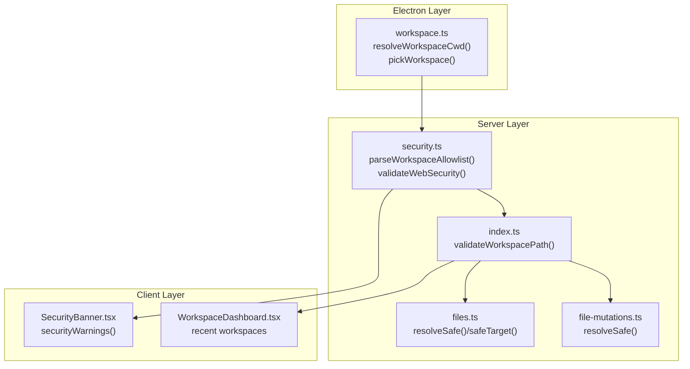
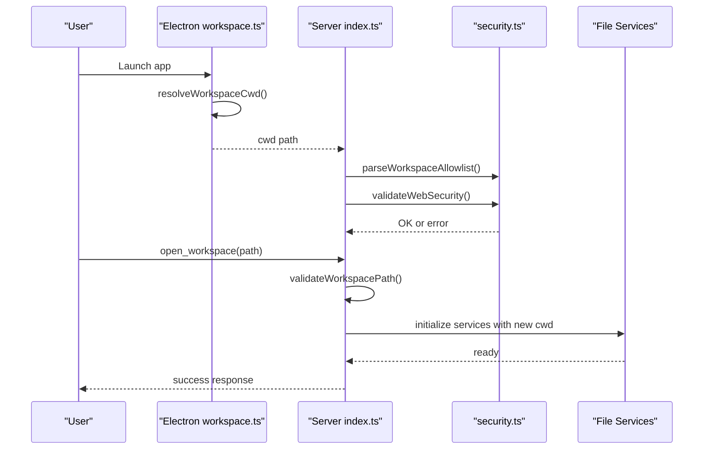
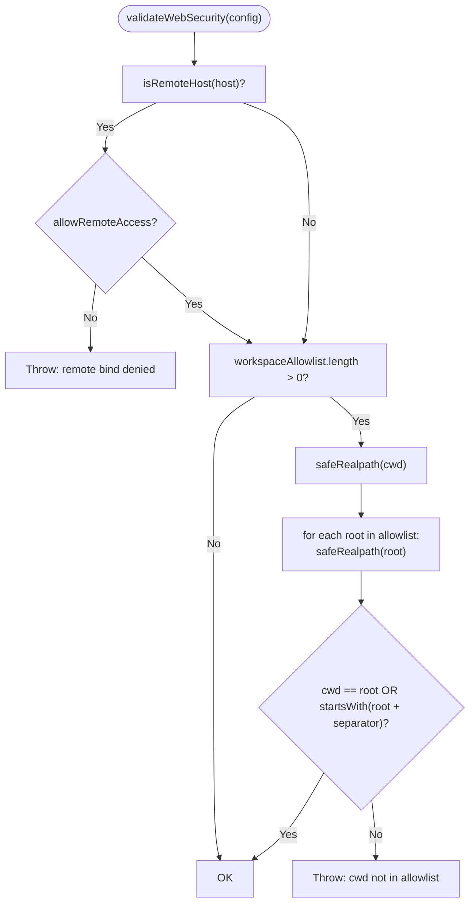
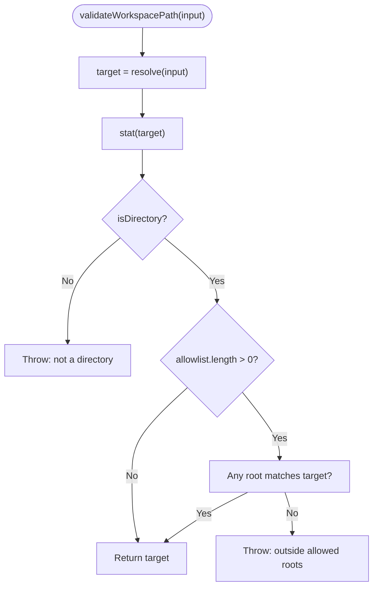
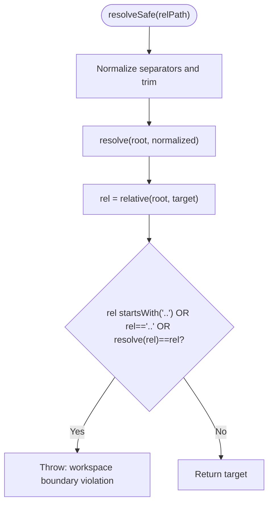
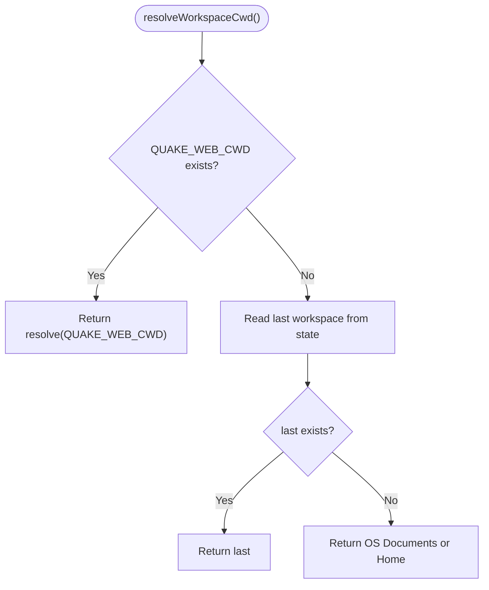
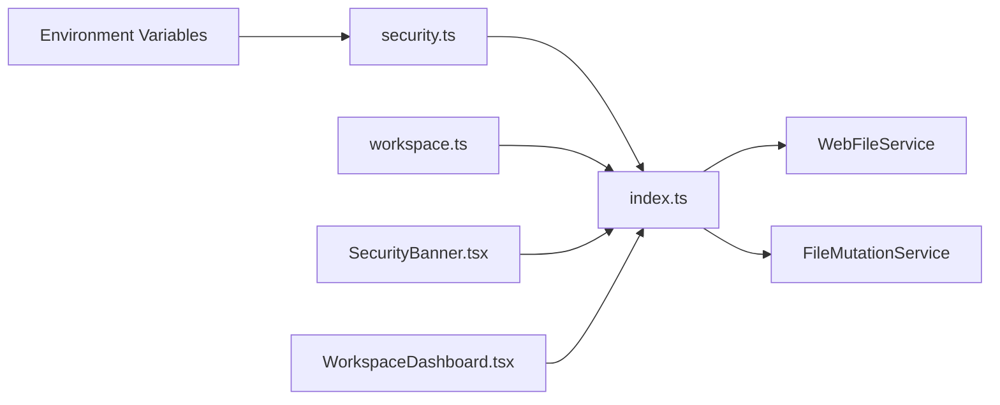

# Workspace Isolation

<cite>
**Referenced Files in This Document**
- [security.ts](file://src/server/security.ts)
- [index.ts](file://src/server/index.ts)
- [files.ts](file://src/server/files.ts)
- [file-mutations.ts](file://src/server/file-mutations.ts)
- [workspace.ts](file://electron/workspace.ts)
- [web-settings.ts](file://src/server/web-settings.ts)
- [SecurityBanner.tsx](file://src/client/src/components/security/SecurityBanner.tsx)
- [WorkspaceDashboard.tsx](file://src/client/src/components/workspace/WorkspaceDashboard.tsx)
- [README.md](file://README.md)
- [security.md](file://docs/security.md)
</cite>

## Table of Contents
1. [Introduction](#introduction)
2. [Project Structure](#project-structure)
3. [Core Components](#core-components)
4. [Architecture Overview](#architecture-overview)
5. [Detailed Component Analysis](#detailed-component-analysis)
6. [Dependency Analysis](#dependency-analysis)
7. [Performance Considerations](#performance-considerations)
8. [Troubleshooting Guide](#troubleshooting-guide)
9. [Conclusion](#conclusion)

## Introduction
This document explains workspace isolation and access control in Quake Code Web. It covers the workspace allowlist mechanism, path validation, directory traversal protection, the WebSecurityConfig interface, workspace validation logic, and safe path resolution functions. It also documents the relationship between working directory, allowed roots, and security boundaries, provides configuration examples, common workspace setups, and troubleshooting guidance for workspace access issues. Finally, it addresses security implications and best practices for secure workspace management.

## Project Structure
Workspace isolation spans three layers:
- Server-side enforcement: security validation, workspace allowlist parsing, and safe path resolution during file operations
- Electron-side workspace selection and persistence: last-used workspace detection and native folder picker
- Client-side UX: security warnings and workspace dashboard

**Diagram sources**
- [workspace.ts:42-53](file://electron/workspace.ts#L42-L53)
- [security.ts:11-46](file://src/server/security.ts#L11-L46)
- [index.ts:211-219](file://src/server/index.ts#L211-L219)
- [files.ts:84-101](file://src/server/files.ts#L84-L101)
- [file-mutations.ts:128-136](file://src/server/file-mutations.ts#L128-L136)
- [SecurityBanner.tsx:13-20](file://src/client/src/components/security/SecurityBanner.tsx#L13-L20)
- [WorkspaceDashboard.tsx:20-33](file://src/client/src/components/workspace/WorkspaceDashboard.tsx#L20-L33)

**Section sources**
- [workspace.ts:42-53](file://electron/workspace.ts#L42-L53)
- [security.ts:11-46](file://src/server/security.ts#L11-L46)
- [index.ts:211-219](file://src/server/index.ts#L211-L219)
- [files.ts:84-101](file://src/server/files.ts#L84-L101)
- [file-mutations.ts:128-136](file://src/server/file-mutations.ts#L128-L136)
- [SecurityBanner.tsx:13-20](file://src/client/src/components/security/SecurityBanner.tsx#L13-L20)
- [WorkspaceDashboard.tsx:20-33](file://src/client/src/components/workspace/WorkspaceDashboard.tsx#L20-L33)

## Core Components
- WebSecurityConfig: defines host, current working directory (cwd), remote access flag, and workspace allowlist
- parseWorkspaceAllowlist: splits and normalizes allowlist entries into absolute paths
- validateWebSecurity: enforces remote host restrictions and workspace allowlist membership
- validateWorkspacePath: validates requested workspace paths and ensures they are within allowed roots
- resolveSafe/safeTarget: safe path resolution for file operations to prevent directory traversal
- resolveWorkspaceCwd/pickWorkspace: Electron-side workspace selection and persistence
- SecurityBanner: client-side security warnings based on configuration state
- WorkspaceDashboard: client-side workspace listing and removal

**Section sources**
- [security.ts:4-46](file://src/server/security.ts#L4-L46)
- [index.ts:211-219](file://src/server/index.ts#L211-L219)
- [files.ts:84-101](file://src/server/files.ts#L84-L101)
- [file-mutations.ts:128-136](file://src/server/file-mutations.ts#L128-L136)
- [workspace.ts:42-65](file://electron/workspace.ts#L42-L65)
- [SecurityBanner.tsx:13-20](file://src/client/src/components/security/SecurityBanner.tsx#L13-L20)
- [WorkspaceDashboard.tsx:20-33](file://src/client/src/components/workspace/WorkspaceDashboard.tsx#L20-L33)

## Architecture Overview
The workspace isolation architecture enforces security at startup and during operations:
- Startup: parse and validate workspace allowlist; enforce remote bind restrictions
- Workspace change: validate requested path against allowlist and filesystem
- File operations: resolve paths safely and reject attempts outside the workspace root
- Electron: choose initial workspace and persist last-used directory
- Client: surface security warnings and manage recent workspaces

**Diagram sources**
- [workspace.ts:42-53](file://electron/workspace.ts#L42-L53)
- [index.ts:54-59](file://src/server/index.ts#L54-L59)
- [security.ts:11-46](file://src/server/security.ts#L11-L46)
- [index.ts:211-219](file://src/server/index.ts#L211-L219)

## Detailed Component Analysis

### WebSecurityConfig and Allowlist Parsing
- WebSecurityConfig defines the security posture: host, cwd, allowRemoteAccess, and workspaceAllowlist
- parseWorkspaceAllowlist splits the environment variable by the platform path delimiter, trims entries, filters empty strings, and resolves each to an absolute path
- validateWebSecurity enforces:
  - Remote bind restriction: wildcard hosts are rejected unless allowRemoteAccess is explicitly enabled
  - Workspace membership: cwd must match or be under one of the allowed roots; uses safeRealpath to resolve symlinks and normalize

**Diagram sources**
- [security.ts:20-41](file://src/server/security.ts#L20-L41)

**Section sources**
- [security.ts:4-46](file://src/server/security.ts#L4-L46)

### Workspace Validation Logic
- validateWorkspacePath ensures the requested path is a directory and resides within the allowlisted roots
- It uses resolve to normalize input and checks membership against allowlist entries

**Diagram sources**
- [index.ts:211-219](file://src/server/index.ts#L211-L219)

**Section sources**
- [index.ts:211-219](file://src/server/index.ts#L211-L219)

### Safe Path Resolution Functions
- resolveSafe in FileMutationService:
  - Normalizes separators and cleans leading/trailing slashes
  - Resolves target under the service root
  - Rejects paths that escape the root using relative() checks
- safeTarget in WebFileService:
  - Normalizes input path
  - Resolves target under the service root
  - Rejects attempts to escape the root
- normalizeInputPath:
  - Ensures consistent forward-slash handling and removes redundant prefixes/suffixes

**Diagram sources**
- [file-mutations.ts:128-136](file://src/server/file-mutations.ts#L128-L136)
- [files.ts:84-101](file://src/server/files.ts#L84-L101)

**Section sources**
- [file-mutations.ts:128-136](file://src/server/file-mutations.ts#L128-L136)
- [files.ts:84-101](file://src/server/files.ts#L84-L101)

### Working Directory Selection and Persistence
- resolveWorkspaceCwd follows precedence:
  - QUAK_WEB_CWD environment variable (if exists)
  - Last used workspace stored in Electron userData
  - Documents folder (or home directory fallback)
- pickWorkspace opens a native folder picker, persists the selection, and returns the chosen directory

**Diagram sources**
- [workspace.ts:42-53](file://electron/workspace.ts#L42-L53)

**Section sources**
- [workspace.ts:42-65](file://electron/workspace.ts#L42-L65)

### Client-Side Security and Workspace UX
- SecurityBanner displays warnings based on configuration:
  - Authentication enabled/disabled
  - Client token presence
  - Remote bind status
  - Workspace boundary status
- WorkspaceDashboard lists recent workspaces, allows removal, and triggers opening a workspace

**Section sources**
- [SecurityBanner.tsx:13-20](file://src/client/src/components/security/SecurityBanner.tsx#L13-L20)
- [WorkspaceDashboard.tsx:20-33](file://src/client/src/components/workspace/WorkspaceDashboard.tsx#L20-L33)

## Dependency Analysis
- Server initialization depends on security.ts for allowlist parsing and validation
- Workspace change commands depend on validateWorkspacePath
- File services depend on safe path resolution to protect against traversal
- Electron workspace selection influences server cwd and client UX

**Diagram sources**
- [security.ts:11-18](file://src/server/security.ts#L11-L18)
- [index.ts:54-59](file://src/server/index.ts#L54-L59)
- [files.ts:84-101](file://src/server/files.ts#L84-L101)
- [file-mutations.ts:128-136](file://src/server/file-mutations.ts#L128-L136)
- [workspace.ts:42-53](file://electron/workspace.ts#L42-L53)
- [SecurityBanner.tsx:13-20](file://src/client/src/components/security/SecurityBanner.tsx#L13-L20)
- [WorkspaceDashboard.tsx:20-33](file://src/client/src/components/workspace/WorkspaceDashboard.tsx#L20-L33)

**Section sources**
- [security.ts:11-18](file://src/server/security.ts#L11-L18)
- [index.ts:54-59](file://src/server/index.ts#L54-L59)
- [files.ts:84-101](file://src/server/files.ts#L84-L101)
- [file-mutations.ts:128-136](file://src/server/file-mutations.ts#L128-L136)
- [workspace.ts:42-53](file://electron/workspace.ts#L42-L53)
- [SecurityBanner.tsx:13-20](file://src/client/src/components/security/SecurityBanner.tsx#L13-L20)
- [WorkspaceDashboard.tsx:20-33](file://src/client/src/components/workspace/WorkspaceDashboard.tsx#L20-L33)

## Performance Considerations
- Path normalization and realpath resolution occur during startup and workspace changes; keep allowlists concise
- File operations validate paths per request; avoid excessive nested directory traversals
- Client-side workspace listing reads localStorage; keep recent workspace arrays reasonably sized

## Troubleshooting Guide
Common workspace access issues and resolutions:
- Error: "workspace path is not a directory"
  - Cause: Requested path is not a directory
  - Fix: Select a valid directory or create it
- Error: "workspace outside allowed roots"
  - Cause: Requested path is not under any allowed root
  - Fix: Add the parent directory to QUAKE_WEB_WORKSPACE_ALLOWLIST or move the workspace inside an allowed root
- Error: "cwd not in allowlist"
  - Cause: Initial cwd is not under any allowed root
  - Fix: Set QUAKE_WEB_WORKSPACE_ALLOWLIST to include the intended workspace root
- Warning: "remote connection open"
  - Cause: Server bound to wildcard host without enabling remote access
  - Fix: Set QUAKE_WEB_ALLOW_REMOTE=1 or bind to localhost only
- Warning: "workspace boundary status"
  - Cause: No workspace allowlist configured
  - Fix: Configure QUAKE_WEB_WORKSPACE_ALLOWLIST to restrict valid workspace roots

Configuration examples:
- Basic local workspace:
  - QUAKE_WEB_HOST=127.0.0.1
  - QUAKE_WEB_PORT=3737
  - QUAKE_WEB_CWD=/path/to/my/project
- Allow multiple roots:
  - QUAKE_WEB_WORKSPACE_ALLOWLIST=/projects:/home/user/dev
- Windows shells may require semicolon separation:
  - QUAKE_WEB_WORKSPACE_ALLOWLIST=C:\Projects;D:\Dev

Best practices:
- Always enable authentication and avoid disabling it except for trusted local experiments
- Bind to localhost by default; only enable remote access after securing auth, allowlists, and policies
- Limit terminal policy to safe mode initially; add explicit confirmations for destructive actions
- Keep workspace allowlists minimal and specific to reduce risk surface
- Persist and review recent workspaces carefully; remove unused entries

**Section sources**
- [README.md:116-130](file://README.md#L116-L130)
- [security.md:15-28](file://docs/security.md#L15-L28)
- [security.ts:20-41](file://src/server/security.ts#L20-L41)
- [index.ts:211-219](file://src/server/index.ts#L211-L219)
- [SecurityBanner.tsx:13-20](file://src/client/src/components/security/SecurityBanner.tsx#L13-L20)

## Conclusion
Quake Code Web implements robust workspace isolation through a layered approach: secure startup validation, strict allowlist enforcement, and safe path resolution across file operations. The Electron layer provides sensible defaults for workspace selection, while the client surfaces actionable security warnings. By configuring workspace allowlists, enforcing authentication, and limiting terminal policies, teams can maintain strong security boundaries around developer workspaces.
