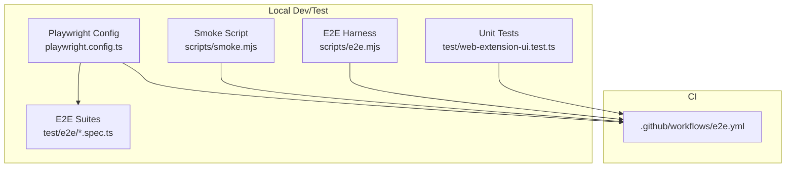
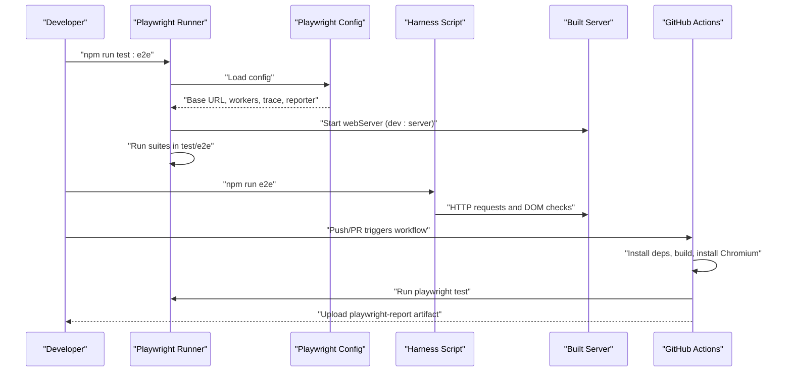
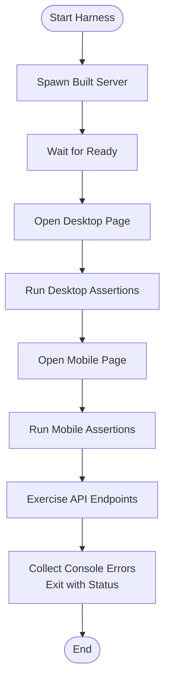
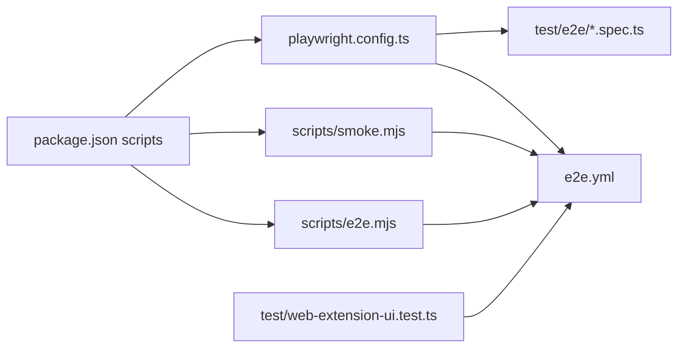

# Testing Strategy

<cite>
**Referenced Files in This Document**
- [playwright.config.ts](file://playwright.config.ts)
- [.github/workflows/e2e.yml](file://.github/workflows/e2e.yml)
- [scripts/e2e.mjs](file://scripts/e2e.mjs)
- [scripts/smoke.mjs](file://scripts/smoke.mjs)
- [test/e2e/chat-flow.spec.ts](file://test/e2e/chat-flow.spec.ts)
- [test/e2e/components.spec.ts](file://test/e2e/components.spec.ts)
- [test/e2e/file-operations.spec.ts](file://test/e2e/file-operations.spec.ts)
- [test/e2e/screenshot.spec.ts](file://test/e2e/screenshot.spec.ts)
- [test/e2e/session-management.spec.ts](file://test/e2e/session-management.spec.ts)
- [test/e2e/settings.spec.ts](file://test/e2e/settings.spec.ts)
- [test/e2e/terminal.spec.ts](file://test/e2e/terminal.spec.ts)
- [test/web-extension-ui.test.ts](file://test/web-extension-ui.test.ts)
- [package.json](file://package.json)
</cite>

## Table of Contents
1. [Introduction](#introduction)
2. [Project Structure](#project-structure)
3. [Core Components](#core-components)
4. [Architecture Overview](#architecture-overview)
5. [Detailed Component Analysis](#detailed-component-analysis)
6. [Dependency Analysis](#dependency-analysis)
7. [Performance Considerations](#performance-considerations)
8. [Troubleshooting Guide](#troubleshooting-guide)
9. [Conclusion](#conclusion)
10. [Appendices](#appendices)

## Introduction
This document describes the multi-layered testing strategy for Quake Code Web. It covers the Playwright end-to-end (E2E) testing framework, component-level visual regression checks, API endpoint validations, and the continuous integration pipeline. It also outlines best practices for testing React components, API endpoints, and the Electron application surface, along with performance and debugging guidance.

## Project Structure
The testing system is organized into:
- Playwright E2E suites under test/e2e, each focusing on a functional area (chat flow, file operations, sessions, settings, terminal, screenshots).
- A dedicated smoke test script validating server readiness and core API endpoints.
- An extended end-to-end harness script that launches a local server, runs targeted assertions, and validates mobile/desktop shells.
- A Vitest unit test for a server-side bridge module.
- CI workflow orchestrated via GitHub Actions to run Playwright E2E tests on Linux runners.

**Diagram sources**
- [playwright.config.ts:1-28](file://playwright.config.ts#L1-L28)
- [.github/workflows/e2e.yml:1-33](file://.github/workflows/e2e.yml#L1-L33)
- [scripts/smoke.mjs:1-87](file://scripts/smoke.mjs#L1-L87)
- [scripts/e2e.mjs:1-936](file://scripts/e2e.mjs#L1-L936)
- [test/web-extension-ui.test.ts:1-19](file://test/web-extension-ui.test.ts#L1-L19)

**Section sources**
- [playwright.config.ts:1-28](file://playwright.config.ts#L1-L28)
- [.github/workflows/e2e.yml:1-33](file://.github/workflows/e2e.yml#L1-L33)
- [scripts/smoke.mjs:1-87](file://scripts/smoke.mjs#L1-L87)
- [scripts/e2e.mjs:1-936](file://scripts/e2e.mjs#L1-L936)
- [test/web-extension-ui.test.ts:1-19](file://test/web-extension-ui.test.ts#L1-L19)

## Core Components
- Playwright configuration defines test directory, parallelism, retries, workers, HTML reporter, tracing, and a local web server lifecycle for E2E runs.
- GitHub Actions job installs dependencies, builds the app, installs Chromium, runs Playwright tests, and uploads HTML reports.
- E2E harness script starts the built server locally, validates UI stability and localization, exercises API endpoints, and performs device-specific checks.
- Smoke script validates server health, core endpoints, concurrency, and policy enforcement.
- E2E suites cover chat flow, file operations, sessions, settings, terminal, and visual regression snapshots.
- Unit tests validate server-side bridge behavior.

**Section sources**
- [playwright.config.ts:1-28](file://playwright.config.ts#L1-L28)
- [.github/workflows/e2e.yml:1-33](file://.github/workflows/e2e.yml#L1-L33)
- [scripts/e2e.mjs:1-936](file://scripts/e2e.mjs#L1-L936)
- [scripts/smoke.mjs:1-87](file://scripts/smoke.mjs#L1-L87)
- [test/e2e/chat-flow.spec.ts:1-90](file://test/e2e/chat-flow.spec.ts#L1-L90)
- [test/e2e/file-operations.spec.ts:1-109](file://test/e2e/file-operations.spec.ts#L1-L109)
- [test/e2e/session-management.spec.ts:1-76](file://test/e2e/session-management.spec.ts#L1-L76)
- [test/e2e/settings.spec.ts:1-113](file://test/e2e/settings.spec.ts#L1-L113)
- [test/e2e/terminal.spec.ts:1-71](file://test/e2e/terminal.spec.ts#L1-L71)
- [test/e2e/components.spec.ts:1-41](file://test/e2e/components.spec.ts#L1-L41)
- [test/e2e/screenshot.spec.ts:1-43](file://test/e2e/screenshot.spec.ts#L1-L43)
- [test/web-extension-ui.test.ts:1-19](file://test/web-extension-ui.test.ts#L1-L19)

## Architecture Overview
The testing architecture integrates local scripts, Playwright suites, and CI automation to deliver reliable coverage across UI, APIs, and platform surfaces.

**Diagram sources**
- [playwright.config.ts:1-28](file://playwright.config.ts#L1-L28)
- [scripts/e2e.mjs:1-936](file://scripts/e2e.mjs#L1-L936)
- [.github/workflows/e2e.yml:1-33](file://.github/workflows/e2e.yml#L1-L33)
- [package.json:8-24](file://package.json#L8-L24)

## Detailed Component Analysis

### Playwright Configuration and CI Pipeline
- Test directory is set to test/e2e with fully parallel execution enabled.
- CI enforces retries and single worker to stabilize runs; local runs use default workers.
- Trace is captured on first retry; screenshots are taken on failure.
- A local web server is launched pointing to the development server; reuseExistingServer avoids conflicts in CI.
- The CI job installs Chromium, builds the app, runs Playwright tests, and uploads HTML reports.

**Section sources**
- [playwright.config.ts:1-28](file://playwright.config.ts#L1-L28)
- [.github/workflows/e2e.yml:1-33](file://.github/workflows/e2e.yml#L1-L33)

### Chat Flow E2E Suite
- Validates app load, composer visibility, prompt submission, timeline presence, command palette accessibility, file explorer opening, terminal panel activation, session picker modal, and settings page navigation.

**Section sources**
- [test/e2e/chat-flow.spec.ts:1-90](file://test/e2e/chat-flow.spec.ts#L1-L90)

### File Operations E2E Suite
- Creates, reads, patches, deletes, renames, and manages directories via API endpoints.
- Enforces workspace boundary checks and verifies file history retrieval.

**Section sources**
- [test/e2e/file-operations.spec.ts:1-109](file://test/e2e/file-operations.spec.ts#L1-L109)

### Session Management E2E Suite
- Lists sessions, opens session picker, closes with Escape, switches sessions, and forks sessions using command API.

**Section sources**
- [test/e2e/session-management.spec.ts:1-76](file://test/e2e/session-management.spec.ts#L1-L76)

### Settings E2E Suite
- Opens settings, navigates sections (appearance, system), changes density, selects themes, and validates server-provided config, models, and commands.

**Section sources**
- [test/e2e/settings.spec.ts:1-113](file://test/e2e/settings.spec.ts#L1-L113)

### Terminal E2E Suite
- Verifies terminal input visibility, command execution, multi-command support, command echoing in output, tab creation, copy behavior, and security warnings for dangerous commands.

**Section sources**
- [test/e2e/terminal.spec.ts:1-71](file://test/e2e/terminal.spec.ts#L1-L71)

### Visual Regression and Component Snapshots
- Captures component-level screenshots for sidebar, composer, timeline, security banner, and toast.
- Captures full-page screenshots for chat view, settings page, file explorer, terminal panel, and command palette.

**Section sources**
- [test/e2e/components.spec.ts:1-41](file://test/e2e/components.spec.ts#L1-L41)
- [test/e2e/screenshot.spec.ts:1-43](file://test/e2e/screenshot.spec.ts#L1-L43)

### Extended E2E Harness (scripts/e2e.mjs)
- Launches the built server with controlled environment variables.
- Performs comprehensive checks including:
  - Page title validation and branding checks.
  - Localization and copy correctness across UI components.
  - Workspace roots and path escape error localization.
  - State endpoint validation and compositional ergonomics.
  - Terminal command execution and policy enforcement.
  - Visual leak detection and responsive behavior for desktop and mobile views.
  - Console error capture and assertion-driven quality gates.

**Diagram sources**
- [scripts/e2e.mjs:1-203](file://scripts/e2e.mjs#L1-L203)

**Section sources**
- [scripts/e2e.mjs:1-936](file://scripts/e2e.mjs#L1-L936)

### Smoke Test (scripts/smoke.mjs)
- Validates server readiness, core GET endpoints, session and model enumeration, concurrent web-settings writes, and terminal command execution with policy enforcement.

**Section sources**
- [scripts/smoke.mjs:1-87](file://scripts/smoke.mjs#L1-L87)

### Unit Test for WebExtensionUiBridge (test/web-extension-ui.test.ts)
- Exercises the server-side bridge to ensure pending plan UI requests are cleared upon session changes.

**Section sources**
- [test/web-extension-ui.test.ts:1-19](file://test/web-extension-ui.test.ts#L1-L19)

## Dependency Analysis
- Playwright configuration depends on the local development server and controls test execution behavior.
- CI workflow depends on npm scripts and Playwright installation.
- E2E harness depends on the built server artifacts and environment variables.
- Suites depend on the app's UI selectors and API endpoints.

**Diagram sources**
- [playwright.config.ts:1-28](file://playwright.config.ts#L1-L28)
- [.github/workflows/e2e.yml:1-33](file://.github/workflows/e2e.yml#L1-L33)
- [scripts/smoke.mjs:1-87](file://scripts/smoke.mjs#L1-L87)
- [scripts/e2e.mjs:1-936](file://scripts/e2e.mjs#L1-L936)
- [test/web-extension-ui.test.ts:1-19](file://test/web-extension-ui.test.ts#L1-L19)
- [package.json:8-24](file://package.json#L8-L24)

**Section sources**
- [playwright.config.ts:1-28](file://playwright.config.ts#L1-L28)
- [.github/workflows/e2e.yml:1-33](file://.github/workflows/e2e.yml#L1-L33)
- [scripts/smoke.mjs:1-87](file://scripts/smoke.mjs#L1-L87)
- [scripts/e2e.mjs:1-936](file://scripts/e2e.mjs#L1-L936)
- [test/web-extension-ui.test.ts:1-19](file://test/web-extension-ui.test.ts#L1-L19)
- [package.json:8-24](file://package.json#L8-L24)

## Performance Considerations
- Prefer bounded scans and windowed selections in UI rendering to avoid scanning full histories; the harness validates these patterns.
- Use targeted selectors and avoid full-array allocations in hot paths (e.g., timeline, tools panel, plan steps).
- Minimize heavy string operations (split/join) in markdown tool previews and line statistics.
- Keep trace and screenshot capture scoped to failing or representative runs to reduce overhead.

[No sources needed since this section provides general guidance]

## Troubleshooting Guide
Common issues and remedies:
- Local server not ready: Increase wait timeouts or check environment variables used by the smoke and harness scripts.
- Flaky UI tests: Use stable locators and wait for visibility; rely on Playwright's trace and HTML reporter for diagnostics.
- Policy enforcement failures: Verify terminal policy and localization of blocked command messages.
- Visual regressions: Adjust maxDiffPixelRatio cautiously and review component snapshots; ensure consistent viewport sizes.
- CI instability: Reduce workers and enable retries; ensure Chromium is installed with required dependencies.

**Section sources**
- [scripts/smoke.mjs:53-62](file://scripts/smoke.mjs#L53-L62)
- [playwright.config.ts:10-14](file://playwright.config.ts#L10-L14)
- [test/e2e/terminal.spec.ts:53-71](file://test/e2e/terminal.spec.ts#L53-L71)
- [test/e2e/components.spec.ts:1-41](file://test/e2e/components.spec.ts#L1-L41)

## Conclusion
The testing strategy combines Playwright E2E suites, visual regression snapshots, a robust smoke and extended harness, and CI automation to ensure reliability across UI, APIs, and platform surfaces. Adhering to bounded scans, targeted selectors, and disciplined trace/report usage yields maintainable and efficient tests.

[No sources needed since this section summarizes without analyzing specific files]

## Appendices

### Test Suite Organization and Coverage
- Chat Flow: App load, composer, timeline, command palette, file explorer, terminal, sessions, settings.
- File Operations: CRUD operations, directory management, workspace boundary enforcement, file history.
- Session Management: Listing, switching, forking, and picker UI.
- Settings: Sections, theme selection, density, and server-provided metadata.
- Terminal: Input/output, multi-command execution, tabs, and security warnings.
- Visual Regression: Component and full-page screenshots.
- Unit Tests: Bridge behavior for plan UI requests.

**Section sources**
- [test/e2e/chat-flow.spec.ts:1-90](file://test/e2e/chat-flow.spec.ts#L1-L90)
- [test/e2e/file-operations.spec.ts:1-109](file://test/e2e/file-operations.spec.ts#L1-L109)
- [test/e2e/session-management.spec.ts:1-76](file://test/e2e/session-management.spec.ts#L1-L76)
- [test/e2e/settings.spec.ts:1-113](file://test/e2e/settings.spec.ts#L1-L113)
- [test/e2e/terminal.spec.ts:1-71](file://test/e2e/terminal.spec.ts#L1-L71)
- [test/e2e/components.spec.ts:1-41](file://test/e2e/components.spec.ts#L1-L41)
- [test/e2e/screenshot.spec.ts:1-43](file://test/e2e/screenshot.spec.ts#L1-L43)
- [test/web-extension-ui.test.ts:1-19](file://test/web-extension-ui.test.ts#L1-L19)

### Best Practices for React Components, API Endpoints, and Electron Applications
- React Components:
  - Use deterministic selectors and aria labels for stable tests.
  - Avoid rendering raw technical copy; ensure localization and UX polish.
  - Validate bounded windows for timelines, tools, and plan steps.
- API Endpoints:
  - Validate HTTP status codes and payload shapes.
  - Enforce security policies and localize error messages.
  - Test concurrent writes and state persistence.
- Electron Applications:
  - Treat Electron as a specialized renderer; validate server-side behavior and IPC bridges.
  - Use harness-style checks for UI stability and policy enforcement.

[No sources needed since this section provides general guidance]
