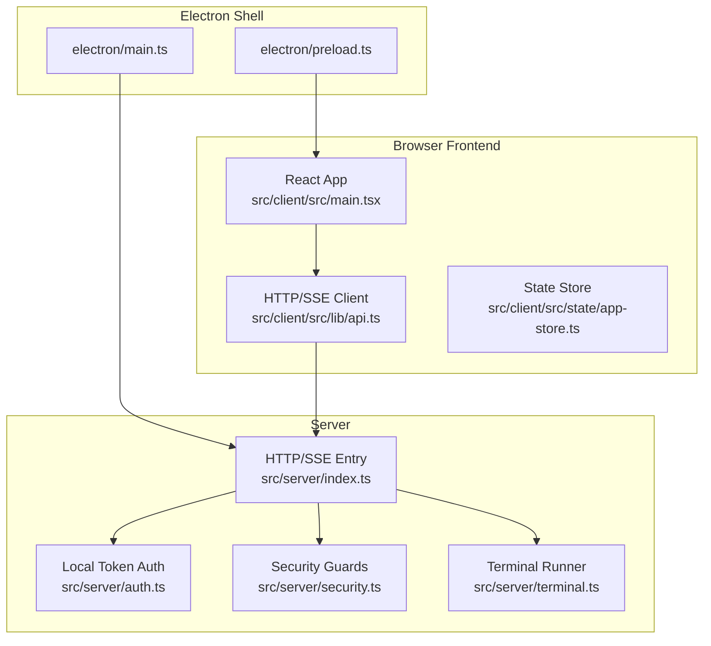
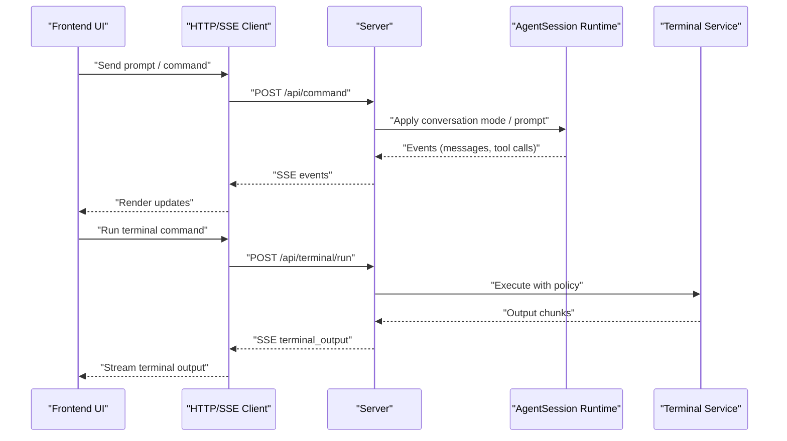
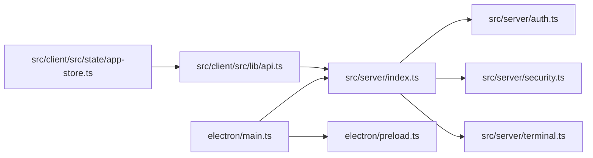

# Troubleshooting and FAQ

<cite>
**Referenced Files in This Document**
- [README.md](file://README.md)
- [docs/qa.md](file://docs/qa.md)
- [docs/architecture.md](file://docs/architecture.md)
- [docs/keyboard-shortcuts.md](file://docs/keyboard-shortcuts.md)
- [electron/main.ts](file://electron/main.ts)
- [electron/preload.ts](file://electron/preload.ts)
- [src/server/index.ts](file://src/server/index.ts)
- [src/server/auth.ts](file://src/server/auth.ts)
- [src/server/security.ts](file://src/server/security.ts)
- [src/server/terminal.ts](file://src/server/terminal.ts)
- [src/client/src/lib/api.ts](file://src/client/src/lib/api.ts)
- [src/client/src/lib/desktop.ts](file://src/client/src/lib/desktop.ts)
- [src/client/src/lib/storage.ts](file://src/client/src/lib/storage.ts)
- [src/client/src/state/app-store.ts](file://src/client/src/state/app-store.ts)
- [package.json](file://package.json)
</cite>

## Table of Contents
1. [Introduction](#introduction)
2. [Project Structure](#project-structure)
3. [Core Components](#core-components)
4. [Architecture Overview](#architecture-overview)
5. [Detailed Component Analysis](#detailed-component-analysis)
6. [Dependency Analysis](#dependency-analysis)
7. [Performance Considerations](#performance-considerations)
8. [Troubleshooting Guide](#troubleshooting-guide)
9. [Conclusion](#conclusion)
10. [Appendices](#appendices)

## Introduction
This document provides a comprehensive Troubleshooting and FAQ guide for Quake Code Web. It covers common setup and runtime issues, configuration pitfalls, error resolution steps, performance tuning, debugging techniques, browser and Electron-specific problems, and network connectivity concerns. It also includes diagnostic commands, log analysis tips, and productivity shortcuts to accelerate development workflows.

## Project Structure
Quake Code Web is a React + TypeScript + Vite frontend served by a Node.js HTTP server with SSE event streaming. An Electron shell embeds the server and serves the UI locally. The backend integrates directly with the same AgentSession runtime used by the TUI, ensuring parity in sessions, tools, and model behavior.

**Diagram sources**
- [electron/main.ts:132-138](file://electron/main.ts#L132-L138)
- [electron/preload.ts:5-14](file://electron/preload.ts#L5-L14)
- [src/server/index.ts:401-662](file://src/server/index.ts#L401-L662)
- [src/server/auth.ts:6-13](file://src/server/auth.ts#L6-L13)
- [src/server/security.ts:24-41](file://src/server/security.ts#L24-L41)
- [src/server/terminal.ts:21-86](file://src/server/terminal.ts#L21-L86)
- [src/client/src/lib/api.ts:9-50](file://src/client/src/lib/api.ts#L9-L50)
- [src/client/src/state/app-store.ts:186-252](file://src/client/src/state/app-store.ts#L186-L252)

**Section sources**
- [README.md:18-103](file://README.md#L18-L103)
- [docs/architecture.md:1-45](file://docs/architecture.md#L1-L45)

## Core Components
- Electron shell manages lifecycle, window behavior, and IPC to the renderer. It starts the backend server and loads the UI.
- Server handles HTTP routes, SSE event streaming, authentication, security policies, file operations, terminal execution, and Git integrations.
- Frontend communicates with the server via HTTP and SSE, maintains UI state, and renders the IDE-like experience.
- Authentication enforces local token-based access for API endpoints and SSE.
- Security validates host binding and workspace allowlists.
- Terminal service executes commands with policy enforcement and streaming output.

**Section sources**
- [electron/main.ts:132-138](file://electron/main.ts#L132-L138)
- [src/server/index.ts:401-662](file://src/server/index.ts#L401-L662)
- [src/server/auth.ts:6-13](file://src/server/auth.ts#L6-L13)
- [src/server/security.ts:24-41](file://src/server/security.ts#L24-L41)
- [src/server/terminal.ts:21-86](file://src/server/terminal.ts#L21-L86)
- [src/client/src/lib/api.ts:9-50](file://src/client/src/lib/api.ts#L9-L50)
- [src/client/src/state/app-store.ts:186-252](file://src/client/src/state/app-store.ts#L186-L252)

## Architecture Overview
The system follows a strict runtime rule: the browser never drives a separate agent implementation. The server owns the AgentSession runtime, session management, extension bindings, and tool execution. The web UI is a thin shell over the same runtime.

**Diagram sources**
- [docs/architecture.md:5-14](file://docs/architecture.md#L5-L14)
- [src/server/index.ts:255-374](file://src/server/index.ts#L255-L374)
- [src/server/terminal.ts:36-85](file://src/server/terminal.ts#L36-L85)
- [src/client/src/lib/api.ts:9-50](file://src/client/src/lib/api.ts#L9-L50)

## Detailed Component Analysis

### Electron Shell (Startup, Window, IPC)
Key behaviors:
- Ensures single-instance lock, relaunch on backend crash, and graceful shutdown.
- Starts the backend server, waits for readiness, and loads the UI.
- Exposes a minimal desktop bridge to the renderer for window controls and overlay theming.

Common issues:
- Backend fails to start or exits unexpectedly.
- Window does not load expected URL.
- Desktop controls not available in production builds.

Resolution steps:
- Verify backend readiness and port availability.
- Confirm dev vs packaged mode differences.
- Check preload exposure and IPC registration.

**Section sources**
- [electron/main.ts:140-171](file://electron/main.ts#L140-L171)
- [electron/preload.ts:5-14](file://electron/preload.ts#L5-L14)

### Server Entry (HTTP/SSE, Routing, Auth)
Key behaviors:
- Validates security configuration (host, workspace allowlist).
- Enforces local token auth for API endpoints and SSE.
- Routes requests to runtime controller, file service, terminal service, Git helpers, and settings.
- Streams events via SSE and attaches a terminal WebSocket.

Common issues:
- Unauthorized requests to protected endpoints.
- 403/404 responses for static assets.
- Port conflicts or host binding failures.
- Terminal policy blocking commands.

Resolution steps:
- Confirm token presence and injection into HTML.
- Check workspace allowlist and CWD validity.
- Verify terminal policy mode and command length limits.

**Section sources**
- [src/server/index.ts:56-61](file://src/server/index.ts#L56-L61)
- [src/server/index.ts:401-662](file://src/server/index.ts#L401-L662)
- [src/server/auth.ts:15-29](file://src/server/auth.ts#L15-L29)
- [src/server/security.ts:24-41](file://src/server/security.ts#L24-L41)
- [src/server/terminal.ts:36-44](file://src/server/terminal.ts#L36-L44)

### Frontend API and SSE Client
Key behaviors:
- Injects token into fetch headers.
- Parses error responses and surfaces user-friendly messages.
- Establishes SSE connection for runtime events.

Common issues:
- Missing token leads to 401 responses.
- Network errors or CORS issues.
- SSE connection drops.

Resolution steps:
- Ensure token is injected into HTML and present in window scope.
- Verify endpoint URLs and token propagation.
- Inspect browser network tab for failed requests.

**Section sources**
- [src/client/src/lib/api.ts:9-50](file://src/client/src/lib/api.ts#L9-L50)

### State Store and UI Rendering
Key behaviors:
- Normalizes and deduplicates messages.
- Prunes tool outputs and tool cards to bound memory usage.
- Manages toasts and UI state.

Common issues:
- Memory growth over long sessions.
- Tool output truncation.
- UI lag during heavy tool activity.

Resolution steps:
- Reduce tool output limits and prune inactive tools.
- Monitor visible message count and adjust dedupe scan limits.
- Use browser devtools to profile memory and CPU.

**Section sources**
- [src/client/src/state/app-store.ts:60-184](file://src/client/src/state/app-store.ts#L60-L184)

### Terminal Execution and Policy
Key behaviors:
- Spawns shell processes with timeouts and output limits.
- Applies terminal policy decisions before execution.
- Streams stdout/stderr via SSE.

Common issues:
- Commands blocked by policy.
- Long-running commands timing out.
- Excessive output truncation.

Resolution steps:
- Adjust terminal policy mode.
- Increase timeoutMs per command.
- Limit output-intensive commands.

**Section sources**
- [src/server/terminal.ts:21-86](file://src/server/terminal.ts#L21-L86)

## Dependency Analysis

**Diagram sources**
- [electron/main.ts:132-138](file://electron/main.ts#L132-L138)
- [electron/preload.ts:5-14](file://electron/preload.ts#L5-L14)
- [src/server/index.ts:401-662](file://src/server/index.ts#L401-L662)
- [src/server/auth.ts:6-13](file://src/server/auth.ts#L6-L13)
- [src/server/security.ts:24-41](file://src/server/security.ts#L24-L41)
- [src/server/terminal.ts:21-86](file://src/server/terminal.ts#L21-L86)
- [src/client/src/lib/api.ts:9-50](file://src/client/src/lib/api.ts#L9-L50)
- [src/client/src/state/app-store.ts:186-252](file://src/client/src/state/app-store.ts#L186-L252)

**Section sources**
- [package.json:8-24](file://package.json#L8-L24)

## Performance Considerations
- Bound memory usage:
  - Message deduplication and identity hashing reduce redundant rendering.
  - Tool output compaction trims excessive text while preserving context.
  - Tool pruning prioritizes active tools and recent activity.
- Streaming and SSE:
  - Use incremental rendering and avoid re-renders on every event.
- Terminal output:
  - Cap output size and enforce timeouts to prevent runaway processes.
- Browser storage:
  - Guard against storage unavailability and clear invalid entries.

Recommendations:
- Keep sessions bounded; prune inactive tools regularly.
- Use terminal policy “safeÔÇØ for untrusted environments.
- Monitor browser devtools for memory spikes and long task warnings.

**Section sources**
- [src/client/src/state/app-store.ts:60-184](file://src/client/src/state/app-store.ts#L60-L184)
- [src/server/terminal.ts:56-83](file://src/server/terminal.ts#L56-L83)

## Troubleshooting Guide

### Setup Problems
- Backend does not start or crashes immediately
  - Check Electron startup logs and backend port readiness.
  - Confirm single-instance lock and relaunch behavior.
  - Validate environment variables and workspace path.
  - See [electron/main.ts:132-138](file://electron/main.ts#L132-L138), [electron/main.ts:150-155](file://electron/main.ts#L150-L155), [src/server/index.ts:56-61](file://src/server/index.ts#L56-L61)

- Cannot connect to UI at expected URL
  - Verify host/port configuration and that the server is listening.
  - Ensure the Electron window loads the correct URL.
  - See [electron/main.ts:132-138](file://electron/main.ts#L132-L138), [src/server/index.ts:664-667](file://src/server/index.ts#L664-L667)

- Static assets return 403/404
  - Confirm asset path resolution and that the requested path is within the public directory.
  - See [src/server/index.ts:383-399](file://src/server/index.ts#L383-L399)

- Remote binding rejected
  - Set the allow-remote flag explicitly before binding to 0.0.0.0.
  - See [src/server/security.ts:24-29](file://src/server/security.ts#L24-L29)

- Workspace outside allowlist
  - Adjust workspace allowlist or choose a path inside the allowlist.
  - See [src/server/security.ts:31-41](file://src/server/security.ts#L31-L41), [src/server/index.ts:211-219](file://src/server/index.ts#L211-L219)

### Authentication and Authorization
- 401/403 Unauthorized on API requests
  - Ensure the X-Quake-Web-Token header matches the server token.
  - Confirm token injection into HTML and presence in window scope.
  - See [src/server/auth.ts:15-29](file://src/server/auth.ts#L15-L29), [src/server/auth.ts:31-35](file://src/server/auth.ts#L31-L35), [src/client/src/lib/api.ts:9-14](file://src/client/src/lib/api.ts#L9-L14)

- Token file location and permissions
  - Token file defaults to a hidden directory; ensure proper permissions.
  - See [src/server/auth.ts:37-47](file://src/server/auth.ts#L37-L47)

### Terminal and Command Execution
- Commands blocked by policy
  - Switch terminal policy to “allow-allÔÇØ cautiously or refactor commands.
  - See [src/server/terminal.ts:42-43](file://src/server/terminal.ts#L42-L43)

- Commands timeout or produce truncated output
  - Increase timeoutMs and review output limits.
  - See [src/server/terminal.ts:36-60](file://src/server/terminal.ts#L36-L60), [src/server/terminal.ts:56-73](file://src/server/terminal.ts#L56-L73)

- Terminal not responding
  - Verify terminal WebSocket attachment and SSE for output.
  - See [src/server/index.ts:661-662](file://src/server/index.ts#L661-L662)

### Browser Compatibility and Electron-Specific Issues
- External links opening in browser
  - Electron prevents navigation outside localhost; external links are opened externally.
  - See [electron/main.ts:96-105](file://electron/main.ts#L96-L105)

- Native window controls and overlay theming
  - Desktop bridge exposes minimize/maximize/close and sets overlay colors.
  - See [electron/preload.ts:5-14](file://electron/preload.ts#L5-L14), [electron/main.ts:54-65](file://electron/main.ts#L54-L65)

- DevTools and debugging
  - Dev builds open DevTools automatically; inspect console and network tabs.
  - See [electron/main.ts:110-113](file://electron/main.ts#L110-L113)

### Network Connectivity Challenges
- SSE connection drops
  - Check for network interruptions and server restarts.
  - Reconnect logic relies on SSE re-establishment; verify token propagation.
  - See [src/client/src/lib/api.ts:48-50](file://src/client/src/lib/api.ts#L48-L50), [src/server/index.ts:408-412](file://src/server/index.ts#L408-L412)

- Proxy or corporate firewall interference
  - Ensure localhost traffic is permitted; avoid outbound restrictions on SSE/WebSocket.
  - See [src/server/index.ts:408-412](file://src/server/index.ts#L408-L412)

### Diagnostics and Log Analysis
- Server logs
  - Look for startup messages, token emission, and error stack traces.
  - See [src/server/index.ts:664-667](file://src/server/index.ts#L664-L667)

- Electron logs
  - Review Electron dev logs for startup and crash diagnostics.
  - See [electron/main.ts:150-155](file://electron/main.ts#L150-L155)

- Frontend console
  - Inspect network tab for failed requests and SSE frames.
  - See [src/client/src/lib/api.ts:9-50](file://src/client/src/lib/api.ts#L9-L50)

- QA checklist
  - Use the manual QA checklist to validate UI and features.
  - See [docs/qa.md:14-42](file://docs/qa.md#L14-L42)

### When to Seek Additional Help
- Persistent 401/403 despite correct token.
- Frequent timeouts or policy rejections.
- UI becomes unresponsive under heavy tool output.
- Electron window fails to load or crashes on startup.

### Productivity Tips and Shortcuts
- Keyboard shortcuts reference
  - Use global shortcuts to open command palette, toggle panels, and navigate quickly.
  - See [docs/keyboard-shortcuts.md:1-37](file://docs/keyboard-shortcuts.md#L1-L37)

- Development scripts
  - Use dev scripts to run server and client concurrently; leverage smoke and E2E tests.
  - See [package.json:8-24](file://package.json#L8-L24)

- State management
  - Keep sessions concise; prune inactive tools and limit message history.
  - See [src/client/src/state/app-store.ts:137-170](file://src/client/src/state/app-store.ts#L137-L170)

**Section sources**
- [src/server/auth.ts:15-29](file://src/server/auth.ts#L15-L29)
- [src/server/security.ts:24-41](file://src/server/security.ts#L24-L41)
- [src/server/terminal.ts:36-83](file://src/server/terminal.ts#L36-L83)
- [src/client/src/lib/api.ts:9-50](file://src/client/src/lib/api.ts#L9-L50)
- [src/client/src/state/app-store.ts:137-170](file://src/client/src/state/app-store.ts#L137-L170)
- [electron/main.ts:132-138](file://electron/main.ts#L132-L138)
- [docs/keyboard-shortcuts.md:1-37](file://docs/keyboard-shortcuts.md#L1-L37)
- [package.json:8-24](file://package.json#L8-L24)
- [docs/qa.md:14-42](file://docs/qa.md#L14-L42)

## Conclusion
By aligning troubleshooting efforts with the runtime-native architecture, enforcing secure defaults, and leveraging built-in safeguards, most issues can be resolved quickly. Use the diagnostic commands, logs, and QA checklist to validate environment health, and apply the performance and security recommendations to maintain a smooth developer experience.

## Appendices

### Environment Variables Reference
- Host and port binding
  - QUAKE_WEB_HOST, QUAKE_WEB_PORT
- Workspace and security
  - QUAKE_WEB_CWD, QUAKE_WEB_ALLOW_REMOTE, QUAKE_WEB_WORKSPACE_ALLOWLIST
- Authentication
  - QUAKE_WEB_TOKEN, QUAKE_WEB_TOKEN_FILE, QUAKE_WEB_AUTH
- Terminal policy
  - QUAKE_WEB_TERMINAL_POLICY

**Section sources**
- [README.md:116-128](file://README.md#L116-L128)
- [src/server/security.ts:4-9](file://src/server/security.ts#L4-L9)
- [src/server/auth.ts:10-13](file://src/server/auth.ts#L10-L13)
- [src/server/terminal.ts:4-9](file://src/server/terminal.ts#L4-L9)
